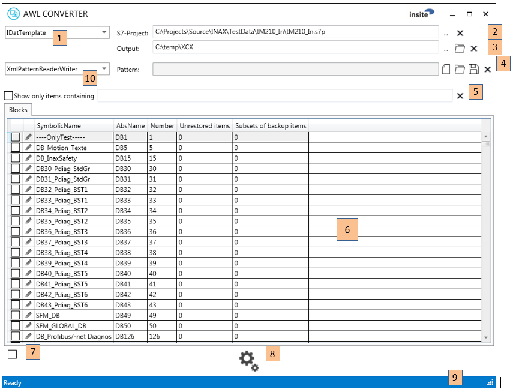
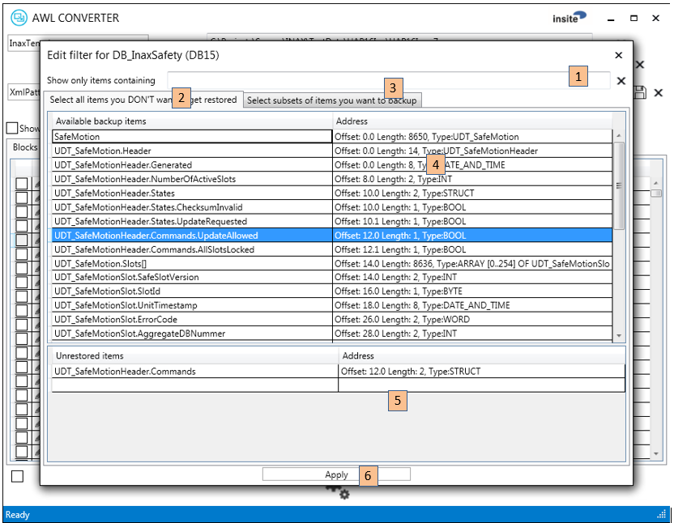

<h1>Software Specification</h1>  

<h1>AWLConverter</h1>
  

**insite GmbH**

	
---  
#Introduction#

The AWLConverter is a software application that converts the data definitions in a Siemens S7 project to XML- or C&#35;-source-files. The conversion to XML format generates data definition files (DDFs) that can be used in different tools of the IDAT family. The conversion to C&#35;-source-files generates files for INAX (**IN**site **A**utomation framewor**X**).

---  
##Purpose and Objective##

Easy creation of files that map PLC/S7 data structures.

---  
##Definitions, Acronyms, Abbreviations##

*  **Data Definition File (DDF):** A file which describes the structure of single or combined variables and defines the mapping of these variables.
*  **Mapping:** Variables are mapped to a defined data or memory area. 

---  
#General Description#

The special features and setting options of the software are described below. 

---  
##System Environment##

The software is written in C&#35; with Visual Studio 2013 for the .NET framework 4.5.2.

---  
#User Interface#

The application is dialog-based. The usage is straightforward, though some features need a bit of explanation.

---  
##MainWindow Controls##

The application features tool tips for all controls. Here, you see a more detailed explanation of the function behind each control:
  

  

**Common symbols:**  

... browse for file/directory  

$&#32;&#32;$ clear file/directory selection or text filter  

  1.   Select the format of the created files. Currently "IDatTemplate" (DDF in XML-format) and "InaxTemplate" (C&#35;-source) are supported. If you select "InaxTemplate", there will be a further tab allowing you to work on the PLC symbols, which is not possible and not needed for DDFs.
  2.    Sets the S7-project from which the data structures are extracted. You can enter the filename manually, browse for it or clear the current selection.
  3.   Sets the output directory for the created files. You can enter the directory manually, browse for it, open the directory with the explorer or clear the current selection.
  4.   Creates, saves or loads a pattern file. A pattern file can save your selections and apply them again to a different or changed S7-project. See below for more details. You can enter the filename manually, create a new one, open it, save it or clear the current selection.
  5.   Enter a text pattern that is matched against the contents of the item list. 
  6.   The list of all data blocks in the PLC-project. If you select "InaxTemplate" there's a further tab that allows you to switch to the "symbols"-view. Beside the symbolic name, the absolute name, the DB number and information regarding your item selection is displayed. You’ll find more on item selection below. If you double click on a grid line, the FilterEditor opens and allows you to select/deselect certain items from a data block for backup/restore.
  7.   Used to check/uncheck all items at once.
  8.   Start creation of output files. 
  9.   Status line. 
  10.   Pattern reader writer. (This are reader writer modules to save and restore patterns in different formats)

---  
##FilterEditor Controls##

By clicking on a grid line (a PLC data block) in the main window, the FilterEditor opens. It allows you to select/deselect certain items from a data block for backup/restore.\
  

  

  1.   Enter a text pattern that is matched against the contents of the item list.
  2.   Tab to select the view that allows you to exclude certain items from a restore operation. In other words, the selected items are "read-only" in respect to the PLC data content.
  3.   Tab to select the view that allows you to narrow down the backed-up items to one or more subsets of the data block. *If there is no subset defined, all items are backed up!* Be aware, that the subset selection has no impact to the available items shown in other parts of the UI due to internal reasons. See below for details.
  4.   List with all available items. A double click on an item moves it to the section list below.
  5.   List with the currently selected items. A double click on an item removes it from the list. 
  6.   Apply the changes.

---  
#Using the FilterEditor#

---  
##Unrestored Items##

The terminology in certain controls of the AWLConverter is derived from it's use to create files for the PLCDataManager. At least "unrestored items" are items that will be excluded from write operations to the PLC. So normally all items inside a data block are read from the PLC but the "unrestored" items will not be written back on a restore operation. Imagine a data block, where a single item could be a production counter, others could be a set of configuration values that you just entered to optimize the machine's performance. Though you want to back-up your settings and maybe restore them at a later time, you don't want to override the production counter on a restore! In this case you would declare the production counter to be an "unrestored item".

---  
##Subsets of Items for Back-up##

Per default, the entire data block is read from the PLC and – in the case of the PLCDataManager - saved in a file. You can narrow down the saved items, by picking only the items you really need to save. This can decrease the memory usage on the disk and increase performance.

---  
#Using Pattern Files#

All the selections you make on the main window and in the FilterEditor can be saved in a pattern file. If you later open the same or a different PLC project and reload the saved pattern file, the AWLConverter will (try to) match the selections you made to the new symbolic content of the selected S7-project.
  

---  
#Installation#

This requires the "Microsoft .NET Framework 4.5.2" to be installed and available on the destination system under Windows.
  

The application files can be copied to any directory. The application can be started directly from this directory.