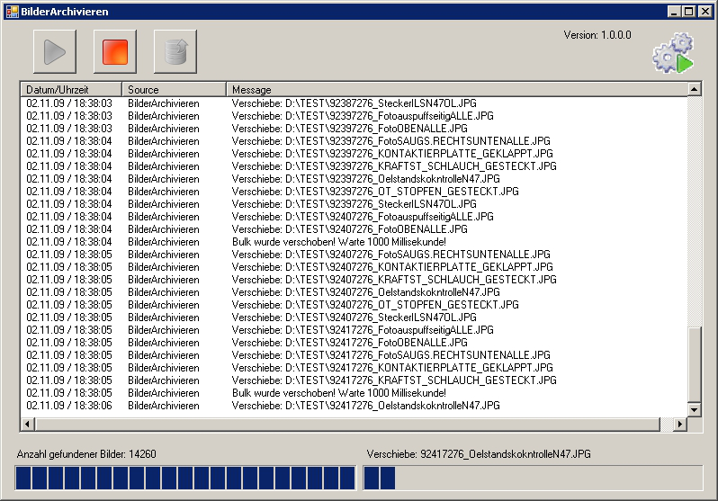

<h1>BMW Steyr NGD</h1>
  

<h1>Software Specification</h1>  

<h1>BilderArchivieren (ArchiveImages)</h1>
  


**insite GmbH**


	
---  
#Introduction#

The Archive Images program is used to move images (e.g. from V60) to an archive server. In the course of this, all special characters are also replaced by permitted characters (see [Appendix C](#appendix_c)).

---  
#Interface#



  

  1.   Starts the monitoring (Auto archiving) (see [Functional description](#functional_description))
  2.   Stops all actions
  3.   Starts the archiving (when all images have been archived, this function is terminated)
  4.   Displays the current program status (see [Status display](#status_display))
  5.   Displays the number of locally stored files
  6.   Displays the progress when moving the files
  7.   Log output

---  
##Status display##

<a name="status_display"></a>


 No action is running. (Program is in stop mode)  


 Auto archiving is active  


 Manual archiving is active  

---  
#Functional description#

<a name="functional_description"></a>
The V60 program saves the evaluated images locally in a directory.
  

The ArchiveImages program is informed via FileSystemEvents when a file has been created or deleted using a filter that must be set (e.g. &#42;.jpg). Once the set bulk number of the files has been reached, this bulk is moved to the Archive Server. The directory structure of the Archive Server can be defined by means of format options in the configuration file.
  

From version 1.0.0.8 it is now possible to also specify multiple sources. The number of files of the source can then be calculated from the total files in all sources.

---  
#Configuration file#

---  
##Path##

The path for the configuration files is searched in the following order:

  1.   HKEY&#95;CURRENT&#95;USER\Software\Insite Gmbh\BilderArchivieren (Character string: config)
  2.   HKEY&#95;LOCAL&#95;MACHINE\Software\Insite Gmbh\BilderArchivieren (Character string: config)
  3.   Start path + \BilderArchivieren.xml

If the file is not found in any of the defined paths, the application is terminated.

---  
##Settings in the configuration file (XML format)##

  
```html
<?xml version="1.0"?>
<!-- Konfigurations-Datei fuer BilderArchivieren. -->
<config name="BilderArchivieren">
  <settings>
    <common autoscan="true" autoscroll="true" maxlogrows="1000" 
            copyerrorrecalltime="60000" bulk="10" maxwaittimeforbulk="360000"/>
    <performance bulk="0" processpriority="belownormal" sleeptimeinms="1000"
                 maxcpuusageinpercent="20" optimizememusage="false"/>
    <filter extensions="*.jpg" converttojpeg="false" deleteafterconvert="false"
            quality="30"/>
    <source path="G:\V60_Bilder_Puffer"/>
    <dest path="N:\Bilder\Band7" format="\%HOSTNAME~3,6%\%FT=yyyy%\%FT=MM%\%FT=dd%" 
          adoptSubFolders="false"/>
    <log path="BilderArchivieren.log" daystokeeplog="1" bulk="20"/>
  </settings>
</config>
```  


---  
###common###

**autoscan:**  

<table>
 <tr><th>Data type </th><td> BOOL</td></tr>
 <tr><th>Description </th><td> Specifies whether the monitoring should be activated</td></tr>
 <tr><th>   </th><td> immediately at the start of the program.</td></tr>
 <tr><th>Default value </th><td> false</td></tr>
</table>

  

**autoscroll:**  

<table>
 <tr><th>Data type </th><td> BOOL</td></tr>
 <tr><th>Description </th><td> Specifies whether the current entry should always be scrolled</td></tr>
 <tr><th>   </th><td> to in the Log window.</td></tr>
 <tr><th>Default value </th><td> true</td></tr>
</table>

  

**maxlogrows:**  

<table>
 <tr><th>Data type </th><td> INTEGER</td></tr>
 <tr><th>Description </th><td> Specifies the number of log files kept in the Log window.</td></tr>
 <tr><th>Default value </th><td> 1000</td></tr>
</table>

  

**copyerrorrecalltime:**  

<table>
 <tr><th>Data type </th><td> INTEGER</td></tr>
 <tr><th>Description </th><td> Specifies the waiting time in milliseconds until a copy</td></tr>
 <tr><th>   </th><td> attempt should be restarted.</td></tr>
 <tr><th>Default value </th><td> 60000</td></tr>
</table>

  

**bulk:**  

<table>
 <tr><th>Data type </th><td> INTEGER</td></tr>
 <tr><th>Description </th><td> Specifies the number of files the archiving procedure is</td></tr>
 <tr><th>   </th><td> started from.</td></tr>
 <tr><th>Default value </th><td> 10</td></tr>
</table>

  

**maxwaittimeforbulk:**  

<table>
 <tr><th>Data type </th><td> INTEGER</td></tr>
 <tr><th>Description </th><td> Specifies the maximum waiting time that the program waits</td></tr>
 <tr><th>   </th><td> until the buffer is full. If the time elapses before the buffer is</td></tr>
 <tr><th>   </th><td> full, the files currently available are moved. If the value 0 is</td></tr>
 <tr><th>   </th><td> used, this waiting time is deactivated and the files are then</td></tr>
 <tr><th>   </th><td> first moved once the buffer is full.</td></tr>
 <tr><th>Default value </th><td> 0</td></tr>
</table>


---  
###performance###

**processpriority:**  

<table>
 <tr><th>Data type </th><td> STRING</td></tr>
 <tr><th>Description </th><td> Specifies the process priority that the program should have</td></tr>
 <tr><th>   </th><td> (for adjustable values see Appendix A).</td></tr>
 <tr><th>Default value </th><td> NORMAL</td></tr>
</table>

  

**bulk:**  

<table>
 <tr><th>Data type </th><td> INTEGER</td></tr>
 <tr><th>Description </th><td> Specifies the maximum number of files moved without pause.</td></tr>
 <tr><th>   </th><td> (only active if a value &#62; 0 is in sleeptimeinms)</td></tr>
 <tr><th>Default value </th><td> 10</td></tr>
</table>

  

**sleeptimems:**  

<table>
 <tr><th>Data type </th><td> INTEGER</td></tr>
 <tr><th>Description </th><td> Specifies the waiting time in milliseconds until the next bulk</td></tr>
 <tr><th>   </th><td> should be copied. (only active if a value &#62; 0 is in bulk).</td></tr>
 <tr><th>Default value </th><td> 1000</td></tr>
</table>

  

**maxcpuusageinpercent:**  

<table>
 <tr><th>Data type </th><td> INTEGER</td></tr>
 <tr><th>Description </th><td> Specifies the maximum CPU load in percent. If this is</td></tr>
 <tr><th>   </th><td> exceeded, a pause occurs</td></tr>
 <tr><th>   </th><td> (only active if a value &#62; 0 is in sleeptimeinms)</td></tr>
 <tr><th>Default value </th><td> 30</td></tr>
</table>

  

**optimizecpuusage:**  

<table>
 <tr><th>Data type </th><td> BOOL</td></tr>
 <tr><th>Description </th><td> Specifies whether the memory manages itself or is managed</td></tr>
 <tr><th>   </th><td> by the .Net Framework. (If it manages itself, the work involved</td></tr>
 <tr><th>   </th><td> for the CPU is greater, since the memory must also be released</td></tr>
 <tr><th>   </th><td> after each archiving procedure. If the Framework performs the</td></tr>
 <tr><th>   </th><td> management, the memory is then released when needed.)</td></tr>
 <tr><th>Default value </th><td> FALSE</td></tr>
</table>

  

**optimizeforoverwrite:**  

<table>
 <tr><th>Data type </th><td> BOOL</td></tr>
 <tr><th>Description </th><td> Specifies whether or not most of the files that are moved</td></tr>
 <tr><th>   </th><td> already exist at the target location. (in the case of backups</td></tr>
 <tr><th>   </th><td> that should be stored in the same path, the option should</td></tr>
 <tr><th>   </th><td> be set to TRUE)</td></tr>
 <tr><th>Default value </th><td> FALSE</td></tr>
</table>


---  
###filter###

**extension:**  

<table>
 <tr><th>Data type </th><td> STRING</td></tr>
 <tr><th>Description </th><td> Specifies the filter for the files to be monitored and copied.</td></tr>
 <tr><th>Default value </th><td> NORMAL</td></tr>
</table>

  

**converttojpg:**  

<table>
 <tr><th>Data type </th><td> BOOL</td></tr>
 <tr><th>Description </th><td> If the filter value is != jpg, the image is converted to</td></tr>
 <tr><th>   </th><td> jpg format and then moved.</td></tr>
 <tr><th>Default value </th><td> FALSE</td></tr>
</table>

  

**deleteafterconvert:**  

<table>
 <tr><th>Data type </th><td> BOOL</td></tr>
 <tr><th>Description </th><td> If this value is True, the originals of the moved files are</td></tr>
 <tr><th>   </th><td> deleted. (only active if converttojpg is TRUE)</td></tr>
 <tr><th>Default value </th><td> FALSE</td></tr>
</table>

  

**quality:**  

<table>
 <tr><th>Data type </th><td> INTEGER</td></tr>
 <tr><th>Description </th><td> Quality of the jpg in percent</td></tr>
 <tr><th>Default value </th><td> 30</td></tr>
</table>


---  
###source###

---  
###dest###

---  
###log###

---  
#Appendix A#

---  
#Appendix B#

---  
#Appendix C#

<a name="appendix_c"></a>

---  
#Document History#