<h1>Documentation and Procedure</h1>  

<h1>Description</h1>   

<h1>ICON</h1>
  

**I**nsite **CO**mmunication **N**ode
  


**insite GmbH**


	
---  
#Introduction#

ICON (insite communication node) is a modularly configurable software application for the transport of data. "Transport" means that data is transported from a source to a sink while the source can also receive a response (usually from the sink). 

---  
##Purpose and Objective##

ICON defines a data transport rule, which is the same for all existing and future developed modules, making it easy to create customer-specific modules that work with any data. 

ICON can be thought of as an Inter-Process Communication(IPC)-kernel.

---  
##Definitons, Acronyms, Abbreviations##

*  **ICON: I**nsite **CO**mmunication **N**ode
*  **TCP/IP:** The TCP network protocol (Transmission Control Protocol) based on the IP (Internet protocol) concerns endpoint-related connections, the so-called sockets. A socket can act as a client, server or listener. In order to describe a broader and more general designation for the states of the sockets, we want to use the terms "Passive" and "Active". In other words, there is an active and a passive connection partner. With these designations we conform with protocols such as FTP (File Transfer Protocol) or UDP (User Datagram Protocol). Unlike with connectionless protocols such as UDP, in the case of TCP there are endpoint-related connection partners that normally connect from the active partner to the passive partner. A socket's own endpoint (active as well as passive) we call LocalEndpoint and the endpoint of the connection partner we call RemoteEndpoint.
*  **PLC:** Programmable Logic Controller
*  **SPS:** Speicher Programmierbare Steuerung (German for PLC)
*  **GUI:** Graphical User Interface --> User Interface
*  **Assembly:** An Assembly is a logical functional unit that is executed under the control of the Common Language Runtime (CLR) by .NET. An Assembly exists physically as a DLL-file or EXE-file.
*  **Spooler:** Buffer for messages (also persistent)


---  
#General Description#

The special features and setting options of the software are described below. 

---  
##System Environment##

The software was written in C&#35; for the .NET Framework 4.0.

---  
##Starting ICONMain.exe##

When starting the application, the following splash screen appears:   


   

Once all the information has been read out from the XML file and the system has configured itself, the main window appears.  

Starting without any existing configuration file or with a configuration file without any essential content or without any information of a configuration (&#60;ICONConfigs&#62;&#60;/ICONConfigs&#62;   
 Or &#60;ICONConfigs&#62;&#60;ICONConfig&#62;&#60;/ICONConfig&#62;&#60;/ICONConfigs&#62;):


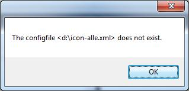

An existing configuration file named "ICON.xml" in the application directory is detected and loaded by ICON. If you would like to use other configuration files, you can transfer an argument with the complete directory and file name to ICONMain.exe when starting.

Starting with a configuration file:   

   


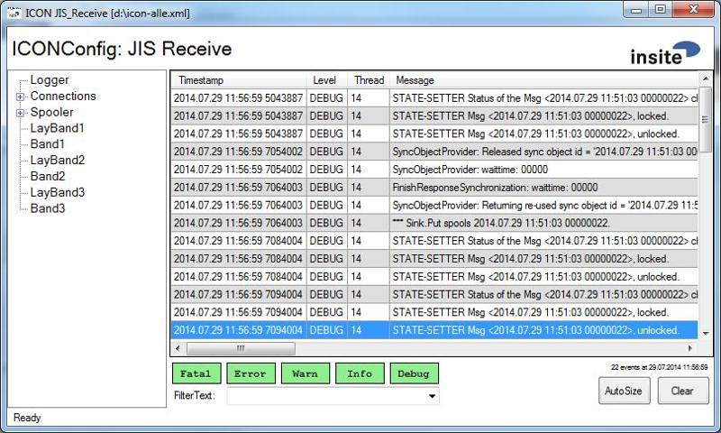
   

When starting, ICON outputs the configuration file from the started XML file to the logger file. In addition, the network connections and network status are logged when starting. This can be helpful for debugging.  

In the ICON application window, two tabs can be seen as a permanent part of the application.

*  Logger - Output of logger messages (partial extract of the last X messages, X is configurable)
*  Spooler - collective container for spoolers that do not occupy any explicit tab.

In the Logger Control below are buttons: **Fatal**, **Error**, **Warn**, **Info** and **Debug**. With these you can filter the messages. Please note that there also is a notice message type which cannot be controlled with the GUI. In addition, the filtering does not only apply to the view in the window but also to the messages in the logger file.

---  
##Version Information of all loaded ICON Components##


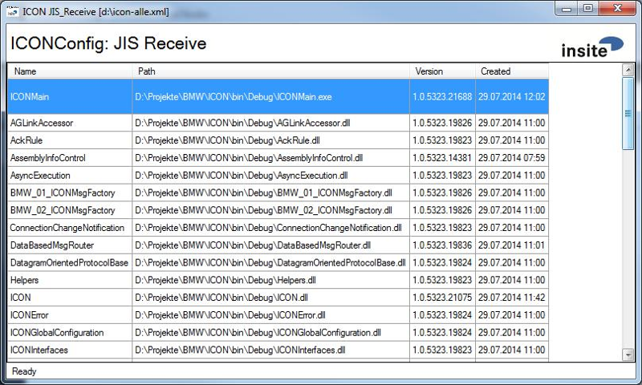

  

To obtain information about all assemblies currently loaded, you can click on the INSITE-LOGO in the upper right corner. By clicking, all information is collected and displayed in a list. The entries of the list can be selected and copied to the clipboard with Copy&Paste. Clicking once again closes this display and the standard interface of ICON is displayed again.

---  
##How does ICON work?##

<a name="howdoesiconwork"></a>

ICON loads modules that have a data interface source, sink or both. Via configuration it performs the application-specific settings of the corresponding module and transports the data (messages) from a source to a sink.  

The source utilises a Message Dispatcher for dispatching to the sink, which sets the message to the respective status in advance. The Message Dispatcher can be set by any module that is a source via the "DispatchMode" parameter as follows:

*  **DispatchMode = 0 (IgnoreSequence)**   
 No processing sequence guaranteed.
*  **DispatchMode = 1 (PreserveIncomingSequence)**   
 The complete processing sequence is guaranteed. Behaves like "PreserveSequence", this mode is reserved for future requirements. 
*  **DispatchMode = 2 (PreserveSequence)**   
 The complete processing sequence is guaranteed.

Therefore, the Message-Dispatcher is the active interface between the source and the sink or between the source and the spooler of a sink.  

The Message-Dispatcher also reports any faults of the sink or spooler to the source.  

The status of a message can be as follows:   


<table>
 <tr><th>Created </th><td> Message was created. </td></tr>
 <tr><th>Locked </th><td> Message was successfully locked (by the sink) (Reservation) </td></tr>
 <tr><th>Started </th><td> Message is transmitted to the sink (Start of the transmission) </td></tr>
 <tr><th>WaitingResponse </th><td> Message waits for a response from the sink/spooler </td></tr>
 <tr><th>Spooled </th><td> Message was accepted from the spooler  </td></tr>
 <tr><th>Ready </th><td> Message was transmitted and processed by the sink/spooler. </td></tr>
 <tr><th>ReadyHardError </th><td> Message goes to error with HardError (error number &#60; 0) </td></tr>
 <tr><th>ReadySoftError </th><td> Message goes to error with SoftError (error number &#62; 0) </td></tr>
</table>


  

"Created" and "Locked" are set by the source, the other statuses will usually be set by the Message-Dispatcher.


---  
#Configuration#

---  
##Configuration &#60;log4net&#62;##

Example of a configuration section in XML:
  
```html
<ICONConfig>
  <log4net>
    <appender name="RollingFile" type="log4net.Appender.RollingFileAppender">
        <file value="ICON.log" />
        <appendToFile value="true" />
        <immediateFlush value="true" />
        <maxSizeRollBackups value="-1" />
        <rollingStyle value="Composite" />
        <maximumFileSize value="100MB" />
        <datePattern value="yyyyMMdd" />
        <layout type="log4net.Layout.PatternLayout">
            <conversionPattern value="%date %-6level [%5thread] %message -
             %property{methodName} (%file:%line) (%property{modulePath})%newline" />
        </layout>
    </appender>
    <appender name="PDEMConverter" type="log4net.Appender.RollingFileAppender">
        <file value="PDEMConverter.log" />
        <appendToFile value="true" />
        <immediateFlush value="true" />
        <maxSizeRollBackups value="-1" />
        <rollingStyle value="Composite" />
        <maximumFileSize value="100MB" />
        <datePattern value="yyyyMMdd" />
        <layout type="log4net.Layout.PatternLayout">
            <conversionPattern value="%date %-6level [%5thread] %message -
             %property{methodname} (%file:%line)(%property{modulePath\})%newline" />
        </layout>
    </appender>
    <appender name="MemoryAppender" type="log4net.Appender.MemoryAppender" >
        <onlyFixPartialEventData value="true" />
    </appender> 
    <root>
        <level value="ALL" />
        <appender-ref ref="RollingFile" />
    </root>
    <logger name="PDEMConverter">
        <level value="ALL" />
        <appender-ref ref="PDEMConverter" />
    </logger>
  </log4net>
</ICONConfig>
```  


*  ICON provides two types of information specifically for the Logger: "methodName" and "modulePath".
*  If a "log4net.Appender.MemoryAppender" is configured, it is essential to ensure that   
 "&#60;onlyFixPartialEventData value = "true" /&#62;" is configured, since this could lead to a memory overflow otherwise.

For setting options and additional information on this 3rdParty component, please refer to page:  
 
<http://logging.apache.org/log4net/>


---  
##Configuration &#60;Includes&#62;##

  
```html
<Includes>
   <Include>D:\Special.xml</Include>
   <Include>D:\Ports\*.xml</Include>
   <Include>@Special*.xml</Include>
</Includes>
```  

With the "Includes" section, ICON can also manage distributed configurations. For example, you can provide ICON with just a minimum configuration and specify files that can extend this configuration if they are available.   

An example of this would be an implementation that communicates with the PLC via the SerialSink while you do not use the same scanner (or the same scanner ports) on every computer. In this case, you cannot configure any port at all, instead you can outsource the configuration in other files. The main benefit of this is not always having to customise the config when a port is added or removed, but simply create or remove a file and then restart ICON.  

The second functionality of the Includes is the handling of special configurations. If the config and Include-Config contain the same configuration parameters, the configuration is overwritten. Therefore, if minor details vary, instead of having to create a completely new configuration, only the different parameters need to be packed into an IncludeFile.   

The Include-File in turn can also contain Includes. A path name in an Include can also be a search string   

`[Path]\[Search pattern]`  

The @ can be used to include the path of the loaded config in the IncludePath.  

i.e. `D:\Icon.xml` -->   `@\Special.xml` --> `D:\Special.xml` 
  

An Include-File must have the same structure as the ICON.xml   

The name of ICONConfig must also be the same.  


---  
##Configuration &#60;ICONGlobals&#62;##

<a name="Configuration_ICONGlobals"></a>
In the Globals section, application-wide settings are performed.
  
```html
<ICONGlobals>
    <ConfigValue name="LookAndFeel" type="string">Tree</ConfigValue>
    <ConfigValue name="Tracing" type="bool">false</ConfigValue>
    <ConfigValue name="Performing" type="bool">false</ConfigValue>
    <ConfigValue name="LoggerViewShowPanel" type="bool">true</ConfigValue>
    <ConfigValue name="LoggerViewMaxRows" type="int">1024</ConfigValue>
    <ConfigValue name="LoggerViewMaxMessageLength" type="int">512</ConfigValue>
    <ConfigValue name="EncodingDefault" type="string">ISO-8859-1</ConfigValue>
    <ConfigValue name="ShowProcessNameInTitleBar" type="bool">false</ConfigValue>
    <ConfigValue name="IconText" type="string"></ConfigValue>
    <ConfigValue name="NotEnoughMemoryLowWaterMark" type="int">100</ConfigValue>
    <ConfigValue name="NotEnoughMemoryHighWaterMark" type="int">500</ConfigValue>
    <ConfigValue name="MaxAveragePLCAccessTime" type="int">0</ConfigValue>
    <ConfigValue name="MaxSocketLatencyTime" type="int">0</ConfigValue>
    <ConfigValue name="SocketLatencyMeasurementType" 
                 type="string">Disabled</ConfigValue>
    <ConfigValue name="SpoolerFontSize" type="int">0</ConfigValue>
    <ConfigValue name="UserLevelModule" type="string"></ConfigValue>
    <ConfigValue name="UnsafeRfc1006Wrapper" type="bool">true</ConfigValue>
    <ConfigValue name="ResolveIpAddresses" type="bool">true</ConfigValue>
    <ConfigValue name="UseSocketBasedReceiveThread"
                 type="bool">false</ConfigValue>
    <ConfigValue name="SocketDataBufferIncreaseAction"
                 type="string"> </ConfigValue>
    <ConfigValue name="SocketTimeout" type="int">30000</ConfigValue>
    <ConfigValue name="SocketSendBufferSize" type="int">8192</ConfigValue>
    <ConfigValue name="UseCaches" type="bool">false</ConfigValue>
</ICONGlobals>
```  


*  **LookAndFeel:** Specifies the representation mode of the GUI. The possible values are "Tab" and "Tree". For more details, see the section [GUI of ICON](#gui_of_icon).
*  **Tracing: ** Used to output additional debug messages.  


The system will slow down considerably when activating tracing due to the huge number of messages logged!
*  **Performing:** Creates additional output with timing information as debug messages.	In particular, those are access times to a PLC, or cycle times of the send and receive buffer processing. Please note that this may also slow down the system.
*  **LoggerViewShowPanel:** With the "*LoggerViewShowPanel*" parameter, the additional functions of the Logger page can be deactivated to only display the log outputs.
*  **LoggerViewMaxRows:** Defines the maximum number of rows in the Logger window. Do not choose the value too high in order to avoid speed impairments. To view the entire Logger output, please use the Logger file.
*  **LoggerViewMaxMessageLength:** Works similarly to "*MaxRows*", but limits the number of characters per row in the message column.
*  **EncodingDefault:** Overwrites the encoding that is set by the operating system (under System Control, Region & Language). For German texts use ISO-8859-1 or Latin1. You can find an overview of diverse codepages here:  
<http://msdn.microsoft.com/de-de/library/aa288104(v=VS.71).aspx>

  
 ("ISO-8859-1" is stored as default value.)
*  **ShowProcessNameInTitleBar:** Specifies whether or not the name of the process (e.g.: ICONMain) is displayed in the title bar instead of the ICON text. If the name of the exe is changed, e.g. ICON2, the custom name is displayed.
*  **IconText:** If you enter a text in "IconText", this text will also be added to the title bar (between ICON and [ConfigPath]). In addition, this text is also added onto the application logo. This allows multiple instances to be distinguished more easily.
*  **NotEnoughMemoryLowWaterMark:** Specifies the amount of hard disk memory available in MBs when ICON should stop its modules. The default value is 100MB, i.e. when the hard disk memory has less than 100MB, ICON stops all modules.
*  **NotEnoughMemoryHighWaterMark:** Specifies the amount of hard disk memory available in MBs when ICON should restart its stopped modules. The default value is 500MB, i.e. when the hard disk memory has more than 500MB available again, ICON modules will be restarted.
*  **MaxAveragePLCAccessTime:** Can be used to activate the performance monitoring of the PLC interface, which is executed every 60000ms (1 minute). This monitoring measures the average reading time from 1000 reads. If the the average time exceeds the set limit, it will be displayed on the logging page of ICON. If the value is 0, this monitoring is deactivated. 
*  **MaxSocketLatencyTime:** Can be used to activate the performance monitoring of any socket. Depending on the setting of "*SocketLatencyMeasurementType*", the duration of a specific process in the handling of a message is measured. If the set time is exceeded, information is displayed on the logging page of ICON. If the value is 0, this monitoring is deactivated. This setting is used as a default setting for all sockets and can be overwritten for each socket individually.
*  **SocketLatencyMeasurementType:** Defines the kind of latency measurement on any socket. The possible values are: "*Disabled*" (no measurement), "*Sent*" (measure latency between trigger and sent-state), and "*Received*" (measure latency or "roundtrip" between sent-state and reception of acknowledge). This setting is used as a default setting for all sockets and can be overwritten for each socket individually. 
*  **SpoolerFontSize:** Modifies the scaling of the spooler grids. The default size is used when this value is 0.
*  **UserLevelModule:** Can be used to specify a *UserLevelModuleWith* to prevent someone from closing ICON if they lack the necessary authorisation, for example.
*  **UnsafeRfc1006Wrapper:** Specifies whether the (unsafe) C++ or the C&#35; Rfc1006 implementation should be used.
*  **ResolveIpAdresses:** Specifies whether the IP addresses are resolved into the computer name.
*  **UseSocketBasedReceiveThread:** Specifies whether each socket should have its own receive thread.
*  **SocketDataBufferIncreaseAction:** Specifies the behavior which is executed when a socket received data but the callback is not called. Valid Values are: "*None*" (no check), "*ReadData*" (read and handle data), "*ResetConnection*" (close socket), "*EatData*" (skipdata), and "*ReadAndReset*" (read handle and reset data)
*  **SocketTimeOut:** Specifies the Timeout for the sockets' sending and receiving.  
also see: <https://msdn.microsoft.com/en-us/library/system.net.sockets.socket.sendtimeout%28v=vs.110%29.aspx>

 and <https://msdn.microsoft.com/en-us/library/system.net.sockets.socket.receivetimeout%28v=vs.110%29.aspx>

*  **SocketSendBufferSize:** Specifies the buffer size of the sockets for sending. If set to 0, no buffering will take place.  
also see <https://msdn.microsoft.com/en-us/library/system.net.sockets.socket.sendbuffersize%28v=vs.110%29.aspx>

* **UseCaches:** Specifies if a data cache is used by the diagnosis pages or not.

---  
##Configuration &#60;ICONNetwork&#62;##

Here, you can enter Hosts that apply for ICON as well as Hosts for the operating system defined under "`C:\Windows\System32\drivers\etc\hosts`".  

Example:
  
```html
<ICONNetwork>
    <ICONHosts>
        <Host IP="192.168.0.144" Name="rg" comment="my local machine" />
        <Host IP="192.168.0.156" Name="traceability" comment="database machine" />
        <Host IP="127.0.0.1" Name="PDEM" comment="the PDEM host" />
        <Host IP="192.168.0.145" Name="YMNB7TEST" comment="localhost" />        
    </ICONHosts>
</ICONNetwork>
```  

Before ICON attempts a resolution via DNS, it uses the IP address under &#60;ICONNetwork&#62;.  

The order would then be as follows:

  1.   Resolution via &#60;ICONNetwork&#62;
  2.   Resolution via `C:\Windows\System32\drivers\etc\hosts`
  3.   Resolution via DNS

---  
##Configuration &#60;ICONPlcs&#62;##

Here, any number of PLCs can be configured. Enter a section for each PLC.
  
```html
<ICONPlc Name="MainOPC">
   ...
   <ConfigValue name="ItemSyntax" type="string">SimaticNet</ConfigValue>
   <ConfigValue name="WriteCacheEnabled" type="bool">false</ConfigValue>
   <ConfigValue name="WriteCacheItemMaxAge" type="int">-1</ConfigValue>
</ICONPlc>
```  


*  **Item Syntax:** Sets the use of different syntaxes (possible values:SimaticNet, Sinumerik, WinAC, INAT)
*  **WriteCacheEnabled:** If true, each Write is cached. A write operation only takes place when there is a change between real data and cache data. If false, each Write is written!
*  **WriteCacheItemMaxAge:** Controls the obsolescence of the cache. Only used with "WriteCacheEnabled = true" (To be specified in milliseconds)

---  
###Specific Parameters for Acces via OPC###

  
```html
<ICONPlc Name="MainPLC">
    <ConfigValue name="OPCVendor" type="string"></ConfigValue>
    <ConfigValue name="OPCServerName" type="string">OPC.SimaticNet</ConfigValue>
    <ConfigValue name="OPCConnectionName" type="string">RTX</ConfigValue>
    ...
</ICONPlc>
```  


*  **OPCVendor:** Specifies the name of the OPCServer vendor (This only has to be specified for Softing OPCServers at present. e.g.: OPCVendor = Softing)
*  **OPCServerName:** Specifies the name of the OPC Server to be used
*  **OPCConnectionName:** Specifies the name of the connection to be used for communication
*  **ConnectAsLeanServer:** If true, *BrowseServerAddressSpace*, *ItemProperties* and *ConnectionPoints* are deactivated (e.g. necessary for WinAC-OPC-Server)

---  
###Specific Parameters for Access via InacS7###

  
```html
<ICONPlc Name="MainPLC">
    <ConfigValue name="InacS7RemoteHost" type="string">192.168.0.145</ConfigValue>
    <ConfigValue name="InacS7Port" type="int">102</ConfigValue>
    <ConfigValue name="InacS7RackNr" type="int">0</ConfigValue>
    <ConfigValue name="InacS7SlotNr" type="int">2</ConfigValue>
    <ConfigValue name="InacS7Timeout" type="int">5000</ConfigValue>
    <ConfigValue name="InacS7EnableDebug" type="int">false</ConfigValue>
    <ConfigValue name="InacS7AllowParallelJobs" type="int">false</ConfigValue>
    <ConfigValue name="InacS7AllowAsyncJobs" type="int">false</ConfigValue>
    <ConfigValue name="InacS7UseThreads" type="int">true</ConfigValue>
    ...
</ICONPlc>
```  


*  **InacS7RemoteHost:** Address of the remote control (= local IP)
*  **InacS7Port:** Port of the PLC
*  **InacS7RackNr:** Rack number
*  **InacS7SlotNr:** Slot number
*  **InacS7Timeout:** Timeout
*  **InacS7EnableDebug:** Write debugmessages.
*  **InacS7AllowParallelJobs:** Allow parallel communication with the plc  (Multiple read and writes at the same time).
*  **InacS7AllowAsyncJobs:** Work asynchronious.
*  **InacS7UseThreads:** Start a Thread for each call.


---  
###Specific Parameters for Acces via AGLink###

  
```html
<ICONPlc Name="MainPLC">
    <ConfigValue name="AGLinkDevice" type="int">0</ConfigValue>
    <ConfigValue name="AGLinkRemoteHost" type="string"></ConfigValue>
    <ConfigValue name="AGLinkPort" type="int">102</ConfigValue>
    <ConfigValue name="AGLinkPlcNr" type="int">-1</ConfigValue>
    <ConfigValue name="AGLinkRackNr" type="int">-1</ConfigValue>
    <ConfigValue name="AGLinkSlotNr" type="int">-1</ConfigValue>
    <ConfigValue name="AGLinkTimeout" type="int">-1</ConfigValue>
    ...
</ICONPlc>
```  


*  **AGLinkDevice:** ...
*  **AGLinkRemoteHost:** Adress of the remote control
*  **AGLinkPort:** Port of the PLC
*  **AGLinkPlcNr:** ...
*  **AGLinkRackNr:** Rack number
*  **AGLinkSlotNr:** Slot number
*  **AGLinkTimeout:** Timeout

---  
###Specific Parameters for Access via LibNoDave###

  
```html
<ICONPlc Name="MainPLC">
    <ConfigValue name="LibNoDaveRemoteHost" type="string">192.168.0.145
        </ConfigValue>
    <ConfigValue name="LibNoDavePort" type="int">102</ConfigValue>
    <ConfigValue name="LibNoDaveRackNr" type="int">0</ConfigValue>
    <ConfigValue name="LibNoDaveSlotNr" type="int">2</ConfigValue>
    <ConfigValue name="LibNoDaveTimeout" type="int">5000</ConfigValue>
    <ConfigValue name="LibNoDaveEnableDebug" type="int">1</ConfigValue>
    ...
</ICONPlc>
```  


*  **LibNoDaveRemoteHost:** Address of the remote control (= local IP)
*  **LibNoDavePort:** Port of the PLC
*  **LibNoDaveRackNr:** Rack number
*  **LibNoDaveSlotNr:** Slot number
*  **LibNoDaveTimeout:** Timeout
*  **LibNoDaveEnableDebug:** Debug

---  
###Specific Parameters for Access via Snap7###

  
```html
<ICONPlc Name="MainPLC">
    <ConfigValue name="Snap7RemoteHost" type="string">192.168.0.145</ConfigValue>
    <ConfigValue name="Snap7RackNr" type="int">0</ConfigValue>
    <ConfigValue name="Snap7SlotNr" type="int">2</ConfigValue>
    ...
</ICONPlc>
```  


*  **Snap7RemoteHost:** Address of the remote control (= local IP)
*  **Snap7RackNr:** Rack number
*  **Snap7SlotNr:** Slot number

---  
##Configuration &#60;ICONProtocols&#62;##

In this section, the default values for ServerPort and LocalServerPort can be set
  
```html
<ConfigValue name="TCPIPDefaultServerPort" type="int">30001</ConfigValue>
<ConfigValue name="TCPIPDefaultLocalServerPort" type="int">30002</ConfigValue>
```  


---  
###Standard Protocols###

You can activate protocols, for example, by the following entry:
  
```html
<ICONStandardProtocol ImplementingClass="WACC04_ICONMsgFactory" />
```  

In order to assign other Default Ports to a protocol, the parameters are listed in the respective section.  

Example:
  
```html
<ICONStandardProtocol ImplementingClass = "????ICONMsgFactory">
    <ConfigValue name = "TCPIPDefaultServerPort" type = "int">2000</ConfigValue>
    <ConfigValue name = "TCPIPDefaultLocalServerPort" type = "int">12400
        </ConfigValue>
</ICONStandardProtocol>
```  


---  
###User-defined Protocols###

Example of a user-defined protocol:
  
```html
<ICONUserDefinedProtocol name="XYZ">
   <FormatStrings>
       <__DATE>dd.MM.yyyy</__DATE>
       <__TIME>HH:mm:ss</__TIME>
   </FormatStrings>
   <RequestParseRule minLength="56"   maxLength=500 >
       <Member name="Quelle" offset="0" type="nchar(8)"/>
       <Member name="Ziel" offset="8" type="nchar(8)"/>
       <Member name="Kennung" offset="16" type="nchar(4)" value="'XYZ-'"
               isIdentifier="true"/>
       <Member name="Type" offset="20" type="nchar(4)" />
       <Member name="Version" offset="24" type="nchar(2)"  value="'5 '"
               isIdentifier="true"/>
       <Member name="Zeichencodierung" offset="26" type="nchar(20)"
               value="'ISO-8859-1 '" isIdentifier="true"/>
       <Member name="LfdNr" offset="46" type="nchar(4)"/>
       <Member name="PayloadLength" offset="50" type="nchar(6)"
               markerType = "headerEnd"/>
       <Member name="Payload" offset="56" type="binary($PayloadLength)"/>
   </RequestParseRule>
   <DefaultResponseBuildRule>
       <Member name="QQuelle"  offset="0"    type="nchar(8)"  value="$Ziel"/>
       <Member name="QZiel"    offset="8"    type="nchar(8)"  value="$Quelle"/>
       <Member name="QKennung" offset="16"   type="nchar(4)"  value="'XYZ-'"/>
       <Member name="QType"    offset="20"   type="nchar(4)"  value="'QUIT'"/>
       <Member name="QVersion" offset="24"   type="nchar(2)"  value="$Version"/>
       <Member name="QZeichencodierung" offset="26" type="nchar(20)"
               value="$Zeichencodierung"/>
       <Member name="QLfdNr"   offset="46"   type="nchar(4)"  value="$LfdNr"/>
       <Member name="AckPayloadLength" offset="50"     type="numeric(-6)" 
               value="'23    '" markerType = "headerEnd"/>/>
       <Member name="QStatus" offset="56"   type="numeric(-4)" value="$__ERROR"/>
       <Member name="QDatum"  offset="60"   type="nchar(10)"  value="$__DATE"/>
       <Member name="QZeit"   offset="70"   type="nchar(8)"   value="$__TIME"/>
       <Member name="QPruefsumme"  offset="78"
               type="binary(1)"  value="$__CHKSUM_1"/>
   </DefaultResponseBuildRule>
   <AckParseRule minLength="56">
       <Member name="Quelle"  offset="0"     type="nchar(8)" value="$Ziel"/>
       <Member name="Ziel"  offset="8"       type="nchar(8)" value="$Quelle"/>
       <Member name="Kennung"  offset="16"   type="nchar(4)"   value="'XYZ-'"
               isIdentifier="true"/>
       <Member name="Type"   offset="20"     type="nchar(4)"     value="'QUIT'"
               isIdentifier="true"/>
       <Member name="Version" offset="24"    type="nchar(2)"    value="'5 '"
               isIdentifier="true"/>
       <Member name="Zeichencodierung" offset="26"   type="nchar(20)"
               value="$Zeichencodierung"/>
       <Member name="LfdNr"  offset="46"     type="nchar(4)" value="$LfdNr"/>
       <Member name="PayloadLength"  offset="50"        type="nchar(6)"
               value="'23    '" isIdentifier="true"/>
       <Member name="Status"       offset="56"        type="numeric(-4)" />
       <Member name="Datum"        offset="60"        type="nchar(10)"/>
       <Member name="Uhrzeit"      offset="70"        type="nchar(8)"/>
       <Member name="Pruefsumme"   offset="78"        type="binary(1)"/>
   </AckParseRule>
   <RequestBuildRule>
       <Member name="Quelle"  offset="0"   type="nchar(8)"/>
       <Member name="Ziel"  offset="8" type="nchar(8)"/>
       <Member name="Kennung" offset="16" type="nchar(8)"  value="'XYZ-DATA'"/>
       <Member name="Version" offset="24" type="nchar(2)" value="'5 '"/>
       <Member name="Zeichencodierung" offset="26" type="nchar(20)" 
               value="'US-ASCII            '"/>
       <Member name="LfdNr"      offset="46"  type="nchar(4)" value="$__SEQCNT"/>
       <Member name="PayloadLength" offset="50"  type="numeric(-6)"/>
       <Member name="Payload"      offset="56"     type="binary($PayloadLength)"/>
       <Member name="Pruefsumme"     type="binary(1)"  value="$__CHKSUM_1"/>
   </RequestBuildRule>
</ICONUserDefinedProtocol>
```  


---  
####Format Strings####
   

The format can be defined using the Format Strings as the name suggests. Here is an example of the possible items:
  
```html
<FormatStrings>
    <__NOW> HH:mm:ss_dd.MM.yyyy</__NOW>
    <__DATE>dd.MM.yyyy</__DATE>
    <__TIME>HH:mm:ss</__TIME>
</FormatStrings>
```  


---  
####Members####
 
  

A Member is used in each of the following rules and is here described for all of them.  

Possible attributes of a member are:
  

**name:**  

Labels the name of the variable; this is required since the values of a member can also be used for other members.
  

**offset:**  

Specifies the offest from the start of the telegram
  

**value:**  

There are variuos constants for value here:  

  

' '&#32;&#32;&#32;&#32;     -&#62;&#32;&#32;&#32;&#32;   value="'XYZ-DATA'"  

  

Describes a constant, The value between the ' is the valid value.  

  

$:&#32;&#32;&#32;&#32;             -&#62;&#32;&#32;&#32;&#32;         value="$source"  

  

Denotes a reference. (i.e. there is a member with the name source).   

Another option is to use the references provided internally by ICON:

*  `__SEQCNT` :  Sequence number of the message
*  `__CHKSUM_1` :  creates a check sum of the telegram length by adding up the bytes
*  `__ERROR` : Specifies the error of the telegram (used, for example, for creating the standard acknowledgement)
*  `__NOW` : Returns the current timestamp in the format specified in the lower strings
*  `DATE` : Returns the current timestamp in the format specified in the lower strings
*  `TIME` : Returns the current timestamp in the format specified in the lower strings


**function name(??):**  

The round brackets describe a function call. In the function call, a maximum of one reference can also be used as a parameter. Currently supported functions are:

*  `INC` : Increments the value of the variable, which was transferred as a parameter and returns this value
*  `LEN` : Determines the length of the variable, which was transferred as a parameter


**isIdentifier:**  

Used for the parse rules, for more details, please refer to the chapter [RequestParseRule](#RequestParseRule/IncomingParseRule).  

  

**markerType:**  

Marks limits, possible values are:

*  headerEnd: Marks the end of the header
*  datagramEnd: Marks the end of the telegram


**type:**  

There are the following options for type:

*  nchar
*  varchar
*  numeric
*  varnumeric
*  binary
*  varbinary

The length of the member is determined by these data types and the associated length specifications. Here are some examples:  

  

type="nchar(8)"  

type="numeric(-6)"  

type="binary($PayloadLength)"  

  

There is another special feature for the numerics:  

Let us assume, for example, that the value is 12:  

  

<table>
 <tr><th>numeric(6): </th><td> This means normal handling. </td><td> '&#32;&#32;&#32;&#32;    12'</td></tr>
 <tr><th>numeric(-6): </th><td> The - means that the number is left-aligned. </td><td> '12&#32;&#32;&#32;&#32;    '</td></tr>
 <tr><th>numeric(06): </th><td> The 0 means that left is filled up with zeros. </td><td> '000012'</td></tr>
</table>


---  
####RequestParseRule/IncomingParseRule####
 
<a name="RequestParseRule/IncomingParseRule"></a>
  

Used to determine whether it is a telegram of the specified UD protocol. For this purpose, all items marked by the attribute "isIdentifier" are compared with the payload data. If they all are equal, it is the current protocol.
  

When sending telegrams from the [MemBasedMsgSink.dll](#MemBasedMsgSink.dll), the reading takes place in 2 steps.   

*Step 1:* reading the header. The header length is determined from the attribute markerType = "headerEnd". If the payload length is equal to the header length, all further members are ignored.  

*Step 2:* reading the entire data, the data length is determined by the header length + the value in the member variable "PayloadLength".
\pagebreak  

**minLength:**  

Is used to determine whether the telegram is precisely this protocol.
  

**FixDataGramLength:**  

Used for fixed datagram lengths, also overwrites the minLength attribute.
  

**maxLength:**  

Used to determine the PayloadLength; *optional*

---  
####RequestBuildRule####
 
  

Used to create a standard acknowledgement.

---  
####DefaultResponseBuildRule####
 
<a name="DefaultResponseBuildRule"></a>
  

Used to create a standard query with data content. If an *ErrorResponseBuildRule* is defined, ICON decides independently which of the two BuildRules is used (depending on whether an error occurs or not).

---  
####ErrorResponseBuildRule####
 
  

See [DefaultResponseBuildRule](#DefaultResponseBuildRule)

---  
####AckParseRule####
 
  

Used to check whether the acknowledgement is for the specified UD protocol.

---  
##Configuration &#60;ICONModuleInstances&#62;##

In this section, the modules are defined, which are loaded and started by ICON after its start.  

Each module must have a unique name and the reference to the assembly to be used.
  

Example:
  
```html
<ICONModule Name="SocketManagerTCP" Assembly="SocketManagement.dll">
</ICONModule>
```  

The configuration of every single module or assembly then is individual and to be taken from the chapter [Module](#Module).

---  
##Spooling##

<a name="Spooling"></a>
The spooling can be activated at [ICONSockets](#ICONSocket.dll), AlarmPDEMConverter and at [MemBasedMsgSink.dll](#MemBasedMsgSink.dll), etc. An active spooling accepts the data transfer from the source and forwards this decoupled to the sink. The spooling can be configured in multiple ways. See following chapter.

---  
###Configuration Spooler###

Example:
  
```html
<Section Type="Spooler">
    <ConfigValue name='Mode' type='int'>1</ConfigValue>
    <ConfigValue name='MaxNumberOfItems' type='int'>3333</ConfigValue>
    <ConfigValue name='HighWaterMark' type='int'>2222</ConfigValue>
    <ConfigValue name='LowWaterMark' type='int'>1111</ConfigValue>
    <ConfigValue name='MaxMsgDelayTimeHour' type='int'>7</ConfigValue>
    <ConfigValue name='MaxMsgDelayTimeMinute' type='int'>7</ConfigValue>
    <ConfigValue name='MaxMsgDelayTimeSecond' type='int'>7</ConfigValue>
    <ConfigValue name='SleepTimeBetweenMsgs' type='int'>0</ConfigValue>             
    <ConfigValue name="AllowMoreThanOnePendingMsg" type="bool">true</ConfigValue>
</Section>
```  

The "Mode" parameter specifies how the data source receives a response:  

**0 = BeforeSpoolerPut:**  Always positive acknowledgement. Acknowledge positive immediately without considering the spooler status ('Fire And Forget' from the source view). Negative results can only be seen in the Log.
  

**1 = AfterSpoolerPut:**  Acknowledge after entry of the datagram in spooler if possible. Negative Response if spooler full (no entry!). Additional error codes in conjunction with 'Ready' status for feedback of the spooler status (full with next datagram, Highwatermark reached, etc.)
  

**2 = AfterSinkPut:**  First acknowledge after processing the datagram. Positive Response if datagram was processed by the sink (i.e. acceptance of spooler in sink). Negative Response only if timeout or spooler full.
  

The default value of "Mode" is 0.
  

"MaxNumberOfItems" defines the maximum number of items, if 0 no limit. Default value = 0.
  


If persistor is configured, a maximum number of 100,000 applies.
  

"HighWaterMark" and "LowWaterMark" trigger events from messages to the source if the number of "HighWaterMark" is reached, or was exceeded and if it reaches "LowWaterMark" again or has fallen below. Default values are 0.
  

You define a maximum residence time of the message in the spooler with the three specifications "MaxMsgDelayTimeHour", "MaxMsgDelayTimeMinute" and "MaxMsgDelayTimeSecond". If the message cannot be transmitted to the sink successfully within this time, it is removed from the spooler. The time starts to run when the first attempt to transmit the message was made. Here, all default values are 9. 
  

You can control the cycle rate of the processing sequence by modifying "SleepTimeBetweenMsgs". The specification is in milliseconds. If you want to make sure that the spooler only pulses every x milliseconds, then you should configure the value to x. Default value = 100.
  

If AllowMoreThanOnePendingMsg=true, several messages waiting for a response can exist. The default value here is *true*!  

  


If, however, several telegrams are waiting for a response, these telegrams are no longer kept persistent in the spooler. This means that if AllowMoreThanOnePendingMsg=true when ICON is terminated hard (e.g. kill process by the Task manager) telegrams could be lost, namely all telegrams that are currently being processed or are waiting for an acknowledgement. In the case of a normal termination of ICON, this does not happen since these pending Msgs are started in a cache file that is reloaded and deleted when restarting.

  

By the configuration of a "GUI" section you can make the spooler visible in the application. See [Configuration Spooler GUI](#Spooler_Configuration).
  

By the configuration of a "GUI" section the spooler buffers the data in a file. See [Spooler Persistor](#Spooler_Persistor).  

  


If "MaxNumberOfItems" is changed when the persistor is configured, the associated persistor file must then be deleted manually.

---  
###Manual Spooler###

<a name="Manual_Spooler"></a>
A manual spooler does not execute its Puts automatically but only when triggered by the module. Such spoolers are only the spoolers from JisReceiveImpl at present.

---  
###Spooler Persistor###

<a name="Spooler_Persistor"></a>
  
```html
<Section Type="Persistor">
    <ConfigValue name='Filename' type='string'>SpoolerDatei</ConfigValue>
    <ConfigValue name="ReorgFragmentationFactor" type="int">0</ConfigValue>
    <ConfigValue name="FlushWatchdogTimeout" type="int">5000</ConfigValue>
</Section>
```  

Define the name of the file with "filename".
  

"ReorgFragmentationFactor" has to be an integer between 10 and 100, if the value is outside this range, the fragmentation is deactivated. If a spooler file reaches the specified fragmentation (in percent), then the file is defragmented.
  


Avoid unfavourable values so that the system is not preoccupied with frequent defragmentations.

  

FlushWatchdogTimeout allows you to define the timeout in milliseconds after which the spooler data should be flushed.

---  
##Multi-XML Configurations##

You can use the (Root) section "&#60;ICONConfigs&#62;" to keep multiple configurations in a single XML file. Add all your existing configurations to the XML file as follows:
  
```html
<ICONConfigs>
    <ICONConfig Name = 'Meine Konfig 1'>
    </ICONConfig>
    <ICONConfig Name = 'Meine Konfig 2'>
    </ICONConfig>
    <ICONConfig Name = 'Meine Konfig 3'>
    </ICONConfig>
    <ICONConfig Name = 'Meine Konfig X'>
    </ICONConfig>
</ICONConfigs>
```  


ICON will then offer you a selection window when starting, where you can execute the required configuration.
  

For example, select a configuration and then click on activate.  


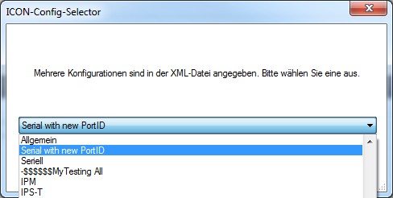

  


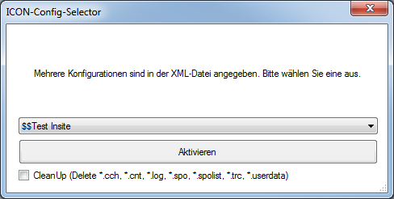


The selected configuration is displayed in the title of the ICON application.


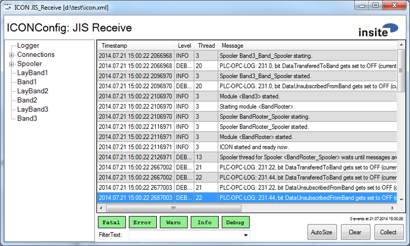


---  
#GUI of ICON#

<a name="gui_of_icon"></a>
Here, you will learn about the special features and operability of the application GUIs.  

ICON supports two styles: 

*  **Navigation with tabs**  


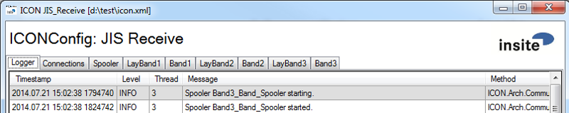

*  **Navigation with trees**  


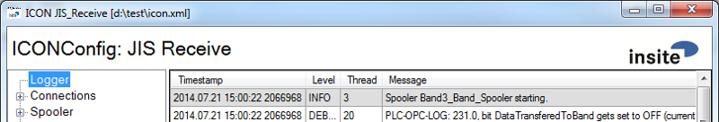

For details, see the section [Configuration &#60;ICONGlobals&#62;](#Configuration_ICONGlobals)

---  
##Status Bar##


The status bar in ICON consists of three areas:

  1.   **Status display:** Here, ICON displays the various action messages automatically.
  2.   **User-defined display:** Here, modules can display information (only one module can be displayed at a time)
  3.   **User rights:** If a UserLevel module is configured in ICON, the current LevelStatus is displayed here.

---  
##Logger##


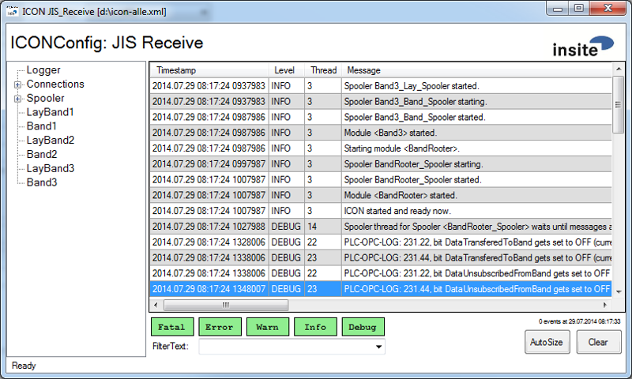

If you double click on a row in the logger, the cell will be copied to the clipboard.
  


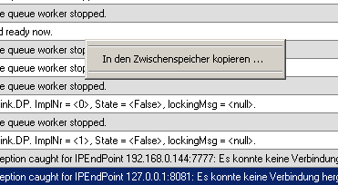


If you right-click on a row, you can copy all rows to the clipboard via the popup menu.


---  
##Connections##

"Connections" appears as a second tab page. The connections to the PLCs are displayed here.


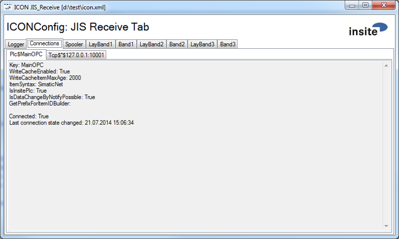

  


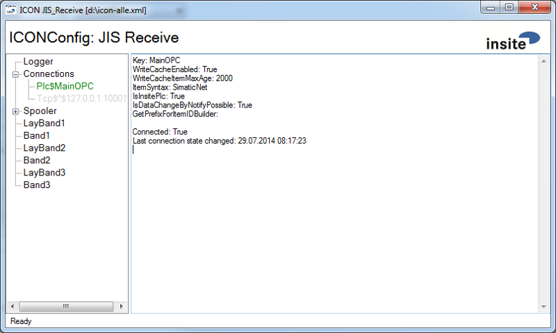


---  
##Spooler##


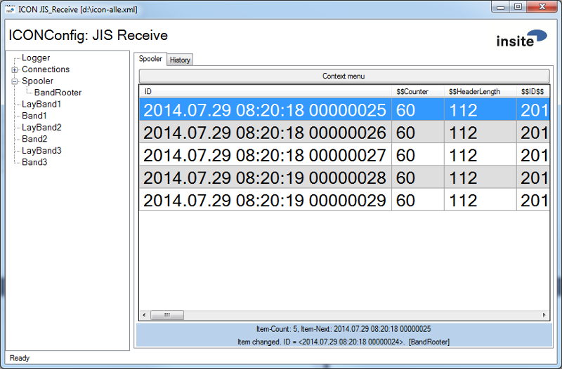

  


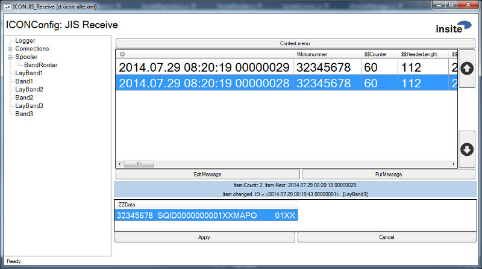

In the spooler you can see a row entry with the most essential information for each message. In the lower status bar (light blue), the total number of messages in the spooler and the next item to be processed are displayed. You can also find the last action and name ("Label") of the spooler here.  

In the area above this, messages that have already been processed and which are waiting for a response are displayed. (If the AllowMoreThanOnePendingMsgs option is set to false, this area is then hidden)  

If you double click on a row, the cell will be copied to the clipboard.
  


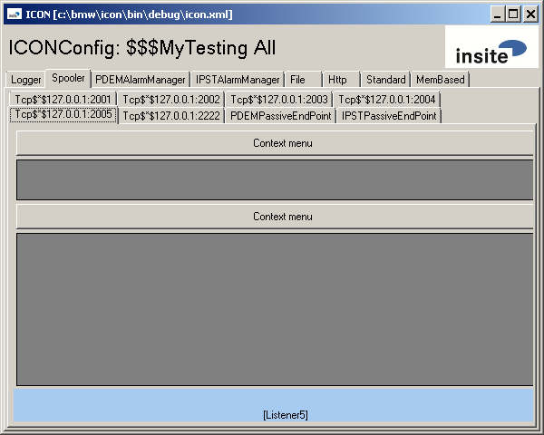


The Listeners (PassiveEndPoint sections) generated in the Socket Manager enter the routing information in the tab/tree node, the label is displayed below.

  

If you right-click here, you will see the following popup menu:
  


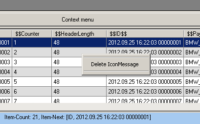
  


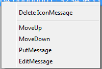


  1.   **Delete IconMessage:** This refers to the selected rows. All selected rows are deleted, but only consecutively from the first. (If the "&#42;&#42;&#42;" row is selected and deleted, all IconMessages from the beginning onwards, as well as all those hidden below "&#42;&#42;&#42;" will be deleted.
  2.   **MoveUp, MoveDown:** Both these entries can be activated via the parameterisation. They are used to move messages.
  3.   **PutMessage:** This option can also be activated via the parameterisation, it is used to send a message to the sink immediately. (however, this option is only possible for a manual spooler)
  4.   **EditMessage:** Also being activated via the parameterisation, this option is used to edit data of a message. (like PutMessage, this option is also only possible for a manual spooler)

  


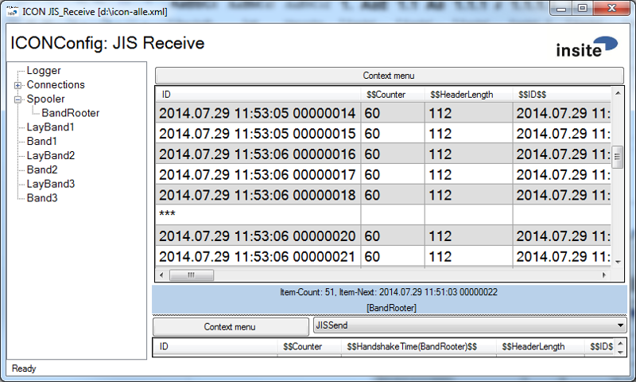

Above, you can see a spooler with
  
```html
<ConfigValue name='ShowItemsFirst' type='int'>20</ConfigValue>
<ConfigValue name='ShowItemsLast' type='int'>30</ConfigValue>
```  

Therefore, only the first 20 and last 30 items are displayed. Between this there is an empty row with "&#42;&#42;&#42;".
As stated above, deleting this "&#42;&#42;&#42;"-row will delete all messages hidden under it (in this case, all messages between the first 20 and the last 30!)

---  
###Spooler Configuration###

<a name="Spooler_Configuration"></a>
  
```html
<Section Type="GUI">
    <ConfigValue name="UserLevelModule" type="string">PLCUserLevel</ConfigValue>
    <ConfigValue name="Group" type="string">Spooler</ConfigValue>
    <ConfigValue name="Label" type="string">Mein Spooler</ConfigValue>
    <ConfigValue name='ShowItemsFirst' type='int'>25</ConfigValue>
    <ConfigValue name='ShowItemsLast' type='int'>15</ConfigValue>
    <ConfigValue name='AllowSpoolerItemUpDownMove' type='bool'>false</ConfigValue>
    <ConfigValue name='AllowPutFromGUI' type='bool'>false</ConfigValue>
    <ConfigValue name='LastOnTop' type='bool'>false</ConfigValue>
    <ConfigValue name='UserCanEditSpoolerItem' type='bool'>false</ConfigValue>
    <ConfigValue name='EditItemValue' type='string'></ConfigValue>
    <ConfigValue name="FirstColumnIsRowNumber" type="bool">false</ConfigValue>
    <Section Type="Columns">
        <Column name="!1AnzahlTeile" data="Payload=112,2" />
        <Column name="!2Band" data="Payload=114,2" />
        <Column name="!3Motornummer" data="Payload=116,10" />
        <Column name="ZZData" data="Payload=116" />
     </Section>
</Section>
```  


*  **UserLevelModule:** Here, you can specify a UserLevelModule. With this, for example, you can disable moving, forwarding, processing etc.
*  **Group:** Allows you to specify the tab in which the spooler should appear. The tabs are created and managed automatically. However, the dynamic spoolers of the Socket Manager are always displayed in the fixed "Spooler" tab.
*  **Label:** Give the spooler a "Label" so that it can be identified clearly within a group.
*  **ShowItemsFirst** and **ShowItemsLast:** As shown above in 4.4, with these options you determine the amount displayed of the first and last messages.
*  **AllowSpoolerItemUpDownMove:** Determines whether or not it is possible to move telegrams in the spooler.
*  **AllowPutFromGui:** Determines whether or not it is possible to put any message into the next sink. However, this option is only relevant for a [manual spooler](#Manual_Spooler) 
*  **LastOnTop:** If set to true, the normal order on the display is inverted (i.e. the newest telegram is at the top, the oldest is at the bottom).
*  **Columns:** Here, you can declare additional columns to be displayed in the spooler. The configuration takes place in exactly the same way as with History Spooler.
*  **UserCanEditSpoolerItem:** If set to true, items can be edited. For this purpose, an additional DataGrid appears on the spooler page. However, this option also is only relevant for a [manual spooler](#Manual_Spooler) 
*  **EditItemValue:** Specifies, which data can be edited using "EditItemValue". However, this option is also only relevant for a [manual spooler](#Manual_Spooler) 
*  **FirstColumnIsRowNumber:**If set to true, the first column is no longer the MsgId but the row number in the GUI instead.

In [ICONGlobals](#Configuration_ICONGlobals), you can also modify the font size of the spooler rows for all spoolers.

---  
###Spooler with History###

If the History is configured, then an additional DataGrid with data already processed from the spooler appears in the GUI. In other words, the data that was transmitted successfully or deleted, unless they were filtered out.  

  


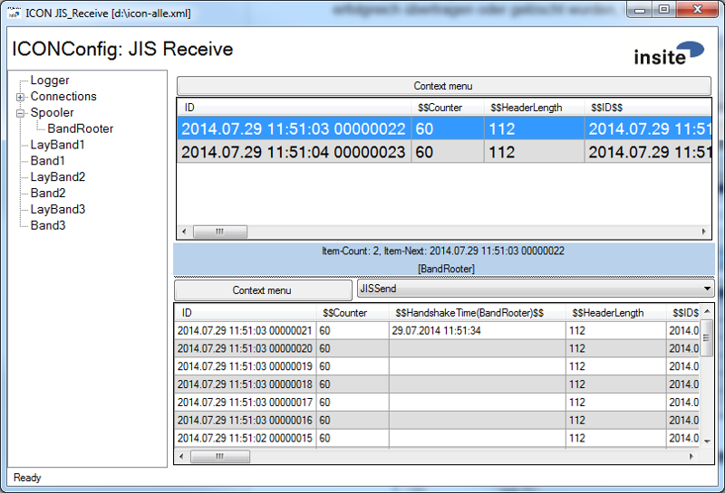
  


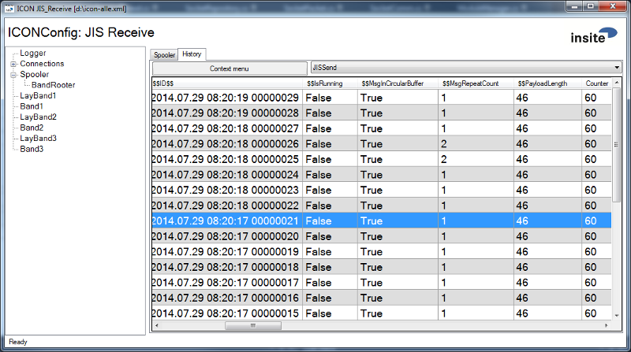
  

The configuration of the History is created as a subsection in the GUI section of the spooler section:
  
```html
<Section Type="Spooler">
    ...
    <Section Type="GUI">
        ...
        <Section Type="History">
            ...
        </Section>
    </Section>
</Section>
```  

An example configuration therefore looks like this:
  
```html
<Section Type="History">
    <ConfigValue name='MaxNumberOfItems' type='int'>500</ConfigValue>
    <ConfigValue name='LastOnTop' type='bool'>false</ConfigValue>
    <ConfigValue name='ShowInTabs' type='bool'>false</ConfigValue>
    <ConfigValue name='DefaultTabIsHistory' type='int'>500</ConfigValue>
    <ConfigValue name='AllowSpoolerItemUpDownMove' type='bool'>false</ConfigValue>
    <Section Type="Persistor">
        <ConfigValue name='Filename' type='string'>Test.History</ConfigValue>
    </Section>
    <Section Type="Filters">
        <Section Type="Filter">
            <ConfigValue name='Filter' type='string'>$$$CPE='CSVREAD AB'</ConfigValue>
            <Section Type="Columns">
                <Column name="$$$CPE" data="Payload,0,10" />
                <Column name="$$$FirstBytes" data="Payload,0,10" />
            </Section>
        </Section>
        <Section Type="DisplayFilters" Default='Filter1'>
            <DisplayFilter name="Filter1" filter="CSVREAD AT" />
            <DisplayFilter name="Filter2" filter="CSVREAD A2" />
            <DisplayFilter name="Filter3" filter="SlotSrc = '0'" />
            <DisplayFilter name="Filter4" filter="SlotSrc = '0' AND
                           State='Unknown'" />
            <DisplayFilter name="Filter5" filter="SlotSrc = '1" />
            <DisplayFilter name="Filter6" filter="SlotSrc = '1' AND
                           State='Unknown'" />
            <DisplayFilter name="Filter7" filter="((State='x') AND (State='y')) OR
                           (State='z')" />
            <DisplayFilter name="Filter8" filter="State='Unknown' OR
                           State='NotUnknown'"/>
            <DisplayFilter name="Filter9" filter="State='Unknown' AND
                           $$$CPE='CSVREAD AB'">
                <Columns>
                    <Column name="$$$CPE" data="Payload,0,10" />
                    <Column name="$$$FirstBytes" data="Payload,0,10" />
                </Columns>
            </DisplayFilter>
        </Section>
    </Section>
</Section>
```  

MaxNumberOfItems and Filename are self-explanatory or are explained in chapter [Spooling](#Spooling).

*  **LastOnTop:** Set to "true" for an inversion of the normal display (i.e. the newest telegram is at the top, the oldest is at the bottom).
*  **ShowInTabs:** Activate to display spoolers and history in two seperate tabs.
*  **DefaultTabIsHistory:** Determines whether the History tab is activated first when starting.

There are two subsections available under the Filters section:

*  **Filter for Insert (Filter Section):** Configures the condition for inserting into the History list.
*  **Filter of the GUI (Display Filters section):** Configures various conditions of a filter that can be activated in the grid. If the filter name &#60;none&#62; is selected, no filter is activated. When the combo box is opened, the configured Displayfilters appear for selection. A filter can be preselected via the default attribute.

Within a filter section, a columns subsection can exist which extracts data from "IconMsg"-attributes. The data parameter contains the attribute name, start, and length of the data. This data can also be used to form conditions. The columns are displayed in the grid.   

If errors occur when forming columns during the evaluation of conditions, the dataset is always displayed and contains a corresponding text in the "$$$$$ERROR$$$$$" column.  

If you select one or more rows in the history list, you can again transmit this data to the sink by clicking the right mouse button or via the context menu.

---  
##MemBasedMsgSource##

<a name="MemBasedMsgSource"></a>
In the upper left corner the configured "Label" is displayed for identification. If some of the slots do not appear, there is a vertical scrollbar to move the display. (However, ICON always tries to use the maximum amount of space available, thus, if the window is enlarged, the viewing area will be enlarged, too)  


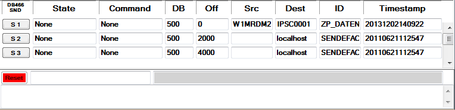

  

To query the last error of a slot or to view the telegram sent with this slot, you click on the corresponding button (e.g. A1). If a slot is selected, it will then turn yellow and the last error and telegram data will be displayed below. It is also possible to perform a reset. This means that the bits return to their initial position.  


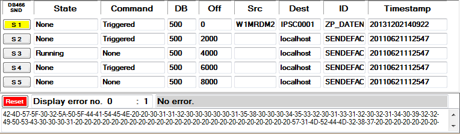

  

**Arrow Up** and **Arrow Down** in ID:  
 
In the ID field you can scroll with the arrow-keys. Usually, there are 3 rows: 

  1.   The TelegramID
  2.   The data in HEX
  3.   The data as character string, in which the non-displayable characters in decimal are provided with the start/end markers "&#60;&#35;" and "&#35;&#62;"

Mouse **double-click** on ID:  

A tooltip is displayed by double-clicking on ID  


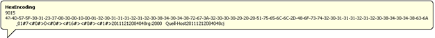


---  
##MemBasedMsgSink##

The MemBasedMsgSink GUI behaves in exactly the same way as described in the previous chapter on [MemBasedMsgSource](#MemBasedMsgSource).  


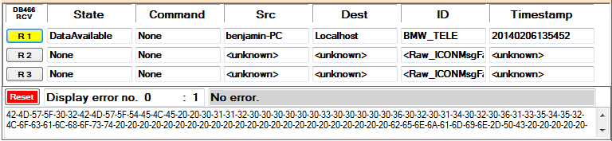


---  
# Module #

<a name="Module"></a>

---  
## ICONSocket.dll ##

<a name="ICONSocket.dll"></a>
An ICON Socket depicts a fix in the configuration parameterised active(client) or passive(server) socket connection. As of now, the TCP and RFC1006 protocol are supported. 

---  
### Configuration ###

  
```html
<ICONModule Name="MeinSocket" Assembly="ICONSocket.dll">
    <ConfigValue name="Protocol" type="string">Tcp</ConfigValue>
    <ConfigValue name="Host" type="string">*</ConfigValue>
    <ConfigValue name="Port" type="string">0</ConfigValue>
    <ConfigValue name="LocalTSAP" type="string"> </ConfigValue>
    <ConfigValue name="RemoteTSAP" type="string"></ConfigValue>
    <ConfigValue name="MaxConnections" type="int">0</ConfigValue>
    <ConfigValue name="ProtImpl" type="string"> </ConfigValue>
    <ConfigValue name="DispatchMode" type="int">2</ConfigValue>
    <ConfigValue name="Sink" type="string"> </ConfigValue>
    <ConfigValue name="MaxHandshakeTime" type="int">10000</ConfigValue>
    <ConfigValue name="MaxIdleTime" type="int">60</ConfigValue>
    <ConfigValue name="FrameSize" type="int">1024</ConfigValue>
    <ConfigValue name="KeepAliveTime" type="int">0</ConfigValue>
    <ConfigValue name="KeepAliveInterval" type="int">0</ConfigValue>
    <ConfigValue name="MaxSocketLatencyTime" type="int">0</ConfigValue>
    <ConfigValue name="SocketLatencyMeasurementType" type="string">Inherit</ConfigValue>
    <ConfigValue name="SpoolAlways" type="bool">false</ConfigValue>
    <ConfigValue name="ReceiveBehaviour" type="string">OnlyProtocolData</ConfigValue>
    <ConfigValue name="ForceClientConnect" type="bool">false</ConfigValue>
    <ConfigValue name="SuppressAcknowledge" type="bool">false</ConfigValue>
        OPTIONAL <Section Type="Spooler" \>
</ICONModule>
```  

Meaning of the individual parameters:

*  **Protocol:** TCP or RFC1006
*  **Host:** an IP address or DNS, "&#42;", "0.0.0.0" or "127.0.0.1" are Listeners (Passive Endpoint).
*  **Port:** a port
*  **LocalTSAP:** a TSAP (only needed in conjunction with RFC1006!)
*  **RemoteTSAP:** a TSAP (only needed in conjunction with RFC1006!)
*  **MaxConnections:** Number of permited multi-client connections for a Listener, "0" for any number.
*  **ProtImpl:** ???&#95;ICONMsgFactory (Without a valid specification no reception of data is possible!)
*  **DispatchMode:** Processing mode of the Message-Dispatcher (2 = PreserveSequence)
*  **Sink:** Reference to the the data sink (Without a valid specification ICON will trigger an exception)
*  **MaxHandshakeTime:** Timeout in ms to the source
*  **MaxIdleTime:** After the time has elapsed in seconds without using the socket, it is terminated.
*  **FrameSize:** Specifies the TPDU&#95;Size of the RFC1006.
*  **KeepAliveTime:**  Determines how often TCP KeepAlive telegrams are sent. TCP sends KeepAlive telegrams to check whether an idle connection is still active. TCP KeepAliveTime is used when the remote system is responding, otherwise the interval between the transmissions is determined by the KeepAliveInterval. This value is set to not less than 2 hours by default.
*  **KeepAliveInterval:** Duration between two successive Keepalive transmissions if the confirmation of the earlier Keepalive transmission was not received.	
*  **MaxSocketLatencyTime:** Can be used to overwrite the state of the latency monitoring for this socket (default setting is found in [ICONGlobals](#Configuration_ICONGlobals)). Depending on the setting of "SocketLatencyMeasurementType", a duration in the handling of a message is measured. If the set time is exceeded, information is displayed on the logging page of ICON. If the value is 0, this monitoring is deactivated.
*  **SocketLatencyMeasurementType:** Specifies the type of measurement. Possible Values are: "Inherit" (monitoring type is inherited from [ICONGlobals](#Configuration_ICONGlobals)), "Disabled" (no monitoring), "Sent" (measurement from beginning of sending to sent), "Received" (measurement from beginning of sending to received acknowledgement).
*  **SpoolAlways:** spooling is always done (if a spooler is available) no matter what the setting is.
*  **ReceiveBehaviour:** Specification of the receive behaviour. Possible values:		
  *  **OnlyProtocolData:** Only telegrams that correspond to the specified protocol are forwarded.	
  *  **OnlyRawData:** Only raw data is sent or received on the connection. This means that no parsing, splitting or assembling of the incoming data is performed, each telegram is forwarded. *Attention*, acknowledgements are not handled then either. This means that a raw data telegram cannot be an acknowledgement.	
  *  **ProtocolAndRawData:** An incoming telegram is parsed, if a telegram is detected after a specified protocol impl, it is forwarded. If residual data remains that does not constitute any valid protocol impl telegram, it is still forwarded. (This option with RFC1006 is default true) 	

*  **ForceClientConnect:** false or true, if true, connection attempts take place every second.
*  **SuppressAcknowledge:** This socket do not wait for an ack for sent messages.

**When a TCP socket is initialised, the Keep-Alive-Timeout is set to 2 hours and the Keep-Alive-Interval is set to 1 second.**

---  
##Socketmanagement.dll##

The SocketManager can dynamically create active sockets, if the attributes necessary for this were set by a WACC protocol. Besides the active sockets, passive connections can be parameterised as well. The management of several sockets enables the SocketManager to decide which connection is used to send based on the telegram destination.

---  
###Configuration###

For detailed description of the parameters see [ICONSocket](#ICONSocket.dll)
  
```html
<ICONModule Name="Socketmanager" Assembly="SocketManagement.dll">
    <ConfigValue name="DoAutomaticReconnect" type="bool">1</ConfigValue>
    <ConfigValue name="ProtImpl" type="string"> </ConfigValue>
    <ConfigValue name="DispatchMode" type="int">2</ConfigValue>
    <ConfigValue name="Sink" type="string"></ConfigValue>
    <ConfigValue name="MaxHandshakeTime" type="int">10000</ConfigValue>
    <ConfigValue name="MaxIdleTime" type="int">60</ConfigValue>
    <ConfigValue name="FrameSize" type="int">1024</ConfigValue>
    <ConfigValue name="KeepAliveTime" type="int">0</ConfigValue>
    <ConfigValue name="KeepAliveInterval" type="int">0</ConfigValue>
    <ConfigValue name="SpoolAlways" type="bool">false</ConfigValue>
    <Section Type="Spooler" \>
    <PassiveEndPoint Name="Listener" \>
</ICONModule>
```  

The DoAutomaticReconnect, ProtImpl, DispatchMode and Sink parameters are transferred to the sockets to be instantiated. The same applies to the spooler section.  

A "PassiveEndPoint" section must be created for the parameterisation of the passive connections (Listeners). The same parameters must be used as with an ICONSocket. The only parameter that cannot be set is the "Host" parameter, for which there is an additional entry:
  
```html
<ConfigValue name="ImmediatelyAcknowledge" type="int">0</ConfigValue>
```  

Set "ImmediatelyAcknowledge" to 1 to receive immediate acknowledgements before the message is transferred to the Message-Dispatcher.  

**SpoolAlways:** Spooling is always done, no matter what the setting is.  

---  
##ICONSerial.dll##

This module opens a Com-Port and acts as an interface between Com-Port and Plc in order to write data from the Port to the Plc and vice versa.
The serial ports are only started if these also exist when starting ICON. This means that if a COM3 is present in the system, it will also be opened; if no Port 3 is present, no attempt will ever be made to open this either (not even if KeepAliveTime and AutoReconnect was parameterised).

---  
###Configuration###

  
```html
<ICONModule Name="Serial3" Assembly="ICONSerial.dll">
    <ConfigValue name="PortID" type="int">0</ConfigValue>
    <ConfigValue name="Sink" type="string">SerialSink</ConfigValue>
    <ConfigValue name="PortName" type="string">COM0</ConfigValue>
    <ConfigValue name="BaudRate" type="int">9600</ConfigValue>
    <ConfigValue name="DataBits" type="int">8</ConfigValue>
    <ConfigValue name="Handshake" type="string">None</ConfigValue>
    <ConfigValue name="Parity" type="string">None</ConfigValue>
    <ConfigValue name="StopBits" type="string">One</ConfigValue>
    <ConfigValue name="AutoReconnect" type="bool">false</ConfigValue>
    <ConfigValue name="KeepAliveTime" type="int">0</ConfigValue>
    <ConfigValue name="ProtImpl" type="string"> 
     BeginMarkerAndEndMarkerOrientedProtImpl</ConfigValue>
</ICONModule>
```  


 It is only possible to first open a port without an error with .Net 4.0.  


 Detecting whether a port is disconnected depends on the respective driver. Some drivers ensure error-free behaviour after reconnecting the device even without Disconnect.  

  

Meaning of the individual parameters:  

*  **PortID:** Unique identification number for the port.
*  **PortName:** Name of the connection (e.g. COM1 or COM2, ...)
*  **BaudRate:** Transmission rate
*  **DataBits:** Default length of data bits per byte
*  **Handshake:** Handshake Protocol:		
  *  **None:** No control item is used for the Handshake.	
  *  **XOnXOff:** The XON/XOFF software control protocol is used. The XOFF control is sent to stop the data transmission. The XON control is sent to resume the transmission. These software controls are used instead of Request to Send (RTS)- and Clear to Send (CTS) hardware controls.	
  *  **RequestToSend:** Request-to-Send (RTS) hardware data flow control is used. RTS signals that data is available for the transmission. If the input buffer is full, the RTS row is set to false. The RTS row is set to true if more space becomes available in the input buffer.	
  *  **RequestToSendXOnXOff:** The Request-to-Send (RTS) hardware control and XON/XOFF software control are used.	

*  **Parity:** Parity check protocol		
  *  **None:** No parity check is performed.	
  *  **Odd:** Specifies the parity bit so that the number of set bits is an odd number.	
  *  **Even:** Specifies the parity bit so that the number of set bits is an even number.	
  *  **Mark:** Keeps the specification of the parity bit at 1.	
  *  **Space:** Keeps the specification of the parity bit at 0.	

*  **StopBits:** Default number of stop bits per byte		
  *  **One:** A stop bit is used.	
  *  **Two:** Two stop bits are used.	
  *  **OnePointFive:** 1.5 stop bits are used.	

*  **ProtImpl:** Here, the protocol used must be specified. (See IconProtocols)
*  **AutoReconnect:** If set to true, another attempt is made to reconnect after detecting the disconnected ComPort.
*  **KeepAliveTime:** Specifies the time interval, at which it should be checked whether the ComPort still exists.

---  
##MemBasedMsgSink.dll##

<a name="MemBasedMsgSink.dll"></a>
This module should be used if the Plc should serve as a data sink. Here, a transfer handshake takes place with the Plc.

---  
###Configuration###

  
```html
<ICONModule Name="Datenkonsument" Assembly="PLCBasedMsgImpl.dll">
    <ConfigValue name="MaxHandshakeTime" type="int">10000</ConfigValue>
    <ConfigValue name="DoMultiSlotHandshake" type="bool">true</ConfigValue>
    <Section Type="Slot">
        <ConfigValue name="Impl" type="string">PlcBasedMsgImpl.dll</ConfigValue>
        <ConfigValue name="Name" type="string">PDEMSinkPlc</ConfigValue>
        <ConfigValue name="Accessor" type="string">MainOPC</ConfigValue>
        <ConfigValue name="ObservedGroupUpdateRate" type="int">20</ConfigValue>
        <ConfigValue name="Poll" type="int">1</ConfigValue>
        <ConfigValue name="DB" type="int">401</ConfigValue>
        <ConfigValue name="Offset" type="int">0</ConfigValue>
        <ConfigValue name="MaxDatagramLength" type="int">-1</ConfigValue>
        <ConfigValue name="FillUpToDataSizeLimit" type="bool">true</ConfigValue>
    </Section>

    OPTIONAL <Section Type="GUI" \>

    OPTIONAL <Section Type="Spooler" \>

</ICONModule>
```  

Meaning of the individual parameters:

*  **Impl:** Specifies the implementation class, here, for example, PlcBasedMsgImpl.
*  **Name:** Specifies a group name for the bits to be monitored in the PLC.
*  **Accessor:** Specifies the PLC Accessor.
*  **ObservedGroupUpdateRate:** Specifies the cycle rate in milliseconds for monitoring the bits in the pool mode.
*  **Poll:** The functionality of the PLC monitoring, whether polling=1 or event controlled =0. 
*  **DB:** The data module to be used in the PLC. (If DB is not specified, an attempt is made to read out the "PufferDB" parameter)
*  **Offset:** Specification of the Offset in the data module. (If Offset is not specified, an attempt is made to read out the "PufferFirstByte" parameter)
*  **MaxDatagramLength:** If a value greater or equal to zero is entered, then the maximum description is monitored with data on the DB from Offset. If the data then exceeds the maximum permissible length, the data is cut off.
*  **FillUpToDataSizeLimit:** Fills the data to be written up to MaxDatagramLength with blank. (Is only active if MaxDatagramLength was specified)

The GUI and Spooler sections are optional and are described in the following chapters.  

---  
####DoMultiSlotHandshake####
 
  

The "DoMultiSlotHandshake" parameter is only relevant for operation with a spooler and may only be set to "true" in this case. It changes the interaction between the spooler and MemBasedMsgSink.   


 If DoMultiSlotHandshake = true, a spooler must be integrated and the "AllowMoreThanOnePendingMsg" parameter must be set to "true" for the integrated spooler.  

If a MemBasedMsgSink has more than one slot, more than one message can be located in "delivery" at the same time. For example, in the case of 3 empty slots, 3 messages can be taken from the spooler immediately and transferred to the respective slot. However, the strategy for the handshake handling then is different: Since ICON works further on with a thread in this situation, it is not possible to wait "synchronously" for handshake signals (as is the case with "DoMultiSlotHandshake" = false), but instead ICON "scans" all slots in succession for any change in the handshake bit with a Timeout time of 100ms. A connected PLC that processes and acknowledges all slots in a cycle virtually "in parallel", for example, is thus handled more efficiently. At the same time, the spooler must be able to handle multiple pending messages, because those may only be removed by the PLC after the acknowledgement. Since the program internal equal treatment always resulted in different combinations of problems (the spooler is also used in the interaction with other MessageSinks) it was decided to control this special "operating mode", which actually only exists with multiple slots for a MemBasedMsgSink, via the configuration and to branch program-internal accordingly.  

  

Thus, to summarise, only the following combinations are allowed:  

  

<table><tr><th>Spooler is present </th><th> Spooler: </th><th> MemBasedMsgSink:</th></tr>
<tr><th>   </th><th> AllowMoreThanOnPendingMsg </th><th> DoMultiSlotHandshake</th></tr>
<tr><td>No </td><td> - </td><td> False</td></tr>
<tr><td>Yes </td><td> False </td><td> False</td></tr>
<tr><td>Yes </td><td> True </td><td> False</td></tr>
<tr><td>Yes </td><td> True </td><td> True</td></tr>
</table>


---  
###Signal Time Diagram Slot (MemBasedMsgSink)###


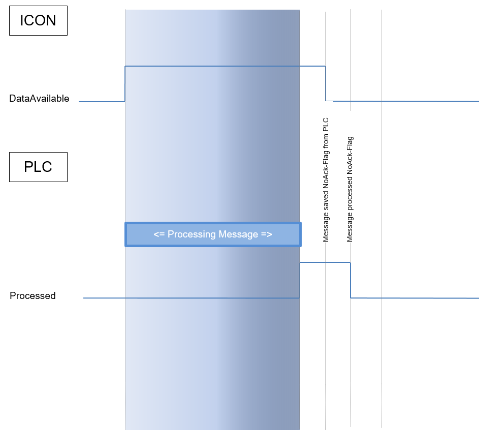
  

---  
###Impl###

<a name="Impl"></a>
The MemBasedMsgSink can use various implementations, afterwards the variants currently possible are listed.  


---  
####PlcBasedMsgImpl.dll####
   

  

---  
#####PLC Interface Structure#####
 
  

<table><tr><th>Data type </th><th> Designation </th><th> Access mode</th></tr>
<tr><td>Byte </td><td> commandWordLB </td><td> Write</td></tr>
<tr><td>Byte </td><td> commandWordHB </td><td> Write</td></tr>
<tr><td>Byte </td><td> stateWordLB </td><td> Read</td></tr>
<tr><td>Byte </td><td> stateWordHB </td><td> Read</td></tr>
<tr><td>SByte </td><td> ackCode1 </td><td> Read/Write</td></tr>
<tr><td>SByte </td><td> ackCode2 </td><td> Read/Write</td></tr>
<tr><td>Byte[] </td><td> data </td><td> Write</td></tr>
</table>


---  
#####PLC Interface Bits#####
 
  


<table><tr><th colspan="3">Structure ICON  -->  PLC Word (commandWord):</th></tr>
<tr><th>Bit No </th><th> Enum </th><th> Description</th></tr>
<tr><td>Bit 0 </td><td> DataAvailable </td><td> Data available for processing (this bit is set</td></tr>
<tr><td>   </td><td>    </td><td> by ICON if the data was saved in the DB) </td></tr>
<tr><td>Bit 1-15 </td><td> </td><td> &#60;free&#62;</td></tr>
</table>

  


  

<br/>

<table><tr><th colspan="3">Structure PLC  -->  ICON Word (stateWord):</th></tr>
<tr><th>Bit No </th><th> Enum </th><th> Description</th></tr>
<tr><td>Bit 0 </td><td> DataProcessed </td><td> This bit is set by the PLC if the data was accepted</td></tr>
<tr><td>Bit 1 </td><td> NoAck </td><td> Bit must be set if no acknowledgement</td></tr>
<tr><td>   </td><td>    </td><td> should be sent to the telegram</td></tr>
<tr><td>Bit 2 </td><td> SpecialAck </td><td> If this bit is set, an acknowledgement is</td></tr>
<tr><td>   </td><td>    </td><td> generated from the data to the slot</td></tr>
<tr><td>Bit 3 </td><td> NetByteOrder </td><td> If this bit is set, byte swapping is performed with</td></tr>
<tr><td>   </td><td>    </td><td> the telegram. (Only relevant in conjunction with</td></tr>
<tr><td>   </td><td>    </td><td> SpecialAck)</td></tr>
<tr><td>Bit 4-15 </td><td> </td><td> &#60;free&#62;</td></tr>
</table>

  


 SpecialAck is only effective if the spooler mode is set to 2

---  
####PLC2COMSinkImpl.dll####
 
  

---  
#####PLC Interface Structure#####
 
  

<table><tr><th>Data type </th><th> Designation </th><th> Access mode</th></tr>
<tr><td>Byte </td><td> commandWordLB </td><td> Write</td></tr>
<tr><td>Byte </td><td> commandWordHB </td><td> Write</td></tr>
<tr><td>Byte </td><td> stateWordLB </td><td> Read</td></tr>
<tr><td>Byte </td><td> stateWordHB </td><td> Read</td></tr>
<tr><td>Byte[] </td><td> data </td><td> Write</td></tr>
</table>


---  
#####PLC Interface Bits#####
 
  

<table><tr><th colspan="3">Structure ICON  -->  PLC Word (commandWord):</th></tr>
<tr><th>Bit No </th><th> Enum </th><th> Description</th></tr>
<tr><td>Bit 0 </td><td> DataAvailable </td><td> Data available for processing (this bit is set</td></tr>
<tr><td>   </td><td>    </td><td> by ICON if the data was saved in the DB)</td></tr>
<tr><td>Bit 1 </td><td> AlivFlag </td><td> Toggle Flag</td></tr>
<tr><td>Bit 2-13 </td><td> DataSentOrderX </td><td> Bits 2-13 are acknowledgements to the</td></tr>
<tr><td>   </td><td>    </td><td> transmission triggers from the control word</td></tr>
<tr><td>Bit 14 </td><td> RxPortIDLoBit </td><td> Encodes the port ID of the last receipt</td></tr>
<tr><td>Bit 15 </td><td> RxPortIDHiBit </td><td> Encodes the port ID of the last receipt</td></tr>
</table>


  

<br/>

<table><tr><th colspan="3">Structure PLC  -->  ICON Word (stateWord):</th></tr>
<tr><th>Bit No </th><th> Enum </th><th> Description</th></tr>
<tr><td>Bit 0 </td><td> DataProcessed </td><td> This bit is set by the PLC if the data was accepted</td></tr>
<tr><td>Bit 1 </td><td> </td><td> &#60;free&#62;</td></tr>
<tr><td>Bit 2-13 </td><td> TriggerOrderX </td><td> Bits 2-13 are transmission triggers, ICON</td></tr>
<tr><td>   </td><td>    </td><td> acknowledges the successful transmission</td></tr>
<tr><td>   </td><td>    </td><td> process by the DataSentOrderX bits</td></tr>
<tr><td>Bit 14-15 </td><td> </td><td> &#60;free&#62;</td></tr>
</table>


---  
#####Extended Configuration#####
 
  

  
```html
 <ICONModule Name="SerialSink" Assembly="MemBasedMsgSink.dll">
      <Section Type="Slot">
        <ConfigValue name="Impl" type="string">PLC2COMImpl.dll</ConfigValue>
									...
        <ConfigValue name="IgnoreDoubleInterval" type="int">1500</ConfigValue>
        <ConfigValue name="AliveFlagCycle" type="int">1000</ConfigValue>
        
        <ConfigValue name="Request1" 
                     type="string">Telnet1:DB402.B0,50</ConfigValue>
         
        <ConfigValue name="Request2" 
                     type="string">Telnet2:Scanner1.txt</ConfigValue>
        ...
        <ConfigValue name="Request12" 
                     type="string">SPID101:DB402.B0,50</ConfigValue>

      </Section>
    </ICONModule>
```  

Meaning of the individual parameters:

*  **Impl:** Specifies the implementation class, here, for example, PlcBasedMsgImpl
*  **Name:** Generates a group name for the bits to be monitored in the PLC
*  **Request:** Here, data can be sent to the specified interface from the PLC. Structure of the string: ModulID:Source		
  *  *ModulID:* Here, the name of the transmitting module must be specified	
  *  *Source:* Specifies the source, which is either a PLC or a file:				
    *  *PLCSource:* DB[DBNumber].B[ByteOffset],[NumberBytes]		
    *  *FileSource:* Path and filename		
	


---  
###GUI MemBasedMsgSink###

<a name="GUI MemBasedMsgSink"></a>
The GUI can be configured as follows:
  
```html
<Section Type="GUI">
    <ConfigValue name="Group" type="string">File</ConfigValue>
    <ConfigValue name="Label" type="string">552</ConfigValue>
    <ConfigValue name="RefreshInterval" type="int">50</ConfigValue>
    <ConfigValue name="RefreshOnlyIfVisible" type="bool">true</ConfigValue>
</Section>
```  

Meaning of the individual parameters:

*  **Group:** Can be used to determine the tab
*  **Label:** Writes the text for identification in the upper left corner of the display
*  **RefreshInterval:** Specified in milliseconds and should be set to a value the system can handle  
	


 If set to 0, the GUI is constantly refreshed which may overload the system
*  **RefreshOnlyIfVisible:** Determines whether the GUI is only refreshed when it is selected

---  
##MemBasedMsgSource.dll##

This module should be used if the PLC should serve as a data source. Herem a transfer handshake takes place with the PLC

---  
###Configuration###

  
```html
<ICONModule Name="Datenlieferant" Assembly="MemBasedMsgSource.dll">
    <ConfigValue name="OnMessageCreated" type="string">AModul</ConfigValue>
    <ConfigValue name="DispatchMode" type="int">2</ConfigValue>
    <ConfigValue name="Sink" type="string">PDEMPassiveEndPoint</ConfigValue>
    <ConfigValue name="Impl" type="string">PlcBasedMsgImpl.dll</ConfigValue>
    <ConfigValue name="Name" type="string">PDEMSourcePlc</ConfigValue>
    <ConfigValue name="Accessor" type="string">MainOPC</ConfigValue>
    <ConfigValue name="ObservedGroupUpdateRate" type="int">20</ConfigValue>
    <ConfigValue name="Poll" type="int">1</ConfigValue>
    <ConfigValue name="DB" type="int">402</ConfigValue>
    <ConfigValue name="Offset" type="int">0</ConfigValue>   
      <ConfigValue name="WaitingFallingAckReady" type="bool">false</ConfigValue>    
        <ConfigValue name="MaxHandshakeTime" type="int">10000</ConfigValue>
        <ConfigValue name="MaxPrefetchByteCount" type="int">200</ConfigValue>
      <ConfigValue name="MsgExecutionMode" 
type="string">ThreadBasedExecutor</ConfigValue>

    OPTIONAL <Section Type="GUI" \>

</ICONModule>
```  

Meaning of the individual parameters:

*  **OnMessageCreated:** If desired or necessary, you can here transfer a message to another source after its creation in order to configure or manipulate it individually further on
*  **DispatchMode:** Mode of the Dispatcher, see [other chapter](#howdoesiconwork) 
*  **Sink:** The sink for the data transmission
*  **Impl:** specifies the implementation class, here, PlcBasedMsgImpl. For details see [Impl](#Impl) 
*  **Name:** Generates a group name for the bits to be monitored in the PLC
*  **Accessor:** Specifies the PLC Accessor
*  **ObservedGroupUpdateRate:** Specifies tje cycle rate in milliseconds for monitoring the bits to be monitored in the pool mode
*  **Poll:** The functionality of the PLC monitoring, whether polling=1 or event controlled=0
*  **DB:** The data module used in the PLC
*  **Offset:** Specification of the offset in the data module
*  **WaitingFallingAckReady:** If set to true, the handshake cycle waits until the ReadyAck falls
*  **WaitForFallingAck:** like WaitingFallingAckReady
*  **MaxHandshakeTime:** 
*  **MaxPrefetchByteCount:** Specifies the minimum length of the bytes when reading from a DB. e.g. If DB length is 300 and requested lenght is 6, 200 bytes will be read. But if DB lenght is 100 and request is 6, then only 100 bytes will be read.
*  **MsgExecutionMode:** Possible Specifications:			
  *  AsynchronousExecutionPattern		
  *  ThreadPoolBasedExecutor		
  *  ThreadBasedExecutor		


 Please always use "ThreadBasedExecutor". Only use others after consultation  

  

The GUI section is optional and is described in the following chapters.

---  
###Signal Time Diagram###


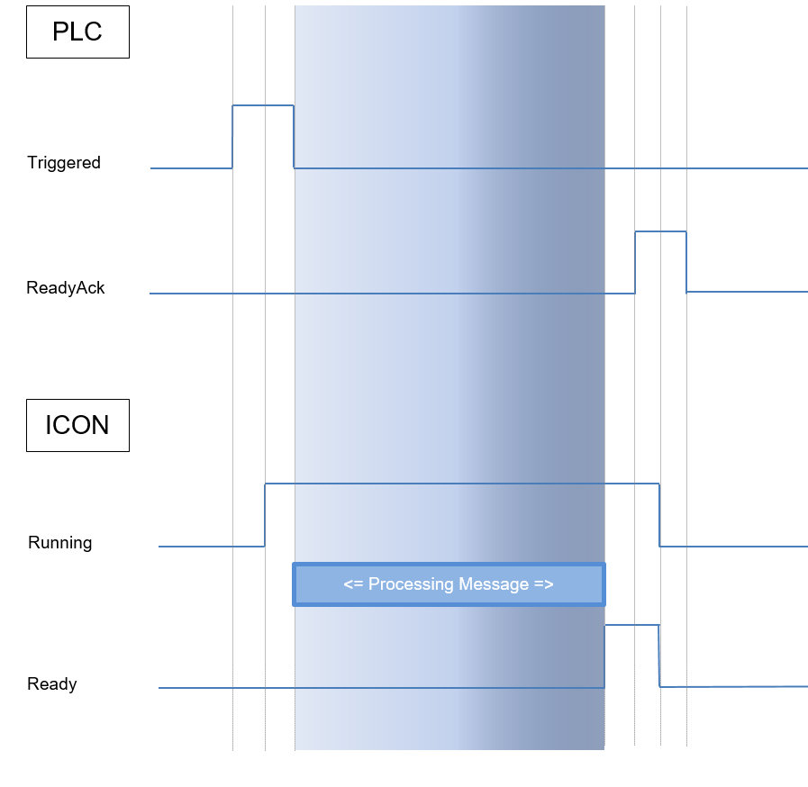
  

---  
###Impl###

The MemBasedMsgSource can use various implementations, in the following, the variants currently possible are listed

---  
####SimplePlcBasedMsgSourceImpl.dll####
 
  

---  
#####PLC Interface Structure#####
 
  

<table><tr><th>Data type </th><th> Designation </th><th> Access mode</th></tr>
<tr><td>Byte </td><td> commandWordLB </td><td> Read</td></tr>
<tr><td>Byte </td><td> commandWordHB </td><td> Read</td></tr>
<tr><td>Byte </td><td> stateWordLB </td><td> Write</td></tr>
<tr><td>Byte </td><td> stateWordHB </td><td> Write</td></tr>
<tr><td>UShort </td><td> error </td><td> Write</td></tr>
<tr><td>USHort </td><td> dataLen </td><td> Read</td></tr>
<tr><td>Byte[] </td><td> data </td><td> Read</td></tr>
</table>


---  
#####PLC Interface Bits#####
 
  

<table><tr><th colspan="3">Structure PLC  -->  ICON Word (commandWord):</th></tr>
<tr><th>Bit No </th><th> Enum </th><th> Description</th></tr>
<tr><td>Bit 0 </td><td> Request </td><td> Data available for processing (This bit is set by</td></tr>
<tr><td>   </td><td>    </td><td> ICON if the data was saved in the DB.)</td></tr>
<tr><td>Bit 1 </td><td> RequestToggle </td><td> Toggle Flag</td></tr>
<tr><td>Bit 2-15 </td><td> </td><td> &#60;free&#62;</td></tr>
</table>


  

<br/>

<table><tr><th colspan="3">Structure ICON  -->  PLC Word (stateWord):</th></tr>
<tr><th>Bit No </th><th> Enum </th><th> Description</th></tr>
<tr><td>Bit 0 </td><td> Running </td><td> is set when a request is running</td></tr>
<tr><td>Bit 1-15 </td><td> </td><td> &#60;free&#62;</td></tr>
</table>


---  
####PLCBasedMsgImpl.dll####
 
  

---  
#####PLC Interface Structure#####
 
  

<table><tr><th>Data type </th><th> Designation </th><th> Access mode</th></tr>
<tr><td>Byte </td><td> commandWordLB </td><td> Read</td></tr>
<tr><td>Byte </td><td> commandWordHB </td><td> Read</td></tr>
<tr><td>Byte </td><td> stateWordLB </td><td> Write</td></tr>
<tr><td>Byte </td><td> stateWordHB </td><td> Write</td></tr>
<tr><td>UShort </td><td> db </td><td> Read</td></tr>
<tr><td>UShort </td><td> offset </td><td> Read</td></tr>
<tr><td>UShort </td><td> error </td><td> Write</td></tr>
<tr><td>Byte[] </td><td> data </td><td> Read</td></tr>
</table>


---  
#####PLC Interface Bits#####
 
  

<table><tr><th colspan="3">Structure PLC  -->  ICON Word (commandWord):</th></tr>
<tr><th>Bit No </th><th> Enum </th><th> Description</th></tr>
<tr><td>Bit 0 </td><td> Triggered </td><td> Transmission trigger to ICON</td></tr>
<tr><td>Bit 1 </td><td> ReadyAcked </td><td> Acknowledgement of the 'ready without error' bit</td></tr>
<tr><td>Bit 2 </td><td> HardErrorAcked </td><td> Acknowledgement of the 'communcation error' bit</td></tr>
<tr><td>Bit 3 </td><td> SoftErrorAcked </td><td> Acknowledgement of the 'procedure error' bit</td></tr>
<tr><td>Bit 4 </td><td> ResetAcked </td><td> Acknowledgement of the 'reset' bit</td></tr>
<tr><td>Bit 5-15 </td><td> </td><td> &#60;free&#62;</td></tr>
</table>


  

<br/>

<table><tr><th colspan="3">Structure ICON  -->  PLC Word (stateWord):</th></tr>
<tr><th>Bit No </th><th> Enum </th><th> Description</th></tr>
<tr><td>Bit 0 </td><td> Running </td><td> Indicates that the transmission procedure is running</td></tr>
<tr><td>Bit 1 </td><td> Ready </td><td> ICON reports a successful transmission procedure here</td></tr>
<tr><td>Bit 2 </td><td> HardError </td><td> ICON reports an error</td></tr>
<tr><td>Bit 3 </td><td> SoftError </td><td> ICON reports an error</td></tr>
<tr><td>Bit 4 </td><td> Reset </td><td> A reset has been requested from the GUI or ICON has </td></tr>
<tr><td>   </td><td>    </td><td> requested a reset due to an error</td></tr>
<tr><td>Bit 5-15 </td><td> </td><td> &#60;free&#62;</td></tr>
</table>

  


  

Pointer to the telegram:  

<table><tr><th colspan="3">Structure of data:</th></tr>
<tr><th>Bit No </th><th> Enum </th><th> Description</th></tr>
<tr><td>DW 4 </td><td> SourceBlock </td><td> Source db of the telegram</td></tr>
<tr><td>DW 6 </td><td> Offset </td><td> Offset at the start of a telegram</td></tr>
<tr><td>DW 8 </td><td> AckCode </td><td> Error code</td></tr>
</table>

  


---  
#####Extended Configuration#####
 
  

  
```html
<ICONModule Name="Datenlieferant" Assembly="MemBasedMsgSource.dll">
...
    <ConfigValue name="Slots" type="int">10</ConfigValue>
...
</ICONModule>
```  

Meaning of the individual parameters:

*  **Slots:** Number of slots used

---  
####PlcBasedFNCallOrientedImpl.dll####
 
  

---  
#####PLC Interface Structure#####
 
  

<table><tr><th>Data type </th><th> Designation </th><th> Access mode</th></tr>
<tr><td>Byte </td><td> commandWordLB </td><td> Read</td></tr>
<tr><td>Byte </td><td> commandWordHB </td><td> Read</td></tr>
<tr><td>UShort </td><td> db </td><td> Read</td></tr>
<tr><td>UShort </td><td> offset </td><td> Read</td></tr>
<tr><td>Byte </td><td> stateWordLB </td><td> Write</td></tr>
<tr><td>Byte </td><td> stateWordHB </td><td> Write</td></tr>
<tr><td>UShort </td><td> error </td><td> Write</td></tr>
<tr><td>Byte[] </td><td> data </td><td> Read</td></tr>
</table>


---  
#####PLC Interface Bits#####
 
  

<table><tr><th colspan="3">Structure PLC  -->  ICON Word (commandWord):</th></tr>
<tr><th>Bit No </th><th> Enum </th><th> Description</th></tr>
<tr><td>Bit 0 </td><td> Triggered </td><td> Transmission trigger to ICON</td></tr>
<tr><td>Bit 1 </td><td> ReadyAcked </td><td> Acknowledgement of the 'ready without error' bit</td></tr>
<tr><td>Bit 2 </td><td> HardErrorAcked </td><td> Acknowledgement of the 'communcation error' bit</td></tr>
<tr><td>Bit 3 </td><td> SoftErrorAcked </td><td> Acknowledgement of the 'procedure error' bit</td></tr>
<tr><td>Bit 4 </td><td> TestRequest </td><td> Testbit</td></tr>
<tr><td>Bit 5-15 </td><td> </td><td> &#60;free&#62;</td></tr>
</table>


  

<br/>

<table><tr><th colspan="3">Structure ICON  -->  PLC Word (stateWord):</th></tr>
<tr><th>Bit No </th><th> Enum </th><th> Description</th></tr>
<tr><td>Bit 0 </td><td> Running </td><td> Indicates that the transmission procedure is running</td></tr>
<tr><td>Bit 1 </td><td> Ready </td><td> ICON reports a successful transmission procedure here</td></tr>
<tr><td>Bit 2 </td><td> HardError </td><td> ICON reports an error</td></tr>
<tr><td>Bit 3 </td><td> SoftError </td><td> ICON reports an error</td></tr>
<tr><td>Bit 4 </td><td> TestResponse </td><td> Testbit</td></tr>
<tr><td>Bit 5-15 </td><td> </td><td> &#60;free&#62;</td></tr>
</table>

  


  

Pointer to the telegram:  

<table><tr><th colspan="3">Structure of data:</th></tr>
<tr><th>Bit No </th><th> Enum </th><th> Description</th></tr>
<tr><td>DW 2 </td><td> SourceBlock </td><td> Source db of the telegram</td></tr>
<tr><td>DW 4 </td><td> Offset </td><td> Offset at the start of a telegram</td></tr>
<tr><td>DW 8 </td><td> AckCode </td><td> Error code</td></tr>
</table>

  


---  
####JisImpl.dll####
 
  

---  
#####PLC Interface Structure#####
 
  

<table><tr><th>Data type </th><th> Designation </th><th> Access mode</th></tr>
<tr><td>Byte </td><td> commandWordLB </td><td> Read</td></tr>
<tr><td>Byte </td><td> commandWordHB </td><td> Read</td></tr>
<tr><td>Byte </td><td> stateWordLB </td><td> Write</td></tr>
<tr><td>Byte </td><td> stateWordHB </td><td> Write</td></tr>
<tr><td>UShort </td><td> error </td><td> Write</td></tr>
</table>


  

Header:  

<table><tr><th>Data type </th><th> Designation </th><th> Access mode</th></tr>
<tr><td>CHAR[2] </td><td> numberOfValues </td><td> Read</td></tr>
<tr><td>CHAR[2] </td><td> boundBuffer </td><td> Read</td></tr>
<tr><td>CHAR[10] </td><td> identifier </td><td> Read</td></tr>
</table>


  

Data:  

<table><tr><th>Data type </th><th> Designation </th><th> Access mode</th></tr>
<tr><td>CHAR[&#42;] </td><td> data </td><td> Read</td></tr>
</table>


  

---  
#####PLC Interface Bits#####
 
  

<table><tr><th colspan="3">Structure ICON  -->  PLC Word (commandWord):</th></tr>
<tr><th>Bit No </th><th> Enum </th><th> Description</th></tr>
<tr><td>Bit 0 </td><td> DataAvailable </td><td> Transmission trigger to ICON</td></tr>
<tr><td>Bit 1-5 </td><td> </td><td> &#60;free&#62;</td></tr>
<tr><td>Bit 6 </td><td> TestRequest </td><td> Testbit</td></tr>
<tr><td>Bit 7 </td><td> AckHardError </td><td> Acknowledgement for error</td></tr>
<tr><td>Bit 8-14 </td><td> </td><td> &#60;free&#62;</td></tr>
<tr><td>Bit 15 </td><td> AliveAck </td><td> Acknowledgement of AliveBit</td></tr>
</table>


  

<br/>

<table><tr><th colspan="3">Structure PLC  -->  ICON Word (stateWord):</th></tr>
<tr><th>Bit No </th><th> Enum </th><th> Description</th></tr>
<tr><td>Bit 0 </td><td> DataProcessed </td><td> Indicates that the transmission is running</td></tr>
<tr><td>Bit 1 </td><td> SpoolerWarning </td><td> ICON reports a successful transmission</td></tr>
<tr><td>   </td><td>    </td><td> procedure here</td></tr>
<tr><td>Bit 2 </td><td> SpoolerFull </td><td> ICON reports an error</td></tr>
<tr><td>Bit 3-5 </td><td> SoftError </td><td> &#60;free&#62;</td></tr>
<tr><td>Bit 6 </td><td> TestResponse </td><td> Testbit</td></tr>
<tr><td>Bit 7 </td><td> HardError </td><td> ICON reports an error</td></tr>
<tr><td>Bit 8-14 </td><td> </td><td> &#60;free&#62;</td></tr>
<tr><td>Bit 15 </td><td> Alive </td><td> Live bit from ICON</td></tr>
</table>


---  
#####Extended Configuration#####
 
  

  
```html
<ICONModule Name="Datenlieferant" Assembly="MemBasedMsgSource.dll">
...
<ConfigValue name="AliveFlagCycle" type="int">1000</ConfigValue>
      <ConfigValue name="DataDb" type="int">0</ConfigValue>
      <ConfigValue name="DataHeader" type="bool">true</ConfigValue>
      <ConfigValue name="DataOffset" type="int">6</ConfigValue>
      <ConfigValue name="ValueLength" type="int">16</ConfigValue>
      <ConfigValue name="MaxValues" type="int">10</ConfigValue>
      <ConfigValue name="ProtImpl" type="string"></ConfigValue>

      <ConfigValue name="FixedValueCount" type="int">0</ConfigValue>
      <ConfigValue name="FixedBufferNumber" type="int">-1</ConfigValue>
      <ConfigValue name="FixedIdentifierDataOffset" type="int">-1</ConfigValue>
      <ConfigValue name="FixedIdentifierDataLength" type="int">-1</ConfigValue>
...
</ICONModule>
```  

Meaning of the individual parameters:

*  **AliveFlagCycle:** Cycle in which the AliveFlag should be checked or set
*  **DataDb:** Db for the data, default is the same as the interface Db
*  **DataHeader:** If true then the JIS-Header precedes the data, if fals, no JIS header is sent
*  **DataOffset:** Offset to the data (The data is created exactly according to the bits by default
*  **ValueLength:** Length of a value (the number of values is specified in the data area
*  **MaxValues:** Maximum number of values
*  **ProtImpl:** Here, you specify which protocol should be used for creating the telegram
*  **FixedValueCount:** Defines a fixed number of values, this field then must not occur in the header anymore
*  **FixedBufferNumber:** Defines the number of the buffer, this field then also must not occur in the header anymore
*  **FixedIdentifierDataOffset:** (only valid if the length was also specified) Defines the identifier fixed, the entire header then must no longer be present
*  **FixedIdentifierDataLength:**  (only valid if the offset was also specified) Defines the identifier fixed, the entire header then must no longer be present

---  
###GUI MemBasedMsgSource###

The configuration of the GUI corresponds exactly to the the configuration of the [GUI of MemBasedMsgSink](#GUI MemBasedMsgSink)

---  
##FunctionCallAdapter##

The FunctionCallAdapter uses the 'MemBasedMsgSource.dll' as a data source and writes the result in the same DB of the source.  

  

It requires 3 parameters:
  
```html
    <ConfigValue name="FunctionIndexIsInBigEndian" type="bool">false</ConfigValue>
    <ConfigValue name="EnableConcurrentCalls" type="bool">true</ConfigValue>
    <ConfigValue name="FunctionCallHandler" type="string">
     ICONFileFunctionHandler.dll</ConfigValue>
```  

**Function calls with Return values:**  

A procedure for data exchange between PLC and PC is considered a function call. As of now, the PLC always is the initiator of a data exchange.For this purpose, it provides the parameters of the function call in a data area abd signals to the PC by a trigger bit that the function is to be processed. The data area for a function call always contains a function number (FunctionID) that enables the PC to detect which function and data structure should be processed. Most functions, in turn, return data to the PLC. This data is attached to the data area of the function parameters by the PC during the processing of the function. In the case of OK, the return values of the function call are valid and can be processed by the PLC.  
 
  

The specified Dll implements the application-specific functionality under "FunctionCallHandler".  

Example with "ICONFileFunctionHandler.dll":
  
```html
<ICONModuleInstances>
    <ICONModule Name="ICONFileFunctionCallAdapter" Assembly="FunctionCallAdapter.dll">
        <ConfigValue name="FunctionIndexIsInBigEndian" type="bool">false</ConfigValue>
        <ConfigValue name="EnableConcurrentCalls" type="bool">true</ConfigValue>
        <ConfigValue name="FunctionCallHandler" 
                     type="string">ICONFileFunctionHandler.dll</ConfigValue>
        <Section Type="Files">
            <Section Type="File">
                <ConfigValue name="Filemoniker" type="string">MatrixR</ConfigValue>
                <ConfigValue name="Filemode" type="string">MatrixResolver</ConfigValue>
                <ConfigValue name="xFilename" 
                             type="string">Exceltest.xlsx!Tabelle5!_Tab1</ConfigValue>
                <ConfigValue name="Filename" type="string">Exceltest.xlsx</ConfigValue>
                <ConfigValue name="KeyColumn" type="string">6</ConfigValue>
                <ConfigValue name="LineSize" type="int">60</ConfigValue>
                <Section Type="Columns">
                    <ConfigValue name="Separator" type="string">7B-7C-7D</ConfigValue>
                    <ConfigValue name="Column" 
            type="string">OtherExceltest.xlsx!Exceltest!Tabelle;7,0,18</ConfigValue>
                    <ConfigValue name="Column" 
                                 type="string">!!_Tab1;2,0,18</ConfigValue>
                    <ConfigValue name="Column" 
                                 type="string">!Test!R30C2:H5W3;3,2,9</ConfigValue>
                    <ConfigValue name="Column" 
                                 type="string">!!_Tab1;4,0,11</ConfigValue>
                    <ConfigValue name="Column" 
                                 type="string">!!R4C5:R"ABC"C"DEF";0,3,21</ConfigValue>
                    <ConfigValue name="Column" 
                                 type="string">!!R"ABC"C5:H60W10;6,11,12</ConfigValue>
                    <ConfigValue name="Column" 
                                 type="string">!!IDENT;7,0,22</ConfigValue>
                </Section>
            </Section>
            <Section Type="File">
                <ConfigValue name="Filemoniker" type="string">Ex</ConfigValue>
                <ConfigValue name="Filemode" type="string">LibXL</ConfigValue>
                <ConfigValue name="Filename" type="string">Exceltest.xlsx</ConfigValue>
                <ConfigValue name="KeyColumn" type="string">6</ConfigValue>
                <ConfigValue name="LineSize" type="int">60</ConfigValue>
                <Section Type="Columns">
                    <ConfigValue name="Column" type="string">2,0,18</ConfigValue>
                    <ConfigValue name="Column" type="string">3,2,9</ConfigValue>
                    <ConfigValue name="Column" type="string">4,0,11</ConfigValue>
                    <ConfigValue name="Column" type="string">5,3,21</ConfigValue>
                    <ConfigValue name="Column" type="string">6,11,12</ConfigValue>
                    <ConfigValue name="Column" type="string">7,0,22</ConfigValue>
                </Section>
            </Section>
            <Section Type="File">
                <ConfigValue name="Filemoniker" type="string">E1</ConfigValue>
                <ConfigValue name="Filename" type="string">Exceltest.csv</ConfigValue>
                <ConfigValue name="Separator" type="string">;</ConfigValue>
                <ConfigValue name="KeyColumn" type="string">6</ConfigValue>
                <ConfigValue name="LineSize" type="int">60</ConfigValue>
                <Section Type="Columns">
                    <ConfigValue name="Column" type="string">2,0,18</ConfigValue>
                    <ConfigValue name="Column" type="string">3,2,9</ConfigValue>
                    <ConfigValue name="Column" type="string">4,0,11</ConfigValue>
                    <ConfigValue name="Column" type="string">5,3,21</ConfigValue>
                    <ConfigValue name="Column" type="string">6,11,12</ConfigValue>
                    <ConfigValue name="Column" type="string">7,0,22</ConfigValue>
                </Section>
            </Section>
            <Section Type="File">
                <ConfigValue name="Filemoniker" type="string">AT</ConfigValue>
                <ConfigValue name="Filename" 
                  type="string">C:\ICON\Config\AntFtsSequenz.txt</ConfigValue>
                <ConfigValue name="Separator" type="string">|</ConfigValue>
                <ConfigValue name="KeyColumn" type="string">7,11</ConfigValue>
                <ConfigValue name="LineSize" type="int">60</ConfigValue>
                <Section Type="Columns">
                    <ConfigValue name="Column" type="string">3,0,18</ConfigValue>
                    <ConfigValue name="Column" type="string">4,2,9</ConfigValue>
                    <ConfigValue name="Column" type="string">5,0,11</ConfigValue>
                    <ConfigValue name="Column" type="string">6,3,21</ConfigValue>
                    <ConfigValue name="Column" type="string">7,11,12</ConfigValue>
                    <ConfigValue name="Column" type="string">8,0,22</ConfigValue>
                </Section>
            </Section>
            <Section Type="File">
                <ConfigValue name="Filemoniker" type="string">A2</ConfigValue>
                <ConfigValue name="Filename" 
                      type="string">C:\ICON\Config\AntFtsSequenz2.txt</ConfigValue>
                <ConfigValue name="Separator" type="string">|</ConfigValue>
                <ConfigValue name="KeyColumn" type="string">5</ConfigValue>
                <ConfigValue name="LineSize" type="int">60</ConfigValue>
                <Section Type="Columns">
                    <ConfigValue name="Separator" type="string">7C</ConfigValue>
                    <ConfigValue name="Column" type="string">3,0,8</ConfigValue>
                    <ConfigValue name="Column" type="string">4,6</ConfigValue>
                    <ConfigValue name="Column" type="string">5</ConfigValue>
                    <ConfigValue name="Column" type="string">6</ConfigValue>
                    <ConfigValue name="Column" type="string">7,11,7</ConfigValue>
                    <ConfigValue name="Column" type="string">8,0,9</ConfigValue>
                </Section>
            </Section>
            <Section Type="File">
                <ConfigValue name="Filemoniker" type="string">BZ</ConfigValue>
                <ConfigValue name="Filename" 
                 type="string">C:\ICON\Config\FTS_Stationszeiten.txt</ConfigValue>
                <ConfigValue name="Separator" type="string">;</ConfigValue>
                <ConfigValue name="KeyColumn" type="string">0,0</ConfigValue>
                <ConfigValue name="LineSize" type="int">300</ConfigValue>
                <Section Type="Columns">
                    <ConfigValue name="Column" type="string">0</ConfigValue>
                    <ConfigValue name="Column" type="string">1</ConfigValue>
                    <ConfigValue name="Column" type="string">2</ConfigValue>
                </Section>
            </Section>
        </Section>
    </ICONModule>
    <ICONModule Name="SourceFileReader" Assembly="MemBasedMsgSource.dll">
        <ConfigValue name="Sink" 
                     type="string">ICONFileFunctionCallAdapter</ConfigValue>
        <ConfigValue name="Impl" 
                     type="string">PLCBasedFNCallOrientedImpl.dll</ConfigValue>
        <ConfigValue name="Slots" type="int">10</ConfigValue>
        <ConfigValue name="Name" type="string">SourceFileReader</ConfigValue>
        <ConfigValue name="Accessor" type="string">MainOPC</ConfigValue>
        <ConfigValue name="ObservedGroupUpdateRate" type="int">20</ConfigValue>
        <ConfigValue name="Poll" type="int">0</ConfigValue>
        <ConfigValue name="DB" type="int">600</ConfigValue>
        <ConfigValue name="Offset" type="int">0</ConfigValue>
        <Section Type="GUI">
            <ConfigValue name="Group" type="string">File</ConfigValue>
            <ConfigValue name="Label" type="string">DB600</ConfigValue>
            <ConfigValue name="RefreshInterval" type="int">0</ConfigValue>
        </Section>
    </ICONModule>
</ICONModuleInstances>
```  


---  
###Function Handler###

---  
####IconFileFunctionHandler.dll####
 
  

---  
#####Data Structure In#####
 
  

<table><tr><th>Data type </th><th> Designation </th><th> Description</th></tr>
<tr><td>Byte[8] </td><td> Job name </td><td> </td></tr>
<tr><td>Byte[8] </td><td> Options </td><td> </td></tr>
<tr><td>Byte[4] </td><td> Identifier </td><td> </td></tr>
<tr><td>Byte </td><td> Mode </td><td> </td></tr>
<tr><td>Byte </td><td> Reserve </td><td> </td></tr>
<tr><td>UShort </td><td> Number rows </td><td> </td></tr>
<tr><td>UShort </td><td> Keypos </td><td> </td></tr>
<tr><td>UShort </td><td> Recno </td><td> </td></tr>
<tr><td>Data </td><td> Key </td><td> </td></tr>
</table>


---  
#####Data Structure Out#####
 
  

<table><tr><th>Data type </th><th> Designation </th><th> Description</th></tr>
<tr><td>Byte[8] </td><td> Job name </td><td> </td></tr>
<tr><td>Byte[8] </td><td> Options </td><td> </td></tr>
<tr><td>Byte[4] </td><td> Identifier </td><td> </td></tr>
<tr><td>Byte[2] </td><td> Status </td><td> </td></tr>
<tr><td>Byte[] </td><td> Data </td><td> </td></tr>
</table>


---  
##Payload Converter Adapter##

The PayloadConverter has many application areas. Possible uses are as a *Content Enricher*, *Content Filter* or even as a *Message Translator*. This module is switched between two other modules. For example, you could attach it between a Membased Source and Passive Endpoint. The PayloadConverterAdapter would then, for example, have to be parameterised as sink for the source, and in the PayloadConverterAdapter the endpoint itself is parameterised as sink. Thus, all messages run via this module and can be changed.  

  
```html
<ICONModule Name="PayloadAdapter" Assembly="PayloadConverterAdapter.dll">
  <ConfigValue name="DispatchMode" type="int">2</ConfigValue>
  <ConfigValue name="Name" type="string">PayloadAdapter</ConfigValue>
  <ConfigValue name="Sink" type="string">PassiveEndPointIPST</ConfigValue>
  <ConfigValue name="PayloadConverterHandler" 
               type="string">ScriptExecutor.dll</ConfigValue>
  <Section Type="Spooler">
    
  </Section>
</ICONModule>
```  

Meaning of the individual parameters:

*  **Sink:** Here, the sink is the next station of the message, as with all other modules. Therefore, this module is entered as sink with the previous station, too.
*  **PayloadConverterHandler:** Through this parameter various implementations can now be made available to the adapter

---  
###Script Executor###

This assembly is a PayloadConverterHandler that can modify the Payload with the aid of external scripts. If this handler is used, the parameterisation of the adapter must be extended by the following entries:  

  
```html
<ICONModule Name="PayloadAdapter" Assembly="PayloadConverterAdapter.dll">
    <ConfigValue name="DispatchMode" type="int">2</ConfigValue>
    <ConfigValue name="Name" type="string">PayloadAdapter</ConfigValue>
    <ConfigValue name="Sink" type="string">PassiveEndPointIPST</ConfigValue>
    <ConfigValue name="PayloadConverterHandler"
                 type="string">ScriptExecutor.dll</ConfigValue>
    <ConfigValue name="ScriptPath"
                 type="string">D:\IPSTPayloadConverter.cs</ConfigValue>
    <ConfigValue name="Language" type="string">CS</ConfigValue>
    <ConfigValue name="InterfaceName" 
                   type="string">IPayloadConverterScriptingInterface</ConfigValue>
    <Section Type="Assemblies">
        <Assembly Name="PayloadConverterHandlerInterface.dll" Path="." ></Assembly>
    </Section>
    <Section Type="Spooler">
.
    </Section>
</ICONModule>
```  


The language parameter has the following options:

*  CS = C&#35;
*  VB = Virtual Basic .Net

For the script it is necessary to specify the interface and its assembly which uses it. This is firstly achieved by the InterfaceName parameter, and secondly by the assembly entry in the "Assemblies" section. Furhtermore, each additional assembly which can the be used in the script can be entered here. For example, third party dlls can then also be used in the scripts.  

  

Interfaces currently supported:
  
```javascript
riptingInterface -> PayloadConverterHandlerInterface.dll
  

```  

Interface:
  
```javascript
unication.Modules.Adapters.Interfaces
{
    public interface IPayloadConverterScriptingInterface
    {
        int RunScript(ILog aLog, byte[] aDataIn, out byte[] aDataOut);
    }
}
  

```  

Example Script:
  
```javascript
tions.Generic;
using System.Text;
using ICON.Communication.Modules.Adapters.Interfaces;
using log4net;
using System.Globalization;
using ICON.Common.Helpers;

namespace ICON.Communication.Modules.Adapters
{
    public class Script : IPayloadConverterScriptingInterface
    {
        public int RunScript(ILog aLog, byte[] aDataIn, out byte[] aDataOut)
        {
                            aLog.Debug("Script Called!");

                            aDataOut = new List<byte>(aDataIn);
                            return 0;
        }
    }
}
  

```  


---  
##Router##

A router can be switched between any modules and is used to distribute messages to various sinks.

---  
###DataBasedMsgRouter###

This router decides, based on the message data (date of the attribute or payload, ...), which sink receives the message.
  
```html
<ICONModule Name="BandRouter" Assembly="DataBasedMsgRouter.dll">
    <ConfigValue name="DispatchMode" type="int">2</ConfigValue>
    <ConfigValue name="Name" type="string">BandRouter</ConfigValue>
    <ConfigValue name="Sink" type="string"></ConfigValue>
    <ConfigValue name="DeleteNonRoutableMsg" type="bool">false</ConfigValue>
    <Section Type="Sinks" Data="Payload=114,2">
        <Sink name="Band1" >'01'</Sink>
        <Sink name="Band2" >'02'</Sink>
    </Section>
    <Section Type="Spooler">
     .
    </Section>
</ICONModule>
```  


Meaning of the individual parameters:

*  **Sink:** A default sink can be specified here, so if none of the sinks defined in "Sinks" apply, then the telegram will be forwarded to the default sink.
*  **DeleteNonRoutableMsg:** Suppresses the error which occurs if no default sink is specified and no sink can be determined.


 The telegrams which do not find any sinks are then deleted.

---  
#### Sinks ####

This section contains the selection criteria for each sink. It is also possible to specify a sink more then once, to use more different criteria for it.
  
```html
<Section Type="Sinks" Data="Payload=114,2">
    <Sink name="Band1" >'01'</Sink>
    <Sink name="Band1" >'03'</Sink>
    <Sink name="Band2" >'02'</Sink>
</Section>
```  

Meaning of the individual parameters:

*  **Data:** Used to specify the Attribute, Offset and Length of the data to be compared. Each attribute (almost all of the columns which are also displayed in the spooler) of the Msg can be used
*  **Sink:** The individual sinks are declared here with name and comparison data.		
  *  **Name:** Band1  -->  this sink must be declared	
  *  **Value:** '01'  -->  i.e. in the attribute Payload at Offset 114 Length 2 there must be 01.	


---  
## JisImpl.dll ##

The JisImpl handles the functionality of JISReceive as a seperate module here.

---  
### Configuration ###

  
```html
<ICONModule Name="Band1" Assembly="JisImpl.dll">
    <ConfigValue name="MaxHandshakeTime" type="int">3000</ConfigValue>
    <ConfigValue name="Name" type="string">Band1</ConfigValue>
    <ConfigValue name="Accessor" type="string">MainOPC</ConfigValue>
    <ConfigValue name="ObservedGroupUpdateRate" type="int">20</ConfigValue>
    <ConfigValue name="Poll" type="int">0</ConfigValue>
    <ConfigValue name="DB" type="int">401</ConfigValue>
    <ConfigValue name="Offset" type="int">0</ConfigValue>
    <ConfigValue name="AliveFlagCycle" type="int">1000</ConfigValue>
    <ConfigValue name="ValueLength" type="int">16</ConfigValue>
    <ConfigValue name="MaxValues" type="int">10</ConfigValue>
    <ConfigValue name="DBMirrorLay" type="int">0</ConfigValue>
    <ConfigValue name="OffsetMirrorLay" type="int">0</ConfigValue>
    <ConfigValue name="MirrorSizeLay" type="int">10</ConfigValue>
    <ConfigValue name="DBMirrorBand" type="int">0</ConfigValue>
    <ConfigValue name="OffsetMirrorBand" type="int">0</ConfigValue>
    <ConfigValue name="MirrorSizeBand" type="int">10</ConfigValue>
    <ConfigValue name="BandRemoveIdentifier" type="string"></ConfigValue>
    <Section Type="MirrorData">
        <Attribute name="Payload" type="string">114</Attribute>
    </Section>
      
    <Section Type="LaySpooler">
...
    </Section>
    <Section Type="BandSpooler">
...
    </Section>
</ICONModule>
```  

Meaning of the individual parameters:

*  **DB:** Specifies the data module, in which the communication interface is located
*  **Offset:** Offset for the communication interface
*  **AliveFlagCycle:** Cycle in milliseconds in which the AliveFlag toggles
*  **ValueLength:** Length of a value in bytes
*  **MaxValues:** Maximum number of values per entry
*  **DBMirrorLay:** DB in which the data of the lay buffer is mirrored
*  **OffsetMirrorLay:** Offset to the lay buffer mirror
*  **MirrorSizeLay:** Maximum number of entries in the lay mirror. The total size of the PLC memory available is then determined by means of the three parameters MaxValues, ValueLength and MirrorSizeLay
*  **DBMirrorBand:** DB in which the data of the band buffer is mirrored
*  **OffsetMirrorBand:** Offset to the Band buffer mirror
*  **MirrorSizeBand:** Maximum number of entries in the Band Mirror. The total size of the PLC memory available is then determined by means of the three parameters MaxValues, ValueLength and MirrorSizeBand
*  **BandRemoveIdentifier:** This parameter can be specified so that not only the first entry of the band buffer always is unsubscribed, but all entries up to and including the entry, in which the BandRemoveIdentifier matches the identifier of the interface. If, for example, "Payload,116,10" is specified, then the identifier (char[10]) is compared with the data in the Payload at Offset 116, Length 10
*  **Mirror Data Section:** This section is used to specify which data is written into the PLC. Here, it is possible to use several attributes successively which then result in the entry in the PLC
*  **LaySpooler Section:** Here, the spooler is configured for the lay band
*  **BandSpooler Section:** Here, the spooler is configured for the band


---  
###PLC Interface Structure###

<table><tr><th>Data type </th><th> Designation </th><th> Access mode</th></tr>
<tr><td>Byte </td><td> commandWordLB </td><td> Write</td></tr>
<tr><td>Byte </td><td> commandWordHB </td><td> Write</td></tr>
<tr><td>UShort </td><td> numberOfValues </td><td> Write</td></tr>
<tr><td>Byte </td><td> stateWordLB </td><td> Read</td></tr>
<tr><td>Byte </td><td> stateWordHB </td><td> Read</td></tr>
<tr><td>CHAR[10] </td><td> identifier </td><td> Read</td></tr>
</table>


---  
###PLC Interface Bits###

As of now, the following bits are defined:  

  

<table><tr><th colspan="3">Structure ICON --> PLC Word(commandWord)</th></tr>
<tr><th>Bit No </th><th> Enum </th><th> Description</th></tr>
<tr><td>Bit 0 </td><td> DataTransferredToBand </td><td> Data was transferred to the band</td></tr>
<tr><td>Bit 1 </td><td> DataUnsubscribedFromBand </td><td> Data was unsubscribed from the band</td></tr>
<tr><td>Bit 2 </td><td> SpoolerFull </td><td> Spooler is full</td></tr>
<tr><td>Bit 3 </td><td> LayDataAvailable </td><td> Lay data is available</td></tr>
<tr><td>Bit 4 </td><td> BandDataAvailable </td><td> Data is available on the band</td></tr>
<tr><td>Bit 5-6 </td><td> </td><td> &#60;free&#62;</td></tr>
<tr><td>Bit 7 </td><td> HardError </td><td> Error has occurred</td></tr>
<tr><td>Bit 8-14 </td><td> </td><td> &#60;free&#62;</td></tr>
<tr><td>Bit 15 </td><td> AliveFlag </td><td> This flag toggles in the set cycle</td></tr>
</table>

  


  

<br/>

<table><tr><th colspan="3">Structure PLC --> ICON Word (commandWord)</th></tr>
<tr><th>Bit No </th><th> Enum </th><th> Description</th></tr>
<tr><td>Bit 0 </td><td> TransfereDataToBand </td><td> Data is transferred from lay buffer</td></tr>
<tr><td>   </td><td>    </td><td> to the band buffer</td></tr>
<tr><td>Bit 1 </td><td> UnsubscribeDataFromBand </td><td> Data unsubscribed from the band puffer</td></tr>
<tr><td>Bit 2-6 </td><td> </td><td> &#60;free&#62;</td></tr>
<tr><td>Bit 7 </td><td> AckHardError </td><td> Acknowledge error</td></tr>
<tr><td>Bit 8-14 </td><td> </td><td> &#60;free&#62;</td></tr>
<tr><td>Bit 15 </td><td> AliveFlag </td><td> This bit is used by the PLC, but is not</td></tr>
<tr><td>   </td><td>    </td><td> polled in ICON</td></tr>
</table>

  


---  
##PLCUserLevel.dll##

This module can be used to read out user levels from the PLC. These levels then control the use of some control elements or the closing of ICON. The current state is displayed in the lower right corner in the status bar  

  


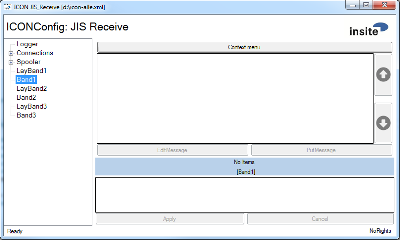
  

---  
###Configuration###

  
```html
<ICONModule Name="PLCUserLevel" Assembly="PLCUserLevel.dll">
    <ConfigValue name="Accessor" type="string">MainOPC</ConfigValue>
    <ConfigValue name="ObservedGroupUpdateRate" type="int">1000</ConfigValue>
    <ConfigValue name="DB" type="int">250</ConfigValue>
    <ConfigValue name="Offset" type="int">188</ConfigValue>
    <ConfigValue name="ValueType" type="string">Int</ConfigValue>
    <ConfigValue name="ValueLength" type="int">2</ConfigValue>
    <ConfigValue name="AllRights" type="string"></ConfigValue>
    <ConfigValue name="NormalRights" type="string"></ConfigValue>
    <ConfigValue name="NoRights" type="string"></ConfigValue>
</ICONModule>
```  

Meaning of the individual parameters:  

*  **DB:** Specifies the data module in which the user-level to be read out is located
*  **Offset:** Offset to the user-level
*  **ValueType:** Specifies what type of data it is (e.g. Int or String)
*  **ValueLength:** Specifies how long this variable is. (for int it is 2, for String any number is allowed)
*  **AllRights:** Specifies the values for which all rights apply, seperated by a semicolon. (e.g. 5;6;7;8; or IH;technician;...), this is also the initial value if no value applies
*  **NormalRights:** Specifies the values for which normal rights apply, the same syntax as in AllRights is used
*  **NoRights:** Specifies the values for which no rights apply, the same syntax as in AllRights is used


---  
##ModuleInstanceManager##

An Instance Manage Module can change the parameters during runtime. This means that modules can be parameterised based on a template and provided with placeholders. On request, these templates are then retrieved and also terminated again.

---  
###DataBasedModuelInstanceManager###

---  
####Configuration####
 
  

  
```html
<ICONModule Name="ModuleInstanceManager" Assembly="DataBasedModuleInstanceManager.dll">
    <ConfigValue name="DispatchMode" type="int">2</ConfigValue>
    <ConfigValue name="Name" type="string">ModuleInstanceManager</ConfigValue>
    <ConfigValue name="Sink" type="string">TCPSinkPlc</ConfigValue>
    <ConfigValue name="Router" type="string">MsgRouter</ConfigValue>
    <Section Type="Instances" StartStopShutdown="Payload=114,2:'01':'02':'03'" >
        <Parameter name="id">Payload=116,2</Parameter>
        <Parameter name="offset">Payload=117,1</Parameter>
        <Parameter name="ipAddress">Payload=118</Parameter>
        <Templates>
            <RouterEntryTemplate 
                name="TCPSinkPlc{id}">{ipAddress}</RouterEntryTemplate>
            <ICONPlcTemplate Name="MainPLC{id}">
                <ConfigValue name="Snap7RemoteHost" 
                             type="string">{ipAddress}</ConfigValue>
                <ConfigValue name="Snap7RackNr" type="int">0</ConfigValue>
                <ConfigValue name="Snap7SlotNr" type="int">2</ConfigValue>
                <ConfigValue name="Snap7Timeout" type="int">5000</ConfigValue>
                <ConfigValue name="ItemSyntax" type="string">SimaticNet</ConfigValue>
                <ConfigValue name="WriteCacheEnabled" type="bool">False</ConfigValue>
                <ConfigValue name="WriteCacheItemMaxAge" type="int">-1</ConfigValue>
            </ICONPlcTemplate>
            <ICONModuleTemplate Name="TCPSourcePLC{id}" 
                                Assembly="MemBasedMsgSource.dll">
                <ConfigValue name="MsgExecutionMode" 
                             type="string">ThreadBasedExecutor</ConfigValue>
                <ConfigValue name="DispatchMode" type="int">2</ConfigValue>
                <ConfigValue name="Slots" type="int">1</ConfigValue>
                <ConfigValue name="Sink" 
                             type="string">SocketManagerTCP</ConfigValue>
                <ConfigValue name="Impl" 
                             type="string">PlcBasedMsgImpl.dll</ConfigValue>
                <ConfigValue name="MaxHandshakeTime" 
                             type="int">6000</ConfigValue>
                <ConfigValue name="Name" type="string">TCPSourcePLC{id}</ConfigValue>
                <ConfigValue name="Accessor" type="string">MainPLC{id}</ConfigValue>
                <ConfigValue name="DB" type="int">202</ConfigValue>
                <ConfigValue name="Offset" type="int">{offset}0</ConfigValue>
                <ConfigValue name="ObservedGroupUpdateRate" 
                             type="int">100</ConfigValue>
                <ConfigValue name="Poll" type="int">1</ConfigValue>
                <Section Type="GUI">
                  <ConfigValue name="Group" type="string">DiagnoseTCP{id}</ConfigValue>
                  <ConfigValue name="Label" type="string">DB202</ConfigValue>
                  <ConfigValue name="RefreshInterval" type="int">500</ConfigValue>
                </Section>
            </ICONModuleTemplate>
        </Templates>
    </Section>
</ICONModule>
```  

Meaning of the individual parameters:

*  **Router:** A router is specified here which can forward telegrams to various modules and also ensure that telegrams are forwarded to the template. (This is necessary, for example, if telegrams can also be sent to a template connection.)
*  **Instances:** In this section, the actual parameterisation is specified		
  *  **StartStopShutdown:** This attribute specifies which values should start, stop or shut down an instance. At the same time, attributes of the ICON message are evaluated.  
*[AttributeName]=*  
 *[Offset],[Length]:[ValueStart]:[ValueStop]:[ValueShutdown]*  
(e.g. the entry Payload=114,2:'01':'01':'03' means that in the payload to offset 114, 2 characters are compared with the specified values.)	
  *  **Parameter:** Parameters have the function of variables that can then be used in other templates.  
		*[AttributeName]=[Offset],[Length]*	
  *  **Templates**				
    *  **RouterEntryTemplate:** If this entry is specified, an entry is added to the router used when starting the instance. This is also mostly necessary for the use of a router, since otherwise the routes would already have to be declared directly in the router		
    *  **ICONPlcTemplate:** Template for an ICONPlc section. (e.g. if a connection can be declared here via Snap7 and in the item Snap7RemoteHost, a variable is entered) Thus the dynamic starting of PLC connections is possible		
    *  **ICONModuleTemplate:** Template for an ICON module. Here, also an entire module can be added and the modifiable parameters are later filled with these variables		
	

---  
##Event Distributor##

An EventDistributor can distribute various events (currently Start, Stop, Restart and Shutdown).

---  
###TcpEventDistributor###

This EventDistributor distributes the events in the form of telegrams. Thus, for example, a telegram can be sent, that ICON was now started or stopped.

---  
####Configuration####
 
  

  
```html
<ICONModule Name="EventDistributor"  Assembly="TcpEventDistributor.dll">
    <ConfigValue name="DispatchMode" type="int">2</ConfigValue>
    <ConfigValue name="Name" type="string">EventDistributor</ConfigValue>
    <ConfigValue name="Sink" type="string">MsgRouter</ConfigValue>
    <ConfigValue name="ProtImpl" type="string"></ConfigValue>
    <ConfigValue name="Start" 
                 type="string">Icon|Ziel='HEAD   '|Payload='UP';</ConfigValue>
    <ConfigValue name="Restart" 
                 type="string">Icon|Ziel='HEAD   '|Payload='RS';</ConfigValue>
    <ConfigValue name="Stop" 
                 type="string">Icon|Ziel='HEAD   '|Payload='DO';</ConfigValue>
    <ConfigValue name="Shutdown" 
                 type="string">Icon|Ziel='HEAD   '|Payload='SD';</ConfigValue>
</ICONModule>
```  

Meaning of the individual parameters:

*  **ProtImpl:** Here, the UserDefined Protocol must be specified which has the BuildRule necessary for starting the telegram.
*  **Start:** Parameterisation of the telegram that is sent when starting ICON
*  **Restart:** Parameterisation of the telegram that is sent when ICON restarts the module after a stop
*  **Stop:** Parameterisation of the telegram that is sent when ICON stops the module (this also occurs at shutdown).
*  **Shutdown:** Parameterisation of the telegram that is sent when ICON is shut down

Parameterisation of the telegrams:  

**\{[BuildRuleName]\{|[AttributeName=AttributeValue]\};\}**

--- 
##Message Dispatcher##

A MessageDispatcher Module can broadcast an input message to various sinks.

---  
####Configuration####
 
  
```html
<ICONModule Name="MessageDispatcher" Assembly="MessageDispatcher.dll">
    <ConfigValue name="DispatchMode" type="int">2</ConfigValue>
    <ConfigValue name="Name" type="string">AckMessageDispatcher</ConfigValue>
    <Section Type="Sinks">
        <Sink name="MemBasedSinkTCP" default='true' noAck="true" />
        <Sink name="Client1" noAck="true" />
        <Sink name="Client2" noAck="true" />
    </Section>
    <Section Type="Spooler">
        ...
    </Section>
</ICONModule>
```  

Meaning of the individual parameters:

*  **DispatchMode:** Here, the UserDefined Protocol must be specified which has the BuildRule necessary for starting the telegram.
*  **Name:** Parameterisation of the telegram that is sent when starting ICON
*  **Sinks:** This section contains all sinks to dispatch to.
    *  **Sink:** A dispatch entry:
        *  **name:** The name of the sink.
        *  **default:** The default sink. (This sink gets the origin message)
        *  **noAck:** false if you do not want to wait for an ack.
*  **Spooler:** A spooler is necessary for this module (see sppoler)

---  
#Example Configurations#

---  
##Gateway with two passive endpoints under RFC1006 with raw data##

  
```html
<ICONConfig>
    <ICONModuleInstances>
        <ICONModule Name="EndPoint1" Assembly="ICONSocket.dll">
            <ConfigValue name="Sink" type="string">EndPoint2</ConfigValue>
            <ConfigValue name="Protocol" type="string">Rfc1006</ConfigValue>
            <ConfigValue name="Port" type="string">10061</ConfigValue>
            <ConfigValue name="LocalTSAP" type="string">LTSAP1</ConfigValue>
            <ConfigValue name="RemoteTSAP" type="string">RTSAP1</ConfigValue>
        </ICONModule>       
        <ICONModule Name="EndPoint2" Assembly="ICONSocket.dll">
            <ConfigValue name="Sink" type="string">EndPoint1</ConfigValue>
            <ConfigValue name="Protocol" type="string">Rfc1006</ConfigValue>
            <ConfigValue name="Port" type="string">10062</ConfigValue>
            <ConfigValue name="LocalTSAP" type="string">LTSAP2</ConfigValue>
            <ConfigValue name="RemoteTSAP" type="string">RTSAP2</ConfigValue>
        </ICONModule>
    </ICONModuleInstances>
</ICONConfig>
```  

This configuration insantiates two Rfc1006 passive endpoints and forwards the raw data from one to the other, provided that a partner is connected on both endpoints "EndPoint1" and "EndPoint2". The "Sink" parameter determines who the respective data of an instance should reach. This means that the "Sink" from "EndPoint1" is "EndPoint2" and from "EndPoint2" is "EndPoint1".

---  
##Gateway with passive and active endpoint under RFC1006 with raw data##

  
```html
<ICONConfig>
    <ICONModuleInstances>
        <ICONModule Name="EndPoint1" Assembly="ICONSocket.dll">
            <ConfigValue name="Sink" type="string">EndPoint2</ConfigValue>
            <ConfigValue name="Protocol" type="string">Rfc1006</ConfigValue>
            <ConfigValue name="Port" type="string">10061</ConfigValue>
            <ConfigValue name="LocalTSAP" type="string">LTSAP1</ConfigValue>
            <ConfigValue name="RemoteTSAP" type="string">RTSAP1</ConfigValue>
        </ICONModule>       
        <ICONModule Name="EndPoint2" Assembly="ICONSocket.dll">
            <ConfigValue name="Sink" type="string">EndPoint1</ConfigValue>
            <ConfigValue name="Protocol" type="string">Rfc1006</ConfigValue>
            <ConfigValue name="Host" type="string">192.168.0.144</ConfigValue>
            <ConfigValue name="Port" type="string">10062</ConfigValue>
            <ConfigValue name="LocalTSAP" type="string">LTSAP2</ConfigValue>
            <ConfigValue name="RemoteTSAP" type="string">RTSAP2</ConfigValue>
        </ICONModule>
    </ICONModuleInstances>
</ICONConfig>
```  

This configuration instantiates two Rfc1006 passive endpoints, one as a passive and one as active, and forwards the raw data from one to the other, provided that a partner is connected on both endpoints "EndPoint1" and "EndPoint2".  

  

You specify the connection partner using the "Host" parameter. If "Host" is not specified or is allocated with "localhost", "127.0.0.1" or "0.0.0.0", then the socket is instantiated as a Passive Endpoint. If an explicit IP address or resolvable DNS (Domain Name System) is specified, then an Active-Endpoint is instantiated. An active endpoint will usually try to connect to the remote host in a secondly cycle, which then has to be a passive remote host.

---  
##Passive endpoint under RFC1006 with receipt of raw data for forwarding to a PLC##

  
```html
<ICONConfig>
    <ICONPlcs>
        <ICONPlc Name="MainOPC">
            <ConfigValue name="OPCServerName" 
                         type="string">OPC.SimaticNet</ConfigValue>
            <ConfigValue name="ItemSyntax" type="string">SimaticNet</ConfigValue>
            <ConfigValue name="OPCConnectionName" type="string">P2T</ConfigValue>
        </ICONPlc>
    </ICONPlcs>
    <ICONModuleInstances>
        <ICONModule Name="EndPoint1" Assembly="ICONSocket.dll">
            <ConfigValue name="Sink" type="string">Plc</ConfigValue>
            <ConfigValue name="Protocol" type="string">Rfc1006</ConfigValue>
            <ConfigValue name="Port" type="string">10061</ConfigValue>
            <ConfigValue name="LocalTSAP" type="string">LTSAP1</ConfigValue>
            <ConfigValue name="RemoteTSAP" type="string">RTSAP1</ConfigValue>
        </ICONModule>       
        <ICONModule Name="Plc" Assembly="MemBasedMsgSink.dll">
            <Section Type="Slot">
                <ConfigValue name="Impl" 
                             type="string">PlcBasedMsgImpl.dll</ConfigValue>
                <ConfigValue name="Accessor" type="string">MainOPC</ConfigValue>
                <ConfigValue name="Poll" type="int">1</ConfigValue>      
                <ConfigValue name="DB" type="int">401</ConfigValue>
                <ConfigValue name="Offset" type="int">0</ConfigValue>
            </Section>
        </ICONModule>
    </ICONModuleInstances>
</ICONConfig>
```  

To get access to a PLC (Programmable Logic Controller) e.g. via OPC (OLE for Process Control), it is necessary to configure a PLC Accessor. See section "ICONPlcs" that can include any number of accessors. An implemented module then gains access via the assigned configuration name, e.g. MainOPC here.

---  
##Gateway with two passive endpoints under RFC1006 with structured data (protocol implementation)##

  
```html
<ICONConfig>
    <ICONProtocols>
        <ICONStandardProtocol ImplementingClass="???_ICONMsgFactory" />
    </ICONProtocols>
    <ICONModuleInstances>
        <ICONModule Name="EndPoint1" Assembly="ICONSocket.dll">
            <ConfigValue name="Sink" type="string">EndPoint2</ConfigValue>
            <ConfigValue name="Protocol" type="string">Rfc1006</ConfigValue>
            <ConfigValue name="Port" type="string">10061</ConfigValue>
            <ConfigValue name="LocalTSAP" type="string">LTSAP1</ConfigValue>
            <ConfigValue name="RemoteTSAP" type="string">RTSAP1</ConfigValue>
            <ConfigValue name="ProtImpl" type="string">???_ICONMsgFactory</ConfigValue>
        </ICONModule>       
        <ICONModule Name="EndPoint2" Assembly="ICONSocket.dll">
            <ConfigValue name="Sink" type="string">EndPoint1</ConfigValue>
            <ConfigValue name="Protocol" type="string">Rfc1006</ConfigValue>
            <ConfigValue name="Port" type="string">10062</ConfigValue>
            <ConfigValue name="LocalTSAP" type="string">LTSAP2</ConfigValue>
            <ConfigValue name="RemoteTSAP" type="string">RTSAP2</ConfigValue>
            <ConfigValue name="ProtImpl" type="string">???_ICONMsgFactory</ConfigValue>
        </ICONModule>
    </ICONModuleInstances>
</ICONConfig>
```  

If a protocol is used for transmission of the data, then the protocols in the "ICONProtocols" section must be specified. The reference to these is then set in the modules via the "ProtImpl" parameter. The received data stream is not monitored at Rfc1006. This means that the data must be sent correctly en bloc. This is not the case with a classic TCP connection.

---  
##TCP passive endpoint with receipt of structured data (protocol implementation) for forwarding to a PLC##

  
```html
<ICONConfig>
    <ICONPlcs>
        <ICONPlc Name="MainOPC">
            <ConfigValue name="OPCServerName" 
                         type="string">OPC.SimaticNet</ConfigValue>
            <ConfigValue name="ItemSyntax" type="string">SimaticNet</ConfigValue>
            <ConfigValue name="OPCConnectionName" type="string">P2T</ConfigValue>
        </ICONPlc>
    </ICONPlcs>
    <ICONProtocols>
        <ICONStandardProtocol ImplementingClass="???_ICONMsgFactory" />
    </ICONProtocols>
    <ICONModuleInstances>
        <ICONModule Name="EndPoint1" Assembly="ICONSocket.dll">
            <ConfigValue name="Sink" type="string">Plc</ConfigValue>
            <ConfigValue name="Protocol" type="string">Tcp</ConfigValue>
            <ConfigValue name="Port" type="string">1101</ConfigValue>
            <ConfigValue name="ProtImpl" type="string">???_ICONMsgFactory</ConfigValue>
        </ICONModule>       
        <ICONModule Name="Plc" Assembly="MemBasedMsgSink.dll">
            <Section Type="Slot">
                <ConfigValue name="Impl" 
                             type="string">PlcBasedMsgImpl.dll</ConfigValue>
                <ConfigValue name="Accessor" type="string">MainOPC</ConfigValue>
                <ConfigValue name="Poll" type="int">1</ConfigValue>      
                <ConfigValue name="DB" type="int">401</ConfigValue>
                <ConfigValue name="Offset" type="int">0</ConfigValue>
            </Section>
        </ICONModule>
    </ICONModuleInstances>
</ICONConfig>
```  

With TCP, a protocol implementer must be specified. the processing of raw data is not possible here. If, in this example, data is received via TCP and it cannot be forwarded to the sink because the PLC has not yet processed previous data, then a negative acknowledgement is generated. If, however, no disruptions occur, then a positive acknowledgement is sent.

---  
##Decoupling data forwarding by means of spooling##

If a sink is not yet ready to accept data or the connection channel to the sink is disturbed or interrupted, then data acceptance can be guaranteed via spooling. The spooler accepts the data of a source and then delivers it independently to the sink. Consequently, the source can still keep sending without going into a fault condition or having to react to this.
  
```html
<ICONConfig>
    <ICONPlcs>
        <ICONPlc Name="MainOPC">
            <ConfigValue name="OPCServerName" 
                         type="string">OPC.SimaticNet</ConfigValue>
            <ConfigValue name="ItemSyntax" type="string">SimaticNet</ConfigValue>
            <ConfigValue name="OPCConnectionName" type="string">P2T</ConfigValue>
        </ICONPlc>
    </ICONPlcs>
    <ICONProtocols>
        <ICONStandardProtocol ImplementingClass="???_ICONMsgFactory" />
    </ICONProtocols>
    <ICONModuleInstances>
        <ICONModule Name="EndPoint1" Assembly="ICONSocket.dll">
            <ConfigValue name="Sink" type="string">Plc</ConfigValue>
            <ConfigValue name="Protocol" type="string">Tcp</ConfigValue>
            <ConfigValue name="Port" type="string">1101</ConfigValue>
            <ConfigValue name="ProtImpl" type="string">???_ICONMsgFactory</ConfigValue>
        </ICONModule>       
        <ICONModule Name="Plc" Assembly="MemBasedMsgSink.dll">
            <Section Type="Slot">
                <ConfigValue name="Impl" 
                             type="string">PlcBasedMsgImpl.dll</ConfigValue>
                <ConfigValue name="Accessor" type="string">MainOPC</ConfigValue>
                <ConfigValue name="Poll" type="int">1</ConfigValue>      
                <ConfigValue name="DB" type="int">401</ConfigValue>
                <ConfigValue name="Offset" type="int">0</ConfigValue>
            </Section>
            <Section Type="Spooler" \>
        </ICONModule>
    </ICONModuleInstances>
</ICONConfig>
```  

The data is spooled by specifying the section type spooler. The spooler can be configured by additional setting options. If the section is empty, you have a standard spooler that is set as follows:

*  A positive acknowledgement is sent when the data reaches the spooler
*  There is no upper limit regarding the amount of data
*  There is no signalling of High or Low WaterMark
*  The data is valid for 10 hours. This applies in the following case: If a sink is free to receive data but the data cannot be transmitted, then it is removed from the spooler after 10 hours with an error message
*  The spooler has no GUI
*  The spooler has no persistor
*  The cycle rate for processing the spooler is set to 100ms

A complete configuration overview can be found in the chapter on ["Spooling"](#Spooling)

---  
##PLC as data source (send compartment) and data sink (slot)##

A minimum configuration could be as follows:
  
```html
<ICONConfig>
    <ICONPlcs>
        <ICONPlc Name="MainOPC">
            <ConfigValue name="OPCServerName" 
                         type="string">OPC.SimaticNet</ConfigValue>
            <ConfigValue name="ItemSyntax" type="string">SimaticNet</ConfigValue>
            <ConfigValue name="OPCConnectionName" type="string">P2T</ConfigValue>
        </ICONPlc>
    </ICONPlcs>
    <ICONProtocols>
        <ICONStandardProtocol ImplementingClass="ISIT01_ICONMsgFactory" />
    </ICONProtocols>
    <ICONModuleInstances>
        <ICONModule Name="PlcQuelle" Assembly="MemBasedMsgSource.dll">
            <ConfigValue name="Sink" type="string">PlcSenke</ConfigValue>
            <ConfigValue name="Slots" type="int">1</ConfigValue>
            <ConfigValue name="Impl" type="string">PlcBasedMsgImpl.dll</ConfigValue>
            <ConfigValue name="Accessor" type="string">MainOPC</ConfigValue>
            <ConfigValue name="Poll" type="int">1</ConfigValue>
            <ConfigValue name="DB" type="int">402</ConfigValue>
            <ConfigValue name="Offset" type="int">0</ConfigValue>   
        </ICONModule>
        <ICONModule Name="PlcSenke" Assembly="MemBasedMsgSink.dll">
            <Section Type="Slot">
                <ConfigValue name="Impl" 
                             type="string">PlcBasedMsgImpl.dll</ConfigValue>
                <ConfigValue name="Accessor" type="string">MainOPC</ConfigValue>
                <ConfigValue name="Poll" type="int">1</ConfigValue>      
                <ConfigValue name="DB" type="int">401</ConfigValue>
                <ConfigValue name="Offset" type="int">0</ConfigValue>
            </Section>
            <Section Type="Spooler">
            </Section>
        </ICONModule>
    </ICONModuleInstances>
</ICONConfig>
```  


---  
##PLC as data source with an IP connection as recipient##

  
```html
<ICONConfig>
    <ICONPlcs>
        <ICONPlc Name="MainOPC">
            <ConfigValue name="OPCServerName" 
                         type="string">OPC.SimaticNet</ConfigValue>
            <ConfigValue name="ItemSyntax" type="string">SimaticNet</ConfigValue>
            <ConfigValue name="OPCConnectionName" type="string">P2T</ConfigValue>
        </ICONPlc>
    </ICONPlcs>
    <ICONProtocols>
        <ICONStandardProtocol ImplementingClass="???_ICONMsgFactory" />
        <ICONStandardProtocol ImplementingClass="WACC04_ICONMsgFactory" />
    </ICONProtocols>
    <ICONModuleInstances>
        <ICONModule Name="PlcQuelle" Assembly="MemBasedMsgSource.dll">
            <ConfigValue name="Sink" type="string">TcpSenke</ConfigValue>
            <ConfigValue name="Slots" type="int">1</ConfigValue>
            <ConfigValue name="Impl" type="string">PlcBasedMsgImpl.dll</ConfigValue>
            <ConfigValue name="Accessor" type="string">MainOPC</ConfigValue>
            <ConfigValue name="Poll" type="int">1</ConfigValue>
            <ConfigValue name="DB" type="int">402</ConfigValue>
            <ConfigValue name="Offset" type="int">0</ConfigValue>   
        </ICONModule>
        <ICONModule Name="TcpSenke" Assembly="ICONSocket.dll">
            <ConfigValue name="Protocol" type="string">Tcp</ConfigValue>
            <ConfigValue name="Host" type="string">192.168.0.144</ConfigValue>
            <ConfigValue name="Port" type="string">1001</ConfigValue>
            <ConfigValue name="ProtImpl" type="string">???_ICONMsgFactory</ConfigValue>
            <Section Type="Spooler" \>
        </ICONModule>       
    </ICONModuleInstances>
</ICONConfig>
```  

If a spooler is configured to a module of an "ICONSocket.dll", then the data must be marked with the spool flag. This is usually done by prefixing with the WACC04-Header.

---  
##Example configuration with a SocketManager##

The SocketManager independently instantiates and manages ICONSockets dynamically.
  
```html
<ICONConfig>
    <ICONPlcs>
        <ICONPlc Name="MainOPC">
            <ConfigValue name="OPCServerName" 
                         type="string">insite.opc.simu</ConfigValue>
            <ConfigValue name="ItemSyntax" type="string">SimaticNet</ConfigValue>
            <ConfigValue name="OPCConnectionName" type="string">P2T</ConfigValue>
        </ICONPlc>
    </ICONPlcs>
    <ICONProtocols>
        <ICONStandardProtocol ImplementingClass="???_ICONMsgFactory" />
        <ICONStandardProtocol ImplementingClass="WACC04_ICONMsgFactory" />
    </ICONProtocols>
    <ICONModuleInstances>
        <ICONModule Name="PlcQuelle" Assembly="MemBasedMsgSource.dll">
            <ConfigValue name="Sink" type="string">SocketManager</ConfigValue>
            <ConfigValue name="Slots" type="int">1</ConfigValue>
            <ConfigValue name="Impl" type="string">PlcBasedMsgImpl.dll</ConfigValue>
            <ConfigValue name="Accessor" type="string">MainOPC</ConfigValue>
            <ConfigValue name="Poll" type="int">1</ConfigValue>
            <ConfigValue name="DB" type="int">412</ConfigValue>
            <ConfigValue name="Offset" type="int">0</ConfigValue>   
        </ICONModule>
        <ICONModule Name="SocketManager" Assembly="SocketManagement.dll">
        </ICONModule>
    </ICONModuleInstances>
</ICONConfig>
```  


If, for example, a passive endpoint is instantiated, an active partner will certainly not be connected to it immediately. To ensure that this occurs smoothly, The SocketManager should be provided with a spooler in this case.
  
```html
<ICONModule Name="SocketManager" Assembly="SocketManagement.dll">
    <Section Type="Spooler" \>
</ICONModule>
```  


##Example of a data mirror##

```html
<ICONConfig>
    <ICONProtocols>
        <ICONStandardProtocol ImplementingClass="???_ICONMsgFactory" />
    </ICONProtocols>
    <ICONModuleInstances>
        <ICONModule Name="EndPoint1" Assembly="ICONSocket.dll">
            <ConfigValue name="Sink" type="string">EndPoint1</ConfigValue>
            <ConfigValue name="Protocol" type="string">Tcp</ConfigValue>
            <ConfigValue name="Host" type="string">127.0.0.1</ConfigValue>
            <ConfigValue name="Port" type="string">1101</ConfigValue>
            <ConfigValue name="ProtImpl" type="string">???_ICONMsgFactory</ConfigValue>
        </ICONModule>       
    </ICONModuleInstances>
</ICONConfig>
```  

This configuration allows you to connect with an other implementation tho this sever and all sent messages will be sent back.

---  
#Installation#

The installation requires

  1.   Microsoft .NET Framework 4

to be installed and available on the destination under Windows.  

  

The ICON files can be copied to any directory and ICONMain.exe can then be started from there.

---  
##Files generated during runtime##

ICON generates files independently. Here are the meanings:

*  **Logfiles:** Files configured for Log4net
*  **Spooler files:** A file is created with the ending SPO for each persistent spooler. TheSocketManager will create spooler files independently that could , for example, look like this: "SpoolerFile-Tcp$127~0~0~1§1001$&#35;.spo"
*  When ICON triggers an exception, which is not intercepted, then a message is displayed and written to the file ICON.trc. ICON shuts down after that.
*  **Cache files:** Some modules as well as the other spooler generate cache files for caching states

Application specific modules also generate files when necessary, such as the "AlarmManager.cch" and "SequenceNumber.cnt".

---  
##AddOns##

Under the "AddOns" folder in the application directory, the following dlls can be provided in order to use additional functions. Only one AddOn can be activated at present.

  1.   RedGate.MemoryProfiler.Snapshot.dll

If "RedGate.MemoryProfiler.Snapshot.dll" in the "AddOns" folder is provided, ICON will request a snapshot every 60 seconds.

---  
#Appendix A#

---  
##Umlaut's in the configuration file##

In order to also work with umlauts in the configuration file, some configuration items (not all of them) also support the replacing of the following character strings in the character declared for this purpose. (it is also partially necessary to convert & to `&amp;`) --> e.g.: Ä = `&amp;`Auml;
  


<table><tr><th>Character </th><th> Character </th><th> Character </th><th> Character </th><th> Character </th><th> Character</th></tr>
<tr><th>   </th><th> string </th><th>    </th><th> string </th><th>    </th><th> string</th></tr>
<tr><td>& </td><td> `&amp;` </td><td> À </td><td> `&Agrave;` </td><td> í </td><td> `&iacute;`</td></tr>
<tr><td>' </td><td> `&quot;` </td><td> Á </td><td> `&Aacute;` </td><td> î </td><td> `&icirc;`</td></tr>
<tr><td>&#62; </td><td> `&gt;` </td><td> Â </td><td> `&Acirc;` </td><td> ï </td><td> `&iuml;`</td></tr>
<tr><td>&#60; </td><td> `&lt;` </td><td> Ã </td><td> `&Atilde;` </td><td> ð </td><td> `&eth;`</td></tr>
<tr><td>¡ </td><td> `&iexcl;` </td><td> Ä </td><td> `&Auml;` </td><td> ñ </td><td> `&ntilde;`</td></tr>
<tr><td>¢ </td><td> `&cent;` </td><td> Å </td><td> `&Aring;` </td><td> ò </td><td> `&ograve;`</td></tr>
<tr><td>£ </td><td> `&pound;` </td><td> Æ </td><td> `&AElig;` </td><td> ó </td><td> `&oacute;`</td></tr>
<tr><td>¤ </td><td> `&curren;` </td><td> Ç </td><td> `&Ccedil;` </td><td> ô </td><td> `&ocirc;`</td></tr>
<tr><td>¥ </td><td> `&yen;` </td><td> È </td><td> `&Egrave;` </td><td> õ </td><td> `&otilde;`</td></tr>
<tr><td>¦ </td><td> `&brvbar;` </td><td> É </td><td> `&Eacute;` </td><td> ö </td><td> `&ouml;`</td></tr>
<tr><td>§ </td><td> `&sect;` </td><td> Ê </td><td> `&Ecirc;` </td><td> ÷ </td><td> `&divide;`</td></tr>
<tr><td>¨ </td><td> `&uml;` </td><td> Ë </td><td> `&Euml;` </td><td> ø </td><td> `&oslash;`</td></tr>
<tr><td>© </td><td> `&copy;` </td><td> Ì </td><td> `&Igrave;` </td><td> ù </td><td> `&ugrave;`</td></tr>
<tr><td>ª </td><td> `&ordf;` </td><td> Í </td><td> `&Iacute;` </td><td> ú </td><td> `&uacute;`</td></tr>
<tr><td>« </td><td> `&laquo;` </td><td> Î </td><td> `&Icirc;` </td><td> û </td><td> `&ucirc;`</td></tr>
<tr><td>¬ </td><td> `&not;` </td><td> Ï </td><td> `&Iuml;` </td><td> ü </td><td> `&uuml;`</td></tr>
<tr><td>  </td><td> `&shy;` </td><td> Ð </td><td> `&ETH;` </td><td> ý </td><td> `&yacute;`</td></tr>
<tr><td>® </td><td> `&reg;` </td><td> Ñ </td><td> `&Ntilde;` </td><td> þ </td><td> `&thorn;`</td></tr>
<tr><td>¯ </td><td> `&macr;` </td><td> Ò </td><td> `&Ograve;` </td><td> ÿ </td><td> `&yuml;`</td></tr>
<tr><td>° </td><td> `&deg;` </td><td> Ó </td><td> `&Oacute;` </td><td>   </td><td>  </td></tr>
<tr><td>± </td><td> `&plusmn;` </td><td> Ô </td><td> `&Ocirc;` </td><td>   </td><td>  </td></tr>
<tr><td>² </td><td> `&sup2;` </td><td> Õ </td><td> `&Otilde;` </td><td>   </td><td>  </td></tr>
<tr><td>³ </td><td> `&sup3;` </td><td> Ö </td><td> `&Ouml;` </td><td>   </td><td>  </td></tr>
<tr><td>´ </td><td> `&acute;` </td><td> × </td><td> `&times;` </td><td>   </td><td>  </td></tr>
<tr><td>µ </td><td> `&micro;` </td><td> Ø </td><td> `&Oslash;` </td><td>   </td><td>  </td></tr>
<tr><td>¶ </td><td> `&para;` </td><td> Ù </td><td> `&Ugrave;` </td><td>   </td><td>  </td></tr>
<tr><td>· </td><td> `&middot;` </td><td> Ú </td><td> `&Uacute;` </td><td>   </td><td>  </td></tr>
<tr><td>¸ </td><td> `&cedil;` </td><td> Û </td><td> `&Ucirc;` </td><td>   </td><td>  </td></tr>
<tr><td>¹ </td><td> `&sup1;` </td><td> Ü </td><td> `&Uuml;` </td><td>   </td><td>  </td></tr>
<tr><td>º </td><td> `&ordm;` </td><td> Ý </td><td> `&Yacute;` </td><td>   </td><td>  </td></tr>
<tr><td>» </td><td> `&raquo;` </td><td> Þ </td><td> `&THORN;` </td><td>   </td><td>  </td></tr>
<tr><td>¼ </td><td> `&frac14;` </td><td> ß </td><td> `&szlig;` </td><td>   </td><td>  </td></tr>
<tr><td>½ </td><td> `&frac12;` </td><td> à </td><td> `&agrave;` </td><td>   </td><td>  </td></tr>
<tr><td>¾ </td><td> `&frac34;` </td><td> á </td><td> `&aacute;` </td><td>   </td><td>  </td></tr>
<tr><td>¿ </td><td> `&iquest;` </td><td> â </td><td> `&acirc;` </td><td>   </td><td>  </td></tr>
</table>


  