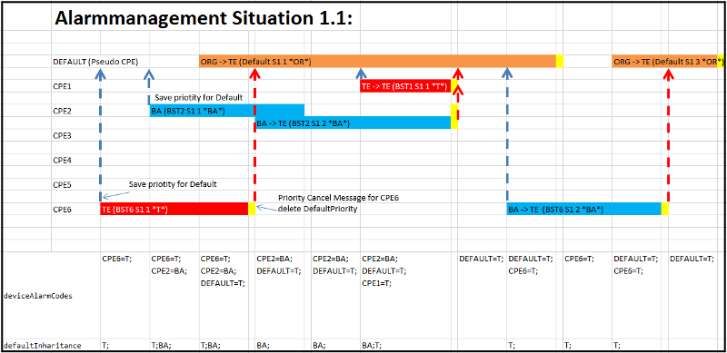
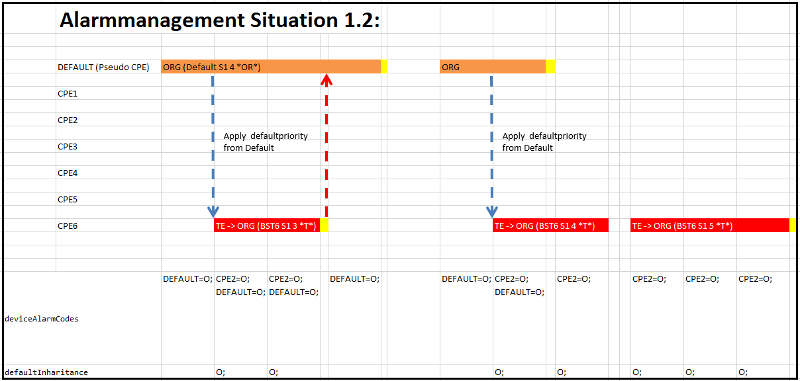
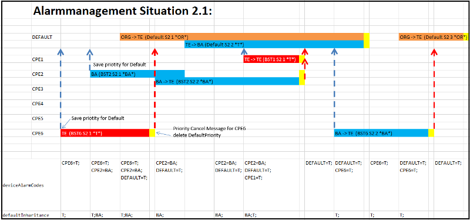
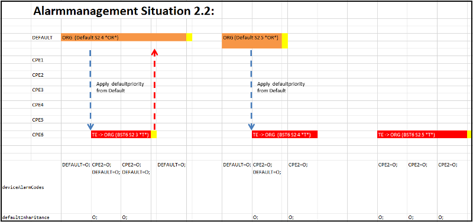
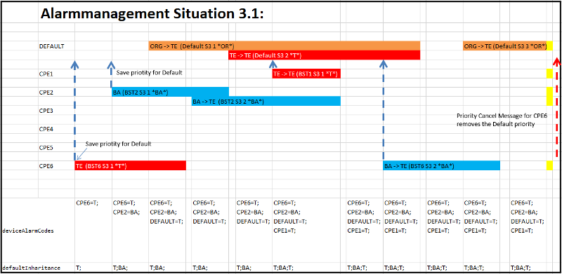
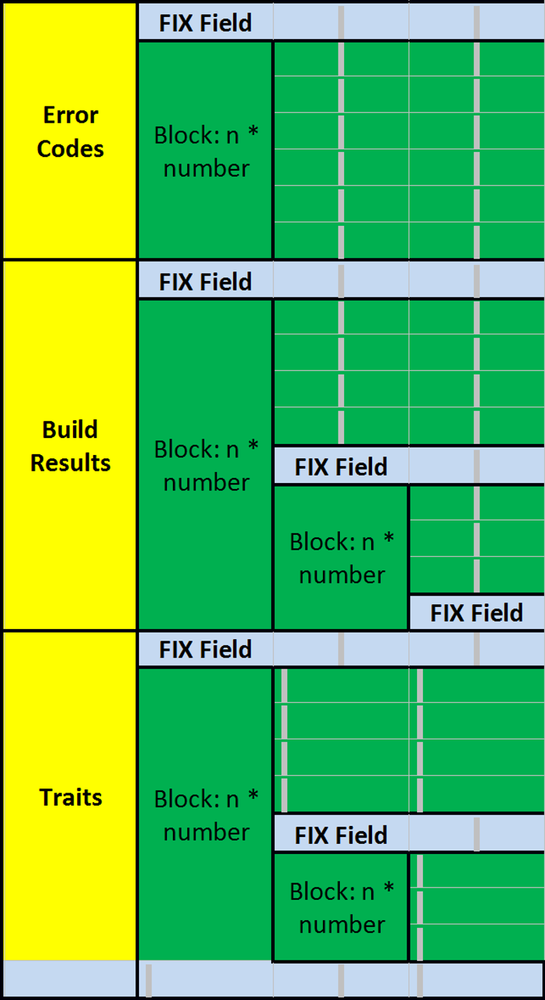

<h1>Documentation and Procedure Description</h1>  

<h1>ICON – Customer module - BMW</h1>
  

**I**nsite **CO**mmunication **N**ode  

**insite GmbH**


---  
#Introduction#

This document describes the functionality of the customer-specific modules for BMW.

---  
##Definitions, acronyms, abbreviations##

*  **ICON: I**nsite **CO**mmunication **N**ode
*  **TCP/IP:** The TCP network protocol (Transmission Control Protocol) based on the IP (Internet protocol) concerns endpoint-related connections, the so-called sockets. A socket can act as a client, server or listener. In order to describe a broader and more general designation for the states of the sockets, we want to use the terms "Passive" and "Active". In other words, there is an active and a passive connection partner. With these designations we conform with protocols such as FTP (File Transfer Protocol) or UDP (User Datagram Protocol). Unlike with connectionless protocols such as UDP, in the case of TCP there are endpoint-related connection partners that normally connect from the active partner to the passive partner. A socket's own endpoint (active as well as passive) we call LocalEndpoint and the endpoint of the connection partner we call RemoteEndpoint.
*  **PLC:** Programmable Logic Controller
*  **SPS:** Speicher Programmierbare Steuerung (German for PLC)
*  **GUI:** Graphical User Interface --> User Interface
*  **Assembly:** An Assembly is a logical functional unit that is executed under the control of the Common Language Runtime (CLR) by .NET. An Assembly exists physically as a DLL-file or EXE-file.
*  **Spooler:** Buffer for messages (also persistent)

---  
##Configuration &#60;ICONProtocols&#62;##

The Default Server Port and Default Local Server Port can be set directly as standard in this section.
  
```html
<ConfigValue name="TCPIPDefaultServerPort" type="int">30001</ConfigValue>
<ConfigValue name="TCPIPDefaultLocalServerPort" type="int">30002</ConfigValue>
```  


---  
###Protocols###

You can activate protocols, for example, by the following entry:
  
```html
<ICONStandardProtocol ImplementingClass="WACC04_ICONMsgFactory" />
<ICONStandardProtocol ImplementingClass="BMW_02_ICONMsgFactory" />
```  

In order to assign other Default Ports to a protocol, the parameters are listed in the respective section.
  

Example:
  
```html
<ICONStandardProtocol ImplementingClass="BMW_02_ICONMsgFactory">
    <ConfigValue name="TCPIPDefaultServerPort" type="int">2000</ConfigValue>
    <ConfigValue name="TCPIPDefaultLocalServerPort" type="int">12400</ConfigValue>
</ICONStandardProtocol>
```  

BMW&#95;01&#95;ICONMsgFactory and BMW&#95;02&#95;ICONMsgFactory have Acknowledge Handling. These, among other things, are configured by AckRule-Information in an ICONAckPolicy section:
  

**Structure of a Rule:**
  

Waiting telegram = W  

Incoming telegram = E
  

W=E[:Offset,value at the position Offset[|value at the position Offset +1][|…]…]

---  
####BMW&#95;01 AckPolicy####
   

  
```html
<ICONAckPolicy Name="BMW_01_AckHandling">
    <AckRule Rule="9013=9000:16,33|32"/>
    <AckRule Rule="1001=1102:48,39|39"/>
</ICONAckPolicy>
```  

The setting of the standard acknowledgement for BMW01 takes place via "ReturnedAck".
  

In addition to this there is the extended attribute Forward, which can specify that a telegram will still be forwarded to the PLC even though it is an acknowledgement.
  

Example:
  
```html
<ICONAckPolicy Name="BMW_02_AckHandling">
    <ReturnedAck Name="Header" OK="OKAY" Error="ACER" NoAck="KEIN__" />
    <AckRule Rule="1101=1102:48,30|39" Forward=True/>
    <AckRule Rule="1001=1102:48,39|39"/>
    <AckRule Rule="6000=6001"/>
    <AckRule Rule="6002=6003:48,31|32|33|34"/>
    <AckRule Rule="6004=6005:48,31|32|33|34;48,31|32|33|35;48,31|32|33|36"/>
    <AckRule Rule="6004=6005:48,31|32|33|37"/>
    <AckRule Rule="A=B"/>
    <AckRule Rule="SIMPLETEST1=QUITTUNG2"/>
    <AckRule Rule="SIMPLETEST2=QUITTUNG6"/>
    <AckRule Rule="SIMPLETEST3=QUITTUNG8"/>
    <AckRule Rule="SIMPLETEST4=QUITTUNG3"/>
    <AckRule Rule="ACKSIMPLE=QUITTUNG:5,3C|43|4F|44|45|3E"/>
    <AckRule Rule="ACKSIMPLE=ACKSIMPLE:10,3C|43|4F|44|45|3E"/>
    <AckRule Rule="ACKSIMPLE=QUITTUNG:10,3C|ff|4F|44|45|3E"/>
    <AckRule Rule="TESTID4=QUITT543:12,41|4F"/>
    <AckRule Rule="A=ACKSIMPLE:10,3C|43|4F|44|45|3E"/>
    <AckRule Rule="X=Y"/>
</ICONAckPolicy>
```  


---  
####BMW&#95;02 AckPolicy####
   

  
```html
<ICONAckPolicy Name="BMW_02_AckHandling">
    <AckRule Rule="*" Type="Header" />
    <AckRule Rule="MOSC_ANFR=MOSC_ANFR" Forward="True" />
    <AckRule Rule="ZP_DATEN=ZP_QUIT" />
    <AckRule Rule="IPSTINIT__" Type="NoAck" />
    <AckRule Rule="EVENTTAB__" Type="NoAck" />
    <AckRule Rule="SETVALUE__" Type="NoAck" />
    <AckRule Rule="PING______" Type="NoAck" />
    <AckRule Rule="EVENT_IM__" Type="Header" OK="OKAY" Error="ACER" NoAck="KEIN__" />
    <AckRule Rule="EVENT_EX__" Type="Header" OK="OKAY" Error="ACER" NoAck="KEIN__" />
    <AckRule Rule="CURVALUE__" Type="Header" OK="OKAY" Error="ACER" NoAck="KEIN__" />
</ICONAckPolicy>
```  

With BMW&#95;02, the setting of the AckPolicy is slightly extended. There is no ReturnAck here. This is specified by the &#42; entry in the rule. Thus, an AckRule with the &#42; in the Attribute Rule is the standard acknowledgement. Additionally, with BMW&#95;2 there are several attributes such as:  

*  **Rule:** In addition to the rule, there are also additional options here as with BMW&#95;01:		
  *  Entry without = means that this rule applies to the telegram with the specified ID. Therefore, if the ID "PING" and the type "NoAck" is entered, for example, no acknowledgement will follow when the Ping telegram is received	

*  **Name:** 'Header' or 'Standard'
*  **OK:** (only with 'Header') character string for ok
*  **Error:** (only with 'Header') character string for NOK
*  **NoAck:** (only with 'Header') character string for detection of NoResponse
*  **Forward:**

  
```html
<AckRule Rule="PING______" Type="Header" OK="OKAY" Forward="False" />
```  

--> **ICON acknowledges the telegram and rejects it (does not forward to the PLC)**
  
```html
<AckRule Rule="WILLICHNICHTHABEN Type="NoAck" OK="OKAY" Forward="False" />
```  

--> **ICON rejects the telegram without acknowledging it**
  
```html
<AckRule Rule="MOSC_ANFR=MOSC_ANFR" Forward="True" />
```  

--> **ICON detects it as acknowledgement, but forwards it to the PLC anyway**
  

The default value for incoming telegrams is Forward="True"  

In the case of acknowledgements, it is the reverse. If the telegram is an acknowledgement, then the default value is Forward ="False"

---  
#Module#

<a name="Module"></a>
---  
##AlarmManager##

The AlarmManager reads out information from the PLC device, links this with TCP telegrams received from the WinCCAlarmServer and thereby sets up a fault message cache. It receives telegrams via a Listener for executing initialisations or resets as well as for returning information. In addition, it forwards telegrams to the PLC. It processes events triggered by the PLC.  

An interface consisting of a control and status word is defined for the control and responses of this module.

---  
###PLC Control and Status Word AlarmManagement###

The PLC can influence the functions of the application via a control word. The following bits are defined at present:
  


<table><tr><th colspan="4">Structure of PLC control word:</th></tr>
<tr><th>Bit No </th><th> Enum </th><th> Impl. </th><th> Description</th></tr>
<tr><td>Bit 0 </td><td> NoAlarmForwarding </td><td> All </td><td> Stop message transfer. Alarm messages</td></tr>
<tr><td>   </td><td>    </td><td>    </td><td> are not forwarded  -->  Info message</td></tr>
<tr><td>   </td><td>    </td><td>    </td><td> *NoAlarmForwardingInfoMsg* transmit</td></tr>
<tr><td>Bit 1 </td><td> NoMachineState </td><td> PDEM </td><td> If a bit is not set, bit 10 is also checked</td></tr>
<tr><td>   </td><td> Forwarding </td><td>    </td><td> when a 9002 telegram is received. If bit</td></tr>
<tr><td>   </td><td>    </td><td>    </td><td> 10 is set, a response telegram is generated.</td></tr>
<tr><td>Bit 2 </td><td> AckGroupError </td><td> All </td><td> Collective bit for faults</td></tr>
<tr><td>Bit 3 </td><td> NoReinitForwarding </td><td> All </td><td> If bit is set, no ReInit telegrams are forwarded</td></tr>
<tr><td>   </td><td>    </td><td>    </td><td> (also see bit 8)</td></tr>
<tr><td>Bit 4 </td><td> PlantOff </td><td> All </td><td> Stop message transfer. Alarm messages are</td></tr>
<tr><td>   </td><td>    </td><td>    </td><td> not forwarded  -->  transmit *PlantOffInfoMsg*</td></tr>
<tr><td>   </td><td>    </td><td>    </td><td> info message</td></tr>
<tr><td>Bit 5-7 </td><td>  </td><td>  </td><td> &#60;free&#62;</td></tr>
<tr><td>Bit 8 </td><td> SendReinit </td><td> PDEM </td><td> If bit is set and Bit 3 is not set, ReInit</td></tr>
<tr><td>   </td><td>    </td><td>    </td><td> telegrams are forwarded</td></tr>
<tr><td>Bit 9 </td><td> NoSpoolerFull </td><td> PDEM </td><td> If bit is set, no 9011 telegram (spooler full</td></tr>
<tr><td>   </td><td> Forwarding </td><td>    </td><td> coming) and no 9012 telegrams (spooler full</td></tr>
<tr><td>   </td><td>    </td><td>    </td><td> going) are entered</td></tr>
<tr><td>Bit 10 </td><td> AckMachineState </td><td> PDEM </td><td> If bit is set, a response telegram with the</td></tr>
<tr><td>   </td><td>    </td><td>    </td><td> number of fault 0 is generated when</td></tr>
<tr><td>   </td><td>    </td><td>    </td><td> receiving a 9002 telegram (also see bit 1)</td></tr>
<tr><td>Bit 11-15 </td><td>  </td><td>  </td><td> &#60;free&#62;</td></tr>
</table>


  

The application can signal specific states via a status word of the PLC. The following bits are dewfined at present:  

<table><tr><th colspan="4">Structure of PLC status word</th> </tr>
<tr><th>Bit No </th><th> Enum </th><th> Impl. </th><th> Description</th></tr>
<tr><td>Bit 0 </td><td> SpoolerFull </td><td> All </td><td> Level message full</td></tr>
<tr><td>Bit 1 </td><td> SpoolerWarning </td><td> All </td><td> Level warning</td></tr>
<tr><td>Bit 2 </td><td> GroupError </td><td> All </td><td> Collective Bit for faults (unhandled</td></tr>
<tr><td>   </td><td>    </td><td>    </td><td> exceptions)</td></tr>
<tr><td>Bit 3 </td><td>  </td><td>  </td><td> &#60;free&#62;</td></tr>
<tr><td>Bit 4 </td><td> DevIdError </td><td> All </td><td> Is set if a telegram with system ID = 0</td></tr>
<tr><td>   </td><td>    </td><td>    </td><td> is detected</td></tr>
<tr><td>Bit 5-15 </td><td>  </td><td>  </td><td> &#60;free&#62;</td></tr>
</table>

  


---  
###AlarmManager Configuration###

  
```html
<ICONModule Name="AlarmManager" Assembly="AlarmManagement.dll">
    <ConfigValue name="DispatchMode" type="int">2</ConfigValue>
    <ConfigValue name="DestinationHost" type="string">PDEM</ConfigValue>
    <ConfigValue name="AlarmMonitorDelayTime" type="int">2000</ConfigValue>
    <ConfigValue name="AlarmServerHost" type="string">127.0.0.1</ConfigValue>
    <ConfigValue name="AlarmServerPort" type="string">7777</ConfigValue>
    <ConfigValue name="AlarmServerEncoding" type="string">latin1</ConfigValue>
    <ConfigValue name="AlarmServerType" type="string">S7</ConfigValue>
    <ConfigValue name="Sink" type="string">PassiveEndPointPDEM</ConfigValue>
    <ConfigValue name="SinkSocketManagement" type="string"></ConfigValue>
    <ConfigValue name="SinkPlc" type="string">PDEMSinkPlc</ConfigValue>
    <ConfigValue name="SinkPlcFixPayloadLength" type="int">2500</ConfigValue>
    <ConfigValue name="ProtImpl" type="string">BMW_01_ICONMsgFactory</ConfigValue>
    <ConfigValue name="CacheFile" type="string">AlarmManager.cch</ConfigValue>
    <ConfigValue name="ControllerSocketSink" type="string"></ConfigValue>
    <ConfigValue name="KeepAliveTime" type="int">0</ConfigValue>
    <ConfigValue name="KeepAliveInterval" type="int">0</ConfigValue>
    <ConfigValue name="ShowAlarmForwardingStateInGui" type="bool">true</ConfigValue>
    <ConfigValue name="FrameSize" type="int">1024</ConfigValue>
    <ConfigValue name="LocalTSAP" type="string">0x0100</ConfigValue>
    <ConfigValue name="RemoteTSAP" type="string">0x0102</ConfigValue>
    <ConfigValue name="ProtImpl" type="string">S7Communication_ICONMsgFactory
    </ConfigValue>
    <ConfigValue name="DiagFile" type="string">D:\ProDiag_gr.txt</ConfigValue>

EITHER <Section Type="PDEM">
           ...
       </Section>
OR     <Section Type="IPST">
           ...
       </Section>
           
    <Section Type="Plc">
        ...
    </Section>
    <Section Type="Spooler">
        ...
    </Section>
</ICONModule>

<ICONModule Name="AlarmManager" Assembly="AlarmManagement.dll">
    <ConfigValue name="DispatchMode" type="int">2</ConfigValue>
    <ConfigValue name="ControllerSocketSink" type="string"></ConfigValue>
    <ConfigValue name="Sink" type="string">PassiveEndPoint</ConfigValue>
    <ConfigValue name="ProtImpl" type="string">BMW_01_ICONMsgFactory</ConfigValue>
    <ConfigValue name="DestinationHost" type="string">192.168.0.144</ConfigValue>
    <ConfigValue name="AlarmServerHost" type="string">192.168.0.145</ConfigValue>
    <ConfigValue name="AlarmServerPort" type="string">7777</ConfigValue>
    <ConfigValue name="AlarmServerEncoding" type="string">latin1</ConfigValue>
    <ConfigValue name="CacheFile" type="string">AlarmManager.cch</ConfigValue>
    <ConfigValue name="SinkPlc" type="string">SinkPlc</ConfigValue>
    <ConfigValue name="SinkPlcFixPayloadLength" type="int">2500</ConfigValue>

    EITHER <Section Type="PDEM" \>
    OR     <Section Type="IPST" \>

    <ConfigValue name="IPSTINITSendPseudoMessage" type="bool">true</ConfigValue>
    <ConfigValue name="CPENameSearchStartIndex" type="int">0</ConfigValue>
    <ConfigValue name="CPENameSearchLength" type="int">4</ConfigValue>
    <ConfigValue name="MaxLenSrcName" type="int">6</ConfigValue>
    <ConfigValue name="NoAlarmForwardingInfoMsg" type="string">ACHTUNG!
    St&amp;ouml;rdatentelegramm wurde abgew&amp;auml;hlt. *ME*</ConfigValue>

    <ConfigValue name="TransformID" type="string">3FM330:25450,3FM340:25460,
    3FM350:25470,3FM360:25480,3FM370:25490,3FM380:25500</ConfigValue>

    <Section Type="Plc">
        <ConfigValue name="Accessor" type="string">MainOPC</ConfigValue>
        <ConfigValue name="DB" type="int">498</ConfigValue>
        <ConfigValue name="Offset" type="int">114</ConfigValue>
        <ConfigValue name="ObservedGroupUpdateRate" type="int">20</ConfigValue>
        <ConfigValue name="Poll" type="int">1</ConfigValue>
    </Section>
    <Section Type="GUI">
        <ConfigValue name="Group" type="string">AlarmManager</ConfigValue>
        <ConfigValue name="Label" type="string">Source</ConfigValue>
        <ConfigValue name="RefreshInterval" type="int">0</ConfigValue>
    </Section>
    <Section Type="Spooler">
        <ConfigValue name='Mode' type='int'>1</ConfigValue>
        <ConfigValue name='MaxNumberOfItems' type='int'>0</ConfigValue>
        <ConfigValue name='HighWaterMark' type='int'>0</ConfigValue>
        <ConfigValue name='LowWaterMark' type='int'>0</ConfigValue>
        <ConfigValue name='MaxMsgDelayTimeHour' type='int'>7</ConfigValue>
        <ConfigValue name='MaxMsgDelayTimeMinute' type='int'>7</ConfigValue>
        <ConfigValue name='MaxMsgDelayTimeSecond' type='int'>7</ConfigValue>
        <ConfigValue name='SleepTimeBetweenMsgs' type='int'>0</ConfigValue>
        <Section Type="Persistor">
            <ConfigValue name='Filename' type='string'>AlarmManager</ConfigValue>
            <ConfigValue name="ReorgFragmentationFactor" type="int">100</ConfigValue>
        </Section>
        <Section Type="GUI">
            <ConfigValue name="Group" type="string">AlarmManager</ConfigValue>
            <ConfigValue name="Label" type="string">AlarmManager</ConfigValue>
            <ConfigValue name='ShowItemsFirst' type='int'>25</ConfigValue>
            <ConfigValue name='ShowItemsLast' type='int'>15</ConfigValue>
        </Section>
    </Section>
</ICONModule>
```  


Description of the additional parameters in the AlarmManager section:
  

*  **DestinationHost:** e.g. 192.168.0.144 or IPS-T, etc. is written as RemoteHost in the telegram to be forwarded
*  **ControllerSocketSink:** A Socket (name of the ICONSocket module) can be entered here. This entry causes the synchronisation of the fault messages to first begin when the socket entered here is connected
*  **AlarmServerHost:** Is the IP-Address of the WinAlarmServer
*  **AlarmServerPort:** Is the IP-Port of the WinAlarmServer
*  **AlarmServerEncoding:** Specifies the encoding of the received data of the WinAlarmServer
*  **AlarmServerType:** *TCP* or *S7*		
  *  *TCP:* ALM2TCP or WinCCAlarmServer	
  *  *S7:* ICON itself	

*  **FrameSize:** Specifies the FrameSize of the RFC1006 telegram
*  **LocalTSAP:** Local TSAP in HEX
*  **RemoteTSAP:** Remote TSAP in HEX = (ConnectionType&#60;&#60;8)+(Rack&#42;0x20)+Slot; (ConnectionType 1=PG; 2=OP; 3=Basic)
*  **DiagFile:** Path to the ProDiag???.txt from HMI or ??.xml from Pdiag
*  **CacheFile:** File name for the fault message cache
*  **SinkPlc**: Specifies the reference to the PLC sink
*  **SinkPlcFixPayloadLength:** The data transmitted to the PLC should always have the same block size. If the parameter is greater than 0, then this block size is always generated. If the data is greater, it is truncated, if it is less, it is filled with zeros

  

---  
####Subsection Type PDEM/IPST####
   

  
```html
<Section Type="PDEM">
    <ConfigValue name="CPENameSearchStartIndex" type="int">0</ConfigValue>
    <ConfigValue name="CPENameSearchLength" type="int">24</ConfigValue>
    <ConfigValue name="MaxLenSrcName" type="int">6</ConfigValue>
    <ConfigValue name="IPSTINITSendPseudoMessage" type="bool">false
    </ConfigValue><!--IPST -->
    <ConfigValue name="PlantOffInfoMsg" type="string">INFO: Anlage ist ausgeschaltet.
                 *ME*</ConfigValue>
    <ConfigValue name="NoAlarmForwardingInfoMsg" type="string">
                 ACHTUNG! St&amp;ouml;rdatentelegramm wurde abgew&amp;auml;hlt. *TE*
    </ConfigValue>
    <ConfigValue name="TransformID" type="string" >3FM330:25450,3FM340:25460,
                 3FM350:25470,3FM360:25480,3FM370:25490,3FM380:25500</ConfigValue>

    <Section Type="NotifyClasses">
        ...
    </Section>
    <Section Type="PlcDevices">
        <ConfigValue name="Accessor" type="string">MainOPC</ConfigValue>
        <ConfigValue name="DB" type="int">498</ConfigValue>
        <ConfigValue name="Offset" type="int">134</ConfigValue>
        <ConfigValue name="ObservedGroupUpdateRate" type="int">20</ConfigValue>
        <ConfigValue name="Poll" type="int">0</ConfigValue>
        <ConfigValue name="Entries" type="int">4</ConfigValue>
        <ConfigValue name="EntryLength" type="int">30</ConfigValue>
        <ConfigValue name="AdditionalInfoDB" type="int">0</ConfigValue>
        <ConfigValue name="AdditionalInfoDelimiter" type="string">A7</ConfigValue>
    </Section>
</Section>
```  

The &#60;Section Type="PDEM" /&#62; OR &#60;Section Type="IPST" /&#62; sections specify which implementation should be used, both are not possible! 
  


 Please note that PDEM expects a TCP-Passive-Endpoint with the protocol implementer "BMW&#95;01&#95;ICONMsgFactory", and IPST expects an Rfc1006Passive-Endpoint with "BMW&#95;02&#95;ICONMsgFactory"
  

*  **IPSTINITSendPseudoMessage:** If True, ICON only sends a Pseudo-Message with "XXXX" when IPSTINIT is received. Only applies to IPST.
*  **CPENameSearchStartIndex:** Position from where CPEName should be searched for.
*  **CPENameSearchLength:** The length from position for the search comparison of the CPEName.
*  **TransformID:** Only applies to the AlarmPDEMConverter for transforming station names bidirectionally with the system ID.
*  **MaxLenSrcName:** This parameter applies to PDEM for the source of the PDEM telegram. For IPST- it defines the maximum length of the CPE name entered in the telegram. 
*  **NoAlarmForwardingInfoMsg:** This parameter specifies the text that is forwarded if the forwarding of fault messages is deselected or selected via the PLC interface (Bit0). With this parameter it is possible to use umlauts (see Umlauts in the configuration file).
*  **PlantOffInfoMsg:** This parameter specifies the text that is forwarded if the forwarding of fault messages is deselected or selected via the PLC interface (Bit4). This message has higher priority than the NoAlarmForwarding message. With this parameter it is possible to use umlauts (see Umlauts in the configuration file).
*  **AdditionalInfoDB:** DB number of the DBS where the extended information is located.
*  **AdditionalInfoDelimiter:** Hex value that is searched for in the telegram. This value declares the start and end character for an offset in the DB. For example (I am a text that indicates an error. §10§ This is the error.) This text is parsed			
    *  I am a text that indicates an error.	
    *  10	
    *  This is the error.	

  *  Additional info is now searched for in the Additional Info DB at offset 10.		
    *  Info1 = Offset 10, Length 4 -&#62; uint	
    *  Info2 = Offset 14, Length 4 -&#62; uint	
    *  Info3 = Offset 18, Length 4 -&#62; uint	
	

The message text thus changes to "I am a text that displays an error. This is the error."

*  **ShowAlarmForwardingStateInGui:** Displays a text in the status bar if the alarm forwarding is deactivated.

---  
#####PDEM#####
   

Specific sections for PDEM are:
  
```html
<Section Type="EngineNumberProviding">
    <ConfigValue name="DefaultAccessor" type="string">MainOPC</ConfigValue>
    <ConfigValue name="DefaultDB" type="string">498</ConfigValue>
    <ConfigValue name="DefaultByte" type="string">1000</ConfigValue>
    <ConfigValue name="DefaultIndex" type="string">2</ConfigValue>
    <Section Type="Connections">
        <Connection Name="F6A130" Accessor = "MainOPC" DB="498" Byte="1000" Index="2"/>
        <Connection Name="F6A140" Accessor = "MainOPC" DB="498" Byte="1000" Index="9"/>
        <Connection Name="F6A150" Accessor = "MainOPC" DB="498" Byte="1000" Index="3"/>
        <Connection Name="BST1" Accessor = "MainOPC" DB="498" Byte="1000" Index="6"/>
    </Section>
</Section>
<Section Type="NotifyClasses">
    <ConfigValue name="Default" type="int">6</ConfigValue>
    <ConfigValue name="SuppressedAlarmCode" type="int">11</ConfigValue>
    <ConfigValue name="PriorityCancelMsg" 
                 type="string">Automatikbetrieb unterbrochen</ConfigValue>
    <AdditionalPriorityCancelMsg pattern="BST1 Cancel message" />
    <NotifyClass Id="Automatikbetrieb unterbrochen" Name="1" Prio="0" 
                 Save="false" Inherit="true"  Comment="ME" Comment2="" />
    <NotifyClass Id="*ME*" Name="1" Prio="1" Save="false" Inherit="false" 
                 Comment="ME" Comment2="" />
    <NotifyClass Id="*BA*" Name="3" Prio="3" Save="true"  Inherit="true"  
                 Comment="BA" Comment2="" />
    <NotifyClass Id="*OR*" Name="4" Prio="4" Save="true"  Inherit="true"  
                 Comment="OR" Comment2="" />
    <NotifyClass Id="*GE*" Name="5" Prio="5" Save="true"  Inherit="true"  
                 Comment="GE" Comment2="" />
    <NotifyClass Id="*TE*" Name="6" Prio="6" Save="true"  Inherit="true"  
                 Comment="TE" Comment2="" />
</Section>
```  


---  
#####PDEM EngineNumberProviding#####
   

...

---  
#####PDEM NotifyClasses#####
   

  
```html
<Section Type="NotifyClasses">
    <ConfigValue name="Default" type="int">6</ConfigValue>
    <ConfigValue name="PriorityCancelMsg" 
                 type="string">Automatikbetrieb unterbrochen</ConfigValue>
    <AdditionalPriorityCancelMsg pattern="BST1 Cancel message" />
    <NotifyClass Id="Automatikbetrieb unterbrochen" Name="1" Prio="0" 
                 Save="false" Inherit="true"  Comment="ME" Comment2="" />
</Section>
```  


*  **Default:** If no suitable NotificationClass is found for this alarm, it is set to this priority.
*  **SuppressedAlarmCode:** All alarms that have a MsgCodeEx greater than or equal to this value are not forwarded.
*  **PriorityCancelMsg:** If this message is detected, the saved priorities are deleted.
*  **AdditionalPriorityCancelMsg:** This parameter can be defined as often as required, hence it is possible to declare multiple CancelMsgs.
*  With the ConfigValue PriorityCancelMsg it is possible to use umlauts (see Umlauts in the configuration file).
*  **NotifyClass:**		
  *  **Id:** This value is searched for in the message text. "" -&#62; no search	
  *  **Prio:** An integer, this value compared with the value of the priority from Pdiag. 0 -&#62; no comparison	
  *  **Name:** The alarm code assigned to the message which is identified by the type.	
  *  **Save:** Specifies that the code of this message should be saved in order to be inherited from other messages. (For information on using, see [Save and Inherit](#Save_and_Inherit))	
  *  **Inherit:** Specifies that the saved code should be inherited. (For information on using, see [Save and Inherit](#Save_and_Inherit))	

*  If the message class cannot be assigned, then the default value is used. 
*  With the ConfigValue PriorityCancelMsg as well as with the attributes comment and comment2 it is possible to use umlauts (see Umlauts in the configuration file).

---  
#####PDEM PlcDevices#####
   

<a name="PDEM_PlcDevices"></a>
The AlarmManager also includes the following parameters in the "PlcDevices" section:

*  **Entries:** Number of devices
*  **EntryLength:** The data length of a device
*  **EngineNumberLength:** The length of an engine number
*  **AdditionalInfoDB:** Reference to a DB for additional information
*  **AdditionalInfoDelimiter:** Delimiter, or identification mark for additional data.

The Accessor, DB, Offset, ObservedGroupUpdateRate and Poll parameters of this section define a MemBasedMsgSource with a PLC implementation.

---  
#####PDEM PlcDevices PLC structure#####
   

FaultTextLabel: If this text is found in the telegram, then the fault is assigned to this device. If the fault label has the value "Default", then, this device is also used. If no other suitable entry was found.  

**!!!Attention!!!** If the Default character sequence is found in the search range, the search is stopped immediately and the settings for Default are applied

---  
#####PDEM PlcDevices PDEM#####
   

  

<table><tr><th colspan="4">Structure of the entry:</th></tr>
<tr><th>Offset </th><th> Designation </th><th> Size </th><th> Description</th></tr>
<tr><td>0 </td><td> ID </td><td> 2 </td><td> System ID of PDEM</td></tr>
<tr><td>2 </td><td> FaultTextLabel </td><td> 8 </td><td> Search text or "Default"</td></tr>
<tr><td>10 </td><td> Engine number </td><td> 8 </td><td>   </td></tr>
<tr><td>18 </td><td> Reserve </td><td> 2 </td><td>   </td></tr>
<tr><td>20 </td><td> Source </td><td> 10 </td><td> Name of the processing point</td></tr>
</table>


---  
#####PDEM PlcDevices IPST#####
   

  

<table><tr><th colspan="4">Structure of the entry:</th></tr>
<tr><th>Offset </th><th> Designation </th><th> Size </th><th> Description</th></tr>
<tr><td>0 </td><td> Source </td><td> 32 </td><td> Computer name</td></tr>
<tr><td>32 </td><td> FaultTextLabel </td><td> 30 </td><td> Search text or "Default"</td></tr>
<tr><td>62 </td><td> FIX.CPE  </td><td> 8 </td><td> Here, the CPE is also the ID</td></tr>
<tr><td>92 </td><td> FIX.PID </td><td> 40 </td><td> Engine number</td></tr>
<tr><td>132 </td><td> FIX.TYP </td><td> 40 </td><td>   </td></tr>
<tr><td>172 </td><td> FIX.CID </td><td> 40 </td><td>   </td></tr>
<tr><td>212 </td><td> FIX.SNR </td><td> 40 </td><td>   </td></tr>
<tr><td>252 </td><td> FIX.MPR </td><td> 40 </td><td>   </td></tr>
<tr><td>292 </td><td> OPTION.ID[1].Value </td><td> 40 </td><td>   </td></tr>
<tr><td>332 </td><td> OPTION.ID[2].Value </td><td> 40 </td><td>   </td></tr>
<tr><td>372 </td><td> OPTION.ID[3].Value </td><td> 40 </td><td>   </td></tr>
<tr><td>412 </td><td> OPTION.ID[4].Value </td><td> 40 </td><td>   </td></tr>
<tr><td>452 </td><td> OPTION.ID[5].Value </td><td> 40 </td><td>   </td></tr>
<tr><td>492 </td><td> OPTION.PROP[1].VALUE </td><td> 32 </td><td>   </td></tr>
<tr><td>524 </td><td> OPTION.PROP[2].VALUE </td><td> 32 </td><td>   </td></tr>
<tr><td>556 </td><td> OPTION.PROP[3].VALUE </td><td> 32 </td><td>   </td></tr>
<tr><td>588 </td><td> OPTION.PROP[4].VALUE </td><td> 32 </td><td>   </td></tr>
<tr><td>620 </td><td> OPTION.PROP[5].VALUE </td><td> 32 </td><td>   </td></tr>
<tr><td>652 </td><td> OPTION.PROP[6].VALUE </td><td> 32 </td><td>   </td></tr>
<tr><td>684 </td><td> OPTION.PROP[7].VALUE </td><td> 32 </td><td>   </td></tr>
<tr><td>716 </td><td> OPTION.PROP[8].VALUE </td><td> 32 </td><td>   </td></tr>
<tr><td>748 </td><td> OPTION.PROP[9].VALUE </td><td> 32 </td><td>   </td></tr>
<tr><td>780 </td><td> OPTION.PROP[10].VALUE </td><td> 32 </td><td>   </td></tr>
<tr><td>812 </td><td> OPTION.RCP </td><td> 40 </td><td>   </td></tr>
</table>


---  
#####Subsection Type PlcErrors#####
   

  
```html
<Section Type="PlcErrors">
    <ConfigValue name="Accessor" type="string">MainOPC</ConfigValue>
    <ConfigValue name="DB" type="int">419</ConfigValue>
    <ConfigValue name="Offset" type="int">0</ConfigValue>
    <ConfigValue name="ObservedGroupUpdateRate" type="int">20</ConfigValue>
    <ConfigValue name="Poll" type="int">1</ConfigValue>
    <ConfigValue name="OffsetCodes" type="int">0</ConfigValue>
    <ConfigValue name="OffsetInfos" type="int">1200</ConfigValue>
    <ConfigValue name="Entries" type="int">600</ConfigValue>
    <ConfigValue name="SizeInfoItem" type="int">18</ConfigValue>
    <ConfigValue name="OffsetText" type="int">0</ConfigValue>
    <Section Type="Errors">
        <!-- *BST1 -->
        <Errors Error="0=0;1;RF300_ASM_Fehler.txt"/>
        <Errors Error="1=0;1;RF300_FC_Fehler.txt"/>
        <Errors Error="2=0;1;RF300_Bus_Fehler.txt"/>

        <!-- *BST2 -->
        <Errors Error="100=0;1;RF300_ASM_Fehler.txt"/>
        <Errors Error="101=0;1;RF300_FC_Fehler.txt"/>
        <Errors Error="102=0;1;RF300_Bus_Fehler.txt"/>

        <!-- *BSTX -->
        <Errors Error="300=0;1;RF300_ASM_Fehler.txt"/>
        <Errors Error="301=0;1;RF300_FC_Fehler.txt"/>
        <Errors Error="302=0;1;RF300_Bus_Fehler.txt"/>

    </Section>
</Section>
```  

The AlarmManager also includes the following parameters in the section "PlcErrors":

*  **OffsetCodes:** Offset in the DB for the start od the code data
*  **OffsetInfos:** Offset in the DB for the start of the info data
*  **Entries:** Number of entries
*  **SizeInfoItem:** The size of an info item
*  **OffsetText:** Offset for the text in an item

The Accessor, DB, Offset, ObservedGroupUpdateRate and Poll parameters of this section define a MemBasedMsgSource with a PLC implementation.

---  
#####Subsection Type PlcErrors PLC Structure#####
   

<table><tr><th colspan="4">Structure of the entry:</th></tr>
<tr><th>Offset </th><th> Designation </th><th> Size </th><th> Description</th></tr>
<tr><td>OffsetCodes </td><td> Error number </td><td> 2 </td><td> Here, an array [1..Entries] of INT must</td></tr>
<tr><td>   </td><td>    </td><td>    </td><td> be declared (Entries is the parameter</td></tr>
<tr><td>   </td><td>    </td><td>    </td><td> in the config)</td></tr>
<tr><td>2 </td><td> ... </td><td> ... </td><td> ...</td></tr>
<tr><td>OffsetInfos </td><td> FaultTextLabel </td><td> Size </td><td> Here, an array [1..Entries] of STRING</td></tr>
<tr><td>   </td><td>    </td><td> Info </td><td> must be declared (Entries is the</td></tr>
<tr><td>   </td><td>    </td><td> Item </td><td> parameter in the config)</td></tr>
<tr><td>... </td><td> ... </td><td> ... </td><td> ...</td></tr>
</table>


---  
#####Subsection Type PlcErrors Errors Structure#####
   

Error=[errorNumber]=[errorCode];[errorcodeExtended];[textfilepath]
  

e.g.: &#60;Errors Error="0=0;1;RF300&#95;ASM&#95;Fehler.txt"/&#62;

---  
#####Subsection Type PlcErrors Text-File-Structure#####
   

<table><tr><th>Code </th><th> Text</th></tr>
</table>

e.g.:
  

01;DetailDiag:Recipient not in host table  

02;DetailDiag:Establishment of connection not possible  

03;DetailDiag:Connection aborted  

---  
#####IPST#####
   

Specific Section of IPST are:
  
```html
<Section Type="NotifyClasses">
    <ConfigValue name="DefaultC" type="string">T</ConfigValue>
    <ConfigValue name="DefaultL" type="string">T</ConfigValue>
    <ConfigValue name="DefaultR" type="string">_</ConfigValue>
    <ConfigValue name="SuppressedAlarmCode" type="string">NO</ConfigValue>
    <ConfigValue name="PriorityCancelMsg" 
                 type="string">Automatikbetrieb unterbrochen</ConfigValue>
    <AdditionalPriorityCancelMsg pattern="BST1 Cancel message" />
    <NotifyClass Id="Automatikbetrieb unterbrochen" Name="M" Prio="2" 
                 Save="false" Inherit="true"  Comment="Meldung" 
                 Comment2="Meldung ohne Ausfallzeit"></NotifyClass>
    <NotifyClass Id="*UN*" Name="N" Prio="2" Save="false" Inherit="false" 
                 Comment="Nicht parametriert" 
                 Comment2="Meldeklasse fehlt"></NotifyClass>
    <NotifyClass Id="*UN*" Name="V" Prio="1" Save="false" Inherit="false" 
                 Comment="Verbindungsabbau" 
                 Comment2="Die Steuerung hat keine Verbindung zu IPS. Die Klasse
                 kann im IPS-T definiert werden"></NotifyClass>
    <NotifyClass Id="*UN*" Name="D" Prio="1" Save="false" Inherit="false" 
                 Comment="Verbindungsabbau" Comment2="Die Steuerung hat keine
                 Verbindung zu IPS. Die Klasse kann im IPS-T definiert werden">
    </NotifyClass>
</Section>
```  


---  
#####IPST NotifyClasses#####
   

<a name="IPST_NotifyClasses"></a>

*  **PriorityCancelMsg:** If this message is detected, the saved priorities are deleted.
*  **SuppressedAlarmCode:** All alarms that have a name (attribute name from NotifyClass) equal to this value are not forwarded.
*  **AdditionalPriorityCancelMsg:** This parameter can be defined as often as required, hence it is possible to declare multiple CancelMsgs.
*  With the ConfigValue PriorityCancelMsg it is possible to use umlauts (see Umlauts in the configuration file).
*  **NotifyClass:**	
  *  **Id:** This value is searched for in the message text. „“ -&#62; no search
  *  **Prio:** An integer, this value compared with the value of the priority from Pdiag. 0 -&#62; no comparison
  *  **Name:** The alarm code assigned to the message which is identified by the type.
  *  **Save:** Specifies that the code of this message should be saved in order to be inherited from other messages. (For information on using, see [Save and Inherit](#Save_and_Inherit))
  *  **Inherit:** Specifies that the saved code should be inherited. (For information on using, see [Save and Inherit](#Save_and_Inherit))	

If the message class cannot be assigned, then the default value is used. Default There are values for C=Coming, L=Leaving and R=Resettable respectively.
  

With the ConfigValue PriorityCancelMsg as well as with the attributes comment and comment2 it is possible to use umlauts (see Umlauts in the configuration file).

---  
#####IPST PlcDevices#####
   

[See PDEM](#PDEM_PlcDevices)

---  
####Subsection Type Plc####
   

  
```html
<Section Type="Plc">
    <ConfigValue name="Accessor" type="string">MainOPC</ConfigValue>
    <ConfigValue name="DB" type="int">498</ConfigValue>
    <ConfigValue name="Offset" type="int">82</ConfigValue>
    <ConfigValue name="Poll" type="int">0</ConfigValue>
</Section>
```  


---  
####Subsection Type Spooler####
   

See Spooling

---  
###AlarmManager Procedure###

---  
####PDEM####

---  
#####Behaviour when starting the module#####
   

  1.   Starting the socket
  2.   Read in AlarmCache from file and log the read in alarms (message output per alarm: Temporary alarms MsgText ...)
  3.   Read in PLC data
  4.   ControllerSocketSink declared		
    1.   No:				
      1.   Create ICONRestartInfo per system Id						
        1.   Create 9002 telegram			
        2.   Send fault with R (Reset)				
        3.    Alarms &#60;= 0: A Message Telegram with R;&#95;;				
        4.    Alarms &#62; 0: For each message a message telegram with R;?;										
      2.   Connect Alarm server (Send Connect Telegram  -->  Alarm server sends all pending alarms)			
    2.   Yes:				
      1.   Wait until the ControllerSocket is connected and then carry out the steps described in 4.1 ("No:")			

---  
#####Behaviour when terminating the module#####
   

  1.   Disconnect alarm server connection (send disconnect telegram)
  2.   Write alarms in alarm cache file

---  
#####Behaviour when connecting/disconnecting from alarm server#####
   

*  **Connect:** Send connect telegram to alarm server  -->  Alarm server sends all pending alarms. This only applies if ControllerSocketSink is not declared. Otherwise, this first occurs when the ControllerSocket is connected.
*  **Disconnect:** Send all alarms as leaving.

---  
#####Behaviour on receiving a reset#####
   

Reset = 9002
  

  1.   Telegram receipt
  2.   Transmit AlarmServerConnect telegram if no connection exists yet
  3.   Depending on the setting:		
    1.   Bit AckMachineState = false				
      1.   Determine number of pending faults			
    2.   Bit AckMachineState = true				
      1.   Number of pending faults = 0			
  4.   9002 Transmit telegram for each system ID
  5.   Send all pending alarms if the number I &#62; 0 && order type == 2

---  
#####Behaviour when changing interfaces#####
   

CommandBitsPLC.NoAlarmForwarding:  

0  -->  1: Send all alarms as going and then transmit a NoAlarmForwarding = True Message  

1  -->  0: Send all pending alarms and then transmit a NoAlarmForwarding = False Message
  

CommandBitsPLC.SendReInit:  

0  -->  1: Reset Reinitbit and send a 9013 telegram for each system Id
If the spooler is full, a spooler status telegram is transmitted and the bit StateBitsPC. SpoolerWarning set. If the level has fallen below, the message is sent again and the bits StateBitsPC.SpoolerFull and StateBitsPC. SpoolerWarning reset again.

---  
#####Behaviour when sending the last leaving alarm#####
   

No change to the normal sequence.

---  
####IPS-T####
   

---  
#####Behaviour when starting the module#####
   

<a name="Behaviour_when_starting_the_module1"></a>

  1.   Starting the socket
  2.   Read in AlarmCache from file and log the read in alarms (message output per alarm: Temporary alarms MsgText ...)
  3.   Read in PLC data
  4.   ControllerSocketSink declared		
    1.   Yes:				
      1.   Create ICONRestartInfo per CPE						
        1.   Create CPEInit telegram			
        2.   Send fault with R (Reset)				
        3.    Alarms &#60;= 0: A Message Telegram with R;&#95;;				
        4.    Alarms &#62; 0: For each message a message telegram with R;?;										
      2.   Connect Alarm server (transmit no connect telegram)			
    2.   No:				
      1.   Wait until the ControllerSocket is connected and then carry out the steps described in 4.1 ("Yes:")			

---  
#####Behaviour when terminating the module#####
   

  1.   Disconnect alarm server connection (send disconnect telegram)
  2.   Write alarms in alarm cache file

---  
#####Behaviour when connecting/disconnecting from alarm server#####
   

**Connect:** Send connect telegram to alarm server  -->  Alarm server sends all pending alarms. This only applies if ControllerSocketSink is declared and the socket is also connected.

---  
#####Behaviour on receiving a reset#####
   

Reset = IPSTINIT
  

Pseudo telegram: "XXXX;R;&#95;;T;PID=;TYP=;CID=;SNR=;MPR=;TEXT="  

  1.   Telegram receipt
  2.   Transmit AlarmServerConnect telegram if no connection exists yet
  3.   Depending on the setting:		
    1.   IPSTINITSendPseudoMessage = true				
      1.   Generate and send pseudo telegram		
      2.   Send all pending telegrams with updated timestamp			
    2.   IPSTINITSendPseudoMessage = false				
      1.   Procedure like [point 4 when starting the module](#Behaviour_when_starting_the_module1)		
      2.   Send all pending telegrams with updated timestamp			


---  
#####Behaviour when changing interfaces#####
   

CommandBitsPLC.NoAlarmForwarding:  

0  -->  1: Send all alarms as going and then transmit a NoAlarmForwarding = True Message  

1  -->  0: Send all pending alarms with updated timestamp and then transmit a NoAlarmForwarding = False Message
  

CommandBitsPLC.SendReinit:  

0  -->  1: Reset Reinitbit and send a CPE&#95;Init for each CPE
  

If the spooler is full, the bit StateBitsPC.SpoolerWarning is set. If the level has fallen below, the bits StateBitsPC.SpoolerFull and StateBitsPC.SpoolerWarning is reset again. (no telegram traffic occurs)

---  
#####Behaviour when sending the last leaving alarm#####
   

The last alarm of each CPE is not sent as 'L' for Leaving but as 'R' for Reset.

---  
####Save and Inherit####
   

<a name="Save_and_Inherit"></a>
The disruption reason of the messages can be modified by using the *save and inherit* setting of [NotifyClasses](#IPST_NotifyClasses). If a coming alarm with *technical* priority is received and is declared technically as save, this priority will be saved for this device. If additional alarms are now received for this device whose NotifyClass is marked with inherit, the priority of this alarm will then be overwritten by the priority previously saved. This will continue until a PriorityCancel Message is received.
  

If a device is identified as Default (see [PLCDevices](#PDEM_PlcDevices)  -->  FaultTextLabel), then this inherit will be slightly more complicated. The default device also inherits from the other devices (in the sequence order by which the code occurs), and another device in turn.also inherits from the default device.
  

**Samples:**  



  



  



  



  



  


  

---  
##AlarmPDEMConverter##

Before the "AlarmPDEMConverter" module can be used, it must be attached between the AlarmManager and the passive endpoints.
  

Therefore, the endpoint configurations refer to the converter via the Sink parameter.  

Example:
  
```html
<ICONModule Name="PassiveEndPointPDEM" Assembly="ICONSocket.dll">
    <ConfigValue name="Sink" type="string">PDEMConverter</ConfigValue>
    <ConfigValue name="Protocol" type="string">Tcp</ConfigValue>
    <ConfigValue name="Port" type="string">1901</ConfigValue>
    <ConfigValue name="MaxConnections" type="int">0</ConfigValue>
    <ConfigValue name="ProtImpl" 
                 type="string">BMW_01_ICONMsgFactory</ConfigValue>
</ICONModule>
<ICONModule Name="PassiveEndPointIPST" Assembly="ICONSocket.dll">
    <ConfigValue name="Sink" type="string">PDEMConverter</ConfigValue>
    <ConfigValue name="Protocol" type="string">Rfc1006</ConfigValue>
    <ConfigValue name="Port" type="string">1801</ConfigValue>
    <ConfigValue name="LocalTSAP" type="string">YMFT02XX</ConfigValue>
    <ConfigValue name="RemoteTSAP" type="string">IPSTKMXX</ConfigValue>
    <ConfigValue name="ImmediatelyAcknowledge" type="int">0</ConfigValue>
    <ConfigValue name="MaxConnections" type="int">0</ConfigValue>
    <ConfigValue name="ProtImpl"
                 type="string">BMW_02_ICONMsgFactory</ConfigValue>
</ICONModule>
<ICONModule Name="PassiveEndPointIPM" Assembly="ICONSocket.dll">
    <ConfigValue name="Sink" type="string">PDEMConverter</ConfigValue>
    <ConfigValue name="Protocol" type="string">Rfc1006</ConfigValue>
    <ConfigValue name="Port" type="string">1802</ConfigValue>
    <ConfigValue name="LocalTSAP" type="string">YMFT02XX</ConfigValue>
    <ConfigValue name="RemoteTSAP" type="string">IPSTKMXX</ConfigValue>
    <ConfigValue name="ImmediatelyAcknowledge" type="int">0</ConfigValue>
    <ConfigValue name="MaxConnections" type="int">0</ConfigValue>
    <ConfigValue name="ProtImpl"
                 type="string">BMW_02_ICONMsgFactory</ConfigValue>
</ICONModule>
```  

The Alarm Manager instance also refers to the converter.
  
```html
<ICONModule Name="PDEMAlarmManager" Assembly="AlarmManagement.dll">
    ...
    <ConfigValue name="Sink" type="string">PDEMConverter</ConfigValue>
    ...
</ICONModule>
```  

Then, the actual converter must be parameterised, for example as following:
  
```html
<ICONModule Name="PDEMConverter" Assembly="AlarmPDEMConverter.dll">
    <ConfigValue name="DispatchMode" type="int">2</ConfigValue>
    <ConfigValue name="Sink" type="string">PDEMAlarmManager</ConfigValue>
    <ConfigValue name="SinkPDEM" type="string">PassiveEndPointPDEM</ConfigValue>
    <ConfigValue name="SinkIPST" type="string">PassiveEndPointIPST</ConfigValue>
    <ConfigValue name="SinkIPM" type="string">PassiveEndPointIPM</ConfigValue>
    <ConfigValue name="SinkIPSTDestination" type="string">IPST0002</ConfigValue>
    <ConfigValue name="SinkIPMDestination" type="string">localhost</ConfigValue>
    <ConfigValue name="PartCodeIPM" type="string">MONR</ConfigValue>
    <Section Type="Spooler">
        <ConfigValue name='Mode' type='int'>1</ConfigValue>
        <ConfigValue name='MaxNumberOfItems' type='int'>3333</ConfigValue>
        <ConfigValue name='HighWaterMark' type='int'>2222</ConfigValue>
        <ConfigValue name='LowWaterMark' type='int'>1111</ConfigValue>
        <ConfigValue name='MaxMsgDelayTimeHour' type='int'>7</ConfigValue>
        <ConfigValue name='MaxMsgDelayTimeMinute' type='int'>7</ConfigValue>
        <ConfigValue name='MaxMsgDelayTimeSecond' type='int'>7</ConfigValue>
        <ConfigValue name='SleepTimeBetweenMsgs' type='int'>0</ConfigValue>             
        <Section Type="Persistor">
            <ConfigValue name='Filename' type='string'>PDEMConverter</ConfigValue>
            <ConfigValue name="ReorgFragmentationFactor" type="int">100</ConfigValue>
        </Section>
        <Section Type="GUI">
            <ConfigValue name="Group" type="string">PDEMAlarmManager</ConfigValue>
            <ConfigValue name="Label" type="string">PDEMConverter</ConfigValue>
            <ConfigValue name='ShowItemsFirst' type='int'>20</ConfigValue>
            <ConfigValue name='ShowItemsLast' type='int'>30</ConfigValue>
        </Section>
    </Section>
</ICONModule>
```  

Thus, the entire data traffic arrives via the converter. As a special feature, the converter includes a cache for detecting the successful forwarding to PDEM/IPST or PDEM/IPM. Please note, that the endpoints must not have any spoolers but the converter must have a spooler. 
  

The converter can be parameterised to enable the processing of telegrams on all three sinks.
  
```html
    <ConfigValue name="SinkPDEM" type="string">PassiveEndPointPDEM</ConfigValue>
    <ConfigValue name="SinkIPST" type="string">PassiveEndPointIPST</ConfigValue>
    <ConfigValue name="SinkIPM" type="string">PassiveEndPointIPM</ConfigValue>
```  

However, if nothing else should be sent to PDEM, for example, or no telegram should go out to IPM, all that is required is for no entry to occur here. In other words, if only PDEM and IPST are to be handled, then this parameterisation is sufficient:
  
```html
    <ConfigValue name="SinkPDEM" type="string">PassiveEndPointPDEM</ConfigValue>
    <ConfigValue name="SinkIPST" type="string">PassiveEndPointIPST</ConfigValue>
```  

Of if nothing more should go to PDEM:
  
```html
    <ConfigValue name="SinkIPST" type="string">PassiveEndPointIPST</ConfigValue>
    <ConfigValue name="SinkIPM" type="string">PassiveEndPointIPM</ConfigValue>
```  

Of if nothing more should go to IPST:
  
```html
    <ConfigValue name="SinkPDEM" type="string">PassiveEndPointPDEM</ConfigValue>
    <ConfigValue name="SinkIPM" type="string">PassiveEndPointIPM</ConfigValue>
```  

It is important, however, that there always has to be at least one of IPST or IPM, since otherwise the purpose of the PDEM converter should be questioned.
  

The following constants are used internally for the conversion:  

  
```javascript
st string testPlan = "PRPL";                                     
        private const string stationTyp = "23";                                
        private const int defaultState = 6;                                        
        private const string defaultText = "                    ";                 
        private const int componentTracingID = 1998;                                
        private const int engineInfoID = 1999;                                      
        private const int extendetComponentTracingId = 9117;                        

        private static Dictionary<int, int> stateMap = new Dictionary<int, int>
        {            //PDEM  |   IPM
	        {1, 0},     //IO    ->  IO
	        {2, 1},     //NIO   ->  NIO
	        {3, 7},     //ABGW  ->  ABGW
	        {4, 8},     //SIO   ->  SIO
	        {5, 5},     //HIO   ->  WIO
	        {6, 14},    //UNBK  ->  UNBK
	        {7, 9},     //ZIO   ->  ZIO
	        {8, 10},    //RIO   ->  RIO
	        {9, 11},    //AIO   ->  AIO
         {10, 13},   //DLF   ->  DLF
         {11, 12}    //EIO   ->  EIO
        };
  

```  


---  
###Conversion Table###

The following table describes the translation of the telegrams:  


<table><tr><th colspan="4">Source</th>  <th colspan="4">Target</th></tr>
<tr><th>Tele-ID </th><th> Description </th><th> Src </th><th> Target </th><th> ID </th><th> Description </th><th> Src </th><th> Target</th></tr>
<tr><td>9000 </td><td> Ping </td><td> PDEM </td><td> PLC </td><td> 9000 </td><td> Ping </td><td> PDEM </td><td> PDEM</td></tr>
<tr><td>9000 </td><td> Ping </td><td> PLC </td><td> PDEM </td><td> 9000 </td><td> Ping </td><td> PLC </td><td> PDEM</td></tr>
<tr><td>9002 </td><td> System status </td><td> PLC </td><td> PDEM </td><td> 9002 </td><td> System status </td><td> PLC </td><td> PDEM</td></tr>
<tr><td>   </td><td> if status=2  -->  </td><td>    </td><td>    </td><td> CPE&#95;INIT&#95;&#95; </td><td> CPE Init </td><td> PLC </td><td> IPS-T</td></tr>
<tr><td>   </td><td>    </td><td>    </td><td>    </td><td> MESSAGE&#95;&#95;&#95; </td><td> Message with class R </td><td> PLC </td><td> IPS-T</td></tr>
<tr><td>9006 </td><td> Machine cycle </td><td> PLC </td><td> PDEM </td><td> 9006 </td><td> Machine cycle </td><td> PLC </td><td> PDEM</td></tr>
<tr><td>   </td><td> time telegram </td><td>    </td><td>    </td><td>    </td><td> time telegram </td><td>    </td><td>   </td></tr>
<tr><td>   </td><td>    </td><td>    </td><td>    </td><td> CURVALUE&#95;&#95; </td><td> Curvalue for cycle time </td><td> PLC </td><td> IPS-T</td></tr>
<tr><td>9007 </td><td> Quantity telegram </td><td> PLC </td><td> PDEM </td><td> 9007 </td><td> Quantity telegram </td><td> PLC </td><td> PDEM</td></tr>
<tr><td>   </td><td>    </td><td>    </td><td>    </td><td> CURVALUE&#95;&#95; </td><td> Curvalue for quantity </td><td> PLC </td><td> IPS-T</td></tr>
<tr><td>9008 </td><td> Fault data TP015A </td><td> PLC </td><td> PDEM </td><td> 9008 </td><td> Fault data TP015A </td><td> PLC </td><td> PDEM</td></tr>
<tr><td>   </td><td> – "coming" (with </td><td>    </td><td>    </td><td>    </td><td> – "coming" (with </td><td>    </td><td>   </td></tr>
<tr><td>   </td><td>  fault text) </td><td>    </td><td>    </td><td>    </td><td> fault text) </td><td>    </td><td>   </td></tr>
<tr><td>   </td><td>    </td><td>    </td><td>    </td><td> MESSAGE&#95;&#95;&#95; </td><td> Message with Child C </td><td> PLC </td><td> IPS-T</td></tr>
<tr><td>9009 </td><td> Fault data TP015A </td><td> PLC </td><td> PDEM </td><td> 9009 </td><td> Fault data TP015A </td><td> PLC </td><td> PDEM</td></tr>
<tr><td>   </td><td> – "leaving" </td><td>    </td><td>    </td><td>    </td><td> – "leaving" </td><td>    </td><td>   </td></tr>
<tr><td>   </td><td>    </td><td>    </td><td>    </td><td> MESSAGE&#95;&#95;&#95; </td><td> Message with Child L </td><td> PLC </td><td> IPS-T</td></tr>
<tr><td>9011 </td><td> Message "Buffer </td><td> PLC </td><td> PDEM </td><td> 9011 </td><td> Message "Buffer </td><td> PLC </td><td> PDEM</td></tr>
<tr><td>   </td><td> full coming" </td><td>    </td><td>    </td><td>    </td><td> full coming" </td><td>    </td><td>   </td></tr>
<tr><td>   </td><td>    </td><td>    </td><td>    </td><td> MESSAGE&#95;&#95;&#95; </td><td> Message with type </td><td> PLC </td><td> IPS-T</td></tr>
<tr><td>   </td><td>    </td><td>    </td><td>    </td><td>    </td><td> C and class Z and </td><td>    </td><td>   </td></tr>
<tr><td>   </td><td>    </td><td>    </td><td>    </td><td>    </td><td> text "Buffer full!" </td><td>    </td><td>   </td></tr>
<tr><td>9012 </td><td> Message "Buffer </td><td> PLC </td><td> PDEM </td><td> 9012 </td><td> Message "Buffer </td><td> PLC </td><td> PDEM</td></tr>
<tr><td>   </td><td> full leaving" </td><td>    </td><td>    </td><td>    </td><td> full leaving" </td><td>    </td><td>   </td></tr>
<tr><td>   </td><td>    </td><td>    </td><td>    </td><td> MESSAGE&#95;&#95;&#95; </td><td> Message with type </td><td> PLC </td><td> IPS-T</td></tr>
<tr><td>   </td><td>    </td><td>    </td><td>    </td><td>    </td><td> L and class Z and </td><td>    </td><td>   </td></tr>
<tr><td>   </td><td>    </td><td>    </td><td>    </td><td>    </td><td> text "Buffer full!" </td><td>    </td><td>   </td></tr>
<tr><td>9013 </td><td> Reinit </td><td> PLC </td><td> PDEM </td><td> 9013 </td><td> Reinit </td><td> PLC </td><td> PDEM</td></tr>
<tr><td>   </td><td>    </td><td>    </td><td>    </td><td> CPE&#95;INIT&#95;&#95; </td><td> CPE Init </td><td> PLC </td><td> IPS-T</td></tr>
<tr><td>   </td><td>    </td><td>    </td><td>    </td><td> MESSAGE&#95;&#95;&#95; </td><td> Message with class R </td><td> PLC </td><td> IPS-T</td></tr>
<tr><td>9016 </td><td> Event telegram </td><td> PLC </td><td> PDEM </td><td> 9016 </td><td> Event telegram </td><td> PLC </td><td> PDEM</td></tr>
<tr><td>   </td><td> (with fault text) </td><td>    </td><td>    </td><td>    </td><td> (with fault text) </td><td>    </td><td>   </td></tr>
<tr><td>   </td><td>    </td><td>    </td><td>    </td><td> MESSAGE&#95;&#95;&#95; </td><td> Message with class ??? </td><td> PLC </td><td> IPS-T</td></tr>
<tr><td>PING&#95;&#95;&#95;&#95; </td><td> Ping </td><td> IPS-T </td><td> PLC </td><td> 9000 </td><td> Ping </td><td> IPS-T </td><td> IPS-T</td></tr>
<tr><td>9000 </td><td> Ping </td><td> PLC </td><td> IPS-T </td><td> PING&#95;&#95;&#95;&#95; </td><td> Ping </td><td> PLC </td><td> IPS-T</td></tr>
<tr><td>EVENTT </td><td> Eventtab </td><td> IPS-T </td><td> PLC </td><td>   </td><td>   </td><td>   </td><td>   </td></tr>
<tr><td>AB&#95;&#95; </td><td>    </td><td>    </td><td>    </td><td> EVENTTAB&#95;&#95; </td><td> Acknowledgement </td><td> PLC </td><td> IPS-T</td></tr>
<tr><td>   </td><td>    </td><td>    </td><td>    </td><td>    </td><td> with OKAY </td><td>    </td><td>   </td></tr>
<tr><td>SETVAL </td><td> Setvalue </td><td> IPS-T </td><td> PLC </td><td>   </td><td>   </td><td>   </td><td>   </td></tr>
<tr><td>UE&#95;&#95; </td><td>  if PDEM not active </td><td>    </td><td>    </td><td> 9020 </td><td> Shift calendar </td><td> IPS-T </td><td> PLC</td></tr>
<tr><td>   </td><td> and EventTAb </td><td>    </td><td>    </td><td>    </td><td>    </td><td>    </td><td>   </td></tr>
<tr><td>   </td><td> already exists  -->  </td><td>    </td><td>    </td><td>    </td><td>    </td><td>    </td><td>   </td></tr>
<tr><td>   </td><td>    </td><td>    </td><td>    </td><td> SETVAL </td><td> Acknowledgement </td><td> PLC </td><td> IPS-T</td></tr>
<tr><td>   </td><td>    </td><td>    </td><td>    </td><td> UE&#95;&#95; </td><td> with OKAY </td><td>    </td><td>   </td></tr>
<tr><td>IPSTINIT&#95;&#95; </td><td> IPS-T init </td><td> IPS-T </td><td> PLC </td><td>   </td><td>   </td><td>   </td><td>   </td></tr>
<tr><td>   </td><td> for each </td><td>    </td><td>    </td><td> 9002 </td><td> System status </td><td> IPS-T </td><td> PLC</td></tr>
<tr><td>   </td><td> system ID </td><td>    </td><td>    </td><td>    </td><td> telegram </td><td>    </td><td>   </td></tr>
<tr><td>   </td><td>    </td><td>    </td><td>    </td><td> SETVALUE&#95;&#95; </td><td> Acknowledgement </td><td> PLC </td><td> IPS-T</td></tr>
<tr><td>   </td><td>    </td><td>    </td><td>    </td><td>    </td><td> with OKAY </td><td>    </td><td>   </td></tr>
</table>

  


There is no such translation table for IPM since the structure of the IPM telegram consists of different modules. Different modules are simply filled for the various telegrams. The structure allocation is as follows.
  


  



  

---  
###Overview###


---  
#Example Configurations#

---  
##B3X, BX8##

---  
###ICON&#95;Allg (PC677 Win7-Profinet)###

  
```html
<ICONConfig Name="Allgemein">
    <ICONGlobals>
        <ConfigValue name="Traceing" type="bool">false</ConfigValue>
        <ConfigValue name="Performing" type="bool">false</ConfigValue>
        <ConfigValue name="LoggerViewMaxRows" type="int">50</ConfigValue>
        <ConfigValue name="EncodingDefault" type="string">Latin1</ConfigValue>
        <ConfigValue name="ShowProcessNameInTitleBar" type="bool">false</ConfigValue>
        <ConfigValue name="IconText" type="string">Allg</ConfigValue>
        <ConfigValue name="LookAndFeel" type="string">Tree</ConfigValue>
        <ConfigValue name="MaxAveragePLCAccessTime" type="int">15</ConfigValue>
    </ICONGlobals>
    <ICONPlcs>
        <ICONPlc Name="MainOPC">
          <ConfigValue name="OPCServerName" type="string">OPC.SimaticNet</ConfigValue>
          <ConfigValue name="ItemSyntax" type="string">SimaticNet</ConfigValue>
          <ConfigValue name="OPCConnectionName" type="string">OPC2</ConfigValue>
          <ConfigValue name="WriteCacheEnabled" type="bool">True</ConfigValue>
          <ConfigValue name="WriteCacheItemMaxAge" type="int">2000</ConfigValue>
        </ICONPlc>
    </ICONPlcs>
    <ICONProtocols>
        <ICONStandardProtocol ImplementingClass="BMW_01_ICONMsgFactory" />
        <ICONStandardProtocol ImplementingClass="BMW_02_ICONMsgFactory" />
        <ICONStandardProtocol ImplementingClass="WACC01_ICONMsgFactory" />
        <ICONStandardProtocol ImplementingClass="WACC02_ICONMsgFactory" />
        <ICONStandardProtocol ImplementingClass="WACC03_ICONMsgFactory" />
        <ICONStandardProtocol ImplementingClass="WACC04_ICONMsgFactory" />
        <ICONAckPolicy Name="BMW_01_AckHandling">
          <ReturnedAck Name="Header" />
        </ICONAckPolicy>
        <ICONAckPolicy Name="BMW_02_AckHandling">
            <AckRule Rule="*" Type="Standard" OK="000010" Error="000099" />
            <AckRule Rule="AUFTRAG_QU" Type="NoAck" />
            <AckRule Rule="STATUS_PZ " Type="NoAck" />
            <AckRule Rule="1101=1102:112,30|30" Forward="False" />
            <AckRule Rule="MOSC_ANFR=MOSC_ANFR" Forward="True" />
        </ICONAckPolicy>
    </ICONProtocols>
    <ICONModuleInstances>

        <!-- Socket Manager for TCP Connection -->
        <ICONModule Name="SocketManagerTCP" Assembly="SocketManagement.dll">
            <ConfigValue name="MaxHandshakeTime" type="int">3000</ConfigValue>
            <ConfigValue name="TCPIPDefaultServerPort" type="int">7011</ConfigValue>
            <ConfigValue name="TCPIPDefaultLokalerServerPort"
                         type="int">12400</ConfigValue>
            <ConfigValue name="DispatchMode" type="int">2</ConfigValue>
            <ConfigValue name="Sink" type="string">MemBasedSinkTCP</ConfigValue>
            <Section Type="Spooler">
                <ConfigValue name="Mode" type="int">1</ConfigValue>
                <ConfigValue name="MaxNumberOfItems" type="int">3333</ConfigValue>
                <ConfigValue name="HighWaterMark" type="int">2222</ConfigValue>
                <ConfigValue name="LowWaterMark" type="int">1111</ConfigValue>
                <ConfigValue name="MaxMsgDelayTimeHour" type="int">0</ConfigValue>
                <ConfigValue name="MaxMsgDelayTimeMinute" type="int">0</ConfigValue>
                <ConfigValue name="MaxMsgDelayTimeSecond" type="int">0</ConfigValue>
                <ConfigValue name="SleepTimeBetweenMsgs" type="int">100</ConfigValue>
                <Section Type="Persistor">
                    <ConfigValue name="Filename"
                                 type="string">AktiveTxTCP</ConfigValue>
                    <ConfigValue name="ReorgFragmentationFactor"
                                 type="int">100</ConfigValue>
                </Section>
                <Section Type="GUI">
                    <ConfigValue name="Group" type="string">Spooler</ConfigValue>
                    <ConfigValue name="Label" type="string">AktiveTxTCP</ConfigValue>
                    <ConfigValue name="ShowItemsFirst" type="int">20</ConfigValue>
                    <ConfigValue name="ShowItemsLast" type="int">30</ConfigValue>
                </Section>
            </Section>
            <PassiveEndPoint Name="Listener_TCP">
                <ConfigValue name="Protocol" type="string">Tcp</ConfigValue>
                <ConfigValue name="Port" type="string">1800</ConfigValue>
                <ConfigValue name="MaxConnections" type="int">0</ConfigValue>
                <ConfigValue name="ImmediatelyAcknowledge" type="int">0</ConfigValue>
                <Section Type="Spooler">
                    <ConfigValue name="Mode" type="int">1</ConfigValue>
                    <ConfigValue name="MaxNumberOfItems" type="int">333</ConfigValue>
                    <ConfigValue name="HighWaterMark" type="int">222</ConfigValue>
                    <ConfigValue name="LowWaterMark" type="int">111</ConfigValue>
                    <ConfigValue name="MaxMsgDelayTimeHour" type="int">0</ConfigValue>
                    <ConfigValue name="MaxMsgDelayTimeMinute"
                                 type="int">0</ConfigValue>
                    <ConfigValue name="MaxMsgDelayTimeSecond"
                                 type="int">0</ConfigValue>
                    <ConfigValue name="SleepTimeBetweenMsgs"
                                 type="int">100</ConfigValue>
                    <Section Type="Persistor">
                        <ConfigValue name="Filename"
                                     type="string">PassivTxTCP</ConfigValue>
                        <ConfigValue name="ReorgFragmentationFactor"
                                     type="int">100</ConfigValue>
                    </Section>
                    <Section Type="GUI">
                        <ConfigValue name="Group" type="string">Spooler</ConfigValue>
                        <ConfigValue name="Label" 
                                     type="string">PassivTxTCP</ConfigValue>
                        <ConfigValue name="ShowItemsFirst" type="int">25</ConfigValue>
                        <ConfigValue name="ShowItemsLast" type="int">15</ConfigValue>
                    </Section>
                </Section>
            </PassiveEndPoint>
        </ICONModule>

        <!-- Send Slot for TCP Connection -->
        <ICONModule Name="MemBasedSourceTCP" Assembly="MemBasedMsgSource.dll">
            <ConfigValue name="MsgExecutionMode"
                         type="string">ThreadBasedExecutor</ConfigValue>
            <ConfigValue name="DispatchMode" type="int">2</ConfigValue>
            <ConfigValue name="Slots" type="int">5</ConfigValue>
            <ConfigValue name="Sink" type="string">SocketManagerTCP</ConfigValue>
            <ConfigValue name="Impl" type="string">PlcBasedMsgImpl.dll</ConfigValue>
            <ConfigValue name="MaxHandshakeTime" type="int">3000</ConfigValue>
            <ConfigValue name="Name" type="string">PlcSource</ConfigValue>
            <ConfigValue name="Accessor" type="string">MainOPC</ConfigValue>
            <ConfigValue name="DB" type="int">202</ConfigValue>
            <ConfigValue name="Offset" type="int">0</ConfigValue>
            <ConfigValue name="ObservedGroupUpdateRate" type="int">20</ConfigValue>
            <ConfigValue name="Poll" type="int">1</ConfigValue>
            <Section Type="GUI">
                <ConfigValue name="Group" type="string">Diagnose</ConfigValue>
                <ConfigValue name="Label" type="string">TCP</ConfigValue>
                <ConfigValue name="RefreshInterval" type="int">500</ConfigValue>
            </Section>
        </ICONModule>

        <!-- Receive Slot for TCP Connection -->
        <ICONModule Name="MemBasedSinkTCP" Assembly="MemBasedMsgSink.dll">
            <ConfigValue name="MaxHandshakeTime" type="int">3000</ConfigValue>
            <Section Type="Slot">
                <ConfigValue name="Impl"
                             type="string">PlcBasedMsgImpl.dll</ConfigValue>
                <ConfigValue name="Name" type="string">PlcSinkTCP</ConfigValue>
                <ConfigValue name="Accessor" type="string">MainOPC</ConfigValue>
                <ConfigValue name="ObservedGroupUpdateRate" type="int">20</ConfigValue>
                <ConfigValue name="Poll" type="int">1</ConfigValue>
                <ConfigValue name="DB" type="int">201</ConfigValue>
                <ConfigValue name="Offset" type="int">0</ConfigValue>
                <ConfigValue name="FillUpToDataSizeLimit"
                             type="bool">true</ConfigValue>
            </Section>
            <Section Type="Slot">
                <ConfigValue name="Impl"
                             type="string">PlcBasedMsgImpl.dll</ConfigValue>
                <ConfigValue name="Name" type="string">PlcSinkTCP</ConfigValue>
                <ConfigValue name="Accessor" type="string">MainOPC</ConfigValue>
                <ConfigValue name="ObservedGroupUpdateRate" type="int">20</ConfigValue>
                <ConfigValue name="Poll" type="int">1</ConfigValue>
                <ConfigValue name="DB" type="int">201</ConfigValue>
                <ConfigValue name="Offset" type="int">2000</ConfigValue>
                <ConfigValue name="MaxDatagramLength" type="int">1994</ConfigValue>
                <ConfigValue name="FillUpToDataSizeLimit"
                             type="bool">true</ConfigValue>
            </Section>
            <Section Type="Slot">
                <ConfigValue name="Impl"
                             type="string">PlcBasedMsgImpl.dll</ConfigValue>
                <ConfigValue name="Name" type="string">PlcSinkTCP</ConfigValue>
                <ConfigValue name="Accessor" type="string">MainOPC</ConfigValue>
                <ConfigValue name="ObservedGroupUpdateRate" type="int">20</ConfigValue>
                <ConfigValue name="Poll" type="int">1</ConfigValue>
                <ConfigValue name="DB" type="int">201</ConfigValue>
                <ConfigValue name="Offset" type="int">4000</ConfigValue>
                <ConfigValue name="MaxDatagramLength" type="int">1994</ConfigValue>        
                <ConfigValue name="FillUpToDataSizeLimit"
                             type="bool">true</ConfigValue>
            </Section>
            <Section Type="Slot">
                <ConfigValue name="Impl"
                             type="string">PlcBasedMsgImpl.dll</ConfigValue>
                <ConfigValue name="Name" type="string">PlcSinkTCP</ConfigValue>
                <ConfigValue name="Accessor" type="string">MainOPC</ConfigValue>
                <ConfigValue name="ObservedGroupUpdateRate" type="int">20</ConfigValue>
                <ConfigValue name="Poll" type="int">1</ConfigValue>
                <ConfigValue name="DB" type="int">201</ConfigValue>
                <ConfigValue name="Offset" type="int">6000</ConfigValue>
                <ConfigValue name="MaxDatagramLength" type="int">1994</ConfigValue>
                <ConfigValue name="FillUpToDataSizeLimit"
                             type="bool">true</ConfigValue>
            </Section>
            <Section Type="Slot">
                <ConfigValue name="Impl"
                             type="string">PlcBasedMsgImpl.dll</ConfigValue>
                <ConfigValue name="Name" type="string">PlcSinkTCP</ConfigValue>
                <ConfigValue name="Accessor" type="string">MainOPC</ConfigValue>
                <ConfigValue name="ObservedGroupUpdateRate" type="int">20</ConfigValue>
                <ConfigValue name="Poll" type="int">1</ConfigValue>
                <ConfigValue name="DB" type="int">201</ConfigValue>
                <ConfigValue name="Offset" type="int">8000</ConfigValue>
                <ConfigValue name="MaxDatagramLength" type="int">1994</ConfigValue>
                <ConfigValue name="FillUpToDataSizeLimit"
                             type="bool">true</ConfigValue>
            </Section>
            <Section Type="GUI">
                <ConfigValue name="Group" type="string">Diagnose</ConfigValue>
                <ConfigValue name="Label" type="string">TCP</ConfigValue>
                <ConfigValue name="RefreshInterval" type="int">500</ConfigValue>
            </Section>
            <Section Type="Spooler">
                <ConfigValue name="Mode" type="int">0</ConfigValue>
                <ConfigValue name="MaxNumberOfItems" type="int">333</ConfigValue>
                <ConfigValue name="HighWaterMark" type="int">222</ConfigValue>
                <ConfigValue name="LowWaterMark" type="int">111</ConfigValue>
                <ConfigValue name="MaxMsgDelayTimeHour" type="int">0</ConfigValue>
                <ConfigValue name="MaxMsgDelayTimeMinute" type="int">0</ConfigValue>
                <ConfigValue name="MaxMsgDelayTimeSecond" type="int">0</ConfigValue>
                <ConfigValue name="SleepTimeBetweenMsgs" type="int">100</ConfigValue>
                <Section Type="Persistor">
                    <ConfigValue name="Filename" type="string">PLCRxTCP</ConfigValue>
                    <ConfigValue name="ReorgFragmentationFactor"
                                 type="int">100</ConfigValue>
                </Section>
                <Section Type="GUI">
                    <ConfigValue name="Group" type="string">Spooler</ConfigValue>
                    <ConfigValue name="Label" type="string">PLCRxTCP</ConfigValue>
                    <ConfigValue name="ShowItemsFirst" type="int">20</ConfigValue>
                    <ConfigValue name="ShowItemsLast" type="int">30</ConfigValue>
                </Section>
            </Section>
        </ICONModule>

        <!-- Phone Call -->
        <ICONModule Name="Listener_Tele" Assembly="ICONSocket.dll">
            <ConfigValue name="Sink" type="string">MemBasedSinkTCP</ConfigValue>
            <ConfigValue name="Protocol" type="string">Rfc1006</ConfigValue>
            <ConfigValue name="Port" type="string">12004</ConfigValue>
            <ConfigValue name="ImmediatelyAcknowledge" type="int">0</ConfigValue>
            <ConfigValue name="LocalTSAP" type="string">TSAP_CLI</ConfigValue>
            <ConfigValue name="RemoteTSAP" type="string">TSAP_SRV</ConfigValue>
            <ConfigValue name="MaxConnections" type="int">0</ConfigValue>
            <ConfigValue name="MaxHandshakeTime" type="int">6000</ConfigValue>
            <ConfigValue name="ProtImpl"
                         type="string">BMW_02_ICONMsgFactory</ConfigValue>
            <Section Type="Spooler">
                <ConfigValue name="Mode" type="int">1</ConfigValue>
                <ConfigValue name="MaxNumberOfItems" type="int">100</ConfigValue>
                <ConfigValue name="HighWaterMark" type="int">80</ConfigValue>
                <ConfigValue name="LowWaterMark" type="int">70</ConfigValue>
                <ConfigValue name="SleepTimeBetweenMsgs" type="int">10</ConfigValue>
                <Section Type="Persistor">
                    <ConfigValue name="Filename" type="string">TxTele</ConfigValue>
                    <ConfigValue name="ReorgFragmentationFactor"
 		                               type="int">0</ConfigValue>
                    <ConfigValue name="FlushWatchdogTimeout"
                                 type="int">5000</ConfigValue>            
                </Section>
                <Section Type="GUI">
                    <ConfigValue name="Group" type="string">Spooler</ConfigValue>
                    <ConfigValue name="Label" type="string">TxTele</ConfigValue>
                    <ConfigValue name="ShowItemsFirst" type="int">25</ConfigValue>
                    <ConfigValue name="ShowItemsLast" type="int">15</ConfigValue>
                    <ConfigValue name="RefreshInterval" type="int">1500</ConfigValue>
                </Section>
            </Section>
        </ICONModule>

    </ICONModuleInstances>
    <log4net>
        <appender name="RollingFile" type="log4net.Appender.RollingFileAppender">
        <file value="..\ICON_ALLG\#ICON.log" />
          <datePattern value="_yyyyMMdd'.log'" />
          <staticLogFileName value="false" />
          <PreserveLogFileBase value="true"/>
          <appendToFile value="true" />
          <immediateFlush value="true" />
          <maximumFileSize value="80MB" />
          <maxSizeRollBackups value="10" />
          <rollingStyle value="Size" />
          <layout type="log4net.Layout.PatternLayout">
            <conversionPattern value="%date %-6level [%5thread] %message -
                                      %property{methodName} - (%file:%line)
                                      (%property{modulePath})%newline" />
          </layout>
        </appender>
        <appender name="MemoryAppender" type="log4net.Appender.MemoryAppender">
          <onlyFixPartialEventData value="true" />
        </appender>
        <appender name="RxTxICONSocket" type="log4net.Appender.RollingFileAppender">
          <file value="..\ICON_ALLG\#RxTxICONSocket.log" />
          <datePattern value="_yyyyMMdd'.log'" />
          <staticLogFileName value="false" />
          <PreserveLogFileBase value="true"/>
          <appendToFile value="true" />
          <immediateFlush value="true" />
          <maximumFileSize value="80MB" />
          <maxSizeRollBackups value="10" />
          <rollingStyle value="Size" />
          <layout type="log4net.Layout.PatternLayout">
            <conversionPattern value="%date;%08thread;%message;%newline" />
          </layout>
        </appender>
        <root>
          <level value="DEBUG" />
          <appender-ref ref="RollingFile" />
        </root>
        <logger name="RxTxICONSocket" additivity="false">
            <level value="ALL" />
            <appender-ref ref="RxTxICONSocket" />
        </logger>
    </log4net>
</ICONConfig>
```  


---  
###ICON&#95;IPM (PC677 Win7-Profinet -&#62; B3X, BX8)###

  
```html
<ICONConfig Name="IPM">
  <ICONGlobals>
    <ConfigValue name="Traceing" type="bool">false</ConfigValue>
    <ConfigValue name="Performing" type="bool">false</ConfigValue>
    <ConfigValue name="LoggerViewMaxRows" type="int">50</ConfigValue>
    <ConfigValue name="EncodingDefault" type="string">Latin1</ConfigValue>
    <ConfigValue name="ShowProcessNameInTitleBar" type="bool">false</ConfigValue>
    <ConfigValue name="IconText" type="string">IPM</ConfigValue>
        <ConfigValue name="LookAndFeel" type="string">Tree</ConfigValue>
        <ConfigValue name="MaxAveragePLCAccessTime" type="int">15</ConfigValue>
  </ICONGlobals>
  <ICONPlcs>
    <ICONPlc Name="MainOPC">
      <ConfigValue name="OPCServerName" type="string">OPC.SimaticNet</ConfigValue>
      <ConfigValue name="ItemSyntax" type="string">SimaticNet</ConfigValue>
      <ConfigValue name="OPCConnectionName" type="string">OPC2</ConfigValue>
      <ConfigValue name="WriteCacheEnabled" type="bool">True</ConfigValue>
      <ConfigValue name="WriteCacheItemMaxAge" type="int">2000</ConfigValue>
    </ICONPlc>
  </ICONPlcs>
  <ICONProtocols>
    <ICONStandardProtocol ImplementingClass="WACC04_ICONMsgFactory" />
    <ICONUserDefinedProtocol name="IPM">
       <FormatStrings>
           <__DATE>dd.MM.yyyy</__DATE>
           <__TIME>HH:mm:ss</__TIME>
       </FormatStrings>
       <RequestParseRule minLength="56">
           <Member name="Quelle"  offset="0"  type="nchar(8)"/>
           <Member name="Ziel"    offset="8"  type="nchar(8)"/>
           <Member name="Kennung" offset="16" type="nchar(4)"  value="'IPM-'"
                   isIdentifier="true"/>
           <Member name="Type"    offset="20" type="nchar(4)" />
           <Member name="Version" offset="24" type="nchar(2)"  value="'5 '"
                   isIdentifier="true"/>
           <Member name="Zeichencodierung" offset="26"    type="nchar(20)"
                   value="'ISO-8859-1          '"   isIdentifier="true"/>
           <Member name="LfdNr"   offset="46" type="nchar(4)"/>
           <Member name="PayloadLength"  offset="50"    type="numeric(-6)"
                   markerType = "headerEnd"/>
           <Member name="Payload" offset="56"  type="binary($PayloadLength)"  />
        </RequestParseRule>
       <DefaultResponseBuildRule>
           <Member name="QQuelle"     offset="0"     type="nchar(8)"   value="$Ziel"/>
           <Member name="QZiel"       offset="8"     type="nchar(8)"
                   value="$Quelle"/>
           <Member name="QKennung"    offset="16"    type="nchar(4)"   value="'IPM-'"/>
           <Member name="QType"       offset="20"    type="nchar(4)"   value="'QUIT'"/>
           <Member name="QVersion"    offset="24"    type="nchar(2)"
                   value="$Version"/>
           <Member name="QZeichencodierung" offset="26"        type="nchar(20)"
                   value="$Zeichencodierung"/>
           <Member name="QLfdNr"   offset="46"     type="nchar(4)"  value="$LfdNr"/>
           <Member name="AckPayloadLength" offset="50"     type="numeric(-6)" 
                   value="'23    '" markerType = "headerEnd"/>/>
           <Member name="QStatus" offset="56"     type="numeric(-4)" value="$__ERROR"/>
           <Member name="QDatum"  offset="60"     type="nchar(10)"  value="$__DATE"/>
           <Member name="QZeit"   offset="70"     type="nchar(8)"   value="$__TIME"/>
           <Member name="QPruefsumme"  offset="78"     type="binary(1)"
                   value="$__CHKSUM_1"/>
       </DefaultResponseBuildRule>
       <AckParseRule minLength="56">
           <Member name="Quelle"  offset="0"     type="nchar(8)" value="$Ziel"/>
           <Member name="Ziel"  offset="8"       type="nchar(8)" value="$Quelle"/>
           <Member name="Kennung"  offset="16"   type="nchar(4)"   value="'IPM-'"
                   isIdentifier="true"/>
           <Member name="Type"   offset="20"     type="nchar(4)"     value="'QUIT'"
                   isIdentifier="true"/>
           <Member name="Version" offset="24"    type="nchar(2)"    value="'5 '"
                   isIdentifier="true"/>
           <Member name="Zeichencodierung" offset="26"   type="nchar(20)"
                   value="$Zeichencodierung"/>
           <Member name="LfdNr"  offset="46"     type="nchar(4)" value="$LfdNr"/>
           <Member name="PayloadLength"  offset="50"   type="nchar(6)" value="'23    '"
                   isIdentifier="true"  markerType = "headerEnd"/>
           <Member name="Status"       offset="56"        type="numeric(-4)" />
           <Member name="Datum"         offset="60"
                   type="nchar(10)"/>
           <Member name="Uhrzeit"       offset="70"                   type="nchar(8)"/>
           <Member name="Pruefsumme"     offset="78"
                   type="binary(1)"/>
        </AckParseRule>
       <RequestBuildRule>
           <Member name="Quelle"  offset="0"   type="nchar(8)"/>
           <Member name="Ziel"  offset="8" type="nchar(8)"/>
           <Member name="Kennung"  offset="16"  type="nchar(8)"  value="'IPM-DATA'"/>
           <Member name="Version"      offset="24"       type="nchar(2)" value="'5 '"/>
           <Member name="Zeichencodierung" offset="26" type="nchar(20)"
                   value="'US-ASCII            '"/>
           <Member name="LfdNr"  offset="46"     type="nchar(4)" value="$__SEQCNT"/>
           <Member name="PayloadLength" offset="50" type="numeric(-6)"
                   markerType = "headerEnd"/>
           <Member name="Payload" offset="56" type="binary($PayloadLength)"/>
           <Member name="Pruefsumme"     type="binary(1)"  value="$__CHKSUM_1"/>
       </RequestBuildRule>
    </ICONUserDefinedProtocol>
  </ICONProtocols>
  <ICONModuleInstances>

    <!-- Socket IPM-->
    <ICONModule Name="Listener1920" Assembly="ICONSocket.dll">
      <ConfigValue name="Sink" type="string">MemBasedSink1920</ConfigValue>
      <ConfigValue name="Protocol" type="string">Rfc1006</ConfigValue>
      <ConfigValue name="Port" type="string">1920</ConfigValue>
      <ConfigValue name="ImmediatelyAcknowledge" type="int">0</ConfigValue>
      <ConfigValue name="LocalTSAP" type="string">IPM5_SPS</ConfigValue>
      <ConfigValue name="RemoteTSAP" type="string">IPM5_SPS</ConfigValue>
      <ConfigValue name="MaxConnections" type="int">0</ConfigValue>
      <ConfigValue name="MaxHandshakeTime" type="int">6000</ConfigValue>
      <ConfigValue name="ProtImpl" type="string">IPM</ConfigValue>
      <Section Type="Spooler">
        <ConfigValue name="Mode" type="int">1</ConfigValue>
        <ConfigValue name="MaxNumberOfItems" type="int">10000</ConfigValue>
        <ConfigValue name="HighWaterMark" type="int">5000</ConfigValue>
        <ConfigValue name="LowWaterMark" type="int">2500</ConfigValue>
        <ConfigValue name="SleepTimeBetweenMsgs" type="int">10</ConfigValue>
        <Section Type="Persistor">
          <ConfigValue name="Filename" type="string">TxIPM</ConfigValue>
          <ConfigValue name="ReorgFragmentationFactor" type="int">0</ConfigValue>
          <ConfigValue name="FlushWatchdogTimeout" type="int">5000</ConfigValue>
        </Section>
        <Section Type="GUI">
          <ConfigValue name="Group" type="string">Spooler</ConfigValue>
          <ConfigValue name="Label" type="string">TxIPM</ConfigValue>
          <ConfigValue name="ShowItemsFirst" type="int">25</ConfigValue>
          <ConfigValue name="ShowItemsLast" type="int">15</ConfigValue>
          <ConfigValue name="RefreshInterval" type="int">1500</ConfigValue>
        </Section>
      </Section>
    </ICONModule>

    <!-- Send Slot for IPM Connection -->
    <ICONModule Name="MemBasedSource1920" Assembly="MemBasedMsgSource.dll">
      <ConfigValue name="MsgExecutionMode"
                   type="string">ThreadBasedExecutor</ConfigValue>
      <ConfigValue name="MaxHandshakeTime" type="int">6000</ConfigValue>
      <ConfigValue name="DispatchMode" type="int">2</ConfigValue>
      <ConfigValue name="Sink" type="string">Listener1920</ConfigValue>
      <ConfigValue name="Impl" type="string">PlcBasedMsgImpl.dll</ConfigValue>
      <ConfigValue name="Name" type="string">MemBasedSource1920</ConfigValue>
      <ConfigValue name="Accessor" type="string">MainOPC</ConfigValue>
      <ConfigValue name="DB" type="int">471</ConfigValue>
      <ConfigValue name="Offset" type="int">0</ConfigValue>
      <ConfigValue name="Slots" type="int">5</ConfigValue>
      <ConfigValue name="ObservedGroupUpdateRate" type="int">100</ConfigValue>
      <ConfigValue name="Poll" type="int">1</ConfigValue>
      <Section Type="GUI">
        <ConfigValue name="Group" type="string">IPM</ConfigValue>
        <ConfigValue name="Label" type="string">DB471</ConfigValue>
        <ConfigValue name="RefreshInterval" type="int">1500</ConfigValue>
      </Section>
    </ICONModule>

    <!-- Receive Slot for IPM Connection -->
    <ICONModule Name="MemBasedSink1920" Assembly="MemBasedMsgSink.dll">
      <ConfigValue name="MaxHandshakeTime" type="int">6000</ConfigValue>
      <Section Type="Slot">
        <ConfigValue name="Impl" type="string">PlcBasedMsgImpl.dll</ConfigValue>
        <ConfigValue name="Name" type="string">MemBasedSink1920_1</ConfigValue>
        <ConfigValue name="Accessor" type="string">MainOPC</ConfigValue>
        <ConfigValue name="ObservedGroupUpdateRate" type="int">100</ConfigValue>
        <ConfigValue name="Poll" type="int">1</ConfigValue>
        <ConfigValue name="DB" type="int">472</ConfigValue>
        <ConfigValue name="Offset" type="int">0</ConfigValue>
        <ConfigValue name="MaxDatagramLength" type="int">500</ConfigValue>
      </Section>
      <Section Type="Slot">
        <ConfigValue name="Impl" type="string">PlcBasedMsgImpl.dll</ConfigValue>
        <ConfigValue name="Name" type="string">MemBasedSink1920_1</ConfigValue>
        <ConfigValue name="Accessor" type="string">MainOPC</ConfigValue>
        <ConfigValue name="ObservedGroupUpdateRate" type="int">100</ConfigValue>
        <ConfigValue name="Poll" type="int">1</ConfigValue>
        <ConfigValue name="DB" type="int">472</ConfigValue>
        <ConfigValue name="Offset" type="int">506</ConfigValue>
        <ConfigValue name="MaxDatagramLength" type="int">500</ConfigValue>
      </Section>
      <Section Type="Slot">
        <ConfigValue name="Impl" type="string">PlcBasedMsgImpl.dll</ConfigValue>
        <ConfigValue name="Name" type="string">MemBasedSink1920_1</ConfigValue>
        <ConfigValue name="Accessor" type="string">MainOPC</ConfigValue>
        <ConfigValue name="ObservedGroupUpdateRate" type="int">100</ConfigValue>
        <ConfigValue name="Poll" type="int">1</ConfigValue>
        <ConfigValue name="DB" type="int">472</ConfigValue>
        <ConfigValue name="Offset" type="int">1012</ConfigValue>
        <ConfigValue name="MaxDatagramLength" type="int">500</ConfigValue>
      </Section>
      <Section Type="Slot">
        <ConfigValue name="Impl" type="string">PlcBasedMsgImpl.dll</ConfigValue>
        <ConfigValue name="Name" type="string">MemBasedSink1920_1</ConfigValue>
        <ConfigValue name="Accessor" type="string">MainOPC</ConfigValue>
        <ConfigValue name="ObservedGroupUpdateRate" type="int">100</ConfigValue>
        <ConfigValue name="Poll" type="int">1</ConfigValue>
        <ConfigValue name="DB" type="int">472</ConfigValue>
        <ConfigValue name="Offset" type="int">1518</ConfigValue>
        <ConfigValue name="MaxDatagramLength" type="int">500</ConfigValue>
      </Section>
      <Section Type="Slot">
        <ConfigValue name="Impl" type="string">PlcBasedMsgImpl.dll</ConfigValue>
        <ConfigValue name="Name" type="string">MemBasedSink1920_1</ConfigValue>
        <ConfigValue name="Accessor" type="string">MainOPC</ConfigValue>
        <ConfigValue name="ObservedGroupUpdateRate" type="int">100</ConfigValue>
        <ConfigValue name="Poll" type="int">1</ConfigValue>
        <ConfigValue name="DB" type="int">472</ConfigValue>
        <ConfigValue name="Offset" type="int">2024</ConfigValue>
        <ConfigValue name="MaxDatagramLength" type="int">500</ConfigValue>
      </Section>
       <Section Type="GUI">
        <ConfigValue name="Group" type="string">IPM</ConfigValue>
        <ConfigValue name="Label" type="string">DB472</ConfigValue>
        <ConfigValue name="RefreshInterval" type="int">1500</ConfigValue>
      </Section>
      <Section Type="Spooler">
        <ConfigValue name="Mode" type="int">2</ConfigValue>
        <ConfigValue name="MaxNumberOfItems" type="int">100</ConfigValue>
        <ConfigValue name="HighWaterMark" type="int">80</ConfigValue>
        <ConfigValue name="LowWaterMark" type="int">70</ConfigValue>
         <ConfigValue name="MaxMsgDelayTimeHour" type="int">0</ConfigValue>
        <ConfigValue name="MaxMsgDelayTimeMinute" type="int">0</ConfigValue>
        <ConfigValue name="MaxMsgDelayTimeSecond" type="int">30</ConfigValue>
        <ConfigValue name="SleepTimeBetweenMsgs" type="int">50</ConfigValue>
        <Section Type="GUI">
          <ConfigValue name="Group" type="string">Spooler</ConfigValue>
          <ConfigValue name="Label" type="string">RxIPM</ConfigValue>
          <ConfigValue name="ShowItemsFirst" type="int">20</ConfigValue>
          <ConfigValue name="ShowItemsLast" type="int">30</ConfigValue>
          <ConfigValue name="RefreshInterval" type="int">1500</ConfigValue>
        </Section>
      </Section>
  </ICONModule>

  </ICONModuleInstances>

  <log4net>
    <appender name="RollingFile" type="log4net.Appender.RollingFileAppender">
    <file value="..\ICON_IPM\#ICON.log" />
      <datePattern value="_yyyyMMdd'.log'" />
      <staticLogFileName value="false" />
      <PreserveLogFileBase value="true"/>
      <appendToFile value="true" />
      <immediateFlush value="true" />
      <maximumFileSize value="80MB" />
      <maxSizeRollBackups value="10" />
      <rollingStyle value="Size" />
      <layout type="log4net.Layout.PatternLayout">
        <conversionPattern value="%date %-6level [%5thread] %message -
                                  %property{methodName} - (%file:%line)
                                 (%property{modulePath})%newline" />
      </layout>
    </appender>
    <appender name="MemoryAppender" type="log4net.Appender.MemoryAppender">
      <onlyFixPartialEventData value="true" />
    </appender>
    <appender name="RxTxICONSocket" type="log4net.Appender.RollingFileAppender">
      <file value="..\ICON_IPM\#RxTxICONSocket.log" />
      <datePattern value="_yyyyMMdd'.log'" />
      <staticLogFileName value="false" />
      <PreserveLogFileBase value="true"/> 
      <appendToFile value="true" />
      <immediateFlush value="true" />
      <maximumFileSize value="80MB" />
      <maxSizeRollBackups value="10" />
      <rollingStyle value="Size" />
      <layout type="log4net.Layout.PatternLayout">
        <conversionPattern value="%date;%08thread;%message;%newline" />
      </layout>
    </appender>
    <root>
      <level value="DEBUG" />
      <appender-ref ref="RollingFile" />
    </root>
    <logger name="RxTxICONSocket" additivity="false">
        <level value="ALL" />
        <appender-ref ref="RxTxICONSocket" />
    </logger>
  </log4net>
</ICONConfig>
```  


---  
###ICON&#95;IPSC (PC677 Win7-Profinet -&#62; B3X, BX8)###

  
```html
<ICONConfig Name="IPS-C">

  <ICONGlobals>
    <ConfigValue name="Traceing" type="bool">false</ConfigValue>
    <ConfigValue name="Performing" type="bool">false</ConfigValue>
    <ConfigValue name="LoggerViewMaxRows" type="int">50</ConfigValue>
    <ConfigValue name="EncodingDefault" type="string">Latin1</ConfigValue>
    <ConfigValue name="ShowProcessNameInTitleBar" type="bool">false</ConfigValue>
    <ConfigValue name="IconText" type="string">IPSC</ConfigValue>
        <ConfigValue name="LookAndFeel" type="string">Tree</ConfigValue>
        <ConfigValue name="MaxAveragePLCAccessTime" type="int">15</ConfigValue>
  </ICONGlobals>
  <ICONPlcs>
    <ICONPlc Name="MainOPC">
      <ConfigValue name="OPCServerName" type="string">OPC.SimaticNet</ConfigValue>
      <ConfigValue name="ItemSyntax" type="string">SimaticNet</ConfigValue>
      <ConfigValue name="OPCConnectionName" type="string">OPC1</ConfigValue>
      <ConfigValue name="WriteCacheEnabled" type="bool">True</ConfigValue>
      <ConfigValue name="WriteCacheItemMaxAge" type="int">2000</ConfigValue>
    </ICONPlc>
  </ICONPlcs>
  <ICONProtocols>
    <ICONStandardProtocol ImplementingClass="BMW_02_ICONMsgFactory" />
    <ICONStandardProtocol ImplementingClass="WACC04_ICONMsgFactory" />
    <ICONAckPolicy Name="BMW_02_AckHandling">
      <ReturnedAck Name="Standard" />
    </ICONAckPolicy>
  </ICONProtocols>

  <ICONModuleInstances>
<!-- Start IPS-C Zaehlpunkt -->
    <ICONModule Name="Listener1930" Assembly="ICONSocket.dll">
      <ConfigValue name="Sink" type="string">MemBasedSinkIPSC-ZP</ConfigValue>
      <ConfigValue name="Protocol" type="string">Rfc1006</ConfigValue>
      <ConfigValue name="Port" type="string">1930</ConfigValue>
      <ConfigValue name="ImmediatelyAcknowledge" type="int">0</ConfigValue>
      <ConfigValue name="LocalTSAP" type="string">IPSC_SPS</ConfigValue>
      <ConfigValue name="RemoteTSAP" type="string">IPSC_SPS</ConfigValue>
      <ConfigValue name="MaxConnections" type="int">0</ConfigValue>
      <ConfigValue name="MaxHandshakeTime" type="int">6000</ConfigValue>
      <ConfigValue name="ProtImpl" type="string">BMW_02_ICONMsgFactory</ConfigValue>
      <ConfigValue name="Sink" type="string">MemBasedSink1930</ConfigValue>
         <Section Type="Spooler">
        <ConfigValue name="Mode" type="int">1</ConfigValue>
        <ConfigValue name="MaxNumberOfItems" type="int">10000</ConfigValue>
        <ConfigValue name="HighWaterMark" type="int">5000</ConfigValue>
        <ConfigValue name="LowWaterMark" type="int">2500</ConfigValue>
        <ConfigValue name="SleepTimeBetweenMsgs" type="int">10</ConfigValue>
        <Section Type="Persistor">
          <ConfigValue name="Filename" type="string">TxIPSC_ZP</ConfigValue>
          <ConfigValue name="ReorgFragmentationFactor" type="int">0</ConfigValue>
          <ConfigValue name="FlushWatchdogTimeout" type="int">5000</ConfigValue>
        </Section>
        <Section Type="GUI">
          <ConfigValue name="Group" type="string">Spooler</ConfigValue>
          <ConfigValue name="Label" type="string">TxIPSC_ZP</ConfigValue>
          <ConfigValue name="ShowItemsFirst" type="int">25</ConfigValue>
          <ConfigValue name="ShowItemsLast" type="int">15</ConfigValue>
          <ConfigValue name="RefreshInterval" type="int">1500</ConfigValue>
        </Section>
      </Section>
    </ICONModule>

    <ICONModule Name="MemBasedSource1930" Assembly="MemBasedMsgSource.dll">
      <ConfigValue name="MaxHandshakeTime" type="int">6000</ConfigValue>
      <ConfigValue name="MsgExecutionMode" type="string">ThreadBasedExecutor
      </ConfigValue>
      <ConfigValue name="DispatchMode" type="int">2</ConfigValue>
      <ConfigValue name="Sink" type="string">Listener1930</ConfigValue>
      <ConfigValue name="Impl" type="string">PlcBasedMsgImpl.dll</ConfigValue>
      <ConfigValue name="Name" type="string">SourcePlcIPSC_ZP</ConfigValue>
      <ConfigValue name="Accessor" type="string">MainOPC</ConfigValue>
      <ConfigValue name="DB" type="int">466</ConfigValue>
      <ConfigValue name="Offset" type="int">0</ConfigValue>
      <ConfigValue name="Slots" type="int">5</ConfigValue>
      <ConfigValue name="ObservedGroupUpdateRate" type="int">100</ConfigValue>
      <ConfigValue name="Poll" type="int">1</ConfigValue>
      <Section Type="GUI">
        <ConfigValue name="Group" type="string">IPSC_ZP</ConfigValue>
        <ConfigValue name="Label" type="string">DB466</ConfigValue>
        <ConfigValue name="RefreshInterval" type="int">1500</ConfigValue>
      </Section>
    </ICONModule>

    <ICONModule Name="MemBasedSink1930" Assembly="MemBasedMsgSink.dll">
      <ConfigValue name="MaxHandshakeTime" type="int">6000</ConfigValue>
      <Section Type="Slot">
        <ConfigValue name="Impl" type="string">PlcBasedMsgImpl.dll</ConfigValue>
        <ConfigValue name="Name" type="string">MemBasedSink1930_1</ConfigValue>
        <ConfigValue name="Accessor" type="string">MainOPC</ConfigValue>
        <ConfigValue name="ObservedGroupUpdateRate" type="int">100</ConfigValue>
        <ConfigValue name="Poll" type="int">1</ConfigValue>
        <ConfigValue name="DB" type="int">466</ConfigValue>
        <ConfigValue name="Offset" type="int">50</ConfigValue>
        <ConfigValue name="MaxDatagramLength" type="int">320</ConfigValue>
        <ConfigValue name="FillUpToDataSizeLimit" type="bool">true</ConfigValue>
      </Section>
      <Section Type="Slot">
        <ConfigValue name="Impl" type="string">PlcBasedMsgImpl.dll</ConfigValue>
        <ConfigValue name="Name" type="string">MemBasedSink1930_2</ConfigValue>
        <ConfigValue name="Accessor" type="string">MainOPC</ConfigValue>
        <ConfigValue name="ObservedGroupUpdateRate" type="int">100</ConfigValue>
        <ConfigValue name="Poll" type="int">1</ConfigValue>
        <ConfigValue name="DB" type="int">466</ConfigValue>
        <ConfigValue name="Offset" type="int">376</ConfigValue>
        <ConfigValue name="MaxDatagramLength" type="int">320</ConfigValue>
        <ConfigValue name="FillUpToDataSizeLimit" type="bool">true</ConfigValue>
      </Section>
      <Section Type="Slot">
        <ConfigValue name="Impl" type="string">PlcBasedMsgImpl.dll</ConfigValue>
        <ConfigValue name="Name" type="string">MemBasedSink1930_3</ConfigValue>
        <ConfigValue name="Accessor" type="string">MainOPC</ConfigValue>
        <ConfigValue name="ObservedGroupUpdateRate" type="int">100</ConfigValue>
        <ConfigValue name="Poll" type="int">1</ConfigValue>
        <ConfigValue name="DB" type="int">466</ConfigValue>
        <ConfigValue name="Offset" type="int">702</ConfigValue>
        <ConfigValue name="MaxDatagramLength" type="int">320</ConfigValue>
        <ConfigValue name="FillUpToDataSizeLimit" type="bool">true</ConfigValue>
      </Section>
      <Section Type="Slot">
        <ConfigValue name="Impl" type="string">PlcBasedMsgImpl.dll</ConfigValue>
        <ConfigValue name="Name" type="string">MemBasedSink1930_4</ConfigValue>
        <ConfigValue name="Accessor" type="string">MainOPC</ConfigValue>
        <ConfigValue name="ObservedGroupUpdateRate" type="int">100</ConfigValue>
        <ConfigValue name="Poll" type="int">1</ConfigValue>
        <ConfigValue name="DB" type="int">466</ConfigValue>
        <ConfigValue name="Offset" type="int">1028</ConfigValue>
        <ConfigValue name="MaxDatagramLength" type="int">320</ConfigValue>
        <ConfigValue name="FillUpToDataSizeLimit" type="bool">true</ConfigValue>
      </Section>
      <Section Type="Slot">
        <ConfigValue name="Impl" type="string">PlcBasedMsgImpl.dll</ConfigValue>
        <ConfigValue name="Name" type="string">MemBasedSink1930_5</ConfigValue>
        <ConfigValue name="Accessor" type="string">MainOPC</ConfigValue>
        <ConfigValue name="ObservedGroupUpdateRate" type="int">100</ConfigValue>
        <ConfigValue name="Poll" type="int">1</ConfigValue>
        <ConfigValue name="DB" type="int">466</ConfigValue>
        <ConfigValue name="Offset" type="int">1354</ConfigValue>
        <ConfigValue name="MaxDatagramLength" type="int">320</ConfigValue>
        <ConfigValue name="FillUpToDataSizeLimit" type="bool">true</ConfigValue>
      </Section>
       <Section Type="GUI">
        <ConfigValue name="Group" type="string">IPSC_ZP</ConfigValue>
        <ConfigValue name="Label" type="string">DB466</ConfigValue>
        <ConfigValue name="RefreshInterval" type="int">1500</ConfigValue>
      </Section>
      <Section Type="Spooler">
        <ConfigValue name="Mode" type="int">2</ConfigValue>
        <ConfigValue name="MaxNumberOfItems" type="int">10</ConfigValue>
        <ConfigValue name="HighWaterMark" type="int">0</ConfigValue>
        <ConfigValue name="LowWaterMark" type="int">0</ConfigValue>
        <ConfigValue name="MaxMsgDelayTimeHour" type="int">0</ConfigValue>
        <ConfigValue name="MaxMsgDelayTimeMinute" type="int">0</ConfigValue>
        <ConfigValue name="MaxMsgDelayTimeSecond" type="int">30</ConfigValue>
        <ConfigValue name="SleepTimeBetweenMsgs" type="int">50</ConfigValue>
        <Section Type="GUI">
          <ConfigValue name="Group" type="string">Spooler</ConfigValue>
         <ConfigValue name="Label" type="string">RxZP</ConfigValue>
          <ConfigValue name="ShowItemsFirst" type="int">20</ConfigValue>
          <ConfigValue name="ShowItemsLast" type="int">30</ConfigValue>
          <ConfigValue name="RefreshInterval" type="int">1500</ConfigValue>
        </Section>
      </Section>
  </ICONModule>
<!-- Ende IPS-C Zaehlpunkt -->

<!-- Start IPS-C Datenanforderung -->
    <ICONModule Name="Listener1931" Assembly="ICONSocket.dll">
      <ConfigValue name="Protocol" type="string">Rfc1006</ConfigValue>
      <ConfigValue name="Port" type="string">1931</ConfigValue>
      <ConfigValue name="ImmediatelyAcknowledge" type="int">0</ConfigValue>
      <ConfigValue name="LocalTSAP" type="string">IPSC_SPS</ConfigValue>
      <ConfigValue name="RemoteTSAP" type="string">IPSC_SPS</ConfigValue>
      <ConfigValue name="MaxConnections" type="int">0</ConfigValue>
      <ConfigValue name="MaxHandshakeTime" type="int">6000</ConfigValue>
      <ConfigValue name="ProtImpl" type="string">BMW_02_ICONMsgFactory</ConfigValue>
      <ConfigValue name="Sink" type="string">MemBasedSink1931</ConfigValue>
      <Section Type="Spooler">
        <ConfigValue name="Mode" type="int">1</ConfigValue>
        <ConfigValue name="MaxNumberOfItems" type="int">10</ConfigValue>
        <ConfigValue name="HighWaterMark" type="int">5</ConfigValue>
        <ConfigValue name="LowWaterMark" type="int">2</ConfigValue>
        <ConfigValue name="MaxMsgDelayTimeHour" type="int">10</ConfigValue>
        <ConfigValue name="MaxMsgDelayTimeMinute" type="int">0</ConfigValue>
        <ConfigValue name="MaxMsgDelayTimeSecond" type="int">0</ConfigValue>
        <ConfigValue name="SleepTimeBetweenMsgs" type="int">50</ConfigValue>
        <Section Type="Persistor">
          <ConfigValue name="Filename" type="string">TxRFC1931</ConfigValue>
          <ConfigValue name="ReorgFragmentationFactor" type="int">0</ConfigValue>
          <ConfigValue name="FlushWatchdogTimeout" type="int">1000</ConfigValue>
        </Section>
        <Section Type="GUI">
          <ConfigValue name="Group" type="string">Spooler</ConfigValue>
          <ConfigValue name="Label" type="string">TxRFC1931</ConfigValue>
          <ConfigValue name="ShowItemsFirst" type="int">25</ConfigValue>
          <ConfigValue name="ShowItemsLast" type="int">15</ConfigValue>
          <ConfigValue name="RefreshInterval" type="int">1500</ConfigValue>
        </Section>
      </Section>
    </ICONModule>

    <ICONModule Name="MemBasedSource1931" Assembly="MemBasedMsgSource.dll">
      <ConfigValue name="MaxHandshakeTime" type="int">6000</ConfigValue>
      <ConfigValue name="MsgExecutionMode" type="string">ThreadBasedExecutor
      </ConfigValue>
      <ConfigValue name="DispatchMode" type="int">2</ConfigValue>
      <ConfigValue name="Sink" type="string">Listener1931</ConfigValue>
      <ConfigValue name="Impl" type="string">PlcBasedMsgImpl.dll</ConfigValue>
      <ConfigValue name="Name" type="string">MemBasedSource1931</ConfigValue>
      <ConfigValue name="Accessor" type="string">MainOPC</ConfigValue>
      <ConfigValue name="DB" type="int">466</ConfigValue>
      <ConfigValue name="Offset" type="int">1680</ConfigValue>
      <ConfigValue name="Slots" type="int">5</ConfigValue>
      <ConfigValue name="ObservedGroupUpdateRate" type="int">100</ConfigValue>
      <ConfigValue name="Poll" type="int">1</ConfigValue> 
      <Section Type="GUI">
        <ConfigValue name="Group" type="string">IPSC_DAT</ConfigValue>
        <ConfigValue name="Label" type="string">DB466</ConfigValue>
        <ConfigValue name="RefreshInterval" type="int">1500</ConfigValue>
      </Section>
    </ICONModule>

    <ICONModule Name="MemBasedSink1931" Assembly="MemBasedMsgSink.dll">
      <ConfigValue name="MaxHandshakeTime" type="int">6000</ConfigValue>
        <Section Type="Slot">
        <ConfigValue name="Impl" type="string">PlcBasedMsgImpl.dll</ConfigValue>
        <ConfigValue name="Name" type="string">MemBasedSink1931_1</ConfigValue>
        <ConfigValue name="Accessor" type="string">MainOPC</ConfigValue>
        <ConfigValue name="ObservedGroupUpdateRate" type="int">100</ConfigValue>
        <ConfigValue name="Poll" type="int">1</ConfigValue>
        <ConfigValue name="DB" type="int">466</ConfigValue>
        <ConfigValue name="Offset" type="int">1730</ConfigValue>
        <ConfigValue name="MaxDatagramLength" type="int">8192</ConfigValue>
        <ConfigValue name="FillUpToDataSizeLimit" type="bool">true</ConfigValue>
      </Section>
      <Section Type="Slot">
        <ConfigValue name="Impl" type="string">PlcBasedMsgImpl.dll</ConfigValue>
        <ConfigValue name="Name" type="string">MemBasedSink1931_2</ConfigValue>
        <ConfigValue name="Accessor" type="string">MainOPC</ConfigValue>
        <ConfigValue name="ObservedGroupUpdateRate" type="int">100</ConfigValue>
        <ConfigValue name="Poll" type="int">1</ConfigValue>
        <ConfigValue name="DB" type="int">466</ConfigValue>
        <ConfigValue name="Offset" type="int">9928</ConfigValue>
        <ConfigValue name="MaxDatagramLength" type="int">8192</ConfigValue>
        <ConfigValue name="FillUpToDataSizeLimit" type="bool">true</ConfigValue>
     </Section>    
      <Section Type="Slot">
        <ConfigValue name="Impl" type="string">PlcBasedMsgImpl.dll</ConfigValue>
        <ConfigValue name="Name" type="string">MemBasedSink1931_3</ConfigValue>
        <ConfigValue name="Accessor" type="string">MainOPC</ConfigValue>
        <ConfigValue name="ObservedGroupUpdateRate" type="int">100</ConfigValue>
        <ConfigValue name="Poll" type="int">1</ConfigValue>
        <ConfigValue name="DB" type="int">466</ConfigValue>
        <ConfigValue name="Offset" type="int">18126</ConfigValue>
        <ConfigValue name="MaxDatagramLength" type="int">8192</ConfigValue>
        <ConfigValue name="FillUpToDataSizeLimit" type="bool">true</ConfigValue>
      </Section>      
      <Section Type="GUI">
        <ConfigValue name="Group" type="string">IPSC_DAT</ConfigValue>
        <ConfigValue name="Label" type="string">DB466</ConfigValue>
        <ConfigValue name="RefreshInterval" type="int">1500</ConfigValue>
      </Section>

      <Section Type="Spooler">
        <ConfigValue name="Mode" type="int">2</ConfigValue>
        <ConfigValue name="MaxNumberOfItems" type="int">1000</ConfigValue>
        <ConfigValue name="HighWaterMark" type="int">80</ConfigValue>
        <ConfigValue name="LowWaterMark" type="int">70</ConfigValue>
         <ConfigValue name="MaxMsgDelayTimeHour" type="int">0</ConfigValue>
        <ConfigValue name="MaxMsgDelayTimeMinute" type="int">0</ConfigValue>
        <ConfigValue name="MaxMsgDelayTimeSecond" type="int">30</ConfigValue>
        <ConfigValue name="SleepTimeBetweenMsgs" type="int">50</ConfigValue>
        <Section Type="Persistor">
          <ConfigValue name="Filename" type="string">RxRFC1931</ConfigValue>
          <ConfigValue name="ReorgFragmentationFactor" type="int">0</ConfigValue>
        </Section>

        <Section Type="GUI">
          <ConfigValue name="Group" type="string">Spooler</ConfigValue>
          <ConfigValue name="Label" type="string">RxRFC1931</ConfigValue>
          <ConfigValue name="ShowItemsFirst" type="int">20</ConfigValue>
          <ConfigValue name="ShowItemsLast" type="int">30</ConfigValue>
          <ConfigValue name="RefreshInterval" type="int">1500</ConfigValue>

          <Section Type="History">
            <ConfigValue name='MaxNumberOfItems' type='int'>500</ConfigValue>

            <Section Type="Persistor">
              <ConfigValue name="Filename" type="string">RxRFC1931_History
              </ConfigValue>
              <ConfigValue name="ReorgFragmentationFactor" type="int">0</ConfigValue>
            </Section>

            <Section Type="Filters">
                <Section Type="Filter">
                    <ConfigValue name="Filter" type="string" >TelegramID='ORD_DATEN '
                                 OR TelegramID='ORDA_DATEN'</ConfigValue>
                </Section>
                <Section Type="DisplayFilters">
                    <DisplayFilter name="ORD_Daten" filter="TelegramID='ORD_DATEN ' OR
                                   TelegramID='ORDA_DATEN'" >
                        <Columns>
                            <Column name="!Motornummer" data="Payload=812,18" />
                            <Column name="!Tel-ID" data="TelegramID" />
                            <Column name="!Timestamp" data="Timestamp" />
                        </Columns>
                    </DisplayFilter>
                </Section>
            </Section>
          </Section>
        </Section>
      </Section>
  </ICONModule>
<!-- Ende IPS-C Datenanforderung -->

  </ICONModuleInstances>
  <log4net>
    <appender name="RollingFile" type="log4net.Appender.RollingFileAppender">
    <file value="..\ICON_IPSC\#ICON.log" />
      <datePattern value="_yyyyMMdd'.log'" />
      <staticLogFileName value="false" />
      <PreserveLogFileBase value="true"/>
      <appendToFile value="true" />
      <immediateFlush value="true" />
      <maximumFileSize value="80MB" />
      <maxSizeRollBackups value="10" />
      <rollingStyle value="Size" />
      <layout type="log4net.Layout.PatternLayout">
        <conversionPattern value="%date %-6level [%5thread] %message -
         %property{methodName} - (%file:%line) (%property{modulePath})%newline" />
      </layout>
    </appender>
    <appender name="MemoryAppender" type="log4net.Appender.MemoryAppender">
      <onlyFixPartialEventData value="true" />
    </appender>
    <appender name="RxTxICONSocket" type="log4net.Appender.RollingFileAppender">
      <file value="..\ICON_IPSC\#RxTxICONSocket.log" />
      <datePattern value="_yyyyMMdd'.log'" />
      <staticLogFileName value="false" />
      <PreserveLogFileBase value="true"/>

      <appendToFile value="true" />
      <immediateFlush value="true" />
      <maximumFileSize value="80MB" />
      <maxSizeRollBackups value="10" />
      <rollingStyle value="Size" />
      <layout type="log4net.Layout.PatternLayout">
        <conversionPattern value="%date;%08thread;%message;%newline" />
      </layout>
    </appender>
    <root>
      <level value="DEBUG" />
      <appender-ref ref="RollingFile" />
    </root>
    <logger name="RxTxICONSocket" additivity="false">
        <level value="ALL" />
        <appender-ref ref="RxTxICONSocket" />
    </logger>
  </log4net>
</ICONConfig>
```  


---  
###ICON&#95;IPST (PC677 Win7-Profinet -&#62; B3X, BX8)###

  
```html
<ICONConfig Name="IPS-T">

  <ICONGlobals>
    <ConfigValue name="Traceing" type="bool">false</ConfigValue>
    <ConfigValue name="Performing" type="bool">false</ConfigValue>
    <ConfigValue name="LoggerViewMaxRows" type="int">50</ConfigValue>
    <ConfigValue name="EncodingDefault" type="string">Latin1</ConfigValue>
    <ConfigValue name="ShowProcessNameInTitleBar" type="bool">false</ConfigValue>
    <ConfigValue name="IconText" type="string">IPST</ConfigValue>
        <ConfigValue name="LookAndFeel" type="string">Tree</ConfigValue>
        <ConfigValue name="MaxAveragePLCAccessTime" type="int">15</ConfigValue>
  </ICONGlobals>
  
  <ICONPlcs>
    <ICONPlc Name="MainOPC">
      <ConfigValue name="OPCServerName" type="string">OPC.SimaticNet</ConfigValue>
      <ConfigValue name="ItemSyntax" type="string">SimaticNet</ConfigValue>
      <ConfigValue name="OPCConnectionName" type="string">OPC1</ConfigValue>
      <ConfigValue name="WriteCacheEnabled" type="bool">True</ConfigValue>
      <ConfigValue name="WriteCacheItemMaxAge" type="int">2000</ConfigValue>      
    </ICONPlc>
  </ICONPlcs>
  
  <ICONProtocols>
    <ICONStandardProtocol ImplementingClass="BMW_01_ICONMsgFactory" />
    <ICONStandardProtocol ImplementingClass="BMW_02_ICONMsgFactory" />
    <ICONStandardProtocol ImplementingClass="WACC04_ICONMsgFactory" />
    <ICONAckPolicy Name="BMW_02_AckHandling">
      <AckRule Rule="*" Type="Header" OK="OKAY" Error="ACER" NoAck="KEIN__" />   
      <AckRule Rule="IPSTINIT__" Type="NoAck" />
      <AckRule Rule="EVENTTAB__" Type="NoAck" />
      <AckRule Rule="SETVALUE__" Type="NoAck" />
      <AckRule Rule="PING______" Type="Header" OK="OKAY" Forward="False" />
    </ICONAckPolicy>
  </ICONProtocols>

  <ICONModuleInstances>
    <ICONModule Name="Listener_IPST" Assembly="ICONSocket.dll">
      <ConfigValue name="Sink" type="string">AlarmManagerIPST</ConfigValue>
      <ConfigValue name="Protocol" type="string">Rfc1006</ConfigValue>
      <ConfigValue name="Port" type="string">1910</ConfigValue>
      <ConfigValue name="ImmediatelyAcknowledge" type="int">0</ConfigValue>
      <ConfigValue name="LocalTSAP" type="string">IPST_SPS</ConfigValue>
      <ConfigValue name="RemoteTSAP" type="string">IPST_SPS</ConfigValue>
      <ConfigValue name="MaxConnections" type="int">0</ConfigValue>
      <ConfigValue name="MaxHandshakeTime" type="int">6000</ConfigValue>      
      <ConfigValue name="ProtImpl" type="string">BMW_02_ICONMsgFactory</ConfigValue>
      <Section Type="Spooler">
        <ConfigValue name="Mode" type="int">1</ConfigValue>
        <ConfigValue name="MaxNumberOfItems" type="int">10000</ConfigValue>
        <ConfigValue name="HighWaterMark" type="int">5000</ConfigValue>
        <ConfigValue name="LowWaterMark" type="int">2500</ConfigValue>
        <ConfigValue name="SleepTimeBetweenMsgs" type="int">10</ConfigValue>
        <Section Type="Persistor">
          <ConfigValue name="Filename" type="string">Listener_IPST</ConfigValue>
          <ConfigValue name="ReorgFragmentationFactor" type="int">0</ConfigValue>
          <ConfigValue name="FlushWatchdogTimeout" type="int">5000</ConfigValue>
        </Section>
        <Section Type="GUI">
          <ConfigValue name="Group" type="string">Spooler</ConfigValue>
          <ConfigValue name="Label" type="string">Listener_IPST</ConfigValue>
          <ConfigValue name="ShowItemsFirst" type="int">25</ConfigValue>
          <ConfigValue name="ShowItemsLast" type="int">15</ConfigValue>
        </Section>
      </Section>
    </ICONModule>
    <ICONModule Name="SourcePlcIPST" Assembly="MemBasedMsgSource.dll">
      <ConfigValue name="MsgExecutionMode" type="string">ThreadBasedExecutor
      </ConfigValue>
      <ConfigValue name="OnMessageCreated" type="string">AlarmManagerIPST</ConfigValue>
      <ConfigValue name="DispatchMode" type="int">2</ConfigValue>
      <ConfigValue name="Slots" type="int">5</ConfigValue>
      <ConfigValue name="Sink" type="string">Listener_IPST</ConfigValue>
      <ConfigValue name="Impl" type="string">PlcBasedMsgImpl.dll</ConfigValue>
      <ConfigValue name="Name" type="string">SourcePlcIPST</ConfigValue>
      <ConfigValue name="Accessor" type="string">MainOPC</ConfigValue>
      <ConfigValue name="ObservedGroupUpdateRate" type="int">20</ConfigValue>
      <ConfigValue name="MaxHandshakeTime" type="int">3000</ConfigValue>
      <ConfigValue name="Poll" type="int">1</ConfigValue>
      <ConfigValue name="DB" type="int">433</ConfigValue>
      <ConfigValue name="Offset" type="int">0</ConfigValue>
      <Section Type="GUI">
        <ConfigValue name="Group" type="string">AlarmManagerIPST</ConfigValue>
        <ConfigValue name="Label" type="string">IPST</ConfigValue>
        <ConfigValue name="RefreshInterval" type="int">500</ConfigValue>
      </Section>
    </ICONModule>
    <ICONModule Name="SinkPlcIPST" Assembly="MemBasedMsgSink.dll">
      <ConfigValue name="MaxHandshakeTime" type="int">3000</ConfigValue>
      <Section Type="Slot">
        <ConfigValue name="Impl" type="string">PlcBasedMsgImpl.dll</ConfigValue>
        <ConfigValue name="Name" type="string">SinkPlcIPST</ConfigValue>
        <ConfigValue name="Accessor" type="string">MainOPC</ConfigValue>
        <ConfigValue name="ObservedGroupUpdateRate" type="int">20</ConfigValue>
        <ConfigValue name="Poll" type="int">1</ConfigValue>
        <ConfigValue name="DB" type="int">434</ConfigValue>
        <ConfigValue name="Offset" type="int">0</ConfigValue>
        <ConfigValue name="MaxDatagramLength" type="int">1994</ConfigValue>        
        <ConfigValue name="FillUpToDataSizeLimit" type="bool">true</ConfigValue>
      </Section>
      <Section Type="Slot">
        <ConfigValue name="Impl" type="string">PlcBasedMsgImpl.dll</ConfigValue>
        <ConfigValue name="Name" type="string">SinkPlcIPST</ConfigValue>
        <ConfigValue name="Accessor" type="string">MainOPC</ConfigValue>
        <ConfigValue name="ObservedGroupUpdateRate" type="int">20</ConfigValue>
        <ConfigValue name="Poll" type="int">1</ConfigValue>
        <ConfigValue name="DB" type="int">434</ConfigValue>
        <ConfigValue name="Offset" type="int">2000</ConfigValue>
        <ConfigValue name="MaxDatagramLength" type="int">1994</ConfigValue>        
        <ConfigValue name="FillUpToDataSizeLimit" type="bool">true</ConfigValue>
      </Section>
      <Section Type="Slot">
        <ConfigValue name="Impl" type="string">PlcBasedMsgImpl.dll</ConfigValue>
        <ConfigValue name="Name" type="string">SinkPlcIPST</ConfigValue>
        <ConfigValue name="Accessor" type="string">MainOPC</ConfigValue>
        <ConfigValue name="ObservedGroupUpdateRate" type="int">20</ConfigValue>
        <ConfigValue name="Poll" type="int">1</ConfigValue>
        <ConfigValue name="DB" type="int">434</ConfigValue>
        <ConfigValue name="Offset" type="int">4000</ConfigValue>
        <ConfigValue name="MaxDatagramLength" type="int">1994</ConfigValue>        
        <ConfigValue name="FillUpToDataSizeLimit" type="bool">true</ConfigValue>
      </Section>
      <Section Type="Slot">
        <ConfigValue name="Impl" type="string">PlcBasedMsgImpl.dll</ConfigValue>
        <ConfigValue name="Name" type="string">SinkPlcIPST</ConfigValue>
        <ConfigValue name="Accessor" type="string">MainOPC</ConfigValue>
        <ConfigValue name="ObservedGroupUpdateRate" type="int">20</ConfigValue>
        <ConfigValue name="Poll" type="int">1</ConfigValue>
        <ConfigValue name="DB" type="int">434</ConfigValue>
        <ConfigValue name="Offset" type="int">6000</ConfigValue>
        <ConfigValue name="MaxDatagramLength" type="int">1994</ConfigValue>        
        <ConfigValue name="FillUpToDataSizeLimit" type="bool">true</ConfigValue>
      </Section>
      <Section Type="Slot">
        <ConfigValue name="Impl" type="string">PlcBasedMsgImpl.dll</ConfigValue>
        <ConfigValue name="Name" type="string">SinkPlcIPST</ConfigValue>
        <ConfigValue name="Accessor" type="string">MainOPC</ConfigValue>
        <ConfigValue name="ObservedGroupUpdateRate" type="int">20</ConfigValue>
        <ConfigValue name="Poll" type="int">1</ConfigValue>
        <ConfigValue name="DB" type="int">434</ConfigValue>
        <ConfigValue name="Offset" type="int">8000</ConfigValue>
        <ConfigValue name="MaxDatagramLength" type="int">1994</ConfigValue>        
        <ConfigValue name="FillUpToDataSizeLimit" type="bool">true</ConfigValue>
      </Section>
      <Section Type="GUI">
        <ConfigValue name="Group" type="string">AlarmManagerIPST</ConfigValue>
        <ConfigValue name="Label" type="string">IPST</ConfigValue>
        <ConfigValue name="RefreshInterval" type="int">500</ConfigValue>
      </Section>
      <Section Type="Spooler">
        <ConfigValue name="Mode" type="int">2</ConfigValue>
        <ConfigValue name="MaxNumberOfItems" type="int">1000</ConfigValue>
        <ConfigValue name="HighWaterMark" type="int">750</ConfigValue>
        <ConfigValue name="LowWaterMark" type="int">250</ConfigValue>
        <ConfigValue name="MaxMsgDelayTimeHour" type="int">0</ConfigValue>
        <ConfigValue name="MaxMsgDelayTimeMinute" type="int">1</ConfigValue>
        <ConfigValue name="MaxMsgDelayTimeSecond" type="int">0</ConfigValue>
        <ConfigValue name="SleepTimeBetweenMsgs" type="int">10</ConfigValue>
        <Section Type="GUI">
          <ConfigValue name="Group" type="string">Spooler</ConfigValue>
          <ConfigValue name="Label" type="string">SinkPlcIPST</ConfigValue>
          <ConfigValue name="ShowItemsFirst" type="int">20</ConfigValue>
          <ConfigValue name="ShowItemsLast" type="int">30</ConfigValue>
        </Section>
      </Section>
    </ICONModule>

    <ICONModule Name="AlarmManagerIPST" Assembly="AlarmManagement.dll">
            <ConfigValue name="ControllerSocketSink" type="string">Listener_IPST
            </ConfigValue>
            <ConfigValue name="DispatchMode" type="int">2</ConfigValue>
      <ConfigValue name="Sink" type="string">PayloadAdapter</ConfigValue>
      <ConfigValue name="DestinationHost" type="string">IPST0002</ConfigValue>
      <ConfigValue name="AlarmServerHost" type="string">127.0.0.1</ConfigValue>
      <ConfigValue name="AlarmServerPort" type="string">7777</ConfigValue>
      <ConfigValue name="AlarmServerEncoding" type="string">Latin1</ConfigValue>
      <ConfigValue name="ProtImpl" type="string">BMW_01_ICONMsgFactory</ConfigValue>
      <ConfigValue name="CacheFile" type="string">AlarmManagerIPST.cch</ConfigValue>
      <ConfigValue name="SinkPlc" type="string">SinkPlcIPST</ConfigValue>
      <ConfigValue name="SinkPlcFixPayloadLength" type="int">250</ConfigValue>
      <Section Type="IPST">
    <ConfigValue name="PlantOffInfoMsg" type="string">INFO: Anlage ist ausgeschaltet.
                                                      *ME*</ConfigValue> 
    <ConfigValue name="NoAlarmForwardingInfoMsg" type="string">ACHTUNG!
                 St&amp;ouml;rdatentelegramm wurde abgew&amp;auml;hlt. 
                 *TE*</ConfigValue> 
        <ConfigValue name="MaxLenSrcName" type="int">30</ConfigValue>
        <ConfigValue name="CPENameSearchStartIndex" type="int">0</ConfigValue>
        <ConfigValue name="CPENameSearchLength" type="int">30</ConfigValue>
        <ConfigValue name="IPSTINITSendPseudoMessage" type="bool">true</ConfigValue>
        <Section Type="NotifyClasses">
          <ConfigValue name="DefaultC" type="string">T</ConfigValue>
          <ConfigValue name="DefaultL" type="string">T</ConfigValue>
          <ConfigValue name="DefaultR" type="string">_</ConfigValue>
          <ConfigValue name="PriorityCancelMsg" type="string">IPS-T: Sammelmeldung
                       -&gt; Anlage gest</ConfigValue>
                    <AdditionalPriorityCancelMsg pattern="BST1 IPS-T: Sammelmeldung
                                                 -&gt; BST gest" />
                    <AdditionalPriorityCancelMsg pattern="BST2 IPS-T: Sammelmeldung
                                                 -&gt; BST gest" />
                    <AdditionalPriorityCancelMsg pattern="BST3 IPS-T: Sammelmeldung  
                                                 -&gt; BST gest" />
                    <AdditionalPriorityCancelMsg pattern="BST4 IPS-T: Sammelmeldung  
                                                 -&gt; BST gest" />
                    <AdditionalPriorityCancelMsg pattern="BST5 IPS-T: Sammelmeldung  
                                                 -&gt; BST gest" />
                    <AdditionalPriorityCancelMsg pattern="BST6 IPS-T: Sammelmeldung
                                                 -&gt; BST gest" />
          <ConfigValue name="SuppressedAlarmCode" type="string">NO</ConfigValue>         
          <NotifyClass Id="Automatikbetrieb unterbrochen" Name="M" Prio="0" 
                       Save="false" Inherit="true"  Comment="Meldung" 
                       Comment2="Meldung ohne Ausfallzeit"></NotifyClass>
          <NotifyClass Id="*NO*" Name="NO" Prio="0" Save="false" Inherit="false"
                       Comment="Meldung"
                       Comment2="Meldung die nicht gesendet wird"></NotifyClass>
          <NotifyClass Id="*UN*" Name="N" Prio="0" Save="false" Inherit="false"
                       Comment="Nicht parametriert" 
                       Comment2="Meldeklasse fehlt"></NotifyClass>
          <NotifyClass Id="*UN*" Name="V" Prio="0" Save="false" Inherit="false"
                       Comment="Verbindungsabbau" Comment2="Die Steuerung hat
                       keine Verbindung zu IPS. Die Klasse kann im IPS-T 
                       definiert werden"></NotifyClass>
          <NotifyClass Id="*UN*" Name="D" Prio="0" Save="false" Inherit="false"
                       Comment="Verbindungsabbau" Comment2="Die Steuerung hat
                       keine Verbindung zu IPS. Die Klasse kann im IPS-T
                       definiert werden"></NotifyClass>
          <NotifyClass Id="*UN*" Name="G" Prio="0" Save="false" Inherit="false"
                       Comment="Tarifliche Pause" Comment2="Tarifliche Pause">
          </NotifyClass>
          <NotifyClass Id="*UN*" Name="P" Prio="0" Save="false" Inherit="false"
                       Comment="Pause" Comment2="Es wird ein Pausentaster gedrueckt,
                       Gruppengespraech, Verteilzeitpause"></NotifyClass>
          <NotifyClass Id="*VS*" Name="S" Prio="0" Save="false" Inherit="false"
                       Comment="Systembedingte Stoerung"
                       Comment2="Versorgungsstoerung"></NotifyClass>
          <NotifyClass Id="*ES*" Name="E" Prio="0" Save="false" Inherit="false"
                       Comment="Systembedingte Stoerung"
                       Comment2="Entsorgungsstoerung"></NotifyClass>
          <NotifyClass Id="*UN*" Name="Q" Prio="0" Save="false" Inherit="false"
                       Comment="Qualitaetsbedingte Stoerung"
                       Comment2="Es besteht ein qualitatives Problem"></NotifyClass>
          <NotifyClass Id="*AS*" Name="A" Prio="0" Save="false" Inherit="false"
                       Comment="Auftragsbedingter Stillstand" Comment2="Die
                       Kommunikation der SPS zu IPS-L ist gestoert"></NotifyClass>
          <NotifyClass Id="*UN*" Name="B" Prio="0" Save="false" Inherit="false"
                       Comment="Anlagenintern systembedingt" Comment2="Ein
                       Zuliefer- BA behindert die Hauptlinie"></NotifyClass>
          <NotifyClass Id="*UN*" Name="U" Prio="0" Save="false" Inherit="false"
                       Comment="Unbekannte Stoerung" Comment2="Der Stoercode 
                       oder das Stoerbit ist IPS-T unbekannt"></NotifyClass>
          <NotifyClass Id="*UN*" Name="C" Prio="0" Save="false" Inherit="false"
                       Comment="Stoerung ohne Stillstand" Comment2="Stoerung 
                       ohne Ausfallzeit"></NotifyClass>
          <NotifyClass Id="*WA*" Name="W" Prio="0" Save="false" Inherit="false"
                       Comment="Warnung" Comment2="Warnung ohne Ausfallzeit">
          </NotifyClass>
          <NotifyClass Id="*ME*" Name="M" Prio="0" Save="false" Inherit="false"
                       Comment="Meldung" Comment2="Meldung ohne Ausfallzeit">
          </NotifyClass>
          <NotifyClass Id="*SD*" Name="Y" Prio="0" Save="false" Inherit="false"
                       Comment="Selbstdiagnose (Motorenbau)" Comment2=""></NotifyClass>
          <NotifyClass Id="*UN*" Name="Z" Prio="0" Save="false" Inherit="false" 
                       Comment="Kommunikationsproblem" Comment2=""></NotifyClass>

          <NotifyClass Id="*GE*" Name="I" Prio="0" Save="true"  Inherit="true"  
                       Comment="Geplante Instandhaltung/TPM" 
                       Comment2="Geplante IH / TPM"></NotifyClass>
          <NotifyClass Id="*TE*" Name="T" Prio="0" Save="true"  Inherit="true"  
                       Comment="Technische Stoerung" Comment2="Es besteht ein 
                       technischer Defekt"></NotifyClass>
          <NotifyClass Id="*BA*" Name="X" Prio="0" Save="true"  Inherit="true"  
                       Comment="Bauteilstoerung (Motorenbau)" Comment2="">
          </NotifyClass>
          <NotifyClass Id="*OR*" Name="O" Prio="0" Save="true"  Inherit="true"  
                       Comment="Organisatorische Stoerung" Comment2="Durch 
                       menschlichen Eingriff"></NotifyClass>

          <NotifyClass Id="PN-Device" Name="M" Prio="0" Save="false" Inherit="false" 
                       Comment="Meldung" Comment2="Meldung ohne Ausfallzeit">
          </NotifyClass>
          <NotifyClass Id="DI_FZ" Name="T" Prio="0" Save="false" Inherit="false"  
                       Comment="Technische Stoerung" Comment2="Es besteht ein 
                       technischer Defekt"></NotifyClass>
        </Section>
        <Section Type="PlcDevices">
          <ConfigValue name="Accessor" type="string">MainOPC</ConfigValue>
          <ConfigValue name="DB" type="int">437</ConfigValue>
          <ConfigValue name="Offset" type="int">0</ConfigValue>
          <ConfigValue name="ObservedGroupUpdateRate" type="int">20</ConfigValue>
          <ConfigValue name="Poll" type="int">1</ConfigValue>
          <ConfigValue name="Entries" type="int">7</ConfigValue>
          <ConfigValue name="EntryLength" type="int">852</ConfigValue>
          <ConfigValue name="AdditionalInfoDB" type="int">0</ConfigValue>
          <ConfigValue name="AdditionalInfoDelimiter" type="string">A7</ConfigValue>
        </Section>
      </Section>
      <Section Type="Plc">
        <ConfigValue name="Accessor" type="string">MainOPC</ConfigValue>
        <ConfigValue name="DB" type="int">432</ConfigValue>
        <ConfigValue name="Offset" type="int">0</ConfigValue>
        <ConfigValue name="ObservedGroupUpdateRate" type="int">20</ConfigValue>
        <ConfigValue name="Poll" type="int">1</ConfigValue>
      </Section>
      <Section Type="GUI">
        <ConfigValue name="Group" type="string">AlarmManagerIPST</ConfigValue>
        <ConfigValue name="Label" type="string">Source</ConfigValue>
        <ConfigValue name="RefreshInterval" type="int">500</ConfigValue>
      </Section>
      <Section Type="Spooler">
        <ConfigValue name="Mode" type="int">1</ConfigValue>
        <ConfigValue name="MaxNumberOfItems" type="int">1000</ConfigValue>
        <ConfigValue name="HighWaterMark" type="int">750</ConfigValue>
        <ConfigValue name="LowWaterMark" type="int">250</ConfigValue>
        <ConfigValue name="MaxMsgDelayTimeHour" type="int">7</ConfigValue>
        <ConfigValue name="MaxMsgDelayTimeMinute" type="int">7</ConfigValue>
        <ConfigValue name="MaxMsgDelayTimeSecond" type="int">7</ConfigValue>
        <ConfigValue name="SleepTimeBetweenMsgs" type="int">100</ConfigValue>
        <Section Type="Persistor">
          <ConfigValue name="Filename" type="string">AlarmManagerIPST</ConfigValue>
          <ConfigValue name="ReorgFragmentationFactor" type="int">0</ConfigValue>
          <ConfigValue name="FlushWatchdogTimeout" type="int">5000</ConfigValue>
        </Section>
        <Section Type="GUI">
          <ConfigValue name="Group" type="string">Spooler</ConfigValue>
          <ConfigValue name="Label" type="string">AlarmManagerIPST</ConfigValue>
          <ConfigValue name="ShowItemsFirst" type="int">25</ConfigValue>
          <ConfigValue name="ShowItemsLast" type="int">15</ConfigValue>
        </Section>
      </Section>
    </ICONModule>
    <ICONModule Name="PayloadAdapter" Assembly="PayloadConverterAdapter.dll">
        <ConfigValue name="DispatchMode" type="int">2</ConfigValue>
        <ConfigValue name="Name" type="string">PayloadAdapter</ConfigValue>
        <ConfigValue name="Sink" type="string">Listener_IPST</ConfigValue>
        <ConfigValue name="PayloadConverterHandler" type="string">ScriptExecutor.dll
        </ConfigValue>
        <ConfigValue name="ScriptPath" 
                     type="string">D:\Programme\ICON_IPST\IPSTPayloadConverter.cs
        </ConfigValue>
        <ConfigValue name="Language" type="string">CS</ConfigValue>
        <ConfigValue name="InterfaceName" type="string">
                     IPayloadConverterScriptingInterface</ConfigValue>
        <Section Type="Assemblies">
            <Assembly Name="PayloadConverterHandlerInterface.dll" Path="." ></Assembly>
        </Section>
        <Section Type="Spooler">
            <ConfigValue name="Mode" type="int">1</ConfigValue>
            <ConfigValue name="MaxNumberOfItems" type="int">1000</ConfigValue>
            <ConfigValue name="HighWaterMark" type="int">750</ConfigValue>
            <ConfigValue name="LowWaterMark" type="int">250</ConfigValue>
            <ConfigValue name="MaxMsgDelayTimeHour" type="int">0</ConfigValue>
            <ConfigValue name="MaxMsgDelayTimeMinute" type="int">0</ConfigValue>
            <ConfigValue name="MaxMsgDelayTimeSecond" type="int">0</ConfigValue>
            <ConfigValue name="SleepTimeBetweenMsgs" type="int">200</ConfigValue>
            <Section Type="Persistor">
                <ConfigValue name="Filename" type="string">PayloadConverter
                </ConfigValue>
                <ConfigValue name="ReorgFragmentationFactor" type="int">100
                </ConfigValue>
            </Section>
            <Section Type="GUI">
                <ConfigValue name="Group" type="string">Spooler</ConfigValue>
                <ConfigValue name="Label" type="string">PayloadConverter</ConfigValue>
                <ConfigValue name="ShowItemsFirst" type="int">20</ConfigValue>
                <ConfigValue name="ShowItemsLast" type="int">30</ConfigValue>
            </Section>
        </Section>
    </ICONModule>
    
  </ICONModuleInstances>

  <log4net>
    <appender name="RollingFile" type="log4net.Appender.RollingFileAppender">
    <file value="..\ICON_IPST\#ICON.log" />
      <datePattern value="_yyyyMMdd'.log'" />
      <staticLogFileName value="false" />
      <PreserveLogFileBase value="true"/> 
      <appendToFile value="true" />
      <immediateFlush value="true" />
      <maximumFileSize value="80MB" />
      <maxSizeRollBackups value="10" />
      <rollingStyle value="Size" />
      <layout type="log4net.Layout.PatternLayout">
        <conversionPattern value="%date %-6level [%5thread] %message - 
                           %property{methodName} - (%file:%line) 
                           (%property{modulePath})%newline" />
      </layout>
    </appender>
    <appender name="MemoryAppender" type="log4net.Appender.MemoryAppender">
      <onlyFixPartialEventData value="true" />
    </appender>
    <appender name="RxTxICONSocket" type="log4net.Appender.RollingFileAppender">
      <file value="..\ICON_IPST\#RxTxICONSocket.log" />
      <datePattern value="_yyyyMMdd'.log'" />
      <staticLogFileName value="false" />
      <PreserveLogFileBase value="true"/> 
      <appendToFile value="true" />
      <immediateFlush value="true" />
      <maximumFileSize value="80MB" />
      <maxSizeRollBackups value="10" />
      <rollingStyle value="Size" />
      <layout type="log4net.Layout.PatternLayout">
        <conversionPattern value="%date;%08thread;%message;%newline" />
      </layout>
    </appender>
    <root>
      <level value="DEBUG" />
      <appender-ref ref="RollingFile" />
    </root>
    <logger name="RxTxICONSocket" additivity="false">
        <level value="ALL" />
        <appender-ref ref="RxTxICONSocket" />
    </logger>
  </log4net>
</ICONConfig>
```  


---  
##Band7##

---  
###ICON&#95;Allg###

Since several different PLC standards prevail on Band 7, there is a main configuration (ICON.xml) that is extended by Include files or can be overwritten.

---  
####ICON (Main configuration)####
   

This main configuration searches for include files in the folder where the configuration is also located. The search pattern is ICON&#95;allg&#42;.xml
  
```html
<ICONConfig Name="Band7">
  <!-- Allg -->
  <Includes>
    <Include>@\ICON_Allg*.xml</Include>
  </Includes>
  <ICONGlobals>
    <ConfigValue name="Tracing" type="bool">false</ConfigValue>
    <ConfigValue name="Performing" type="bool">false</ConfigValue>
    <ConfigValue name="LoggerViewMaxRows" type="int">1024</ConfigValue>
    <ConfigValue name="EncodingDefault" type="string">Latin1</ConfigValue>
    <ConfigValue name="ShowProcessNameInTitleBar" type="bool">false</ConfigValue>
    <ConfigValue name="IconText" type="string">Allg</ConfigValue>
    <ConfigValue name="LookAndFeel" type="string">Tree</ConfigValue>
    <ConfigValue name="UnsafeRfc1006Wrapper" type="bool">False</ConfigValue>
    <ConfigValue name="MaxAveragePLCAccessTime" type="int">10000</ConfigValue>
    <ConfigValue name="UserLevelModule" type="string">PLCUserLevel</ConfigValue>
  </ICONGlobals>
  <ICONPlcs>
    <ICONPlc Name="MainOPC">
      <ConfigValue name="OPCServerName" type="string">OPC.SimaticNet</ConfigValue>
      <ConfigValue name="ItemSyntax" type="string">SimaticNet</ConfigValue>
      <ConfigValue name="OPCConnectionName" type="string">P2P</ConfigValue>
      <ConfigValue name="WriteCacheEnabled" type="bool">True</ConfigValue>
      <ConfigValue name="WriteCacheItemMaxAge" type="int">2000</ConfigValue>
    </ICONPlc>
  </ICONPlcs>
  <ICONProtocols>
    <ConfigValue name="TCPIPDefaultServerPort" type="int">2000</ConfigValue>
    <ConfigValue name="TCPIPDefaultLocalServerPort" type="int">12400</ConfigValue>
    <ICONStandardProtocol ImplementingClass="BMW_01_ICONMsgFactory" />
    <ICONStandardProtocol ImplementingClass="BMW_02_ICONMsgFactory" />
    <ICONStandardProtocol ImplementingClass="WACC01_ICONMsgFactory" />
    <ICONStandardProtocol ImplementingClass="WACC02_ICONMsgFactory" />
    <ICONStandardProtocol ImplementingClass="WACC03_ICONMsgFactory" />
    <ICONStandardProtocol ImplementingClass="WACC04_ICONMsgFactory" />
    <ICONAckPolicy Name="BMW_01_AckHandling">
      <ReturnedAck Name="Header" />
      <AckRule Rule="1101=1102:48,30|30" Forward="False" />
      <AckRule Rule="1121=1112" Forward="True" />
    </ICONAckPolicy>
    <ICONAckPolicy Name="BMW_02_AckHandling">
        <AckRule Rule="*" Type="Standard" OK="000010" Error="000099" />
        <AckRule Rule="ERGE_MOBLT" Type="Header" />
        <AckRule Rule="IPSTINIT__" Type="NoAck" />
        <AckRule Rule="EVENTTAB__" Type="NoAck" />
        <AckRule Rule="SETVALUE__" Type="NoAck" />
        <AckRule Rule="PING______" Type="NoAck" />
        <AckRule Rule="EVENT_IM__" Type="Header" OK="OKAY" Error="ACER" 
                 NoAck="KEIN__" />
        <AckRule Rule="EVENT_EX__" Type="Header" OK="OKAY" Error="ACER" 
                 NoAck="KEIN__" />
        <AckRule Rule="CURVALUE__" Type="Header" OK="OKAY" Error="ACER" 
                 NoAck="KEIN__" />
        <AckRule Rule="ZP_DATEN=ZP_QUIT" Forward="True" />
        <AckRule Rule="ZP_DATEN=ZP_ERR" Forward="True" />
        <AckRule Rule="DAT_ANFO=ORD_DATEN" Forward="True" />
        <AckRule Rule="DAT_ANFO=ORD_ERR" Forward="True" />
        <AckRule Rule="ORD_ANFO=ORDA_DATEN" Forward="True" />
        <AckRule Rule="ORD_ANFO=ORDA_ERR" Forward="True" />
        <AckRule Rule="PAC_ANFO=PAC_DATEN" Forward="True" />
        <AckRule Rule="PAC_ANFO=PAC_ERR" Forward="True" />
        <AckRule Rule="MOSC_ANFR=MOSC_ANFR" Forward="True" />
    </ICONAckPolicy>
    <ICONUserDefinedProtocol name="IPM">
       <FormatStrings>
           <__DATE>dd.MM.yyyy</__DATE>
           <__TIME>HH:mm:ss</__TIME>
       </FormatStrings>
       <RequestParseRule minLength="56">
           <Member name="Quelle"  offset="0"  type="nchar(8)"/>
           <Member name="Ziel"    offset="8"  type="nchar(8)"/>
           <Member name="Kennung" offset="16" type="nchar(4)"  value="'IPM-'"
                   isIdentifier="true"/>
           <Member name="Type"    offset="20" type="nchar(4)" />
           <Member name="Version" offset="24" type="nchar(2)"  value="'5 '"  
                   isIdentifier="true"/>
           <Member name="Zeichencodierung" offset="26" type="nchar(20)" 
                   value="'ISO-8859-1          '"   isIdentifier="true"/>
           <Member name="LfdNr"   offset="46" type="nchar(4)"/>
           <Member name="PayloadLength"  offset="50"    type="numeric(-6)"  
                   markerType = "headerEnd"/>
           <Member name="Payload" offset="56"  type="binary($PayloadLength)"/>
        </RequestParseRule>
       <DefaultResponseBuildRule>
           <Member name="QQuelle"     offset="0"     type="nchar(8)"   value="$Ziel"/>
           <Member name="QZiel"       offset="8"     type="nchar(8)"   
                   value="$Quelle"/>
           <Member name="QKennung"    offset="16"    type="nchar(4)"   value="'IPM-'"/>
           <Member name="QType"       offset="20"    type="nchar(4)"   value="'QUIT'"/>
           <Member name="QVersion"    offset="24"    type="nchar(2)"   
                   value="$Version"/>
           <Member name="QZeichencodierung" offset="26" type="nchar(20)"    
                   value="$Zeichencodierung"/>
           <Member name="QLfdNr"   offset="46"     type="nchar(4)"  value="$LfdNr"/>
           <Member name="AckPayloadLength" offset="50"     t
                   ype="numeric(-6)" value="'23    '"  markerType = "headerEnd"/>
           <Member name="QStatus" offset="56"     type="numeric(-4)" value="$__ERROR"/>
           <Member name="QDatum"  offset="60"     type="nchar(10)"  value="$__DATE"/>
           <Member name="QZeit"   offset="70"     type="nchar(8)"   value="$__TIME"/>
           <Member name="QPruefsumme"  offset="78"     type="binary(1)"  
                   value="$__CHKSUM_1"/>
       </DefaultResponseBuildRule>
       <AckParseRule minLength="56">
           <Member name="Quelle"  offset="0"     type="nchar(8)" value="$Ziel"/>
           <Member name="Ziel"  offset="8"       type="nchar(8)" value="$Quelle"/>
           <Member name="Kennung"  offset="16"   type="nchar(4)"   value="'IPM-'" 
                   isIdentifier="true"/>
           <Member name="Type"   offset="20"     type="nchar(4)"     value="'QUIT'" 
                   isIdentifier="true"/>
           <Member name="Version" offset="24"    type="nchar(2)"    value="'5 '"        
                   isIdentifier="true"/>
           <Member name="Zeichencodierung" offset="26"   type="nchar(20)"   
                   value="$Zeichencodierung"/>
           <Member name="LfdNr"  offset="46"     type="nchar(4)" value="$LfdNr"/>
           <Member name="PayloadLength"  offset="50"        type="numeric(-6)" 
                   value="'23    '" isIdentifier="true" markerType = "headerEnd"/>
           <Member name="Status"         offset="56"        type="numeric(-4)" />
           <Member name="Datum"          offset="60"        type="nchar(10)"/>
           <Member name="Uhrzeit"        offset="70"        type="nchar(8)"/>
           <Member name="Pruefsumme"     offset="78"        type="binary(1)"/>
        </AckParseRule>
       <RequestBuildRule>
           <Member name="Quelle"  offset="0"   type="nchar(8)"/>
           <Member name="Ziel"  offset="8" type="nchar(8)"/>
           <Member name="Kennung"  offset="16"        type="nchar(8)"  
                   value="'IPM-DATA'"/>
           <Member name="Version"      offset="24"        type="nchar(2)" 
                   value="'5 '"/>
           <Member name="Zeichencodierung" offset="26" type="nchar(20)" 
                   value="'US-ASCII            '"/>
           <Member name="LfdNr"           offset="46"     type="nchar(4)" 
                   value="$__SEQCNT"/>
           <Member name="PayloadLength"   offset="50"        type="numeric(-6)" 
                   markerType = "headerEnd"/>
           <Member name="Payload"         offset="56"   type="binary($PayloadLength)"/>
           <Member name="Pruefsumme"     type="binary(1)"  value="$__CHKSUM_1"/>
       </RequestBuildRule>
    </ICONUserDefinedProtocol>
  </ICONProtocols>
  <ICONModuleInstances>
    <ICONModule Name="PLCUserLevel" Assembly="PLCUserLevel.dll">
      <ConfigValue name="DB" type="int">250</ConfigValue>
      <ConfigValue name="Offset" type="int">188</ConfigValue>
      <ConfigValue name="Accessor" type="string">MainOPC</ConfigValue>
      <ConfigValue name="ObservedGroupUpdateRate" type="int">1000</ConfigValue>
      <ConfigValue name="ValueLength" type="int">2</ConfigValue>
      <ConfigValue name="AllRights" type="string">6;7;8;9;10</ConfigValue>
      <ConfigValue name="NormalRights" type="string">4;5</ConfigValue>
      <ConfigValue name="NoRights" type="string">0;1;2;3</ConfigValue>
    </ICONModule>
    <ICONModule Name="SocketManagerTCP" Assembly="SocketManagement.dll">
      <ConfigValue name="MaxHandshakeTime" type="int">8000</ConfigValue>
      <ConfigValue name="TCPIPDefaultServerPort" type="int">7011</ConfigValue>
      <ConfigValue name="TCPIPDefaultLokalerServerPort" type="int">12400</ConfigValue>
      <ConfigValue name="DispatchMode" type="int">2</ConfigValue>
      <ConfigValue name="Sink" type="string">TCPSinkPlc</ConfigValue>
      <ConfigValue name="SpoolAlways" type="bool">true</ConfigValue>
      <Section Type="Spooler">
        <ConfigValue name="Mode" type="int">1</ConfigValue>
        <ConfigValue name="MaxNumberOfItems" type="int">3333</ConfigValue>
        <ConfigValue name="HighWaterMark" type="int">2222</ConfigValue>
        <ConfigValue name="LowWaterMark" type="int">1111</ConfigValue>
        <ConfigValue name="MaxMsgDelayTimeHour" type="int">0</ConfigValue>
        <ConfigValue name="MaxMsgDelayTimeMinute" type="int">0</ConfigValue>
        <ConfigValue name="MaxMsgDelayTimeSecond" type="int">0</ConfigValue>
        <ConfigValue name="SleepTimeBetweenMsgs" type="int">100</ConfigValue>
        <ConfigValue name="AllowMoreThanOnePendingMsg" type="bool">false</ConfigValue>
        <Section Type="Persistor">
          <ConfigValue name="Filename" type="string">AktiveTxTCP</ConfigValue>
          <ConfigValue name="ReorgFragmentationFactor" type="int">100</ConfigValue>
        </Section>
        <Section Type="GUI">
          <ConfigValue name="Group" type="string">AktiveTxTCP</ConfigValue>
          <ConfigValue name="ShowItemsFirst" type="int">20</ConfigValue>
          <ConfigValue name="ShowItemsLast" type="int">30</ConfigValue>
        </Section>
      </Section>
      <PassiveEndPoint Name="PassiveEndPointDefault">
        <ConfigValue name="Protocol" type="string">Tcp</ConfigValue>
        <ConfigValue name="Port" type="string">1800</ConfigValue>
        <ConfigValue name="MaxHandshakeTime" type="int">20000</ConfigValue>
        <ConfigValue name="MaxConnections" type="int">0</ConfigValue>
        <ConfigValue name="ImmediatelyAcknowledge" type="int">0</ConfigValue>
        <Section Type="Spooler">
          <ConfigValue name="Mode" type="int">1</ConfigValue>
          <ConfigValue name="MaxNumberOfItems" type="int">333</ConfigValue>
          <ConfigValue name="HighWaterMark" type="int">222</ConfigValue>
          <ConfigValue name="LowWaterMark" type="int">111</ConfigValue>
          <ConfigValue name="MaxMsgDelayTimeHour" type="int">0</ConfigValue>
          <ConfigValue name="MaxMsgDelayTimeMinute" type="int">0</ConfigValue>
          <ConfigValue name="MaxMsgDelayTimeSecond" type="int">0</ConfigValue>
          <ConfigValue name="SleepTimeBetweenMsgs" type="int">100</ConfigValue>
          <ConfigValue name="AllowMoreThanOnePendingMsg" type="bool">false
          </ConfigValue>
          <Section Type="Persistor">
            <ConfigValue name="Filename" type="string">PassiveEndPointDefault
            </ConfigValue>
            <ConfigValue name="ReorgFragmentationFactor" type="int">100</ConfigValue>
          </Section>
          <Section Type="GUI">
            <ConfigValue name="Group" type="string">Spooler</ConfigValue>
            <ConfigValue name="Label" type="string">PassiveEndPointDefault
            </ConfigValue>
            <ConfigValue name="ShowItemsFirst" type="int">25</ConfigValue>
            <ConfigValue name="ShowItemsLast" type="int">15</ConfigValue>
          </Section>
        </Section>
      </PassiveEndPoint>
      <PassiveEndPoint Name="PassiveEndPointEST">
        <ConfigValue name="Protocol" type="string">Tcp</ConfigValue>
        <ConfigValue name="Port" type="string">7010</ConfigValue>
        <ConfigValue name="MaxHandshakeTime" type="int">20000</ConfigValue>
        <ConfigValue name="MaxConnections" type="int">0</ConfigValue>
        <ConfigValue name="ImmediatelyAcknowledge" type="int">0</ConfigValue>
        <Section Type="Spooler">
          <ConfigValue name="Mode" type="int">1</ConfigValue>
          <ConfigValue name="MaxNumberOfItems" type="int">333</ConfigValue>
          <ConfigValue name="HighWaterMark" type="int">222</ConfigValue>
          <ConfigValue name="LowWaterMark" type="int">111</ConfigValue>
          <ConfigValue name="MaxMsgDelayTimeHour" type="int">0</ConfigValue>
          <ConfigValue name="MaxMsgDelayTimeMinute" type="int">0</ConfigValue>
          <ConfigValue name="MaxMsgDelayTimeSecond" type="int">0</ConfigValue>
          <ConfigValue name="SleepTimeBetweenMsgs" type="int">100</ConfigValue>
          <ConfigValue name="AllowMoreThanOnePendingMsg" type="bool">false
          </ConfigValue>
          <Section Type="Persistor">
            <ConfigValue name="Filename" type="string">PassiveEndPointEST</ConfigValue>
            <ConfigValue name="ReorgFragmentationFactor" type="int">100</ConfigValue>
          </Section>
          <Section Type="GUI">
            <ConfigValue name="Group" type="string">Spooler</ConfigValue>
            <ConfigValue name="Group" type="string">PassiveEndPointEST</ConfigValue>
            <ConfigValue name="ShowItemsFirst" type="int">25</ConfigValue>
            <ConfigValue name="ShowItemsLast" type="int">15</ConfigValue>
          </Section>
        </Section>
      </PassiveEndPoint>
    </ICONModule>
    <ICONModule Name="TCPSourcePLC" Assembly="MemBasedMsgSource.dll">
      <ConfigValue name="MsgExecutionMode" type="string">ThreadBasedExecutor
      </ConfigValue>
      <ConfigValue name="DispatchMode" type="int">2</ConfigValue>
      <ConfigValue name="Slots" type="int">10</ConfigValue>
      <ConfigValue name="Sink" type="string">SocketManagerTCP</ConfigValue>
      <ConfigValue name="Impl" type="string">PlcBasedMsgImpl.dll</ConfigValue>
      <ConfigValue name="MaxHandshakeTime" type="int">3000</ConfigValue>
      <ConfigValue name="Name" type="string">TCPSourcePLC</ConfigValue>
      <ConfigValue name="Accessor" type="string">MainOPC</ConfigValue>
      <ConfigValue name="DB" type="int">202</ConfigValue>
      <ConfigValue name="Offset" type="int">0</ConfigValue>
      <ConfigValue name="ObservedGroupUpdateRate" type="int">100</ConfigValue>
      <ConfigValue name="Poll" type="int">1</ConfigValue>
      <Section Type="GUI">
        <ConfigValue name="Group" type="string">DiagnoseTCP</ConfigValue>
        <ConfigValue name="Label" type="string">DB202</ConfigValue>
        <ConfigValue name="RefreshInterval" type="int">500</ConfigValue>
      </Section>
    </ICONModule>
    <ICONModule Name="TCPSinkPlc" Assembly="MemBasedMsgSink.dll">
      <ConfigValue name="MaxHandshakeTime" type="int">3000</ConfigValue>
      <ConfigValue name="DoMultiSlotHandshake" type="bool">false</ConfigValue>
      <Section Type="Slot">
        <ConfigValue name="Impl" type="string">PlcBasedMsgImpl.dll</ConfigValue>
        <ConfigValue name="Name" type="string">TCPSinkPlc</ConfigValue>
        <ConfigValue name="Accessor" type="string">MainOPC</ConfigValue>
        <ConfigValue name="ObservedGroupUpdateRate" type="int">100</ConfigValue>
        <ConfigValue name="Poll" type="int">1</ConfigValue>
        <ConfigValue name="DB" type="int">201</ConfigValue>
        <ConfigValue name="Offset" type="int">0</ConfigValue>
      </Section>
      <Section Type="GUI">
        <ConfigValue name="Group" type="string">DiagnoseTCP</ConfigValue>
        <ConfigValue name="Label" type="string">DB201</ConfigValue>
        <ConfigValue name="RefreshInterval" type="int">500</ConfigValue>
      </Section>
      <Section Type="Spooler">
        <ConfigValue name="Mode" type="int">2</ConfigValue>
        <ConfigValue name="MaxNumberOfItems" type="int">333</ConfigValue>
        <ConfigValue name="HighWaterMark" type="int">222</ConfigValue>
        <ConfigValue name="LowWaterMark" type="int">111</ConfigValue>
        <ConfigValue name="MaxMsgDelayTimeHour" type="int">0</ConfigValue>
        <ConfigValue name="MaxMsgDelayTimeMinute" type="int">0</ConfigValue>
        <ConfigValue name="MaxMsgDelayTimeSecond" type="int">0</ConfigValue>
        <ConfigValue name="SleepTimeBetweenMsgs" type="int">100</ConfigValue>
        <ConfigValue name="AllowMoreThanOnePendingMsg" type="bool">false</ConfigValue>
        <Section Type="Persistor">
          <ConfigValue name="Filename" type="string">TCPSinkPlc</ConfigValue>
          <ConfigValue name="ReorgFragmentationFactor" type="int">100</ConfigValue>
        </Section>
        <Section Type="GUI">
          <ConfigValue name="Group" type="string">Spooler</ConfigValue>
          <ConfigValue name="Label" type="string">TCPSinkPlc</ConfigValue>
          <ConfigValue name="ShowItemsFirst" type="int">20</ConfigValue>
          <ConfigValue name="ShowItemsLast" type="int">30</ConfigValue>
        </Section>
      </Section>
    </ICONModule>
    <ICONModule Name="PDEMSourcePlc" Assembly="MemBasedMsgSource.dll">
      <ConfigValue name="MsgExecutionMode" type="string">ThreadBasedExecutor
      </ConfigValue>
      <ConfigValue name="OnMessageCreated" type="string">AlarmManager</ConfigValue>
      <ConfigValue name="DispatchMode" type="int">2</ConfigValue>
      <ConfigValue name="Slots" type="int">10</ConfigValue>
      <ConfigValue name="MaxHandshakeTime" type="int">3000</ConfigValue>
      <ConfigValue name="Sink" type="string">AlarmManager</ConfigValue>
      <ConfigValue name="Impl" type="string">PlcBasedMsgImpl.dll</ConfigValue>
      <ConfigValue name="Name" type="string">PDEMSourcePlc</ConfigValue>
      <ConfigValue name="Accessor" type="string">MainOPC</ConfigValue>
      <ConfigValue name="ObservedGroupUpdateRate" type="int">100</ConfigValue>
      <ConfigValue name="Poll" type="int">1</ConfigValue>
      <ConfigValue name="DB" type="int">402</ConfigValue>
      <ConfigValue name="Offset" type="int">0</ConfigValue>
      <Section Type="GUI">
        <ConfigValue name="Group" type="string">DiagnosePDEM</ConfigValue>
        <ConfigValue name="Label" type="string">DB402</ConfigValue>
        <ConfigValue name="RefreshInterval" type="int">500</ConfigValue>
      </Section>
    </ICONModule>
    <ICONModule Name="PDEMSinkPlc" Assembly="MemBasedMsgSink.dll">
      <ConfigValue name="MaxHandshakeTime" type="int">3000</ConfigValue>
      <ConfigValue name="DoMultiSlotHandshake" type="bool">false</ConfigValue>
      <Section Type="Slot">
        <ConfigValue name="Impl" type="string">PlcBasedMsgImpl.dll</ConfigValue>
        <ConfigValue name="Name" type="string">PDEMSinkPlc</ConfigValue>
        <ConfigValue name="Accessor" type="string">MainOPC</ConfigValue>
        <ConfigValue name="ObservedGroupUpdateRate" type="int">100</ConfigValue>
        <ConfigValue name="Poll" type="int">1</ConfigValue>
        <ConfigValue name="DB" type="int">401</ConfigValue>
        <ConfigValue name="Offset" type="int">0</ConfigValue>
      </Section>
      <Section Type="GUI">
        <ConfigValue name="Group" type="string">DiagnosePDEM</ConfigValue>
        <ConfigValue name="Label" type="string">DB401</ConfigValue>
        <ConfigValue name="RefreshInterval" type="int">500</ConfigValue>
      </Section>
      <Section Type="Spooler">
        <ConfigValue name="Mode" type="int">2</ConfigValue>
        <ConfigValue name="MaxNumberOfItems" type="int">333</ConfigValue>
        <ConfigValue name="HighWaterMark" type="int">222</ConfigValue>
        <ConfigValue name="LowWaterMark" type="int">111</ConfigValue>
        <ConfigValue name="MaxMsgDelayTimeHour" type="int">0</ConfigValue>
        <ConfigValue name="MaxMsgDelayTimeMinute" type="int">0</ConfigValue>
        <ConfigValue name="MaxMsgDelayTimeSecond" type="int">0</ConfigValue>
        <ConfigValue name="SleepTimeBetweenMsgs" type="int">400</ConfigValue>
        <ConfigValue name="AllowMoreThanOnePendingMsg" type="bool">false</ConfigValue>
        <Section Type="Persistor">
          <ConfigValue name="Filename" type="string">PDEMSinkPlc</ConfigValue>
          <ConfigValue name="ReorgFragmentationFactor" type="int">100</ConfigValue>
        </Section>
        <Section Type="GUI">
          <ConfigValue name="Group" type="string">Spooler</ConfigValue>
          <ConfigValue name="Label" type="string">PDEMSinkPlc</ConfigValue>
          <ConfigValue name="ShowItemsFirst" type="int">20</ConfigValue>
          <ConfigValue name="ShowItemsLast" type="int">30</ConfigValue>
        </Section>
      </Section>
    </ICONModule>   
    <ICONModule Name="PassiveEndPointPDEM" Assembly="ICONSocket.dll">
      <ConfigValue name="Protocol" type="string">Tcp</ConfigValue>
      <ConfigValue name="Port" type="string">1900</ConfigValue>
      <ConfigValue name="ImmediatelyAcknowledge" type="int">0</ConfigValue>
      <ConfigValue name="MaxHandshakeTime" type="int">20000</ConfigValue>
      <ConfigValue name="MaxConnections" type="int">0</ConfigValue>
      <ConfigValue name="ProtImpl" type="string">BMW_01_ICONMsgFactory</ConfigValue>
      <ConfigValue name="Sink" type="string">AlarmManager</ConfigValue>
      <Section Type="Spooler">
        <ConfigValue name="Mode" type="int">1</ConfigValue>
        <ConfigValue name="MaxNumberOfItems" type="int">3333</ConfigValue>
        <ConfigValue name="HighWaterMark" type="int">2222</ConfigValue>
        <ConfigValue name="LowWaterMark" type="int">1111</ConfigValue>
        <ConfigValue name="MaxMsgDelayTimeHour" type="int">0</ConfigValue>
        <ConfigValue name="MaxMsgDelayTimeMinute" type="int">0</ConfigValue>
        <ConfigValue name="MaxMsgDelayTimeSecond" type="int">0</ConfigValue>
        <ConfigValue name="SleepTimeBetweenMsgs" type="int">200</ConfigValue>
        <ConfigValue name="AllowMoreThanOnePendingMsg" type="bool">false</ConfigValue>
        <Section Type="Persistor">
          <ConfigValue name="Filename" type="string">PassiveEndPointPDEM</ConfigValue>
          <ConfigValue name="ReorgFragmentationFactor" type="int">0</ConfigValue>
        </Section>
        <Section Type="GUI">
          <ConfigValue name="Group" type="string">Spooler</ConfigValue>
          <ConfigValue name="Label" type="string">PassiveEndPointPDEM</ConfigValue>
          <ConfigValue name="ShowItemsFirst" type="int">25</ConfigValue>
          <ConfigValue name="ShowItemsLast" type="int">15</ConfigValue>
        </Section>
      </Section>
    </ICONModule>
    <ICONModule Name="AlarmManager" Assembly="AlarmManagement.dll">
      <ConfigValue name="ShowAlarmForwardingStateInGui" type="bool">true</ConfigValue>
      <ConfigValue name="DispatchMode" type="int">2</ConfigValue>
      <ConfigValue name="ControllerSocketSink" type="string">PassiveEndPointPDEM
      </ConfigValue>
      <ConfigValue name="Sink" type="string">PassiveEndPointPDEM</ConfigValue>
      <ConfigValue name="DestinationHost" type="string">PDEM</ConfigValue>
      <ConfigValue name="AlarmServerHost" type="string">127.0.0.1</ConfigValue>
      <ConfigValue name="AlarmServerPort" type="string">7777</ConfigValue>
      <ConfigValue name="AlarmServerEncoding" type="string">latin1</ConfigValue>
      <ConfigValue name="ProtImpl" type="string">BMW_01_ICONMsgFactory</ConfigValue>
      <ConfigValue name="CacheFile" type="string">AlarmManager.cch</ConfigValue>
      <ConfigValue name="SinkPlc" type="string">PDEMSinkPlc</ConfigValue>
      <ConfigValue name="SinkPlcFixPayloadLength" type="int">2500</ConfigValue>
      <Section Type="PDEM">
        <ConfigValue name="CPENameSearchStartIndex" type="int">0</ConfigValue>
        <ConfigValue name="CPENameSearchLength" type="int">24</ConfigValue>
        <ConfigValue name="MaxLenSrcName" type="int">6</ConfigValue>
        <ConfigValue name="PlantOffInfoMsg" 
                     type="string">INFO: Anlage ist ausgeschaltet. *ME*</ConfigValue> 
        <ConfigValue name="NoAlarmForwardingInfoMsg" 
                     type="string">ACHTUNG! St&amp;ouml;rdatentelegramm wurde 
                     abgew&amp;auml;hlt. *TE*</ConfigValue> 
        <Section Type="NotifyClasses">
           <ConfigValue name="Default" type="int">6</ConfigValue>
           <ConfigValue name="PriorityCancelMsg" 
                        type="string">Automatikbetrieb unterbrochen</ConfigValue>
           <NotifyClass Id="Automatikbetrieb unterbrochen" Name="4" Prio="4"
                        Save="false" Inherit="true"  Comment="ME" Comment2="" />
           <NotifyClass Id="*ME*" Name="1" Prio="1" Save="false" Inherit="false"  
                        Comment="ME" Comment2="" />
           <NotifyClass Id="*SD*" Name="2" Prio="2" Save="false" Inherit="false" 
                        Comment="SD" Comment2="" />
           <NotifyClass Id="*BA*" Name="3" Prio="3" Save="true"  Inherit="true"  
                        Comment="BA" Comment2="" />
           <NotifyClass Id="*OR*" Name="4" Prio="4" Save="true"  Inherit="true"  
                        Comment="OR" Comment2="" />
           <NotifyClass Id="*GE*" Name="5" Prio="5" Save="true"  Inherit="true"  
                        Comment="GE" Comment2="" />
           <NotifyClass Id="*TE*" Name="6" Prio="6" Save="true"  Inherit="true"  
                        Comment="TE" Comment2="" />
           <NotifyClass Id="*NO*" Name="11" Prio="11" Save="false"  Inherit="false"  
                        Comment="NO" Comment2="" />
        </Section>
        <Section Type="PlcDevices">
          <ConfigValue name="Accessor" type="string">MainOPC</ConfigValue>
          <ConfigValue name="DB" type="int">498</ConfigValue>
          <ConfigValue name="Offset" type="int">134</ConfigValue>
          <ConfigValue name="ObservedGroupUpdateRate" type="int">20</ConfigValue>
          <ConfigValue name="Poll" type="int">0</ConfigValue>
          <ConfigValue name="Entries" type="int">4</ConfigValue>
          <ConfigValue name="EntryLength" type="int">30</ConfigValue>
          <ConfigValue name="AdditionalInfoDB" type="int">0</ConfigValue>
          <ConfigValue name="AdditionalInfoDelimiter" type="string">A7</ConfigValue>
        </Section>
        <Section Type="PlcErrors">
          <ConfigValue name="Accessor" type="string">MainOPC</ConfigValue>
          <ConfigValue name="DB" type="int">419</ConfigValue>
          <ConfigValue name="Offset" type="int">0</ConfigValue>
          <ConfigValue name="ObservedGroupUpdateRate" type="int">200</ConfigValue>
          <ConfigValue name="Poll" type="int">0</ConfigValue>
          <ConfigValue name="OffsetCodes" type="int">0</ConfigValue>
          <ConfigValue name="OffsetInfos" type="int">800</ConfigValue>
          <ConfigValue name="Entries" type="int">400</ConfigValue>
          <ConfigValue name="SizeInfoItem" type="int">18</ConfigValue>
          <ConfigValue name="OffsetText" type="int">0</ConfigValue>
          <Section Type="Errors">
              <!--Das @ Zeichen repraesentiert den Dateipfad
                  zur geladenen Konfiguration-->
              <!-- *BST1 -->
              <Errors Error="0=0;1;@\RF300_ASM_Fehler.txt"/>
              <Errors Error="1=0;1;@\RF300_FC_Fehler.txt"/>
              <Errors Error="2=0;1;@\RF300_Bus_Fehler.txt"/>
              <Errors Error="3=0;1;@\RF300_ASM_Fehler.txt"/>
              <Errors Error="4=0;1;@\RF300_FC_Fehler.txt"/>
              <Errors Error="5=0;1;@\RF300_Bus_Fehler.txt"/>
              <Errors Error="7=0;1;@\ASI_Link_Fehler.txt"/>
              <Errors Error="8=0;1;@\ASI_Slave_Fehler.txt"/>
              <Errors Error="10=0;1;@\PLC2TCP_Fehler.txt"/>
              <Errors Error="11=0;1;@\PLC2TCP_Fehler.txt"/>
              <Errors Error="12=0;1;@\PLC2TCP_Fehler.txt"/>
              <Errors Error="13=0;1;@\PLC2TCP_Fehler.txt"/>
              <Errors Error="14=0;1;@\PLC2TCP_Fehler.txt"/>
              <Errors Error="15=0;1;@\PLC2TCP_Fehler.txt"/>
              <Errors Error="16=0;1;@\PLC2TCP_Fehler.txt"/>
              <Errors Error="17=0;1;@\PLC2TCP_Fehler.txt"/>
              <Errors Error="18=0;1;@\PLC2TCP_Fehler.txt"/>
              <Errors Error="19=0;1;@\PLC2TCP_Fehler.txt"/>
              <Errors Error="20=0;1;@\POSMO_Fehler.txt"/>
              <Errors Error="21=0;1;@\POSMO_Fehler.txt"/>
              <Errors Error="22=0;1;@\POSMO_Fehler.txt"/>
              <Errors Error="23=0;1;@\POSMO_Fehler.txt"/>
              <Errors Error="24=0;1;@\POSMO_Fehler.txt"/>
              <Errors Error="25=0;1;@\POSMO_Fehler.txt"/>
              <Errors Error="26=0;1;@\POSMO_Fehler.txt"/>
              <Errors Error="27=0;1;@\POSMO_Fehler.txt"/>
              <Errors Error="28=0;1;@\POSMO_Fehler.txt"/>
              <Errors Error="29=0;1;@\POSMO_Fehler.txt"/>
              <Errors Error="30=0;1;@\POSMO_Fehler.txt"/>
              <Errors Error="31=0;1;@\POSMO_Fehler.txt"/>
              <Errors Error="32=0;1;@\POSMO_Fehler.txt"/>
              <Errors Error="33=0;1;@\POSMO_Fehler.txt"/>
              <Errors Error="34=0;1;@\POSMO_Fehler.txt"/>
              <Errors Error="40=0;1;@\KUKA_Fehler.txt"/>
              <Errors Error="41=0;1;@\KUKA_Fehler.txt"/>
              <Errors Error="42=0;1;@\KUKA_Fehler.txt"/>

              <!-- *BST2 -->
              <Errors Error="100=0;1;@\RF300_ASM_Fehler.txt"/>
              <Errors Error="101=0;1;@\RF300_FC_Fehler.txt"/>
              <Errors Error="102=0;1;@\RF300_Bus_Fehler.txt"/>
              <Errors Error="103=0;1;@\RF300_ASM_Fehler.txt"/>
              <Errors Error="104=0;1;@\RF300_FC_Fehler.txt"/>
              <Errors Error="105=0;1;@\RF300_Bus_Fehler.txt"/>
              <Errors Error="107=0;1;@\ASI_Link_Fehler.txt"/>
              <Errors Error="108=0;1;@\ASI_Slave_Fehler.txt"/>
              <Errors Error="110=0;1;@\PLC2TCP_Fehler.txt"/>
              <Errors Error="111=0;1;@\PLC2TCP_Fehler.txt"/>
              <Errors Error="112=0;1;@\PLC2TCP_Fehler.txt"/>
              <Errors Error="113=0;1;@\PLC2TCP_Fehler.txt"/>
              <Errors Error="114=0;1;@\PLC2TCP_Fehler.txt"/>
              <Errors Error="115=0;1;@\PLC2TCP_Fehler.txt"/>
              <Errors Error="116=0;1;@\PLC2TCP_Fehler.txt"/>
              <Errors Error="117=0;1;@\PLC2TCP_Fehler.txt"/>
              <Errors Error="118=0;1;@\PLC2TCP_Fehler.txt"/>
              <Errors Error="119=0;1;@\PLC2TCP_Fehler.txt"/>
              <Errors Error="120=0;1;@\POSMO_Fehler.txt"/>
              <Errors Error="121=0;1;@\POSMO_Fehler.txt"/>
              <Errors Error="122=0;1;@\POSMO_Fehler.txt"/>
              <Errors Error="123=0;1;@\POSMO_Fehler.txt"/>
              <Errors Error="124=0;1;@\POSMO_Fehler.txt"/>
              <Errors Error="125=0;1;@\POSMO_Fehler.txt"/>
              <Errors Error="126=0;1;@\POSMO_Fehler.txt"/>
              <Errors Error="127=0;1;@\POSMO_Fehler.txt"/>
              <Errors Error="128=0;1;@\POSMO_Fehler.txt"/>
              <Errors Error="129=0;1;@\POSMO_Fehler.txt"/>
              <Errors Error="130=0;1;@\POSMO_Fehler.txt"/>
              <Errors Error="131=0;1;@\POSMO_Fehler.txt"/>
              <Errors Error="132=0;1;@\POSMO_Fehler.txt"/>
              <Errors Error="133=0;1;@\POSMO_Fehler.txt"/>
              <Errors Error="134=0;1;@\POSMO_Fehler.txt"/>
              <Errors Error="140=0;1;@\KUKA_Fehler.txt"/>
              <Errors Error="141=0;1;@\KUKA_Fehler.txt"/>
              <Errors Error="142=0;1;@\KUKA_Fehler.txt"/>

              <!-- *BST3 -->
              <Errors Error="200=0;1;@\RF300_ASM_Fehler.txt"/>
              <Errors Error="201=0;1;@\RF300_FC_Fehler.txt"/>
              <Errors Error="202=0;1;@\RF300_Bus_Fehler.txt"/>
              <Errors Error="203=0;1;@\RF300_ASM_Fehler.txt"/>
              <Errors Error="204=0;1;@\RF300_FC_Fehler.txt"/>
              <Errors Error="205=0;1;@\RF300_Bus_Fehler.txt"/>
              <Errors Error="207=0;1;@\ASI_Link_Fehler.txt"/>
              <Errors Error="208=0;1;@\ASI_Slave_Fehler.txt"/>
              <Errors Error="210=0;1;@\PLC2TCP_Fehler.txt"/>
              <Errors Error="211=0;1;@\PLC2TCP_Fehler.txt"/>
              <Errors Error="212=0;1;@\PLC2TCP_Fehler.txt"/>
              <Errors Error="213=0;1;@\PLC2TCP_Fehler.txt"/>
              <Errors Error="214=0;1;@\PLC2TCP_Fehler.txt"/>
              <Errors Error="215=0;1;@\PLC2TCP_Fehler.txt"/>
              <Errors Error="216=0;1;@\PLC2TCP_Fehler.txt"/>
              <Errors Error="217=0;1;@\PLC2TCP_Fehler.txt"/>
              <Errors Error="218=0;1;@\PLC2TCP_Fehler.txt"/>
              <Errors Error="219=0;1;@\PLC2TCP_Fehler.txt"/>
              <Errors Error="220=0;1;@\POSMO_Fehler.txt"/>
              <Errors Error="221=0;1;@\POSMO_Fehler.txt"/>
              <Errors Error="222=0;1;@\POSMO_Fehler.txt"/>
              <Errors Error="223=0;1;@\POSMO_Fehler.txt"/>
              <Errors Error="224=0;1;@\POSMO_Fehler.txt"/>
              <Errors Error="225=0;1;@\POSMO_Fehler.txt"/>
              <Errors Error="226=0;1;@\POSMO_Fehler.txt"/>
              <Errors Error="227=0;1;@\POSMO_Fehler.txt"/>
              <Errors Error="228=0;1;@\POSMO_Fehler.txt"/>
              <Errors Error="229=0;1;@\POSMO_Fehler.txt"/>
              <Errors Error="230=0;1;@\POSMO_Fehler.txt"/>
              <Errors Error="231=0;1;@\POSMO_Fehler.txt"/>
              <Errors Error="232=0;1;@\POSMO_Fehler.txt"/>
              <Errors Error="233=0;1;@\POSMO_Fehler.txt"/>
              <Errors Error="234=0;1;@\POSMO_Fehler.txt"/>
              <Errors Error="240=0;1;@\KUKA_Fehler.txt"/>
              <Errors Error="241=0;1;@\KUKA_Fehler.txt"/>
              <Errors Error="242=0;1;@\KUKA_Fehler.txt"/>

              <!-- *BST4 -->
              <Errors Error="300=0;1;@\RF300_ASM_Fehler.txt"/>
              <Errors Error="301=0;1;@\RF300_FC_Fehler.txt"/>
              <Errors Error="302=0;1;@\RF300_Bus_Fehler.txt"/>
              <Errors Error="303=0;1;@\RF300_ASM_Fehler.txt"/>
              <Errors Error="304=0;1;@\RF300_FC_Fehler.txt"/>
              <Errors Error="305=0;1;@\RF300_Bus_Fehler.txt"/>
              <Errors Error="307=0;1;@\ASI_Link_Fehler.txt"/>
              <Errors Error="308=0;1;@\ASI_Slave_Fehler.txt"/>
              <Errors Error="310=0;1;@\PLC2TCP_Fehler.txt"/>
              <Errors Error="311=0;1;@\PLC2TCP_Fehler.txt"/>
              <Errors Error="312=0;1;@\PLC2TCP_Fehler.txt"/>
              <Errors Error="313=0;1;@\PLC2TCP_Fehler.txt"/>
              <Errors Error="314=0;1;@\PLC2TCP_Fehler.txt"/>
              <Errors Error="315=0;1;@\PLC2TCP_Fehler.txt"/>
              <Errors Error="316=0;1;@\PLC2TCP_Fehler.txt"/>
              <Errors Error="317=0;1;@\PLC2TCP_Fehler.txt"/>
              <Errors Error="318=0;1;@\PLC2TCP_Fehler.txt"/>
              <Errors Error="319=0;1;@\PLC2TCP_Fehler.txt"/>
              <Errors Error="320=0;1;@\POSMO_Fehler.txt"/>
              <Errors Error="321=0;1;@\POSMO_Fehler.txt"/>
              <Errors Error="322=0;1;@\POSMO_Fehler.txt"/>
              <Errors Error="323=0;1;@\POSMO_Fehler.txt"/>
              <Errors Error="324=0;1;@\POSMO_Fehler.txt"/>
              <Errors Error="325=0;1;@\POSMO_Fehler.txt"/>
              <Errors Error="326=0;1;@\POSMO_Fehler.txt"/>
              <Errors Error="327=0;1;@\POSMO_Fehler.txt"/>
              <Errors Error="328=0;1;@\POSMO_Fehler.txt"/>
              <Errors Error="329=0;1;@\POSMO_Fehler.txt"/>
              <Errors Error="330=0;1;@\POSMO_Fehler.txt"/>
              <Errors Error="331=0;1;@\POSMO_Fehler.txt"/>
              <Errors Error="332=0;1;@\POSMO_Fehler.txt"/>
              <Errors Error="333=0;1;@\POSMO_Fehler.txt"/>
              <Errors Error="334=0;1;@\POSMO_Fehler.txt"/>
              <Errors Error="340=0;1;@\KUKA_Fehler.txt"/>
              <Errors Error="341=0;1;@\KUKA_Fehler.txt"/>
              <Errors Error="342=0;1;@\KUKA_Fehler.txt"/>

              <!-- *BST5 -->
              <Errors Error="400=0;1;@\RF300_ASM_Fehler.txt"/>
              <Errors Error="401=0;1;@\RF300_FC_Fehler.txt"/>
              <Errors Error="402=0;1;@\RF300_Bus_Fehler.txt"/>
              <Errors Error="403=0;1;@\RF300_ASM_Fehler.txt"/>
              <Errors Error="404=0;1;@\RF300_FC_Fehler.txt"/>
              <Errors Error="405=0;1;@\RF300_Bus_Fehler.txt"/>
              <Errors Error="407=0;1;@\ASI_Link_Fehler.txt"/>
              <Errors Error="408=0;1;@\ASI_Slave_Fehler.txt"/>
              <Errors Error="410=0;1;@\PLC2TCP_Fehler.txt"/>
              <Errors Error="411=0;1;@\PLC2TCP_Fehler.txt"/>
              <Errors Error="412=0;1;@\PLC2TCP_Fehler.txt"/>
              <Errors Error="413=0;1;@\PLC2TCP_Fehler.txt"/>
              <Errors Error="414=0;1;@\PLC2TCP_Fehler.txt"/>
              <Errors Error="415=0;1;@\PLC2TCP_Fehler.txt"/>
              <Errors Error="416=0;1;@\PLC2TCP_Fehler.txt"/>
              <Errors Error="417=0;1;@\PLC2TCP_Fehler.txt"/>
              <Errors Error="418=0;1;@\PLC2TCP_Fehler.txt"/>
              <Errors Error="419=0;1;@\PLC2TCP_Fehler.txt"/>
              <Errors Error="420=0;1;@\POSMO_Fehler.txt"/>
              <Errors Error="421=0;1;@\POSMO_Fehler.txt"/>
              <Errors Error="422=0;1;@\POSMO_Fehler.txt"/>
              <Errors Error="423=0;1;@\POSMO_Fehler.txt"/>
              <Errors Error="424=0;1;@\POSMO_Fehler.txt"/>
              <Errors Error="425=0;1;@\POSMO_Fehler.txt"/>
              <Errors Error="426=0;1;@\POSMO_Fehler.txt"/>
              <Errors Error="427=0;1;@\POSMO_Fehler.txt"/>
              <Errors Error="428=0;1;@\POSMO_Fehler.txt"/>
              <Errors Error="429=0;1;@\POSMO_Fehler.txt"/>
              <Errors Error="430=0;1;@\POSMO_Fehler.txt"/>
              <Errors Error="431=0;1;@\POSMO_Fehler.txt"/>
              <Errors Error="432=0;1;@\POSMO_Fehler.txt"/>
              <Errors Error="433=0;1;@\POSMO_Fehler.txt"/>
              <Errors Error="434=0;1;@\POSMO_Fehler.txt"/>
              <Errors Error="440=0;1;@\KUKA_Fehler.txt"/>
              <Errors Error="441=0;1;@\KUKA_Fehler.txt"/>
              <Errors Error="442=0;1;@\KUKA_Fehler.txt"/>

              <!-- *BST6 -->
              <Errors Error="500=0;1;@\RF300_ASM_Fehler.txt"/>
              <Errors Error="501=0;1;@\RF300_FC_Fehler.txt"/>
              <Errors Error="502=0;1;@\RF300_Bus_Fehler.txt"/>
              <Errors Error="503=0;1;@\RF300_ASM_Fehler.txt"/>
              <Errors Error="504=0;1;@\RF300_FC_Fehler.txt"/>
              <Errors Error="505=0;1;@\RF300_Bus_Fehler.txt"/>
              <Errors Error="507=0;1;@\ASI_Link_Fehler.txt"/>
              <Errors Error="508=0;1;@\ASI_Slave_Fehler.txt"/>
              <Errors Error="510=0;1;@\PLC2TCP_Fehler.txt"/>
              <Errors Error="511=0;1;@\PLC2TCP_Fehler.txt"/>
              <Errors Error="512=0;1;@\PLC2TCP_Fehler.txt"/>
              <Errors Error="513=0;1;@\PLC2TCP_Fehler.txt"/>
              <Errors Error="514=0;1;@\PLC2TCP_Fehler.txt"/>
              <Errors Error="515=0;1;@\PLC2TCP_Fehler.txt"/>
              <Errors Error="516=0;1;@\PLC2TCP_Fehler.txt"/>
              <Errors Error="517=0;1;@\PLC2TCP_Fehler.txt"/>
              <Errors Error="518=0;1;@\PLC2TCP_Fehler.txt"/>
              <Errors Error="519=0;1;@\PLC2TCP_Fehler.txt"/>
              <Errors Error="520=0;1;@\POSMO_Fehler.txt"/>
              <Errors Error="521=0;1;@\POSMO_Fehler.txt"/>
              <Errors Error="522=0;1;@\POSMO_Fehler.txt"/>
              <Errors Error="523=0;1;@\POSMO_Fehler.txt"/>
              <Errors Error="524=0;1;@\POSMO_Fehler.txt"/>
              <Errors Error="525=0;1;@\POSMO_Fehler.txt"/>
              <Errors Error="526=0;1;@\POSMO_Fehler.txt"/>
              <Errors Error="527=0;1;@\POSMO_Fehler.txt"/>
              <Errors Error="528=0;1;@\POSMO_Fehler.txt"/>
              <Errors Error="529=0;1;@\POSMO_Fehler.txt"/>
              <Errors Error="530=0;1;@\POSMO_Fehler.txt"/>
              <Errors Error="531=0;1;@\POSMO_Fehler.txt"/>
              <Errors Error="532=0;1;@\POSMO_Fehler.txt"/>
              <Errors Error="533=0;1;@\POSMO_Fehler.txt"/>
              <Errors Error="534=0;1;@\POSMO_Fehler.txt"/>
              <Errors Error="540=0;1;@\KUKA_Fehler.txt"/>
              <Errors Error="541=0;1;@\KUKA_Fehler.txt"/>
              <Errors Error="542=0;1;@\KUKA_Fehler.txt"/>
            </Section>
        </Section>
      </Section>
      <Section Type="Plc">
        <ConfigValue name="Accessor" type="string">MainOPC</ConfigValue>
        <ConfigValue name="DB" type="int">498</ConfigValue>
        <ConfigValue name="Offset" type="int">82</ConfigValue>
        <ConfigValue name="ObservedGroupUpdateRate" type="int">20</ConfigValue>
        <ConfigValue name="Poll" type="int">0</ConfigValue>
      </Section>
      <Section Type="Spooler">
        <ConfigValue name="Mode" type="int">1</ConfigValue>
        <ConfigValue name="MaxNumberOfItems" type="int">0</ConfigValue>
        <ConfigValue name="HighWaterMark" type="int">0</ConfigValue>
        <ConfigValue name="LowWaterMark" type="int">0</ConfigValue>
        <ConfigValue name="MaxMsgDelayTimeHour" type="int">0</ConfigValue>
        <ConfigValue name="MaxMsgDelayTimeMinute" type="int">0</ConfigValue>
        <ConfigValue name="MaxMsgDelayTimeSecond" type="int">0</ConfigValue>
        <ConfigValue name="SleepTimeBetweenMsgs" type="int">200</ConfigValue>
        <Section Type="Persistor">
          <ConfigValue name="Filename" type="string">AlarmManager</ConfigValue>
          <ConfigValue name="ReorgFragmentationFactor" type="int">100</ConfigValue>
        </Section>
        <Section Type="GUI">
          <ConfigValue name="Group" type="string">Spooler</ConfigValue>
          <ConfigValue name="Label" type="string">AlarmManager</ConfigValue>
          <ConfigValue name="ShowItemsFirst" type="int">25</ConfigValue>
          <ConfigValue name="ShowItemsLast" type="int">15</ConfigValue>
        </Section>
      </Section>
    </ICONModule>
  </ICONModuleInstances>
  <log4net>
    <appender name="RollingFile" type="log4net.Appender.RollingFileAppender">
      <file value="#ICON.log" />
      <staticLogFileName value="false" />
      <PreserveLogFileBase value="true"/> 
      <appendToFile value="true" />
      <immediateFlush value="true" />
      <maximumFileSize value="10MB" />
      <maxSizeRollBackups value="5" />
      <rollingStyle value="Size" />
      <layout type="log4net.Layout.PatternLayout">
        <conversionPattern 
         value="%date %-6level [%5thread] %message - %property{methodName} -
         (%file:%line) (%property{modulePath})%newline" />
      </layout>
    </appender>
    <appender name="PDEMConverter" type="log4net.Appender.RollingFileAppender">
        <file value="#PDEMConverter.log" />
        <staticLogFileName value="false" />
        <PreserveLogFileBase value="true"/> 
        <appendToFile value="true" />
        <immediateFlush value="true" />
        <maximumFileSize value="10MB" />
        <maxSizeRollBackups value="5" />
        <rollingStyle value="Size" />
        <layout type="log4net.Layout.PatternLayout">
            <conversionPattern value="%date %-6level [%5thread] %message - 
            %property{methodName} - (%file:%line) (%property{modulePath})%newline" />
        </layout>
    </appender>
    <appender name="MemoryAppender" type="log4net.Appender.MemoryAppender">
      <onlyFixPartialEventData value="true" />
    </appender>
    <appender name="RxTxICONSocket" type="log4net.Appender.RollingFileAppender">
      <file value="#RxTxICONSocket.log" />
      <datePattern value="_yyyyMMdd'.log'" />
      <staticLogFileName value="false" />
      <PreserveLogFileBase value="true"/> 
      <appendToFile value="true" />
      <immediateFlush value="true" />
      <maximumFileSize value="10MB" />
      <maxSizeRollBackups value="5" />
      <rollingStyle value="Size" />
      <layout type="log4net.Layout.PatternLayout">
        <conversionPattern value="%date;%08thread;%message;%newline" />
      </layout>
    </appender>
    <appender name="RxTxICONSocket_PDEM" type="log4net.Appender.RollingFileAppender">
      <file value="#RxTxICONSocket_PDEM.log" />
      <filter type="log4net.Filter.StringMatchFilter">
          <stringToMatch value=":1900" />
      </filter>
      <filter type="log4net.Filter.DenyAllFilter" />      
      <datePattern value="_yyyyMMdd'.log'" />
      <staticLogFileName value="false" />
      <PreserveLogFileBase value="true"/> 
      <appendToFile value="true" />
      <immediateFlush value="true" />
      <maximumFileSize value="5MB" />
      <maxSizeRollBackups value="5" />
      <rollingStyle value="Size" />
      <layout type="log4net.Layout.PatternLayout">
        <conversionPattern value="%date;%08thread;%message;%newline" />
      </layout>
    </appender>
    <appender name="RxTxICONSocket_Schrauber" 
              type="log4net.Appender.RollingFileAppender">
      <file value="#RxTxICONSocket_Schrauber.log" />
      <filter type="log4net.Filter.StringMatchFilter">
          <stringToMatch value=":7010" />
      </filter>
      <filter type="log4net.Filter.DenyAllFilter" />      
      <datePattern value="_yyyyMMdd'.log'" />
      <staticLogFileName value="false" />
      <PreserveLogFileBase value="true"/> 
      <appendToFile value="true" />
      <immediateFlush value="true" />
      <maximumFileSize value="5MB" />
      <maxSizeRollBackups value="5" />
      <rollingStyle value="Size" />
      <layout type="log4net.Layout.PatternLayout">
        <conversionPattern value="%date;%08thread;%message;%newline" />
      </layout>
    </appender>
    <appender name="RxTxICONSocket_IPSC" type="log4net.Appender.RollingFileAppender">
      <file value="#RxTxICONSocket_IPSC.log" />
      <filter type="log4net.Filter.StringMatchFilter">
          <stringToMatch value=":193" />
      </filter>
      <filter type="log4net.Filter.DenyAllFilter" />      
      <datePattern value="_yyyyMMdd'.log'" />
      <staticLogFileName value="false" />
      <PreserveLogFileBase value="true"/> 
      <appendToFile value="true" />
      <immediateFlush value="true" />
      <maximumFileSize value="5MB" />
      <maxSizeRollBackups value="5" />
      <rollingStyle value="Size" />
      <layout type="log4net.Layout.PatternLayout">
        <conversionPattern value="%date;%08thread;%message;%newline" />
      </layout>
    </appender>
    <root>
      <level value="INFO" />
      <appender-ref ref="RollingFile" />
    </root>
    <logger name="PDEMConverter" additivity="false">
      <level value="INFO" />
      <appender-ref ref="PDEMConverter" />
    </logger>
    <logger name="RxTxICONSocket" additivity="false">
        <level value="ALL" />
        <appender-ref ref="RxTxICONSocket" />
        <appender-ref ref="RxTxICONSocket_PDEM" />
        <appender-ref ref="RxTxICONSocket_Schrauber" />
        <appender-ref ref="RxTxICONSocket_IPSC" />
    </logger>
  </log4net>

</ICONConfig>
```  


---  
####ICON&#95;Allg&#95;6&#95;BST (Include File)####
   

This file contains the extended settings for 6 BSTs.
  
```html
<ICONConfig Name="Band7">
  <!-- 6 BSTs -->

  <ICONModuleInstances>
    <ICONModule Name="AlarmManager" Assembly="AlarmManagement.dll">
      <Section Type="PDEM">
        <Section Type="PlcDevices">
          <ConfigValue name="Offset" type="int">166</ConfigValue>
          <ConfigValue name="Entries" type="int">6</ConfigValue>
        </Section>
        <Section Type="PlcErrors">
        </Section>
          <ConfigValue name="OffsetInfos" type="int">1200</ConfigValue>
          <ConfigValue name="Entries" type="int">600</ConfigValue>
      </Section>
      <Section Type="Plc">
        <ConfigValue name="Offset" type="int">114</ConfigValue>
      </Section>
    </ICONModule>
  </ICONModuleInstances>
 
</ICONConfig>
```  


---  
####ICON&#95;Allg&#95;HAP (Include File)####
   

This file contains the extended settings for manual workstations. Measures are taken to ensure that the inheritance of the AlarmManagement is changed since a PriorityCancelMessage is virtually never sent at manual workstations.
  
```html
<ICONConfig Name="Band7">
  <!-- HAP no SAVE -->

  <ICONModuleInstances>
    <ICONModule Name="AlarmManager" Assembly="AlarmManagement.dll">
      <Section Type="PDEM">
        <Section Type="NotifyClasses">
           <NotifyClass Id="*BA*" Name="3" Prio="3" Save="false"  
                        Inherit="true"  Comment="BA" Comment2="" />
           <NotifyClass Id="*OR*" Name="4" Prio="4" Save="false"  
                        Inherit="true"  Comment="OR" Comment2="" />
           <NotifyClass Id="*GE*" Name="5" Prio="5" Save="false"  
                        Inherit="true"  Comment="GE" Comment2="" />
           <NotifyClass Id="*TE*" Name="6" Prio="6" Save="false"  
                        Inherit="true"  Comment="TE" Comment2="" />
        </Section>
      </Section>
    </ICONModule>
  </ICONModuleInstances>
 
</ICONConfig>
```  


---  
####ICON&#95;Allg&#95;IPSC (Include File for ICON.xml)####
   

  
```html
<ICONConfig Name="Band7">
  <!-- IPSC -->

  <ICONModuleInstances>
    <ICONModule Name="PassiveEndPointIPSC" Assembly="SocketManagement.dll">
      <ConfigValue name="MaxHandshakeTime" type="int">8000</ConfigValue>
      <ConfigValue name="DispatchMode" type="int">2</ConfigValue>
      <ConfigValue name="Sink" type="string">RFCSinkPlc</ConfigValue>
      <PassiveEndPoint Name="PassiveEndPointIPSC_ZP" Assembly="ICONSocket.dll">
        <ConfigValue name="Protocol" type="string">Rfc1006</ConfigValue>
        <ConfigValue name="Port" type="string">1930</ConfigValue>
        <ConfigValue name="ImmediatelyAcknowledge" type="int">0</ConfigValue>
        <ConfigValue name="LocalTSAP" type="string">IPSC_SPS</ConfigValue>
        <ConfigValue name="RemoteTSAP" type="string">IPSC_SPS</ConfigValue>
        <ConfigValue name="MaxConnections" type="int">0</ConfigValue>
        <ConfigValue name="MaxHandshakeTime" type="int">6000</ConfigValue>      
        <ConfigValue name="ProtImpl" type="string">BMW_02_ICONMsgFactory</ConfigValue>
        <Section Type="Spooler">
          <ConfigValue name="Mode" type="int">2</ConfigValue>
          <ConfigValue name="MaxNumberOfItems" type="int">10000</ConfigValue>
          <ConfigValue name="HighWaterMark" type="int">5000</ConfigValue>
          <ConfigValue name="LowWaterMark" type="int">2500</ConfigValue>
          <ConfigValue name="SleepTimeBetweenMsgs" type="int">50</ConfigValue>
          <ConfigValue name="AllowMoreThanOnePendingMsg" 
                       type="bool">false</ConfigValue>
          <Section Type="Persistor">
            <ConfigValue name="Filename" 
                         type="string">PassiveEndPointIPSC_ZP</ConfigValue>
            <ConfigValue name="ReorgFragmentationFactor" type="int">0</ConfigValue>
            <ConfigValue name="FlushWatchdogTimeout" type="int">5000</ConfigValue>            
          </Section>
          <Section Type="GUI">
            <ConfigValue name="Group" type="string">Spooler</ConfigValue>
            <ConfigValue name="Label"  
                         type="string">PassiveEndPointIPSC_ZP</ConfigValue>
            <ConfigValue name="ShowItemsFirst" type="int">25</ConfigValue>
            <ConfigValue name="ShowItemsLast" type="int">15</ConfigValue>
            <ConfigValue name="RefreshInterval" type="int">1500</ConfigValue>
          </Section>
        </Section>
      </PassiveEndPoint>
      <PassiveEndPoint Name="PassiveEndPointIPSC_Daten" Assembly="ICONSocket.dll">
        <ConfigValue name="Protocol" type="string">Rfc1006</ConfigValue>
        <ConfigValue name="Port" type="string">1931</ConfigValue>
        <ConfigValue name="ImmediatelyAcknowledge" type="int">0</ConfigValue>
        <ConfigValue name="LocalTSAP" type="string">IPSC_SPS</ConfigValue>
        <ConfigValue name="RemoteTSAP" type="string">IPSC_SPS</ConfigValue>
        <ConfigValue name="MaxConnections" type="int">0</ConfigValue>
        <ConfigValue name="MaxHandshakeTime" type="int">6000</ConfigValue>      
        <ConfigValue name="ProtImpl" type="string">BMW_02_ICONMsgFactory</ConfigValue>
        <Section Type="Spooler">
          <ConfigValue name="Mode" type="int">2</ConfigValue>
          <ConfigValue name="MaxNumberOfItems" type="int">10000</ConfigValue>
          <ConfigValue name="HighWaterMark" type="int">5000</ConfigValue>
          <ConfigValue name="LowWaterMark" type="int">2500</ConfigValue>
          <ConfigValue name="SleepTimeBetweenMsgs" type="int">50</ConfigValue>
          <ConfigValue name="AllowMoreThanOnePendingMsg" 
                       type="bool">false</ConfigValue>
          <Section Type="Persistor">
            <ConfigValue name="Filename" 
                         type="string">PassiveEndPointIPSC_Daten</ConfigValue>
            <ConfigValue name="ReorgFragmentationFactor" type="int">0</ConfigValue>
            <ConfigValue name="FlushWatchdogTimeout" type="int">5000</ConfigValue>            
          </Section>
          <Section Type="GUI">
            <ConfigValue name="Group" type="string">Spooler</ConfigValue>
            <ConfigValue name="Label" 
                         type="string">PassiveEndPointIPSC_Daten</ConfigValue>
            <ConfigValue name="ShowItemsFirst" type="int">25</ConfigValue>
            <ConfigValue name="ShowItemsLast" type="int">15</ConfigValue>
            <ConfigValue name="RefreshInterval" type="int">1500</ConfigValue>
          </Section>
        </Section>
      </PassiveEndPoint>
    </ICONModule>
    <ICONModule Name="RFCSourcePlc" Assembly="MemBasedMsgSource.dll">
      <ConfigValue name="MaxHandshakeTime" type="int">6000</ConfigValue>
      <ConfigValue name="MsgExecutionMode" 
                   type="string">ThreadBasedExecutor</ConfigValue>
      <ConfigValue name="DispatchMode" type="int">2</ConfigValue>
      <ConfigValue name="Sink" type="string">PassiveEndPointIPSC</ConfigValue>
      <ConfigValue name="Impl" type="string">PlcBasedMsgImpl.dll</ConfigValue>
      <ConfigValue name="Name" type="string">RFCSourcePlc</ConfigValue>
      <ConfigValue name="Accessor" type="string">MainOPC</ConfigValue>
      <ConfigValue name="DB" type="int">212</ConfigValue>
      <ConfigValue name="Offset" type="int">0</ConfigValue>
      <ConfigValue name="Slots" type="int">10</ConfigValue>
      <ConfigValue name="ObservedGroupUpdateRate" type="int">100</ConfigValue>
      <ConfigValue name="Poll" type="int">1</ConfigValue>
      <Section Type="GUI">
        <ConfigValue name="Group" type="string">DiagnoseRFC</ConfigValue>
        <ConfigValue name="Label" type="string">DB212</ConfigValue>
        <ConfigValue name="RefreshInterval" type="int">1500</ConfigValue>
      </Section>
    </ICONModule>
    <ICONModule Name="RFCSinkPlc" Assembly="MemBasedMsgSink.dll">
      <ConfigValue name="MaxHandshakeTime" type="int">6000</ConfigValue>
      <ConfigValue name="DoMultiSlotHandshake" type="bool">false</ConfigValue>
      <Section Type="Slot">
        <ConfigValue name="Impl" type="string">PlcBasedMsgImpl.dll</ConfigValue>
        <ConfigValue name="Name" type="string">RFCSinkPlc</ConfigValue>
        <ConfigValue name="Accessor" type="string">MainOPC</ConfigValue>
        <ConfigValue name="ObservedGroupUpdateRate" type="int">100</ConfigValue>
        <ConfigValue name="Poll" type="int">1</ConfigValue>
        <ConfigValue name="DB" type="int">211</ConfigValue>
        <ConfigValue name="Offset" type="int">0</ConfigValue>
        <ConfigValue name="MaxDatagramLength" type="int">7500</ConfigValue>
      </Section>
      <Section Type="GUI">
        <ConfigValue name="Group" type="string">DiagnoseRFC</ConfigValue>
        <ConfigValue name="Label" type="string">DB211</ConfigValue>
        <ConfigValue name="RefreshInterval" type="int">1500</ConfigValue>
      </Section>
      <Section Type="Spooler">
        <ConfigValue name="Mode" type="int">2</ConfigValue>
        <ConfigValue name="MaxNumberOfItems" type="int">10</ConfigValue>
        <ConfigValue name="HighWaterMark" type="int">0</ConfigValue>
        <ConfigValue name="LowWaterMark" type="int">0</ConfigValue>
        <ConfigValue name="MaxMsgDelayTimeHour" type="int">0</ConfigValue>
        <ConfigValue name="MaxMsgDelayTimeMinute" type="int">0</ConfigValue>
        <ConfigValue name="MaxMsgDelayTimeSecond" type="int">30</ConfigValue>
        <ConfigValue name="SleepTimeBetweenMsgs" type="int">50</ConfigValue>
        <ConfigValue name="AllowMoreThanOnePendingMsg" type="bool">false</ConfigValue>
        <Section Type="GUI">
          <ConfigValue name="Group" type="string">Spooler</ConfigValue>
          <ConfigValue name="Label" type="string">RFCSinkPlc</ConfigValue>
          <ConfigValue name="ShowItemsFirst" type="int">20</ConfigValue>
          <ConfigValue name="ShowItemsLast" type="int">30</ConfigValue>
          <ConfigValue name="RefreshInterval" type="int">1500</ConfigValue>
        </Section>
      </Section>
  </ICONModule>
  </ICONModuleInstances>
 
</ICONConfig>
```  


---  
###ICON&#95;JIS&#95;Receive###

---  
####ICON&#95;JIS&#95;Receive (Main file for JIS&#95;Receive)####
   

  
```html
<ICONConfig Name="JIS Receive">
  <Includes>
    <Include>@\ICON_JIS_Receive_Band2.xml</Include>
  </Includes>
    <ICONGlobals>
        <ConfigValue name="Traceing" type="bool">false</ConfigValue>
        <ConfigValue name="Performing" type="bool">false</ConfigValue>
        <ConfigValue name="LoggerViewMaxRows" type="int">50</ConfigValue>
        <ConfigValue name="EncodingDefault" type="string">Latin1</ConfigValue>
        <ConfigValue name="ShowProcessNameInTitleBar" type="bool">false</ConfigValue>
        <ConfigValue name="IconText" type="string">JISRec</ConfigValue>
        <ConfigValue name="LookAndFeel" type="string">Tree</ConfigValue>
        <ConfigValue name="SpoolerFontSize" type="int">30</ConfigValue>
        <ConfigValue name="UserLevelModule" type="string">PLCUserLevel</ConfigValue>
    </ICONGlobals>
    <ICONPlcs>
        <ICONPlc Name="MainOPC">
            <ConfigValue name="OPCServerName" type="string">OPC.SimaticNet
            </ConfigValue>
            <ConfigValue name="ItemSyntax" type="string">SimaticNet</ConfigValue>
            <ConfigValue name="OPCConnectionName" type="string">P2T</ConfigValue>
            <ConfigValue name="WriteCacheEnabled" type="bool">True</ConfigValue>
            <ConfigValue name="WriteCacheItemMaxAge" type="int">2000</ConfigValue>
        </ICONPlc>
    </ICONPlcs>
    
    <ICONProtocols>
        <ICONStandardProtocol ImplementingClass="BMW_02_ICONMsgFactory" />
        <ICONAckPolicy Name="BMW_02_AckHandling">
            <AckRule Rule="*" Type="Header" OK="000010" Error="000099" />
        </ICONAckPolicy>    
    </ICONProtocols>
    
    <ICONModuleInstances>   
        <ICONModule Name="PLCUserLevel" Assembly="PLCUserLevel.dll">
          <ConfigValue name="DB" type="int">250</ConfigValue>
          <ConfigValue name="Offset" type="int">188</ConfigValue>
          <ConfigValue name="Accessor" type="string">MainOPC</ConfigValue>
          <ConfigValue name="ObservedGroupUpdateRate" type="int">1000</ConfigValue>
          <ConfigValue name="ValueLength" type="int">2</ConfigValue>
          <ConfigValue name="AllRights" type="string">6;7;8;9;10</ConfigValue>
          <ConfigValue name="NormalRights" type="string">4;5</ConfigValue>
          <ConfigValue name="NoRights" type="string">0;1;2;3</ConfigValue>
        </ICONModule>

        <ICONModule Name="JisReceiveSocket" Assembly="ICONSocket.dll">
          <ConfigValue name="Protocol" type="string">Tcp</ConfigValue>
          <ConfigValue name="Sink" type="string">BandRooter</ConfigValue>
          <ConfigValue name="Protocol" type="string">Tcp</ConfigValue>
          <ConfigValue name="Port" type="string">10001</ConfigValue>
          <ConfigValue name="ImmediatelyAcknowledge" type="int">0</ConfigValue>
          <ConfigValue name="MaxConnections" type="int">0</ConfigValue>
          <ConfigValue name="MaxHandshakeTime" type="int">6000</ConfigValue>      
          <ConfigValue name="ProtImpl" 
                       type="string">BMW_02_ICONMsgFactory</ConfigValue>
        </ICONModule>
            
        <ICONModule Name="BandRooter" Assembly="DataBasedMsgRouter.dll">
            <ConfigValue name="DispatchMode" type="int">2</ConfigValue>
            <ConfigValue name="Name" type="string">BandRooter</ConfigValue>
            <ConfigValue name="Sink" type="string"></ConfigValue>
            <ConfigValue name="DeleteNonRoutableMsg" type="bool">true</ConfigValue>
            <Section Type="Sinks" Data="Payload=114,2">
                <Sink name="Band1" >'01'</Sink>
            </Section>
            <Section Type="Spooler">
                <ConfigValue name="Mode" type="int">1</ConfigValue>
                <ConfigValue name="MaxNumberOfItems" type="int">1000</ConfigValue>
                <ConfigValue name="HighWaterMark" type="int">750</ConfigValue>
                <ConfigValue name="LowWaterMark" type="int">250</ConfigValue>
                <ConfigValue name="MaxMsgDelayTimeHour" type="int">0</ConfigValue>
                <ConfigValue name="MaxMsgDelayTimeMinute" type="int">0</ConfigValue>
                <ConfigValue name="MaxMsgDelayTimeSecond" type="int">0</ConfigValue>
                <ConfigValue name="SleepTimeBetweenMsgs" type="int">200</ConfigValue>
                <ConfigValue name="AllowMoreThanOnePendingMsg" 
                             type="bool">false</ConfigValue>
                <Section Type="Persistor">
                    <ConfigValue name="Filename" type="string">BandRooter</ConfigValue>
                    <ConfigValue name="ReorgFragmentationFactor" 
                                 type="int">100</ConfigValue>
                </Section>
                <Section Type="GUI">
                    <ConfigValue name="Group" type="string">Spooler</ConfigValue>
                    <ConfigValue name="Label" type="string">BandRooter</ConfigValue>
                    <ConfigValue name="ShowItemsFirst" type="int">20</ConfigValue>
                    <ConfigValue name="ShowItemsLast" type="int">30</ConfigValue>
                    <ConfigValue name="FirstColumnIsRowNumber" 
                                 type="bool">true</ConfigValue>
                      <Section Type="History">
                        <ConfigValue name='MaxNumberOfItems' 
                                     type='int'>500</ConfigValue>
                        <ConfigValue name='LastOnTop' type='bool'>true</ConfigValue>
                        <ConfigValue name='ShowInTabs' type='bool'>true</ConfigValue>
                        <ConfigValue name='DefaultTabIsHistory' 
                                     type='bool'>true</ConfigValue>
                        <ConfigValue name="FirstColumnIsRowNumber" 
                                     type="bool">true</ConfigValue>
                      <Section Type="Persistor">
                          <ConfigValue name="Filename" 
                                       type="string">BandRooterHistory</ConfigValue>          
                        </Section>
                        <Section Type="Filters">
                            <Section Type="Filter">
                                <ConfigValue name="Filter" 
                              type="string" >TelegramID='BMW_TELE  '</ConfigValue> 
                            </Section>
                            <Section Type="DisplayFilters" Default="JISReceive">
                                <DisplayFilter name="JISReceive" 
                                               filter="TelegramID='BMW_TELE  '">
                                    <Columns>
                                        <Column name="!Band" data="Payload=114,2" />
                                        <Column name="!MONR" data="Payload=116,8" />
                                        <Column name="!Repeat" 
                                                data="$$MsgRepeatCount" />
                                        <Column name="!RemoteHost" data="RemoteHost" />
                                        <Column name="!Running" data="$$IsRunning" />
                                    </Columns>
                                </DisplayFilter>
                            </Section>
                        </Section>
                      </Section>
                </Section>
            </Section>
        </ICONModule>
        
        <ICONModule Name="Band1" Assembly="JisImpl.dll">
          <ConfigValue name="MaxHandshakeTime" type="int">3000</ConfigValue>
          <ConfigValue name="Name" type="string">Band1</ConfigValue>
          <ConfigValue name="DoMultiSlotHandshake" type="bool">false</ConfigValue>
          <ConfigValue name="Accessor" type="string">MainOPC</ConfigValue>
          <ConfigValue name="ObservedGroupUpdateRate" type="int">20</ConfigValue>
          <ConfigValue name="Poll" type="int">0</ConfigValue>
          <ConfigValue name="DB" type="int">231</ConfigValue>
          <ConfigValue name="Offset" type="int">0</ConfigValue>
          <ConfigValue name="MaxValues" type="int">10</ConfigValue>
          <ConfigValue name="DBMirrorLay" type="int">233</ConfigValue>
          <ConfigValue name="OffsetMirrorLay" type="int">0</ConfigValue>
          <ConfigValue name="MirrorSizeLay" type="int">20</ConfigValue>
          <ConfigValue name="DBMirrorBand" type="int">234</ConfigValue>
          <ConfigValue name="OffsetMirrorBand" type="int">0</ConfigValue>
          <ConfigValue name="MirrorSizeBand" type="int">20</ConfigValue>
          <ConfigValue name="BandRemoveIdentifier" type="string">Payload,116,10
          </ConfigValue>
          <Section Type="MirrorData">
            <Attribute name="Payload" type="string">114</Attribute>
          </Section>
          <Section Type="LaySpooler">
            <ConfigValue name="Mode" type="int">1</ConfigValue>
            <ConfigValue name="MaxNumberOfItems" type="int">20</ConfigValue>
            <ConfigValue name="SleepTimeBetweenMsgs" type="int">1000</ConfigValue>
            <ConfigValue name="AllowMoreThanOnePendingMsg" type="bool">false
            </ConfigValue>
            <Section Type="Persistor">
              <ConfigValue name="Filename" type="string">LayBand1</ConfigValue>
              <ConfigValue name="ReorgFragmentationFactor" type="int">100
              </ConfigValue>
            </Section>
            <Section Type="GUI">
              <ConfigValue name="UserLevelModule" type="string">PLCUserLevel
              </ConfigValue>
              <ConfigValue name="Group" type="string">LayBand1</ConfigValue>
              <ConfigValue name="Label" type="string">LayBand1</ConfigValue>
              <ConfigValue name="ShowItemsFirst" type="int">20</ConfigValue>
              <ConfigValue name="ShowItemsLast" type="int">0</ConfigValue>
              <ConfigValue name="AllowSpoolerItemUpDownMove" type="bool">true
              </ConfigValue>
              <ConfigValue name="AllowPutFromGUI" type="bool">true</ConfigValue>
              <ConfigValue name='LastOnTop' type='bool'>true</ConfigValue>
              <ConfigValue name='UserCanEditSpoolerItem' type='bool'>true</ConfigValue>
              <ConfigValue name='EditItemValue' type='string'>ZZData</ConfigValue>
              <ConfigValue name="FirstColumnIsRowNumber" type="bool">true</ConfigValue>
              <Section Type="Columns">
                 <Column name="!Motornummer" data="Payload=116,10" />
                 <Column name="ZZData" data="Payload=116" />
              </Section>
            </Section>
          </Section>
          <Section Type="BandSpooler">
            <ConfigValue name="Mode" type="int">1</ConfigValue>
            <ConfigValue name="MaxNumberOfItems" type="int">20</ConfigValue>
            <ConfigValue name="SleepTimeBetweenMsgs" type="int">1000</ConfigValue>
            <ConfigValue name="AllowMoreThanOnePendingMsg" type="bool">false
            </ConfigValue>
            <Section Type="Persistor">
              <ConfigValue name="Filename" type="string">Band1</ConfigValue>
              <ConfigValue name="ReorgFragmentationFactor" type="int">100</ConfigValue>
            </Section>
            <Section Type="GUI">
              <ConfigValue name="UserLevelModule" type="string">PLCUserLevel
              </ConfigValue>
              <ConfigValue name="Group" type="string">Band1</ConfigValue>
              <ConfigValue name="Label" type="string">Band1</ConfigValue>
              <ConfigValue name="ShowItemsFirst" type="int">20</ConfigValue>
              <ConfigValue name="ShowItemsLast" type="int">0</ConfigValue>
              <ConfigValue name="AllowSpoolerItemUpDownMove" type="bool">true
              </ConfigValue>
              <ConfigValue name="AllowPutFromGUI" type="bool">true</ConfigValue>
              <ConfigValue name='LastOnTop' type='bool'>true</ConfigValue>
              <ConfigValue name='UserCanEditSpoolerItem' type='bool'>true</ConfigValue>
              <ConfigValue name='EditItemValue' type='string'>ZZData</ConfigValue>
              <ConfigValue name="FirstColumnIsRowNumber" type="bool">true</ConfigValue>
              <Section Type="Columns">
                 <Column name="!Motornummer" data="Payload=116,10" />
                 <Column name="ZZData" data="Payload=116" />
              </Section>
            </Section>
          </Section>
        </ICONModule>
        
    </ICONModuleInstances>

  <log4net>
    <appender name="RollingFile" type="log4net.Appender.RollingFileAppender">
    <file value="..\ICON_JIS_Receive\#ICON.log" />
      <datePattern value="_yyyyMMdd'.log'" />
      <staticLogFileName value="false" />
      <PreserveLogFileBase value="true"/> 
      <appendToFile value="true" />
      <immediateFlush value="true" />
      <maximumFileSize value="80MB" />
      <maxSizeRollBackups value="10" />
      <rollingStyle value="Size" />
      <layout type="log4net.Layout.PatternLayout">
        <conversionPattern value="%date %-6level [%5thread] %message - 
                           %property{methodName} - (%file:%line) 
                           (%property{modulePath})%newline" />
      </layout>
    </appender>
    <appender name="MemoryAppender" type="log4net.Appender.MemoryAppender">
      <onlyFixPartialEventData value="true" />
    </appender>
    <appender name="RxTxICONSocket" type="log4net.Appender.RollingFileAppender">
      <file value="..\ICON_JIS_Receive\#RxTxICONSocket.log" />
      <datePattern value="_yyyyMMdd'.log'" />
      <staticLogFileName value="false" />
      <PreserveLogFileBase value="true"/> 
      <appendToFile value="true" />
      <immediateFlush value="true" />
      <maximumFileSize value="80MB" />
      <maxSizeRollBackups value="10" />
      <rollingStyle value="Size" />
      <layout type="log4net.Layout.PatternLayout">
        <conversionPattern value="%date;%08thread;%message;%newline" />
      </layout>
    </appender>
    <root>
      <level value="DEBUG" />
      <appender-ref ref="RollingFile" />
    </root>
    <logger name="RxTxICONSocket" additivity="false">
        <level value="ALL" />
        <appender-ref ref="RxTxICONSocket" />
    </logger>
  </log4net>
</ICONConfig>
```  


---  
####ICON&#95;JIS&#95;Receive&#95;Band2 (Include file for JIS&#95;Receive)####
   

  
```html
<ICONConfig Name="JIS Receive">
    
    <ICONModuleInstances>   
            
        <ICONModule Name="BandRooter" Assembly="DataBasedMsgRouter.dll">
                <Sink name="Band2" >'02'</Sink>
        </ICONModule>
        
        <ICONModule Name="Band2" Assembly="JisImpl.dll">
          <ConfigValue name="MaxHandshakeTime" type="int">3000</ConfigValue>
          <ConfigValue name="Name" type="string">Band2</ConfigValue>
          <ConfigValue name="DoMultiSlotHandshake" type="bool">false</ConfigValue>
          <ConfigValue name="Accessor" type="string">MainOPC</ConfigValue>
          <ConfigValue name="ObservedGroupUpdateRate" type="int">20</ConfigValue>
          <ConfigValue name="Poll" type="int">0</ConfigValue>
          <ConfigValue name="DB" type="int">231</ConfigValue>
          <ConfigValue name="Offset" type="int">22</ConfigValue>
              <ConfigValue name="MaxValues" type="int">10</ConfigValue>
          <ConfigValue name="DBMirrorLay" type="int">235</ConfigValue>
          <ConfigValue name="OffsetMirrorLay" type="int">0</ConfigValue>
          <ConfigValue name="MirrorSizeLay" type="int">20</ConfigValue>
          <ConfigValue name="DBMirrorBand" type="int">236</ConfigValue>
          <ConfigValue name="OffsetMirrorBand" type="int">0</ConfigValue>
          <ConfigValue name="MirrorSizeBand" type="int">20</ConfigValue>
          <Section Type="MirrorData">
            <Attribute name="Payload" type="string">114</Attribute>
          </Section>
          <Section Type="LaySpooler">
            <ConfigValue name="Mode" type="int">1</ConfigValue>
            <ConfigValue name="MaxNumberOfItems" type="int">20</ConfigValue>
            <ConfigValue name="SleepTimeBetweenMsgs" type="int">1000</ConfigValue>
            <ConfigValue name="AllowMoreThanOnePendingMsg" type="bool">false
            </ConfigValue>
            <ConfigValue name="AutoSpoolerPut" type="bool">false</ConfigValue>
            <Section Type="Persistor">
              <ConfigValue name="Filename" type="string">LayBand2</ConfigValue>
              <ConfigValue name="ReorgFragmentationFactor" type="int">100
              </ConfigValue>
            </Section>
            <Section Type="GUI">
              <ConfigValue name="UserLevelModule" type="string">PLCUserLevel
              </ConfigValue>
              <ConfigValue name="Group" type="string">LayBand2</ConfigValue>
              <ConfigValue name="Label" type="string">LayBand2</ConfigValue>
              <ConfigValue name="ShowItemsFirst" type="int">20</ConfigValue>
              <ConfigValue name="ShowItemsLast" type="int">0</ConfigValue>
              <ConfigValue name="AllowSpoolerItemUpDownMove" type="bool">true
              </ConfigValue>
              <ConfigValue name="AllowPutFromGUI" type="bool">true</ConfigValue>
              <ConfigValue name='LastOnTop' type='bool'>true</ConfigValue>
              <ConfigValue name='UserCanEditSpoolerItem' type='bool'>true</ConfigValue>
              <ConfigValue name='EditItemValue' type='string'>ZZData</ConfigValue>
              <ConfigValue name="FirstColumnIsRowNumber" type="bool">true</ConfigValue>
              <Section Type="Columns">
                <Column name="!Motornummer" data="Payload=116,10" />
                <Column name="ZZData" data="Payload=116" />
              </Section>
            </Section>
          </Section>
          <Section Type="BandSpooler">
            <ConfigValue name="Mode" type="int">1</ConfigValue>
            <ConfigValue name="MaxNumberOfItems" type="int">20</ConfigValue>
            <ConfigValue name="SleepTimeBetweenMsgs" type="int">1000</ConfigValue>
            <ConfigValue name="AllowMoreThanOnePendingMsg" type="bool">false
            </ConfigValue>
            <ConfigValue name="AutoSpoolerPut" type="bool">false</ConfigValue>
            <Section Type="Persistor">
              <ConfigValue name="Filename" type="string">Band2</ConfigValue>
              <ConfigValue name="ReorgFragmentationFactor" type="int">100</ConfigValue>
            </Section>
            <Section Type="GUI">
              <ConfigValue name="UserLevelModule" type="string">PLCUserLevel
              </ConfigValue>
              <ConfigValue name="Group" type="string">Band2</ConfigValue>
              <ConfigValue name="Label" type="string">Band2</ConfigValue>
              <ConfigValue name="ShowItemsFirst" type="int">20</ConfigValue>
              <ConfigValue name="ShowItemsLast" type="int">0</ConfigValue>
              <ConfigValue name="AllowSpoolerItemUpDownMove" type="bool">true
              </ConfigValue>
              <ConfigValue name="AllowPutFromGUI" type="bool">true</ConfigValue>
              <ConfigValue name='LastOnTop' type='bool'>true</ConfigValue>
              <ConfigValue name='UserCanEditSpoolerItem' type='bool'>true</ConfigValue>
              <ConfigValue name='EditItemValue' type='string'>ZZData</ConfigValue>
              <ConfigValue name="FirstColumnIsRowNumber" type="bool">true</ConfigValue>
              <Section Type="Columns">
                 <Column name="!Motornummer" data="Payload=116,10" />
                 <Column name="ZZData" data="Payload=116" />
              </Section>
            </Section>
          </Section>
        </ICONModule>
    
    </ICONModuleInstances>

</ICONConfig>
```  


---  
###ICON&#95;JIS&#95;Send###

---  
####ICON&#95;JIS&#95;Send (Band7)####
   

  
```html
<ICONConfig Name="JIS Receive">
    
    <ICONModuleInstances>   
            
        <ICONModule Name="BandRooter" Assembly="DataBasedMsgRouter.dll">
                <Sink name="Band2" >'02'</Sink>
        </ICONModule>
        
        <ICONModule Name="Band2" Assembly="JisImpl.dll">
          <ConfigValue name="MaxHandshakeTime" type="int">3000</ConfigValue>
          <ConfigValue name="Name" type="string">Band2</ConfigValue>
          <ConfigValue name="DoMultiSlotHandshake" type="bool">false</ConfigValue>
          <ConfigValue name="Accessor" type="string">MainOPC</ConfigValue>
          <ConfigValue name="ObservedGroupUpdateRate" type="int">20</ConfigValue>
          <ConfigValue name="Poll" type="int">0</ConfigValue>
          <ConfigValue name="DB" type="int">231</ConfigValue>
          <ConfigValue name="Offset" type="int">22</ConfigValue>
              <ConfigValue name="MaxValues" type="int">10</ConfigValue>
          <ConfigValue name="DBMirrorLay" type="int">235</ConfigValue>
          <ConfigValue name="OffsetMirrorLay" type="int">0</ConfigValue>
          <ConfigValue name="MirrorSizeLay" type="int">20</ConfigValue>
          <ConfigValue name="DBMirrorBand" type="int">236</ConfigValue>
          <ConfigValue name="OffsetMirrorBand" type="int">0</ConfigValue>
          <ConfigValue name="MirrorSizeBand" type="int">20</ConfigValue>
          <Section Type="MirrorData">
            <Attribute name="Payload" type="string">114</Attribute>
          </Section>
          <Section Type="LaySpooler">
            <ConfigValue name="Mode" type="int">1</ConfigValue>
            <ConfigValue name="MaxNumberOfItems" type="int">20</ConfigValue>
            <ConfigValue name="SleepTimeBetweenMsgs" type="int">1000</ConfigValue>
            <ConfigValue name="AllowMoreThanOnePendingMsg" type="bool">false
            </ConfigValue>
            <ConfigValue name="AutoSpoolerPut" type="bool">false</ConfigValue>
            <Section Type="Persistor">
              <ConfigValue name="Filename" type="string">LayBand2</ConfigValue>
              <ConfigValue name="ReorgFragmentationFactor" type="int">100</ConfigValue>
            </Section>
            <Section Type="GUI">
              <ConfigValue name="UserLevelModule" type="string">PLCUserLevel
              </ConfigValue>
              <ConfigValue name="Group" type="string">LayBand2</ConfigValue>
              <ConfigValue name="Label" type="string">LayBand2</ConfigValue>
              <ConfigValue name="ShowItemsFirst" type="int">20</ConfigValue>
              <ConfigValue name="ShowItemsLast" type="int">0</ConfigValue>
              <ConfigValue name="AllowSpoolerItemUpDownMove" type="bool">true
              </ConfigValue>
              <ConfigValue name="AllowPutFromGUI" type="bool">true</ConfigValue>
              <ConfigValue name='LastOnTop' type='bool'>true</ConfigValue>
              <ConfigValue name='UserCanEditSpoolerItem' type='bool'>true</ConfigValue>
              <ConfigValue name='EditItemValue' type='string'>ZZData</ConfigValue>
              <ConfigValue name="FirstColumnIsRowNumber" type="bool">true</ConfigValue>
              <Section Type="Columns">
                <Column name="!Motornummer" data="Payload=116,10" />
                <Column name="ZZData" data="Payload=116" />
              </Section>
            </Section>
          </Section>
          <Section Type="BandSpooler">
            <ConfigValue name="Mode" type="int">1</ConfigValue>
            <ConfigValue name="MaxNumberOfItems" type="int">20</ConfigValue>
            <ConfigValue name="SleepTimeBetweenMsgs" type="int">1000</ConfigValue>
            <ConfigValue name="AllowMoreThanOnePendingMsg" type="bool">false
            </ConfigValue>
            <ConfigValue name="AutoSpoolerPut" type="bool">false</ConfigValue>
            <Section Type="Persistor">
              <ConfigValue name="Filename" type="string">Band2</ConfigValue>
              <ConfigValue name="ReorgFragmentationFactor" type="int">100</ConfigValue>
            </Section>
            <Section Type="GUI">
              <ConfigValue name="UserLevelModule" type="string">PLCUserLevel
              </ConfigValue>
              <ConfigValue name="Group" type="string">Band2</ConfigValue>
              <ConfigValue name="Label" type="string">Band2</ConfigValue>
              <ConfigValue name="ShowItemsFirst" type="int">20</ConfigValue>
              <ConfigValue name="ShowItemsLast" type="int">0</ConfigValue>
              <ConfigValue name="AllowSpoolerItemUpDownMove" type="bool">true
              </ConfigValue>
              <ConfigValue name="AllowPutFromGUI" type="bool">true</ConfigValue>
              <ConfigValue name='LastOnTop' type='bool'>true</ConfigValue>
              <ConfigValue name='UserCanEditSpoolerItem' type='bool'>true</ConfigValue>
              <ConfigValue name='EditItemValue' type='string'>ZZData</ConfigValue>
              <ConfigValue name="FirstColumnIsRowNumber" type="bool">true</ConfigValue>
              <Section Type="Columns">
                 <Column name="!Motornummer" data="Payload=116,10" />
                 <Column name="ZZData" data="Payload=116" />
              </Section>
            </Section>
          </Section>
        </ICONModule>
    
    </ICONModuleInstances>

 </ICONConfig>
```  


---  
####ICON&#95;JIS&#95;Send&#95;2 (Band7)####
   

  
```html
<ICONConfig Name="JIS Send">
  <ICONModuleInstances>
    <ICONModule Name="JisSendSource_2" Assembly="MemBasedMsgSource.dll">
      <ConfigValue name="MsgExecutionMode" type="string">ThreadBasedExecutor
      </ConfigValue>
      <ConfigValue name="DispatchMode" type="int">2</ConfigValue>
      <ConfigValue name="Sink" type="string">JisSendSocket_2</ConfigValue>
      <ConfigValue name="Impl" type="string">JisImpl.dll</ConfigValue>
      <ConfigValue name="MaxHandshakeTime" type="int">3000</ConfigValue>
      <ConfigValue name="Name" type="string">JisSendSource_2</ConfigValue>
      <ConfigValue name="Accessor" type="string">MainOPC</ConfigValue>
      <ConfigValue name="DB" type="int">232</ConfigValue>
      <ConfigValue name="Offset" type="int">180</ConfigValue>
      <ConfigValue name="ObservedGroupUpdateRate" type="int">20</ConfigValue>
      <ConfigValue name="Poll" type="int">1</ConfigValue>
      <ConfigValue name="ProtImpl" type="string">BMW_02_ICONMsgFactory</ConfigValue>
      <Section Type="GUI">
        <ConfigValue name="Group" type="string">Diagnose_JIS_Send_2</ConfigValue>
        <ConfigValue name="Label" type="string">TCP</ConfigValue>
        <ConfigValue name="RefreshInterval" type="int">500</ConfigValue>
      </Section>
    </ICONModule>
    <ICONModule Name="JisSendSocket_2" Assembly="ICONSocket.dll">
      <ConfigValue name="Sink" type="string">JisSendSource_2</ConfigValue>
      <ConfigValue name="Protocol" type="string">Tcp</ConfigValue>
      <ConfigValue name="Host" type="string">YMTR7R900</ConfigValue>
      <ConfigValue name="Port" type="string">10001</ConfigValue>
      <ConfigValue name="ImmediatelyAcknowledge" type="int">0</ConfigValue>
      <ConfigValue name="MaxConnections" type="int">0</ConfigValue>
      <ConfigValue name="MaxHandshakeTime" type="int">6000</ConfigValue>      
      <ConfigValue name="ProtImpl" type="string">BMW_02_ICONMsgFactory</ConfigValue>
      <ConfigValue name="SpoolAlways" type="bool">true</ConfigValue>
      <ConfigValue name="ForceClientConnect" type="bool">true</ConfigValue>
      <Section Type="Spooler">
        <ConfigValue name="Mode" type="int">1</ConfigValue>
        <ConfigValue name="MaxNumberOfItems" type="int">100</ConfigValue>
        <ConfigValue name="HighWaterMark" type="int">3</ConfigValue>
        <ConfigValue name="LowWaterMark" type="int">2</ConfigValue>
        <ConfigValue name="SleepTimeBetweenMsgs" type="int">100</ConfigValue>
        <ConfigValue name="AllowMoreThanOnePendingMsg" type="bool">false</ConfigValue>
    <Section Type="Persistor">
          <ConfigValue name="Filename" type="string">TxJisTele_2</ConfigValue>
          <ConfigValue name="ReorgFragmentationFactor" type="int">0</ConfigValue>
          <ConfigValue name="FlushWatchdogTimeout" type="int">5000</ConfigValue>            
        </Section>
        <Section Type="GUI">
          <ConfigValue name="Group" type="string">JISSend_2</ConfigValue>
          <ConfigValue name="Label" type="string">TxJisTele_2</ConfigValue>
          <ConfigValue name="ShowItemsFirst" type="int">25</ConfigValue>
          <ConfigValue name="ShowItemsLast" type="int">15</ConfigValue>
          <ConfigValue name="RefreshInterval" type="int">500</ConfigValue>
          <ConfigValue name="UserLevelModule" type="string">PLCUserLevel</ConfigValue>
          <ConfigValue name="FirstColumnIsRowNumber" type="bool">true</ConfigValue>
          <ConfigValue name='LastOnTop' type='bool'>true</ConfigValue>
          <Section Type="History">
            <ConfigValue name='MaxNumberOfItems' type='int'>100</ConfigValue>
            <ConfigValue name="FirstColumnIsRowNumber" type="bool">true</ConfigValue>
            <ConfigValue name='LastOnTop' type='bool'>true</ConfigValue>
            <ConfigValue name='LastOnTop' type='bool'>true</ConfigValue>
            <ConfigValue name='ShowInTabs' type='bool'>true</ConfigValue>
            <ConfigValue name='DefaultTabIsHistory' type='bool'>true</ConfigValue>
            <Section Type="Persistor">
              <ConfigValue name="Filename" type="string">History_2</ConfigValue>          
            </Section>
            <Section Type="Filters">
                <Section Type="Filter">
                    <ConfigValue name="Filter" type="string" >TelegramID='BMW_TELE  '
                    </ConfigValue> 
                </Section>
                <Section Type="DisplayFilters" Default="JISSend">
                    <DisplayFilter name="JISSend" filter="TelegramID='BMW_TELE  '">
                        <Columns>
                            <Column name="!Band" data="Payload=114,2" />
                            <Column name="!MONR" data="Payload=116,8" />
                            <Column name="!Repeat" data="$$MsgRepeatCount" />
                            <Column name="!RemoteHost" data="RemoteHost" />
                            <Column name="!Running" data="$$IsRunning" />
                        </Columns>
                    </DisplayFilter>
                </Section>
            </Section>
          </Section>
        </Section>
      </Section>
    </ICONModule>
  </ICONModuleInstances>
</ICONConfig>
```  


---  
###ICON&#95;Serial###

---  
####ICON&#95;Serial (Band7)####
   

  
```html
<ICONConfig Name="ICON-Serial" >
  <Includes>
    <Include>@\ICON_Serial_COM*.xml</Include>
    <Include>@\ICON_Serial_TCP*.xml</Include>
  </Includes>
  <ICONGlobals>
    <ConfigValue name="Traceing" type="bool">false</ConfigValue>
    <ConfigValue name="Performing" type="bool">false</ConfigValue>
    <ConfigValue name="LoggerViewMaxRows" type="int">50</ConfigValue>
    <ConfigValue name="EncodingDefault" type="string">Latin1</ConfigValue>
    <ConfigValue name="ShowProcessNameInTitleBar" type="bool">false</ConfigValue>
    <ConfigValue name="IconText" type="string">Serial</ConfigValue>
    <ConfigValue name="LookAndFeel" type="string">Tree</ConfigValue>
    <ConfigValue name="UserLevelModule" type="string">PLCUserLevel</ConfigValue>
  </ICONGlobals>
  <ICONPlcs>
        <ICONPlc Name="MainOPC">
            <ConfigValue name="OPCServerName" type="string">OPC.SimaticNet
            </ConfigValue>
            <ConfigValue name="ItemSyntax" type="string">SimaticNet</ConfigValue>
            <ConfigValue name="OPCConnectionName" type="string">RTX</ConfigValue>
            <ConfigValue name="WriteCacheEnabled" type="bool">False</ConfigValue>
        </ICONPlc>
  </ICONPlcs>
  <ICONModuleInstances>

    <ICONModule Name="PLCUserLevel" Assembly="PLCUserLevel.dll">
        <ConfigValue name="DB" type="int">250</ConfigValue>
        <ConfigValue name="Offset" type="int">188</ConfigValue>
        <ConfigValue name="Accessor" type="string">MainOPC</ConfigValue>
        <ConfigValue name="ObservedGroupUpdateRate" type="int">1000</ConfigValue>
        <ConfigValue name="ValueLength" type="int">2</ConfigValue>
        <ConfigValue name="AllRights" type="string">6;7;8;9;10</ConfigValue>
        <ConfigValue name="NormalRights" type="string">4;5</ConfigValue>
        <ConfigValue name="NoRights" type="string">0;1;2;3</ConfigValue>
    </ICONModule>
 
    <ICONModule Name="SerialSink" Assembly="MemBasedMsgSink.dll">
          <Section Type="Slot">
            <ConfigValue name="Impl" type="string">PLC2COMImpl.dll</ConfigValue>
            <ConfigValue name="Name" type="string">SerialSink</ConfigValue>
            <ConfigValue name="Accessor" type="string">MainOPC</ConfigValue>
            <ConfigValue name="ObservedGroupUpdateRate" type="int">20</ConfigValue>
            <ConfigValue name="Poll" type="int">0</ConfigValue>
            <ConfigValue name="DB" type="int">245</ConfigValue>
            <ConfigValue name="Offset" type="int">0</ConfigValue>
            <ConfigValue name="IgnoreDoubleInterval" type="int">3000</ConfigValue>
            <ConfigValue name="AliveFlagCycle" type="int">1000</ConfigValue>
          </Section>
          <Section Type="GUI">
            <ConfigValue name="Group" type="string">Serial</ConfigValue>
            <ConfigValue name="Label" type="string">DB245</ConfigValue>
            <ConfigValue name="RefreshInterval" type="int">500</ConfigValue>
          </Section>
          <Section Type="Spooler">
            <ConfigValue name="Mode" type="int">0</ConfigValue>
            <ConfigValue name="MaxNumberOfItems" type="int">10</ConfigValue>
            <ConfigValue name="HighWaterMark" type="int">8</ConfigValue>
            <ConfigValue name="LowWaterMark" type="int">2</ConfigValue>
            <ConfigValue name="SleepTimeBetweenMsgs" type="int">0</ConfigValue>
            <Section Type="GUI">
              <ConfigValue name="Group" type="string">Spooler</ConfigValue>
              <ConfigValue name="Label" type="string">Serial</ConfigValue>
              <ConfigValue name="ShowItemsFirst" type="int">10</ConfigValue>
              <ConfigValue name="ShowItemsLast" type="int">10</ConfigValue>
            </Section>
          </Section>
    </ICONModule>
  </ICONModuleInstances>
  <ICONProtocols>
        <ICONUserDefinedProtocol name="STX_ETX">
            <RequestParseRule minLength="2" dropFrame="true">
                <Member name="StartCharacter"       offset="0"      type="binary(1)"
                        value="'02'"    isIdentifier="true"/>
                <Member name="Payload"              offset="1"      type="nchar()"/>
                <Member name="EndCharacter"         type="binary(1)"    value="'03'"
                        markerType = "datagramEnd"/>
            </RequestParseRule>
        </ICONUserDefinedProtocol>
  </ICONProtocols>
  <log4net>
    <appender name="RollingFile" type="log4net.Appender.RollingFileAppender">
    <file value="#ICON.log" />
      <datePattern value="_yyyyMMdd'.log'" />
      <staticLogFileName value="false" />
      <PreserveLogFileBase value="true"/> 
      <appendToFile value="true" />
      <immediateFlush value="true" />
      <maximumFileSize value="10MB" />
      <maxSizeRollBackups value="10" />
      <rollingStyle value="Size" />
      <layout type="log4net.Layout.PatternLayout">
        <conversionPattern value="%date %-6level [%5thread] %message - 
                           %property{methodName} - 
                           (%file:%line) (%property{modulePath})%newline" />
      </layout>
    </appender>
    <appender name="MemoryAppender" type="log4net.Appender.MemoryAppender">
      <onlyFixPartialEventData value="true" />
    </appender>
    <appender name="RxTxICONSocket" type="log4net.Appender.RollingFileAppender">
      <file value="#RxTxICONSocket.log" />
      <datePattern value="_yyyyMMdd'.log'" />
      <staticLogFileName value="false" />
      <PreserveLogFileBase value="true"/> 
      <appendToFile value="true" />
      <immediateFlush value="true" />
      <maximumFileSize value="80MB" />
      <maxSizeRollBackups value="10" />
      <rollingStyle value="Size" />
      <layout type="log4net.Layout.PatternLayout">
        <conversionPattern value="%date;%08thread;%message;%newline" />
      </layout>
    </appender>
    <root>
      <level value="INFO" />
      <appender-ref ref="RollingFile" />
    </root>
    <logger name="RxTxICONSocket" additivity="false">
        <level value="ALL" />
        <appender-ref ref="RxTxICONSocket" />
    </logger>
  </log4net>
</ICONConfig>
```  


---  
####ICON&#95;Serial&#95;COM&#95;1 (Band7)####
   

  
```html
<ICONConfig Name="ICON-Serial">
  <ICONModuleInstances>

        <!-- 
 copy ICON module for additional interfaces
 Assign unique name e.g.: Serial1, Serial2,...
 and enter the required COM interface for PortName
 the interface settings may have to be changed if necessary.
    --> 

    <ICONModule Name="Serial1" Assembly="ICONSerial.dll">
        <ConfigValue name="PortID" type="int">1</ConfigValue>
        <ConfigValue name="Sink" type="string">SerialSink</ConfigValue>
        <ConfigValue name="PortName" type="string">COM1</ConfigValue>
        <ConfigValue name="Handshake" type="string">None</ConfigValue>
        <ConfigValue name="ProtImpl" type="string">STX_ETX</ConfigValue>
        <ConfigValue name="BaudRate" type="int">34800</ConfigValue>
        <ConfigValue name="DataBits" type="int">8</ConfigValue>
        <ConfigValue name="Handshake" type="string">None</ConfigValue>
        <ConfigValue name="Parity" type="string">None</ConfigValue>
        <ConfigValue name="StopBits" type="string">One</ConfigValue>
    </ICONModule>

  </ICONModuleInstances>
</ICONConfig>
```  


---  
####ICON&#95;Serial&#95;TCP&#95;1 (Band7)####
   

  
```html
<ICONConfig Name="ICON-Serial">
  <ICONModuleInstances>
 
    <!-- 
 copy ICON module for additional interfaces
 Assign unique name e.g.: Telnet1, Telnet2,...
 also enter the same name for Label in the GUI section
 and enter the required IP for Host
    --> 
    
    <ICONModule Name="Telnet1" Assembly="ICONSocket.dll">
        <ConfigValue name="Sink" type="string">SerialSink</ConfigValue>
        <ConfigValue name="Protocol" type="string">Tcp</ConfigValue>
        <ConfigValue name="Host" type="string">192.168.214.1</ConfigValue>
        <ConfigValue name="Port" type="string">23</ConfigValue>
        <ConfigValue name="KeepAliveTime" type="int">500</ConfigValue>
        <ConfigValue name="KeepAliveInterval" type="int">100</ConfigValue>
        <ConfigValue name="MaxConnections" type="int">0</ConfigValue>
        <ConfigValue name="ForceClientConnect" type="bool">true</ConfigValue>
        <Section Type="Spooler">
          <ConfigValue name='Mode' type='int'>1</ConfigValue>
          <ConfigValue name='MaxNumberOfItems' type='int'>3333</ConfigValue>
          <ConfigValue name='HighWaterMark' type='int'>2222</ConfigValue>
          <ConfigValue name='LowWaterMark' type='int'>1111</ConfigValue>
          <ConfigValue name='MaxMsgDelayTimeHour' type='int'>7</ConfigValue>
          <ConfigValue name='MaxMsgDelayTimeMinute' type='int'>7</ConfigValue>
          <ConfigValue name='MaxMsgDelayTimeSecond' type='int'>7</ConfigValue>
          <ConfigValue name='SleepTimeBetweenMsgs' type='int'>0</ConfigValue>
          <ConfigValue name="AllowMoreThanOnePendingMsg" type="bool">true</ConfigValue>
          <Section Type="Persistor">
            <ConfigValue name='Filename' type='string'>Telnet1</ConfigValue>
            <ConfigValue name="ReorgFragmentationFactor" type="int">0</ConfigValue>
          </Section>
          <Section Type="GUI">
            <ConfigValue name="Group" type="string">Spooler</ConfigValue>
            <ConfigValue name="Label" type="string">Telnet1</ConfigValue>
            <ConfigValue name='ShowItemsFirst' type='int'>25</ConfigValue>
            <ConfigValue name='ShowItemsLast' type='int'>15</ConfigValue>
          </Section>
        </Section>
    </ICONModule>

  </ICONModuleInstances>
  
</ICONConfig>
```  


---  
#Change directory#

<table><tr><th>Author </th><th> Date </th><th> Remarks</th></tr>
<tr><td>Benjamin Prömmer </td><td> 2014-07-21 </td><td> New creation</td></tr>
<tr><td>Benjamin Prömmer </td><td> 2014-09-25 </td><td> Extension of AlarmManagement</td></tr>
<tr><td>Benjamin Prömmer </td><td> 2015-04-21 </td><td> Extension of AlarmManagement</td></tr>
</table>