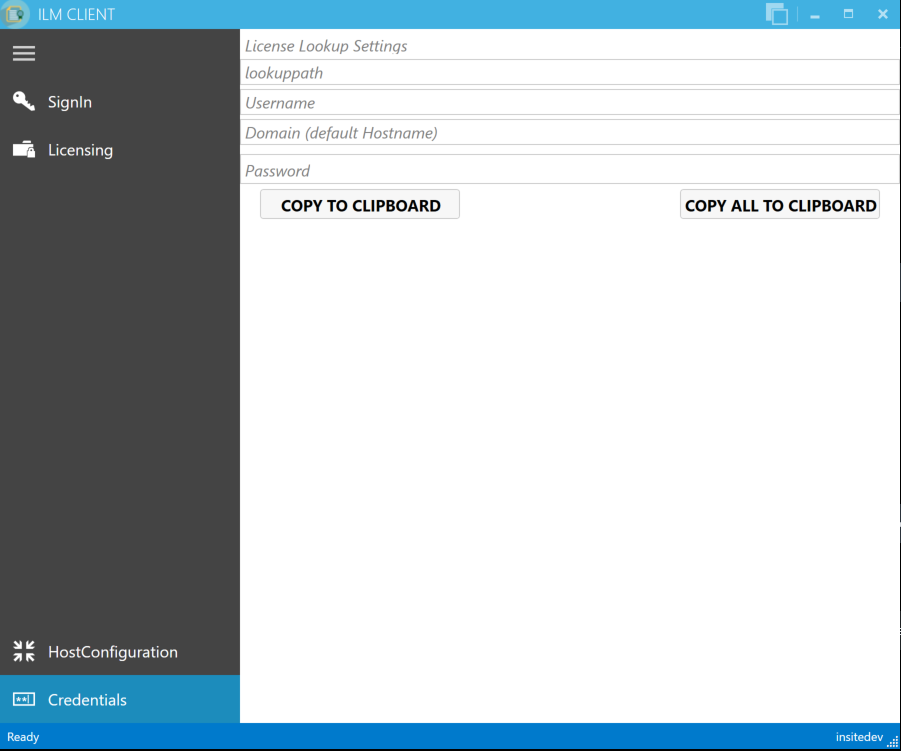
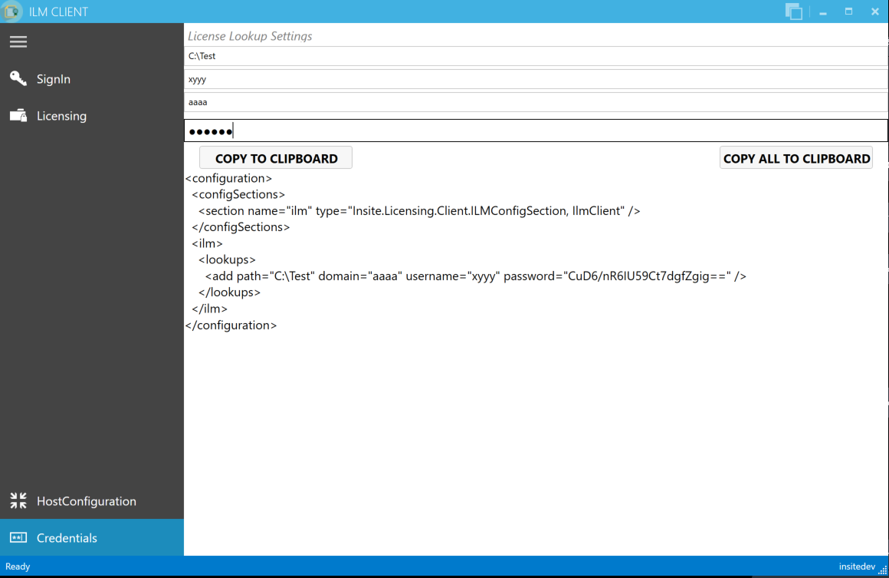

<h1>ILM</h1>  

<h1>Insite License Management</h1>


---  
#General#

This tool uses a WebApi to a licensing server on the internet. It is intended for clients of insite, who need a license for the use of software by insite. To retrieve licenses, the client has received the following information from insite:

*  Username and password to sign in to the licensing server
*  The product-key for the application to be licensed *(only relevant for command-line-mode)*

For licensing, also the license source-file (&#42;.lics) is required, which is created on-start by an insite-application which requires a license.

---  
##GUI mode vs. Command-line mode##

ILMWebApiClient is by default run in so-called "GUI mode" as a "normal" Windows application with a user interface (see [2. "GUI mode"](#GUI mode)).  

With a command-line parameter, it can also be changed into "Command-line-mode" so the application can be embedded into a batch file or a setup script. By this, it is possible to "automatically" generate the license file to a given license source (see [3. "Command-line mode"](#Command-line mode)).

---  
#GUI mode#

<a name="GUI mode"></a>
After double-clicking the application, a window appears. To begin, the user must first log himself in.

---  
##Login##


  

This tool utilizes the WebApi interface and is intended for clients of insite, who need a license to use insite software. As usual, there is a login, where the client has to log himself in using his personal user data.  

The clients receive this user data by their contact person at insite.

---  
##HostConfiguration##


  

On this page, the hosts to be licensed are configured. Here, "localhost" is the default setting so there is no need to change anything.
  

Additionally, the data of multiple hosts can be registered. By clicking on *Collect*, all .lics-files of those hosts are collected and stored in a file-structure in the output folder (the path specified at the top right below the *collect*-button).
  

Then, this data can be licensed on the licensing page. If this finishes successfully, the resulting licenses ("&#42;.lic" files) can then be distributed back to the hosts by clicking the *Publish*-button in the top-right corner.  

---  
###Manual DataExchange###

On the computer to be licensed, go to the folder  

`"C:\ProgramData\insite\license"`


Copy both folders to this target directory on your local hard drive:  

`[path specified in ILM]\[name of the computer]`


This results in the following file structure:


This is necessary because the ILM-WebApiClient searches for the attribution to a license via the filename. This means, the license file must not be renamed. Therefore, it is simple to implement an up-to-date license-data management for each individual computer.

---  
##Licensing##

<a name="licensing"></a>


In *Items to license*, all .lics-files, which were found for the current license, are displayed.  

By clicking the button *Activate selected Licenses*, all files are activated, which were selected in *Items to license*.  

The activated license is stored in the *licensed*-folder, whose filepath is determined as follows:

*  If a *localhost*-file was activated, the folder can be found in  
	`"C:\ProgramData\insite\license\licensed"`
*  If a remote-file was activated, it can be found in  
	`[path specified in ILM]\[name of the computer]\licensed`

With *Activate license from file*, an OpenFile-dialog box is opened and the file to be activated can be selected. The created license is then stored to the same directory. Distributing the licenses is also possible from this page, at which one can select specific computers, all computers, or those computers for which a license was just activated.  

The display next to *Items to license* shows the status of the activation:

*  An "X" means the license could not be activated
*  An "=" means the license has not changed since the last activation (however, the license file is still created again)
*  A tick means the activation has been successful

---  
#Command-line mode#

<a name="Command-line mode"></a>
In command-line mode, the program is started from a command-line or a batch file with the following call:
  

`ILMWebApiClient -c -l<ProductKey> -s<path to .lics-file> -u<Username> -p<Password>`
  

The client receives the ProductKey from insite or can copy it to the clipboard by clicking the license entry in GUI-Mode (see [2.3 "Licensing"](#licensing)).
  

During this process, different status notifications will appear in the console (unless the program was started by a batch file, the "Enter"-key has to be pressed at the end). On successful completion, there will be a license file ("&#42;.lic") in the directory of the licensing source file ("&#42;.lics").

---  
#License-Lookup#

To be able to reload licenses even after the computer was reset, ILM offers the feature of "lookup-paths". When starting the application, these paths are searched to determine if there already is a license file which matches the current computer.  

To be able to use this feature, a configuration for this can be set in the ILM-Client, since it also contains an encrypted password. This configuration then only has to be included in the exe.config file of the application which was licensed by ILM.
  







  
```html
<?xml version="1.0" encoding="utf-8" ?>
<configuration>
    <configSections>
        <section name="ilm"
                 type="Insite.Licensing.Client.ILMConfigSection, IlmClient"/>
        ...
    </configSections>
    <startup>
        <supportedRuntime version="v4.0" sku=".NETFramework,Version=v4.5.2" />
    </startup>
    <runtime>
        <legacyCorruptedStateExceptionsPolicy enabled="true" />
    </runtime>
    <ilm>
        <lookups>
            <add path="ABC" domain="" username=""
                 password="TODO -> Encryption in ILMWEBApi!!!" />
        </lookups>
    </ilm>

    ...
</configuration>
```  


---  
#Change directory#

<table><tr><th>Author </th><th> Date </th><th> Remarks</th></tr>
<tr><td>Benjamin Prömmer </td><td> 12.01.2016 </td><td> Creation</td></tr>
<tr><td>Benjamin Prömmer </td><td> 24.03.2016 </td><td> Detailed description of manual DataExchange</td></tr>
<tr><td>Benjamin Prömmer </td><td> 25.05.2016 </td><td> Expand "licensing"</td></tr>
<tr><td>Karsten Gorkow </td><td> 13.06.2016 </td><td> Corrections, add command-line mode</td></tr>
<tr><td>Benjamin Prömmer </td><td> 21.12.2016 </td><td> Description license-lookup</td></tr>
</table>