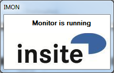
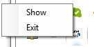

<h1>Software Specification</h1>  

<h1>IMON</h1>
  

**insite GmbH**

---  
#Introduction#

IMON is a simple GUI for a monitor. In the current application a "comparer" is used as a monitor (see comparer documentation). A "monitor" is an abstract concept of an object, which can be configured, started and stopped again. The purpose of a monitor in this sense is to monitor or observe something and react accordingly if anything changes. IMON configures the comparer on start-up and has 

---  
##Purpose and Objective##

GUI for monitor, here a comparer.

---  
#General Description#

The special features and setting options of the software are described below. 

---  
##System Environment##

The software is written with C&#35; Visual Studio 2010 for the Target framework .NET 4.0.  

 .NET 4.5 is not used since it does not guarantee any compatibility with XP.

---  
#User Interface#

The user interface is kept very simple and its only option is to display the current state of the monitor. IMON normally runs minimised as a Tray Icon.  

---  
##Tray menu##

  

*  **Show:** displays or hides the main window
*  **Exit:** terminates the application

---  
#Installation#

This requires that the "Microsoft .NET Framework 4.0 Servicepack 1" is installed and available on the destination system under Windows.
  

The application files can be copied to any directory. The application can be started directly from this directory.

---  
#Document History#

<table><tr><th>Author </th><th> Date </th><th> Remarks</th></tr>
<tr><td>Benjamin Prömmer </td><td> 2014-12-12 </td><td> Creation</td></tr>
<tr><td>Karsten Gorkow </td><td> 2016-01-13 </td><td> Minor changes</td></tr>
</table>