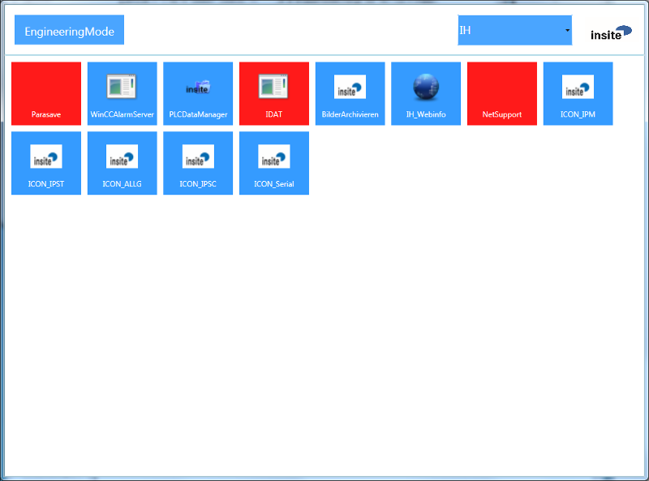
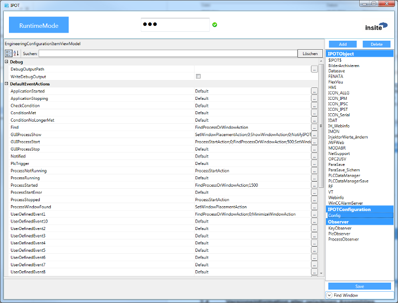
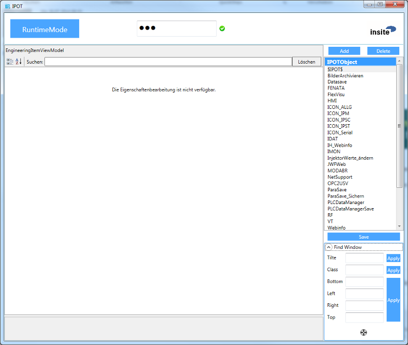
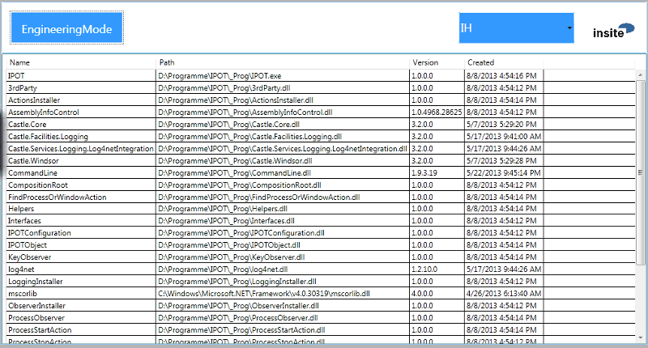

<h1>Software Specification</h1>  

<h1>IPOT</h1>
  

**I**nsite **P**rocess **O**bservation **T**ool  

**insite GmbH**


---  
#Introduction#

IPOT (Insite Process Observation Tool) is a modular configurable software application for monitoring, starting and controlling processes and their windows.

---  
##Purpose and Objective##

On an automation computer it is necessary to monitor and control several different programs. Even though you can fall back on Windows tools in the process, the program IPOT is much more convenient and powerful for this purpose.

---  
##Definitions, acronyms, abbreviations##

*  **IPOT:** Insite Process Observation Tool
*  **PLC:** Programmable Logic Controller
*  **GUI:** graphical user interface  -->  user interface
*  **Assembly:** An Assembly is a logical functional unit that is executed under the control of the Common Language Runtime (CLR) of .NET. An Assembly physically exists as a .dll or .exe file
*  **Process:** Executed application
*  **Event:** A signal that is fired to different places in the program, and can be reacted to by means of actions
*  **Action:** Defines actions that can be parameterised on events
*  **Observer:** Defines observations that, in turn, can fire events

---  
#General Description#

The special features and setting options of the software are described below.

---  
##System Environment##

The software is written with C&#35; Visual Studio 2012 for the target framework .NET 4.

---  
##Start parameter##

IPOT can be started with different parameters. Since an IPOT is a single instance application, if an IPOT instance is already running, the parameters are transferred to the existing instance and the current instance is terminated again.


<table><tr><th>Param </th><th> Param </th><th> Description</th></tr>
<tr><th>Short </th><th> Long </th><th>   </th></tr>
<tr><td>c </td><td> config </td><td> Specifies the path to the configuration file</td></tr>
<tr><td>   </td><td>    </td><td> (default: IPOT.config)</td></tr>
<tr><td>g </td><td> group </td><td> Specifies which group in the GUI should be displayed.</td></tr>
<tr><td>   </td><td>    </td><td> If this parameter is specified, only the specified group is</td></tr>
<tr><td>   </td><td>    </td><td> displayed, and all other groups are thus disabled.</td></tr>
<tr><td>v </td><td> view </td><td> If a POTObject ID is specified, the event GUIProcessShow</td></tr>
<tr><td>   </td><td>    </td><td> is fired to this ID</td></tr>
<tr><td>a </td><td> arg </td><td> This parameter can be specified together with –v and</td></tr>
<tr><td>   </td><td>    </td><td> ensures that these arguments are given to the process to be</td></tr>
<tr><td>   </td><td>    </td><td> started. (Attention: These arguments take priority over the</td></tr>
<tr><td>   </td><td>    </td><td> configured arguments, i.e. if arguments with –a were</td></tr>
<tr><td>   </td><td>    </td><td> transferred, then the parameterised arguments will not be</td></tr>
<tr><td>   </td><td>    </td><td> transferred. Furthermore, an ongoing process will be</td></tr>
<tr><td>   </td><td>    </td><td> terminated beforehand (if a corresponding action was</td></tr>
<tr><td>   </td><td>    </td><td> parameterised to the event GUIProcessStop and the setting</td></tr>
<tr><td>   </td><td>    </td><td> ProcessHandleInstances was set to false), so that the new</td></tr>
<tr><td>   </td><td>    </td><td> process can be started with the new arguments</td></tr>
<tr><td>u </td><td> update </td><td> Sets a config value (this value must be declared in the config,</td></tr>
<tr><td>   </td><td>    </td><td> however, i.e. it is only possible to change but not to add</td></tr>
<tr><td>   </td><td>    </td><td> In the case of events, adding is possible, too)</td></tr>
<tr><td>s </td><td> save </td><td> Saves the config change</td></tr>
<tr><td>e </td><td> exit </td><td> If an POTObject ID is specified, the event GUIProcessStop is</td></tr>
<tr><td>   </td><td>    </td><td> fired to this ID. (the ID for IPOT itself is "$IPOT$")</td></tr>
</table>

  


Examples:  

**IPOT is started (if it is not yet running) and the group is set to IH.**  

IPOT.exe -cD:\Data\DH\Configs\Insite\IPOT.config –gIH
  

**IPOT is started (if it is not yet running) and the application with the ID ArchiveImages is started. (If the corresponding actions were declared.)**
IPOT.exe -cD:\Data\DH\Configs\Insite\IPOT.config –vArchiveImages
  

**IPOT is started (if it is not yet running), the application with the ID ArchiveImages is started and the arguments silent and -test are transferred. (If the corresponding actions were declared.)**  

IPOT.exe -cD:\Data\DH\Configs\Insite\IPOT.config –vArchiveImages –a"-silent  

-test"
  

**IPOT is started (if it is not yet running) and the setting for the program ICON&#95;ALLG is adapted (Observe is set to False) and saved.**  

IPOT.exe -cD:\Data\DH\Configs\Insite\IPOT.config -uICON&#95;ALLG.Observe=false –s
  

**IPOT is started (if it is not yet running) and the setting for the program ICON&#95;ALLG is adapted (Observe is set to False) and saved.**  

IPOT.exe -cD:\Data\DH\Configs\Insite\IPOT.config   
-uParasave.GUIProcessStop=FindProcessOrWindowAction;3000;ProcessStopAction
  

**IPOT is started (if it is not yet running) and the application with the ID ArchiveImages is terminated. (If the corresponding actions were declared.)**  

IPOT.exe -cD:\Data\DH\Configs\Insite\IPOT.config -eArchiveImages
  

**IPOT is started (if it is not yet running) and the application with the ID ArchiveImages is set to Obser=false, this change is saved and the application is then terminated. (If the corresponding actions were declared.)**  

IPOT.exe -cD:\Data\DH\Configs\Insite\IPOT.config -uArchiveImages.Observe=false –s -eArchiveImages

---  
##IPOT-GUI##

Once all the information has been read out from the .confi file and and the system has configured itself, the main window then appears. If IPOTObjects have already been parameterised, the application is then started in Runtime Mode:

---  
###Runtime Mode###



  

The tiles represent the individual processes, if a tile is red, the process is not found, or the file to be started is not available.
  

**Colour definition:**
  

**Process is running or is not being monitored:**  


  

**Restart is currently not permitted:**  


  

**Process or window not found:**  


---  
###Engineering Mode###

Press the button in the top left hand corner to switch over to the Engineering Mode. In this mode you can view as well as change the individual observations. Finding windows is facilitated by the search function that you can find in the bottom right-hand corner of the Engineering Mode when opening the Expander. Simply drag the target icon onto the window from which you need data and add this by selecting the IPOTObject and clicking on "Add".  

The old configuration with the extension .bak is saved by pressing the Save button and your changes are written to the new configuration. Each change is active immediately, but if the Save button is not pressed, then the changes will be lost when you exit. If a new object is added, it first becomes active after restarting the Observer!
  



  



  


---  
##Version information of all loaded assemblies##



  

To obtain information about all assemblies currently loaded, you can click on the INSITE-LOG in the upper right-hand corner. By clicking, all information is collected and displayed in a list. The entries of the list can be selected and copied to the clipboard by Copy&Paste. Clicking once again closes this version display and a new standard interface of IPOT is displayed again.

---  
##Password protection##


  


  


  

If a password is specified, this will be requested when terminating and changing to the Engineering Mode. If the password is correct, the green icon will appear, which simultaneously functions as a logoff button. As long as the password not valid, the red icon appears, which you can also use to terminate the input.

---  
##How does IPOT work?##

IPOT works event-based. At various places in the application, defined events are fired that can be linked to actions via the parameterisation. This principle of Action  -->  Reaction runs through the entire application, whereby any action in the application can be controlled via the parameterisation. This results in a freely configurable and very flexible program that can be used for a wide variety of applications.

---  
#Web-Interface#

IPOT also supports a WebAPI interface, the commands which are described in start parameters can also be used via this interface. These commands are HTTP Post requests.
  

Example:  

**IPOT starts (if it's not already running) and the group is set to IH.**  

POST /Commandline/Execute?password=1234  

Host: http://localhost:8091  

-cD:\Daten\DH\Konfigs\Insite\IPOT.config –gIH

---  
#Components#

IPOT consists of several subcomponents. These are divided into two main groups (Observers and Actions). 

---  
##Observers##

Observers are started from IPOT and fire events to objects. These processing events can then be configured.

---  
###ProcessObserver###

The ProcessObserver checks cyclically until all marked objects are connected with IPOT. As soon as a component loses the connection again and a MinDownTime is parameterised, the Observer is executed again on this component. As long as a connection of the component with IPOT exists, the IPOTObject assumes all functions, which also include observation.

---  
####Configuration####
   

  
```html
<component id="PlcObserver" service="IPOT.Arch.Interfaces.IObserver, Interfaces" 
           type="IPOT.Components.Observers.PlcObserver, PlcObserver"
           lifestyle="singleton">
    <parameters>
        <active>true</active>
        <cycle>1000</cycle>
        <asyc>true</async>
    </parameters>
</component>
```  


<table><tr><th>Parameter </th><th> Description</th></tr>
<tr><td>cycle </td><td> Checking interval, in this interval reading takes place from the Plc</td></tr>
<tr><td>async </td><td> Executes the observation of all projects in parallel</td></tr>
<tr><td>active </td><td> Activates the observer  -->  Default is true </td></tr>
</table>


---  
###KeyObserver###

Various HotKeys and their functions can be parameterised on objects for the KeyObserver. By pressing a key, the parameterised event is then fired to the configured IPOT object/s.

---  
####Configuration####
   

  
```html
<component id="KeyObserver" service="IPOT.Arch.Interfaces.IObserver, Interfaces" 
           type="IPOT.Components.Observers.KeyObserver, KeyObserver" 
           lifestyle="singleton">
    <parameters>
        <active>true</active>
        <asyc>true</async>
        <hotKeys>
            <dictionary>
                <entry key="F9">UDKeyObserverEvent1=*</entry>
                <entry key="Alt+F9">UDKeyObserverEvent2=*</entry>
            </dictionary>
        </hotKeys>
    </parameters>
</component>
```  


<table><tr><th>Parameter </th><th> Description</th></tr>
<tr><td>async </td><td> Fires an event for all objects simultaneously</td></tr>
<tr><td>active </td><td> Activates the observer  -->  Default is true</td></tr>
<tr><td>hotkeys </td><td> Here, the key, its event, and the components that the event was</td></tr>
<tr><td>   </td><td> applied to are to be parameterised:</td></tr>
<tr><td>   </td><td> Key = F9 (or Alt+F9/Shift+F9/Ctrl+F9)</td></tr>
<tr><td>   </td><td> Event = UserDefinedEvent1</td></tr>
<tr><td>   </td><td> Object = &#42; = all IPOTObjects; empty = IPOT; otherwise the ID</td></tr>
</table>


---  
###PlcObserver###

The PlcObserver checks cyclically whether anything has changed on the Plc data specified. If a change occurs, the PlcTrigger-event is fired for the respective object. Additionally, various triggers and their functions can also be parameterised on objects. When the trigger occurs, the parameterised event is then fired to the configured IPOT object/s.

---  
####Configuration####
   

  
```html
<component id="ProcessObserver" service="IPOT.Arch.Interfaces.IObserver, Interfaces" 
           type="IPOT.Components.Observers.ProcessObserver, ProcessObserver"
           lifestyle="singleton">
    <parameters>
        <active>true</active>
        <cycle>10000</cycle>
        <asyc>true</async>
        <plcEvents>
            <dictionary>
                <entry key="DB2,1.0=true">UserDefinedEvent1=*</entry>
            </dictionary>
        </plcEvents>
    </parameters>
</component>
```  


<table><tr><th>Parameter </th><th> Description</th></tr>
<tr><td>cycle </td><td> Checking interval, in this interval an attempt is made to find</td></tr>
<tr><td>   </td><td> processes that are not connected</td></tr>
<tr><td>async </td><td> Fires an event for all objects simultaneously</td></tr>
<tr><td>active </td><td> Activates the observer  -->  Default is true</td></tr>
<tr><td>plcEvents </td><td> Here, a PLCTrigger is entered that can fire user-defined events</td></tr>
<tr><td>   </td><td> Key = DB2,1.0=true</td></tr>
<tr><td>   </td><td> Event = UserDefinedEvent1</td></tr>
<tr><td>   </td><td> Object = &#42; = all IPOTObjects; empty = IPOT; otherwise the ID</td></tr>
</table>


---  
##Action (Actions)##

<a name="Action (Actions)"></a>
An action can be parameterised on any events. Even a chain of actions is possible. Actions, in turn, can fire events on which further actions can be parameterised.

---  
###FindProcessOrWindowAction###

Only the process or window is searched for depending on whether a window was parameterised for the action.
  

**Parameters used:**  

ProcessName, WindowTitle, WindowClass

---  
###ProcessStartAction###

If the restart is not disabled, the process is started here.
  

**Parameters used:**  

WorkingDir, ExecutablePath, ExecutableName, Arguments

---  
###ProcessStopAction###

In case the process is running, a Close is searched for here, if the termination takes longer than 5000 ms, the process is terminated hard.

---  
###SetWindowPlacementAction###

This action can change the style of the window and set the size and position.
  

**Parameters used:**  

RemoveWindowStyles, ShowMode, Left, Top, Right, Bottom

---  
###MinimizeWindowAction###

This action minimizes the size of the window.

---  
###RestoreShowModeAction###

**Parameters used:**  

ShowMode

---  
###ShowWindowAction###

This action brings the window into the foreground and sets the Show Mode
  

**Parameters used:**  

GUIShowMode

---  
###TaskBarHideAction###

This action hides the taskbar. (AutoHide)

---  
###TaskBarUnHideAction###

This action resets the taskbar to visible.

---  
###NotifyIPOTObjectAction###

This action sends a Notified Event to the IPOTObjects parameterised in Notify.
  

**Parameters used:**  

Notify

---  
###CheckConditionAction###

This action checks an additional condition. If this condition is not met, the Autostart is deactivated by the Observer until the condition is met.
  

**Parameters used:**  

Condition

---  
###NoAction###

This action has no task, its only purpose is to overwrite a default value.

---  
###PropertyKeyOverrideAction###

This action allows the extension of existing settings. Here, for example, it is possible to transfer an argument from the Plc to a program.
  

**Parameters used:**  

KeyOverride

---  
###SetWindowParentAction###

This action allows the WindowParent to be changed.
  

**Parameters used:**  

ParentProcessName, ParentWindowTitle, ParentWindowClass

---  
###ResetWindowParentAction###

This action allows the WindowParent to be reset to the Desktop.

---  
#Configuration in Detail#

---  
##IPOTConfiguration##

  
```html
<component id="Config" service="IPOT.Arch.Interfaces.IIPOTConfiguration, Interfaces" 
           type="IPOT.Arch.IPOTConfiguration, IPOTConfiguration"
           lifestyle="singleton">
  <parameters>
    <startGroup>IH</startGroup>
    <showMode>Minimized</showMode>
    <password>sB1rAPxfi1cDyI6JblwKDQ==</password>
    <logoutTimeMs>10000</logoutTimeMs>
    <writeDebugOutput>false</writeDebugOutput>
    <debugOutputPath></debugOutputPath>
    <plcConnctionString>Data Source=192.168.0.145,0,2;</plcConnctionString>
    <groups>
      <list>
        <item>IH</item>
        <item>Werker</item>
      </list>
    </groups>
    <windowPosLTRB>0;129;1025;975</windowPosLTRB>
    <eventActions>
       <dictionary>
          <entry key="UDKeyObserverEvent1">MinimizeWindowAction</entry>
          <entry key="Notified">MinimizeWindowAction</entry>
       </dictionary>
    </eventActions>
  </parameters>
</component>
```  


<table><tr><th>Parameter </th><th> Description</th></tr>
<tr><td>startGroup </td><td> Group program group to be displayed when starting IPOT</td></tr>
<tr><td>showMode </td><td> Indicates the StartMode of IPOT (Minimized, Maximized,</td></tr>
<tr><td>   </td><td> Normal)</td></tr>
<tr><td>password </td><td> Entry of the password in order to terminate the</td></tr>
<tr><td>   </td><td> application and to switch to the Engineering Mode</td></tr>
<tr><td>   </td><td> (no password = no logon necessary)</td></tr>
<tr><td>logoutTimeMs </td><td> Time until the automatic logout. (0=no automatic logout)</td></tr>
<tr><td>writeDebugOutput </td><td> The Dynamic ViewModel is created as a .cs file</td></tr>
<tr><td>debugOutputPath </td><td> Path for the dynamic ViewModel</td></tr>
<tr><td>plcConnectionString </td><td> Specifies the Plc connection if one is required</td></tr>
<tr><td>   </td><td> (IP,Rack,Slot)</td></tr>
<tr><td>Groups </td><td> Displayable program groups</td></tr>
<tr><td>windowPosLTRB </td><td> Window position and size Left, Top, Right, Bottom</td></tr>
<tr><td>eventActions </td><td> See *IPOTObject*</td></tr>
</table>

  


---  
##IPOTObject##

This object is required for parameterising and managing an application. All settings and events for the application can be parameterised here.
  
```html
<component id="Parasave" service="IPOT.Arch.Interfaces.IIPOTObject, Interfaces"
           type="IPOT.Arch.IPOTObject, IPOTObject" lifestyle="singleton">
  <parameters>
    <id>Parasave</id>
    <prop>
      <dictionary>
        <entry key="ProcessName">ParaSave</entry>
        <entry key="ExecutableName">ParaSave.exe</entry>
        <entry key="ExecutablePath">d:\Programme\ParaSave</entry>
        <entry key="WorkingDir">d:\Programme\ParaSave</entry>
        <entry key="MinDownTime">0</entry>
        <entry key="Observe">false</entry>
        <entry key="Arguments"></entry>
        <entry key="Icon"> d:\Programme\ParaSave\icon.ico</entry>
        <entry key="WindowClass"></entry>
        <entry key="WindowTitle"></entry>
        <entry key="GUIShowMode">ShowNormal</entry>
        <entry key="RemoveWindowStyles">MinMaxBox</entry>
        <entry key="ShowMode">ShowNormal</entry>
        <entry key="Left">0</entry>
        <entry key="Top">129</entry>
        <entry key="Right">1025</entry>
        <entry key="Bottom">575</entry>
        <entry key="Group">IH</entry>
        <entry key="Notify"></entry>
      </dictionary>
    </prop>
    <eventActions>
      <dictionary>
        <entry key="GUIProcessStart">
          ProcessStartAction;0;
          FindProcessOrWindowAction;500;
          SetWindowPlacementAction
        </entry>
      </dictionary>
    </eventActions>
    <defaultEventActions>
      <dictionary>
        <entry key="GUIProcessStart">
          ProcessStartAction;0;
          FindProcessOrWindowAction;500;
          SetWindowPlacementAction
        </entry>
      </dictionary>
    </defaultEventActions >
  </parameters>
</component>
```  


<table><tr><th>Parameter </th><th> Description</th></tr>
<tr><td>ProcessName </td><td> Process name that can be seen in the Task Manager</td></tr>
<tr><td>ExecutablePath </td><td> Path for the executable file</td></tr>
<tr><td>ExecutableName </td><td> Name of the executable file</td></tr>
<tr><td>WorkingDir </td><td> Working directory</td></tr>
<tr><td>ProcessHandleInstances </td><td> The process can manage several instances indepen-</td></tr>
<tr><td>   </td><td> dently and IPOT does not have to take care of it.</td></tr>
<tr><td>MinDownTime </td><td> Restart of an application only after this time has</td></tr>
<tr><td>   </td><td> elapsed</td></tr>
<tr><td>Observe </td><td> Observation active or not</td></tr>
<tr><td>Arguments </td><td> Arguments for the process start</td></tr>
<tr><td>Icon </td><td> Icon to be displayed in the GUI</td></tr>
<tr><td>   </td><td> (Otherwise the icon of the Exe is used.)</td></tr>
<tr><td>WindowClass </td><td> Window class for identification of the correct window</td></tr>
<tr><td>WindowTitle </td><td> Window title for identification of the correct window </td></tr>
<tr><td>GUIShowMode </td><td> Display mode that the window is set to if it is started</td></tr>
<tr><td>   </td><td> from the GUI of IPOT</td></tr>
<tr><td>RemoveWindowStyles </td><td> Here, the window title can be changed</td></tr>
<tr><td>   </td><td> (e.g. removal of the MinMaxBox, frame, etc.)</td></tr>
<tr><td>ShowMode </td><td> Window mode that the window must be set to</td></tr>
<tr><td>   </td><td> when starting</td></tr>
<tr><td>Left </td><td> Left edge of the window</td></tr>
<tr><td>Top </td><td> Top edge of the window</td></tr>
<tr><td>Right </td><td> Right edge of the window</td></tr>
<tr><td>Bottom </td><td> Bottom edge of the window</td></tr>
<tr><td>Group </td><td> Group that the application belongs to. Several groups</td></tr>
<tr><td>   </td><td> can also be declared (e.g. "Grp1;Grp2")</td></tr>
<tr><td>Notify </td><td> Objects to which the Notify Event should be sent</td></tr>
<tr><td>   </td><td> Possible is:</td></tr>
<tr><td>   </td><td> Empty= IPOT</td></tr>
<tr><td>   </td><td> &#42;= All IPOTObjects</td></tr>
<tr><td>   </td><td> ID1;ID2; = specified IDs)</td></tr>
<tr><td>ObserveCondition </td><td> Specifies whether a condition should be observed</td></tr>
<tr><td>   </td><td> (is only relevant in connection with Observe=True)</td></tr>
</table>

  


<table><tr><td>Condition </td><td> Specifies the condition. A condition is to declare</td></tr>
<tr><td>   </td><td> [Type]:[Condition][ [$OR$ or $AND$][Type]:[Condition] ]</td></tr>
<tr><td>   </td><td> There are two types of conditions at present:</td></tr>
<tr><td>   </td><td> 1. PlcCondition: </td></tr>
<tr><td>   </td><td> Plc:[Selector (DB,MB,EB + Number)],[Offset(for Bits Offset.Bit)],</td></tr>
<tr><td>   </td><td> [Length (do not specify for bits!)]=[value](The value comparison</td></tr>
<tr><td>   </td><td> takes place with IgnoreCase) e.g.: Plc:DB2,1.0=true</td></tr>
<tr><td>   </td><td> 2. WmiCondition:</td></tr>
<tr><td>   </td><td> e.g.: Wmi:Select &#42; From Win32&#95;PnPEntity Where Caption = </td></tr>
<tr><td>   </td><td> "WIBU - CodeMeter-Stick USB Device"</td></tr>
<tr><td>   </td><td> Plc:WMI-Select must evaluate for Count &#62; 0.</td></tr>
<tr><td>KeyOverride </td><td> Specifies which settings should be updated.</td></tr>
<tr><td>   </td><td> [Type]:[Key]=[Selector];[ [Type]:[Key]=[Selector]];</td></tr>
<tr><td>   </td><td> A format ID must also still be defined in the key for this value </td></tr>
<tr><td>   </td><td> -->  {Indexbeginnendmit0}</td></tr>
<tr><td>   </td><td> There are two types at present :</td></tr>
<tr><td>   </td><td> 1. Plc:</td></tr>
<tr><td>   </td><td> Plc [Key]=[Selector (DB,MB,EB + Number)],</td></tr>
<tr><td>   </td><td> [Offset(for Bits Offset.Bit)],[Length (do not specify for bits!)]</td></tr>
<tr><td>   </td><td> (The value comparison takes place with IgnoreCase)</td></tr>
<tr><td>   </td><td> e.g.: Plc:Arguments=DB2,542,6</td></tr>
<tr><td>   </td><td> Arguments must then have the format Id 0: Arguments="-p{0}"</td></tr>
<tr><td>   </td><td> 2. WmiCondition:</td></tr>
<tr><td>   </td><td> e.g.: Wmi:Select Name From Win32&#95;PnPEntity Where Caption = </td></tr>
<tr><td>   </td><td> "WIBU - CodeMeter-Stick USB Device"</td></tr>
<tr><td>PlcObserverTrigger </td><td> Here, you can specify which data change should trigger a</td></tr>
<tr><td>   </td><td> PlcTriggerEvent. e.g.: DB2,1.0=true</td></tr>
<tr><td>PlcTriggerDetected </td><td> Here, you can specify that a data area should be written</td></tr>
<tr><td>   </td><td> in the Plc when a trigger is detected.</td></tr>
<tr><td>   </td><td> e.g.: DB2,4.0=false;true</td></tr>
<tr><td>   </td><td> Trigger = false  -->  1st value in the example is therefore then false</td></tr>
<tr><td>   </td><td> Trigger = true  -->  2nd value in the example is therefore then true</td></tr>
</table>

  


---  
###prop###

<table><tr><th>Parameter </th><th> Description</th></tr>
<tr><td>id </td><td> Unique application ID</td></tr>
<tr><td>prop </td><td> Dictionary of all settings</td></tr>
<tr><td>eventActions </td><td> Dictionary of the events and the associated actions</td></tr>
</table>


---  
###eventActions###

  
```html
<entry key="[Event]">[Action];[DelayTime][;[Action][DelayTime]]</entry>
```  


<table><tr><th>Parameter </th><th> Description</th></tr>
<tr><td>event </td><td> See [Appendix A](#Appendix_A)</td></tr>
<tr><td>Action </td><td> See [Actions](#Action (Actions))</td></tr>
<tr><td>DelayTime </td><td> Delay time for execution of the action</td></tr>
</table>

  


---  
###defaultEventActions###

Here, default settings can be defined for all events. Therefore, if an event should not be declared in the object, this entry is used.
  
```html
<entry key="[Event]">[Action];[DelayTime][;[Action][DelayTime]]</entry>
```  


<table><tr><th>Parameter </th><th> Description</th></tr>
<tr><td>event </td><td> See [Appendix A](#Appendix_A)</td></tr>
<tr><td>Action </td><td> See [Actions](#Action (Actions))</td></tr>
<tr><td>DelayTime </td><td> Delay time for execution of the action</td></tr>
</table>

  


---  
##Configuration &#60;log4net&#62;##

For setting options and additional information on this 3rd party component, please refer to page: <http://logging.apache.org/log4net/>


---  
#Installation#

This requires that 

  1.   Microsoft .NET Framework 4.5.2

is installed and available on the destination system under Windows.
  

These files can be copied to any directory and IPOT.exe can then be started from there.
  


 The directory must be a local directory and not a network drive!

---  
#Appendix A#

<a name="Appendix_A"></a>
---  
##Events##


<table><tr><th>Parameter </th><th> Description</th></tr>
<tr><td>ProcessNotRunning </td><td> This event is fired from the FindProcessOrWindowAction</td></tr>
<tr><td>   </td><td> if the process was not found</td></tr>
<tr><td>ProcessStarted </td><td> This event is fired from the ProcessStartAction after starting the</td></tr>
<tr><td>   </td><td> process</td></tr>
<tr><td>ApplicationStarted </td><td> This event is fired to each IPOTObject from the ProcessObserver</td></tr>
<tr><td>   </td><td> when starting the application</td></tr>
<tr><td>ApplicationStopping </td><td> This event is fired to each IPOTObject from the ProcessObserver</td></tr>
<tr><td>   </td><td> when terminating the application</td></tr>
<tr><td>ApplicationWindow- </td><td> This event is fired to the IPOTConfiguration object from IPOT</td></tr>
<tr><td>StateChanged </td><td> when changing the window status (maximising, minimising)</td></tr>
<tr><td>   </td><td> of the application</td></tr>
<tr><td>ProcessWindowFound </td><td> This event is fired from the FindProcessOrWindowAction if the</td></tr>
<tr><td>   </td><td> process and associated window was found</td></tr>
<tr><td>Find </td><td> This event is fired from the ProcessObserver for the IPOTObjects</td></tr>
<tr><td>   </td><td> which have activated during the check cycle Observe, the</td></tr>
<tr><td>   </td><td> restart is not deactivated, the process does not run and no</td></tr>
<tr><td>   </td><td> Condition was activated</td></tr>
<tr><td>ProcessRunning </td><td> This event is fired from FindProcessOrWindowAction if the process</td></tr>
<tr><td>   </td><td> was not found. (If a window is required, this event is replaced by</td></tr>
<tr><td>   </td><td> ProcessWindowFound)</td></tr>
<tr><td>WindowPlaced </td><td> This event is fired from SetWindowPlacement if the window has</td></tr>
<tr><td>   </td><td> been placed on the specified position</td></tr>
<tr><td>ProcessStartError </td><td> This event is fired from the ProcessStartAction if an</td></tr>
<tr><td>   </td><td> error has occurred after starting the process</td></tr>
<tr><td>ProcessStopped </td><td> This event is fired from IPOTObject if the associated process</td></tr>
<tr><td>   </td><td> was terminated</td></tr>
<tr><td>GUIProcessShow </td><td> This event is fired from IPOT if the button (tile) of the object</td></tr>
<tr><td>   </td><td> has been pressed on the surface, or if IPOT was started with the</td></tr>
<tr><td>   </td><td> CommandlineParameter View</td></tr>
<tr><td>GUIProcessStart </td><td> This event is fired from the ShowWindowAction if the process</td></tr>
<tr><td>   </td><td> does not run</td></tr>
<tr><td>GUIProcessStop </td><td> This event is fired from IPOT if the button (tile) of the object has</td></tr>
<tr><td>   </td><td> been pressed on the surface with the Control button held down,</td></tr>
<tr><td>   </td><td> or if IPOT was started with the CommandlineParameter View</td></tr>
</table>

  


<table><tr><td>UserDefinedEvent1 </td><td> These events are used</td></tr>
<tr><td>... (2-9) </td><td> by the Observers</td></tr>
<tr><td>UserDefinedEvent10 </td><td> and can be parameterised freely</td></tr>
<tr><td>ApplicationActivated </td><td> This event is called up from IPOT as soon as the window</td></tr>
<tr><td>   </td><td> receives the focus.</td></tr>
<tr><td>ApplicationDeactivated </td><td> This event is called up from IPOT as soon as the window</td></tr>
<tr><td>   </td><td> loses the focus.</td></tr>
<tr><td>Notified </td><td> This event is called up from NotifyIPOTObjectAction in order+</td></tr>
<tr><td>   </td><td> to notify other objects.</td></tr>
<tr><td>CheckCondition </td><td> This event is fired when checking whether the element can be</td></tr>
<tr><td>   </td><td> restarted (only if a condition is specified)</td></tr>
<tr><td>PlcTrigger </td><td> This event is fired if a data change was detected on the</td></tr>
<tr><td>   </td><td> parameterised plc data.</td></tr>
<tr><td>ConditionMet </td><td> This event is fired if the condition is met. (if one was declared)</td></tr>
<tr><td>ConditionNoLongerMet </td><td> This event is fired if the condition was met,</td></tr>
<tr><td>   </td><td> but now is not met anymore</td></tr>
<tr><td>ParentChanged </td><td> This event if fired if the parent was successfully changed</td></tr>
<tr><td>ParentNotFound </td><td> This event if fired if the parent was not found</td></tr>
</table>

  


---  
#Change directory#


<table><tr><th>Author </th><th> Date </th><th> Remarks</th></tr>
<tr><td>Benjamin Prömmer </td><td> 2013-08-22 </td><td> Creation</td></tr>
<tr><td>Benjamin Prömmer </td><td> 2013-08-26 </td><td> Extended by password entry</td></tr>
<tr><td>Benjamin Prömmer </td><td> 2013-09-20 </td><td> IPOT.Common to IPOT.Arch!!! / Editing function</td></tr>
<tr><td>Benjamin Prömmer </td><td> 2014-07-02 </td><td> Start parameter, IPOTConfigParameter</td></tr>
<tr><td>Benjamin Prömmer </td><td> 2014-07-07 </td><td> Start parameter, new event  -->  GUIProcessStop</td></tr>
<tr><td>Benjamin Prömmer </td><td> 2014-07-10 </td><td> Action CheckConditionAction</td></tr>
<tr><td>Benjamin Prömmer </td><td> 2014-07-15 </td><td> PLCObserver, UserDefinedEvent, ...</td></tr>
<tr><td>Benjamin Prömmer </td><td> 2014-07-17 </td><td> NoAction</td></tr>
<tr><td>Benjamin Prömmer </td><td> 2014-07-18 </td><td> Default Actions Parameter</td></tr>
<tr><td>Benjamin Prömmer </td><td> 2014-07-28 </td><td> FindWindow and Group</td></tr>
<tr><td>Benjamin Prömmer </td><td> 2014-08-05 </td><td> PropertyKeyOverrideAction</td></tr>
<tr><td>Benjamin Prömmer </td><td> 2014-09-18 </td><td> Argument –a and ProcessHandleInstances</td></tr>
<tr><td>Benjamin Prömmer </td><td> 2015-02-15 </td><td> SetWindowParentAction, ResetWindowParentAction</td></tr>
<tr><td>Benjamin Prömmer </td><td> 2015-06-01 </td><td> Webserver integration</td></tr>
</table>