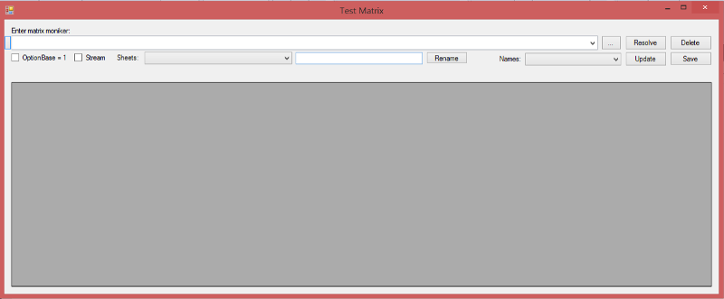
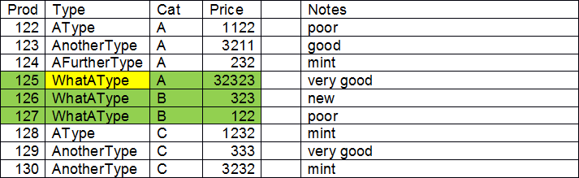
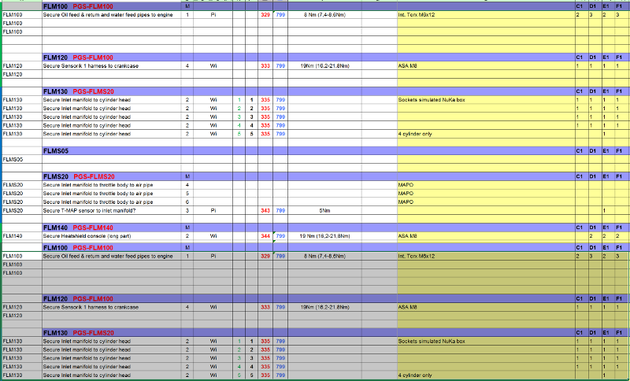
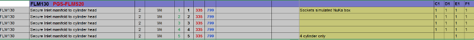
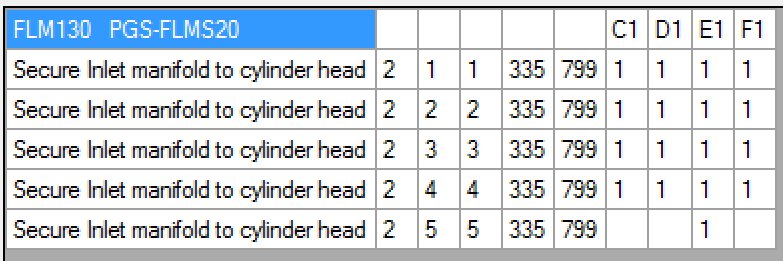
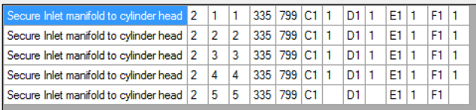

<h1>Matrix</h1>  

<h1>User Guide</h1>
  


**insite GmbH**


	
---  
#Introduction#

The main purpose of this document is to describe a query language that is used to reference and convert data from a data source that stores data in a 2D-matrix or a two-dimensional array. The concrete case uses an Excel sheet as the data source. Different components of the IDAT family of tools may use these queries.

---  
##Main DLL##

The query language is realised in a DLL called "MatrixResolver.dll".

---  
##Test Application##

Since a query can get quite complex, a front-end application to the MatrixResolver.dll exists. "TestMatrix" displays the result of a certain query as a grid. You can use it for testing or evaluating a query.

---  
##Document Audience##

Users of the IDAT family of tools that have to deal with data export/import from/to Excel. To understand the building of complex queries, you will need some knowledge about C&#35; and you should know the extension methods of IEnumerable or LINQ.

---  
#General Description#

---  
##System Requirements##

The application and DLLs were developed in C&#35; for the .NET framework 4.5 and above.  

The MatrixResolver uses LibXL, which is a library to access Excel data.

---  
##Overview##

---  
###MatrixResolver.dll###

---  
####Configuration####
   

When creating a MatrixResolver you can supply the parameter "OptionBase1". If set to true, all array indices are 1-based, which is the default. If you want to switch to the more "programmer-friendly" 0-based array indices, you want to set OptionBase1 to false.

---  
####Reading####
   

The method Resolve wants the data moniker and the data reader as parameters and returns the queried matrix as an IEnumerable&#60;IEnumerable&#60;string&#62;&#62; typed object.

---  
####Writing####
   

The method "UpdateData" wants the data moniker, a data reader/writer and an instance of an IEnumerable&#60;IEnumerable&#60;string&#62;&#62; typed object that contains the data to be written. If the data is omitted a new Excel workbook and a sheet will be created.

---  
###TestMatrix###



  


  1.   Enter the data moniker here. This is a combo box. Used monikers are preserved and you can recall them by clicking the downward arrow on the right side. To delete monikers from the list, select it and press "Shift + Del".
  2.   Opens an editor window for editing complex queries more easily.
  3.   Browse for the Excel file.
  4.   Resolve the current moniker and display data in grid.
  5.   Delete the current moniker from the combo box. Input field will be empty afterwards.
  6.   Switches the numbering scheme for array indices or column and row from 0-based (not checked) to 1-based (checked).
  7.   When checked, the "moniker" is treated as a simple filename. Further information in the moniker (sheet, col/row selection ...) will lead to an error, since this is would not be a valid filename.
  8.   Drop-down list that contains displays all sheets in the current file. You can rename sheets by using the text box (9.) and the rename button (10.).
  9.   Text box to enter a new sheet name.
  10.   Renames the selected sheet (8.) to the new name (9.).
  11.   Drop-down list that contains displays all named ranges in all sheets of the current Excel file.
  12.   Updates the changes made in the data grid (14.) in the Excel file.
  13.   Saves the current Excel file so that its modification time is updated. This can be used for triggering a new processing of the data in case the file os observed by another application (e.g. transfer of Excel data to PLC). **No data will be transferred from the data grid to the file! You will have to use the Update button to achieve this!**
  14.   Data grid that shows the result of the query/moniker and can be used to update data in the Excel file.


---  
#Query/Moniker Syntax#

A moniker is divided into two parts. The first one deals with the selection of a (sub-)matrix (a rectangular area of cells). The syntax for this part was developed by insite. The second part more or less is plain C&#35;. Since the returned matrix of the first part is an instance of an object of type IEnumerable&#60;IEnumerable&#60;string&#62;&#62; you can use all C&#35; extension methods for IEnumerable&#60;T&#62; (Select, Where, Take, Skip ...). Refer to different sources on the web regarding C&#35; and IEnumerable or consult a C&#35; programming book to learn more.

---  
##Basic selection of a Matrix##

<a name="basic_selection_of_a_matrix"></a>
The basic pattern for this part is:
  

&#60;filename&#62;[!&#60;sheetname&#62;[!&#60;matrixselection&#62;]]  

or  

&#60;filename&#62;[!!&#60;matrixselection&#62;]
  

<table>
 <tr><th>&#60;filename&#62; </th><td> Path and filename of the Excel file</td></tr>
 <tr><th>&#60;sheetname&#62; </th><td> Name of the sheet in the Excel file. If this not defined,</td></tr>
 <tr><th>   </th><td> the first sheet is used</td></tr>
 <tr><th>&#60;matrixselection&#62; </th><td> Expression that selects the matrix from the defined sheet.</td></tr>
 <tr><th>   </th><td> See below for details. If not defined, the entire sheet is used</td></tr>
</table>

One of these constants can replace any of these parameters:
  

%latextablebegin
\begin{tabular}{ll}
**UntilEmpty** & The referenced side will be increased until an empty  

   & cell is found.  

**GroupSameSequence** & The referenced side will be increased until a cell is  

   & found that has a different content as the cell in the  

   & upper left corner.  

  

%latextableend
You can also nest the Matrix function. 

---  
####Examples for advanced Matrix selection####

Base for these examples is the following table. OptionBase1 is always true.
  


<table><tr><th>Prod </th><th> Type </th><th> Cat </th><th> Price </th><th>  </th><th> Notes

</th></tr>
<tr><td>122 </td><td> AType </td><td> A </td><td> 1122 </td><td>  </td><td> poor

</td></tr>
<tr><td>123 </td><td> AnotherType </td><td> A </td><td> 3211 </td><td>  </td><td> good

</td></tr>
<tr><td>124 </td><td> AFurtherType </td><td> A </td><td> 232 </td><td>  </td><td> mint

</td></tr>
<tr><td>125 </td><td> WhatAType </td><td> A </td><td> 32323 </td><td>  </td><td> very good

</td></tr>
<tr><td>126 </td><td> WhatAType </td><td> B </td><td> 323 </td><td>  </td><td> new

</td></tr>
<tr><td>127 </td><td> WhatAType </td><td> B </td><td> 122 </td><td>  </td><td> poor

</td></tr>
<tr><td>128 </td><td> AType </td><td> C </td><td> 1232 </td><td>  </td><td> mint

</td></tr>
<tr><td>129 </td><td> AnotherType </td><td> C </td><td> 333 </td><td>  </td><td> very good

</td></tr>
<tr><td>130 </td><td> AnotherType </td><td> C </td><td> 3232 </td><td>  </td><td> mint

</td></tr>
</table>


  

C"WhatAType"R"WhatAType"  

.Margin(1, GroupSameSequence, UntilEmpty, GroupSameSequence)  




  


C"C"R"C".Margin(UntilEmpty, GroupSameSequence, 3, 2)  


  


---  
##Refining the query##

As already said, the basic selection as described in section [Basic Selection of a Matrix](#basic_selection_of_a_matrix) returns an object of the type IEnumerable&#60;IEnumerable&#60;string&#62;&#62;. The resolver is aware of this and is able to apply all C&#35; extension methods for this type to the returned matrix. This enables you to write quite complex queries that filter, transform and/or select data from the matrix in nearly endless ways. The explanation of these concepts is beyond the scope of this document, we invite you to search the web for C&#35; and especially the extension methods for the IEnumerable&#60;T&#62; generic type. You may use this link as a starting point:  

<https://msdn.microsoft.com/en-us/library/ckzcawb8%28v=vs.110%29.aspx0>


  

The following real-world examples make partially use of this concept. 

---  
##Real-World example for Matrix selection and transformation##

Data records for screw drivers have to be queried from an Excel file to get finally transferred to a PLC. Here is a screenshot of a part of the sheet:
  




  

The query C"FLM130"R"FLM130".Margin(0,1,14,GroupSameSequence) returns
  




  

The next part of the query are successive calls (or clauses) to extension methods of IEnumerable&#60;T&#62; in C&#35;:
  

First, comparing the column indeces to constants inside a "Select.Where"-clause extracts the used columns:
  
```javascript
e((y, index) => 
  (index == 1 || index == 2 || index == 4 || index == 5 
    || index == 6 || index == 7 
    || (index >= 11 && index <= 14))).ToList())
  

```  

This results in reduced data with the structure  




  

Then, the clause
  
```javascript
<List<string>>(), (list, item) => 
  { 
    if (list.Count < 1) 
    { 
      list.Add(item); 
    } 
    else 
    { 
      List<string> r = list.First(); 
      for (int i = 9; i >= 6; i--) 
      { 
      item.Insert(i, r[i]); 
      } 
      list.Add(item); 
    } 
    return list; 
  }, 
  list => { return list.Skip(1); }
)
  

```  

renders the data to the format used in the PLC.
  

Finally, the data looks like this:  




  


Assuming a file called "C:\MyData\ScrewerData.xlsx" and a sheet called "Current" and without any formatting, the entire query to achieve this result looks like this:
  
```javascript
ta.xlsx!Current!
C"FLM130"R"FLM130".Margin(0,1,14,GroupSameSequence).Select(x => 
x.Where((y, index) => (index == 1 || index == 2 || index == 4
|| index == 5 || index == 6 || index == 7 || (index >= 11 
&& index <= 14))).ToList()).Aggregate(new List<List<string>>(),
(list, item) => { if (list.Count < 1) { list.Add(item); } else {  List<string> 
r = list.First(); for (int i = 9; i >= 6; i--) { item.Insert(i, r[i]); }
list.Add(item); } return list; }, list => { return list.Skip(1); })}
  

```  


---  
#Document History#


<table><tr><th>Author </th><th> Date </th><th> Notes

</th></tr>
<tr><td>Ralf Gedrat </td><td> September 2012 </td><td> Created
</td></tr>
<tr><td>Karsten Gorkow </td><td> January 2016 </td><td> Rewriting the entire document in English
</td></tr>
</table>



<table>
 <tr><th></td></tr>
</table>

<table>
 <tr><th></td></tr>
</table>