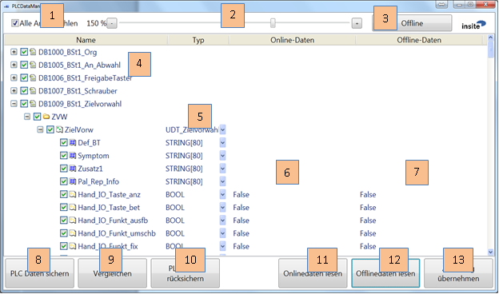
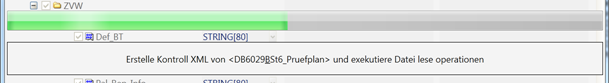
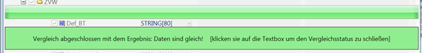
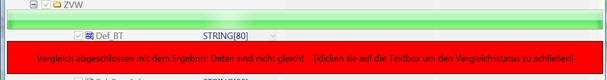
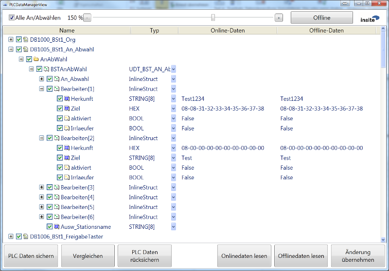
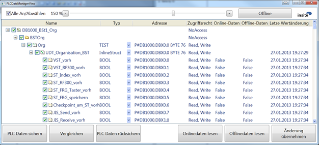
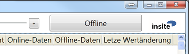

<h1>PLCDataManager</h1>


---  
#Introduction#

PLCDataManager is a software application that one one hand makes it possible to backup, restore and compare data modules of a PLC to or from an XML file, while on the other hand, the online/offline data can also be visualized and changed via structured views. The OPC, ODK and LibNoDave interfaces can be used for communication with the PLC.

---  
##Purpose and Objective##

Creation of module backups so that they can be reloaded again if necessary.

---  
##Definitions, Acronyms, Abbreviations##

*  **PLC:** Programmable Logic Controller
*  **SPS:** Speicher Programmierbare Steuerung
*  **LibNoDave:** Free library for the communication with a PLC.
*  **ODK:** Simatic WinAC Open Development Kit
*  **DDF:** Data definition file, a file that describes the structure and mapping of data, in our case data from the PLC. A DDF may also contain a certain snapshot of the data.
*  **Mapping:** a variable is mapped to a defined data area. 
*  **UC:** User Control 


---  
#General Description#

The special features and setting options of the software are described below. 

---  
##System Environment##

The software is written with C&#35; Visual Studio 2010 for the Target framework .NET 4.0. 


 .NET 4.5 is not used since it does not guarantee any compatibility with XP.

---  
##System Start##

When starting the application, all information is read from a XML configuration file.
  

An existing configuration file named "PLCDataManagerConfig.xml" in the application directory is detected and loaded by PLCDataManager. If you would like to use other configuration files, you can supply a different configuration file name via the command line when starting the PLCDataManager. 

---  
###Command Line Parameters###


<table><tr><th>Short </th><th> Long </th><th> Type </th><th> Default value </th><th> Description</th></tr>
<tr><th>name </th><th> name </th><th>    </th><th>    </th><th>   </th></tr>
<tr><td>f </td><td> file </td><td> Parameter </td><td> PLCDataManager </td><td>Configuration file</td></tr>
<tr><td>   </td><td>    </td><td>    </td><td> Config.xml </td><td>    </td></tr>
<tr><td>c </td><td> compare </td><td> Switch </td><td>  </td><td> Automatic comparison</td></tr>
<tr><td>s </td><td> save </td><td> Switch </td><td>  </td><td> Automatic save</td></tr>
<tr><td>r </td><td> restore </td><td> Switch </td><td>  </td><td> Automatic restore</td></tr>
<tr><td>v </td><td> visu </td><td> Switch </td><td>  </td><td> Displaying visualisation</td></tr>
<tr><td>   </td><td>    </td><td>    </td><td>    </td><td> (only in conjunction with c,s,r)</td></tr>
</table>


  

Example:
  

<table>
 <tr><th>Automatic comparison: </th><td> PLCDataManager.exe –f"C:\PLCDataManager.xml" –c</td></tr>			
 <tr><th>Automatic backup: </th><td> PLCDataManager.exe –f"C:\PLCDataManager.xml" –s</td></tr>
 <tr><th>Automatic backup </th><td> PLCDataManager.exe –f"C:\PLCDataManager.xml" –s -v</td></tr>
 <tr><th>with visualization: </th><td>   </td></tr>
</table>


---  
###Automatic Mode###

These parameters enable executing the application in automatic mode. The c, s and r switches are not allowed simultaneously. There is, however, a prioritization if all three are specified:
  

<table><tr><th>Priority </th><th> Action</th></tr>
<tr><td>1 </td><td> Restore</td></tr>
<tr><td>2 </td><td> Save</td></tr>
<tr><td>3 </td><td> Compare</td></tr>
</table>


  

The automatic comparison has a special feature: If the comparison should fail (NOK), a specific bit in a freely definable data word is set in the PLC (see "PLC Interface"). This bit is reset (OK) if a further automatic comparison run or manually triggered comparison no longer results in any differences.

---  
###PLC-triggered Mode###

A backup can also be initiated by the PLC. A special interface has to be supplied for this purpose. Furthermore, the files that are backed-up by a PLC-trigger can be different from the ones used in manual or automatic mode. See below for more details.

---  
##Data Handling##

The data is saved in a data definition file.
  


 If the underlying structure of the data definitions changes, then the old backup file must be deleted before it is possible to create a new backup. Otherwise, the old structure applies!

---  
#User Interface#

Apart from the normal control elements, the user interface includes the IDATUC that is responsible for displaying the structures. The individual sections of the interface are described in detail below.

---  
##Control Elements##




  

<table>
 <tr><th>[1] </th><td colspan="2">Select and deselect</td></tr>
 <tr><th>[2] </th><td colspan="2">Set the zoom factor for the entire application</td></tr>
 <tr><th>[3] </th><td colspan="2">Activate and deactivate the online mode (for details see Online Mode)</td></tr>
 <tr><th>[4] </th><td colspan="2">The following data is displayed in the Name column:</td></tr>
 <tr><th>   </th><td> Level1: </td><td> Name of the data definition file</td></tr>
 <tr><th>   </th><td> Level2: </td><td> Name of the mappings of the data definition file</td></tr>
 <tr><th>   </th><td> Level3-Level[X-1]: </td><td> Name of the data structure</td></tr>
 <tr><th>   </th><td> Level[x]: </td><td> Name of the variable</td></tr>
 <tr><th>   </th><td colspan="2">Every single object can be activated or deactivated by the checkbox</td></tr>
 <tr><th>   </th><td colspan="2">If the character [&#42;] is displayed after the name of the file definition,</td></tr>
 <tr><th>   </th><td colspan="2">this item is also registered for the PLC-triggered-backup</td></tr>
 <tr><th>[5] </th><td colspan="2">In this column the data type / name of the data structure is displayed</td></tr>
 <tr><th>   </th><td colspan="2">(here it is also possible to switch over for displaying the offset in</td></tr>
 <tr><th>   </th><td colspan="2">binary or hexadecimal format)</td></tr>
 <tr><th>[6] </th><td colspan="2">In this column the current value in the PLC is displayed</td></tr>
 <tr><th>[7] </th><td colspan="2">In this column the value that is stored in the last backup is displayed</td></tr>
 <tr><th>   </th><td colspan="2">(this column can also be edited)</td></tr>
 <tr><th>[8] </th><td colspan="2">Start of the backup run from the PLC to the file</td></tr>
 <tr><th>[9] </th><td colspan="2">Start of the comparison run</td></tr>
 <tr><th>[10] </th><td colspan="2">Start of the restore run from the file to the PLC</td></tr>
 <tr><th>[11] </th><td colspan="2">Read the data from the PLC and display the data in the user interface</td></tr>
 <tr><th>   </th><td colspan="2">only the visible variables are read here)</td></tr>
 <tr><th>[12] </th><td colspan="2">Read the data from the file and display the data in the user interface</td></tr>
 <tr><th>   </th><td colspan="2">(only the visible variables are read here)</td></tr>
 <tr><th>[13] </th><td colspan="2">Writes the changes that were made in column [7] to the PLC</td></tr>
</table>


---  
##Progress Displays and Feedbacks##

When executing an action, the following control elements are displayed.  




  

A positive feedback during a comparison turns the TextBox green. The control elements first disappear after clicking on the TextBox.  




  

A negative feedback during a comparison, or an error, turns the TextBox red. The control elements first disappear after clicking on the TextBox.  



  

---  
##Structure Display and Data Manipulation##

The item for displaying and manipulating the structure is the core of this application and is also located at its centre. This control element maps the structures existing in the PLC. Hence, you can view, compare or change the current PLC data as well as the backed-up data.
  

Thanks to this type of data processing, a "Byte-Bit-Offset" (as common in the PLC-world) no longer has to be used, nor do the values have to be converted. It is also no longer necessary to know the details of all data types, such as the length information contained in the first two bits of a string, in order to manipulate them. This element does this by itself. If, however, it is important for you to see the addresses or the hexadecimal or binary values, this is possible, too. The representation of the values can easily be switched over using the "Type" column and the addresses can be displayed by activating the "Address" column (the addresses are displayed in pointer format).
  




---  
###Possible Columns###

It is also possible to display other columns (for details on how to do this, please see the chapter [Configuration](#Configuration)).  

This figure shows the possible columns:
  



  

<table><tr><th>Additional column </th><th> Description</th></tr>
<tr><td>Address </td><td> This column displays the address of the variables in</td></tr>
<tr><td>   </td><td> pointer format.</td></tr>
<tr><td>Access right </td><td> The access right indicates whether the variable can be</td></tr>
<tr><td>   </td><td> read or written. This is parametrized in the mappings</td></tr>
<tr><td>   </td><td> with Write and Read operations.</td></tr>
<tr><td>Last value change </td><td> Here, the timestamp is displayed when the last update</td></tr>
<tr><td>   </td><td> of the variable was performed.</td></tr>
<tr><td>   </td><td> (Last read operation of the UC) </td></tr>
</table>


---  
###Online Mode###




  

With this button it is possible to activate an online mode and to deactivate it again. In the online operating mode, all variables currently visible in the structure display are updated cyclically with the current data in the PLC.

---  
#Configuration#

<a name="Configuration"></a>
The configuration of the application is divided into two files. The first file (called "PLCDataManager.exe.config") contains the settings for the user interface, whereas the "PLCDataManager.xml"-file contains the settings for the application. 

---  
##Configuration of the User Interface (UI)##

  
```html
<?xml version="1.0"?>
<configuration>
<configSections>
    <sectionGroup name="applicationSettings" 
                  type="System.Configuration.ApplicationSettingsGroup, System,
                  Version=4.0.0.0, Culture=neutral, PublicKeyToken=b77a5c561934e089" >
        <section name="PLCDataManager.Properties.Settings" 
                 type="System.Configuration.ClientSettingsSection, System,
                 Version=4.0.0.0, Culture=neutral, PublicKeyToken=b77a5c561934e089"
                 requirePermission="false" />
    </sectionGroup>
</configSections>
<startup>
<supportedRuntime version="v4.0" sku=".NETFramework,Version=v4.0"/>
</startup>
<applicationSettings>
   <PLCDataManager.Properties.Settings>
            <setting name="DefaultFontSize" serializeAs="String">
                <value>12</value>
            </setting>
            <setting name="Zoom" serializeAs="String">
                <value>150</value>
            </setting>
            <setting name="ShowAccessRightColumn" serializeAs="String">
                <value>False</value>
            </setting>
            <setting name="ShowLastValueChangeColumn" serializeAs="String">
                <value>False</value>
            </setting>
            <setting name="ShowAddressColumn" serializeAs="String">
                <value>True</value>
            </setting>
        </PLCDataManager.Properties.Settings>
    </applicationSettings>
</configuration>
```  


<table><tr><th>Variable </th><th> Description</th></tr>
<tr><td>DefaultFontSize </td><td> Sets the default font size.</td></tr>
<tr><td>Zoom </td><td> Sets the initial zoom factor on start up.</td></tr>
<tr><td>ShowAccessRightColumn </td><td> If "True", the "Access right" column is shown.</td></tr>
<tr><td>ShowLastValueChangeColumn </td><td> If "True", the "Last value change" column is shown.</td></tr>
<tr><td>ShowAddressColumn </td><td> If "True", the "Address" column is shown.</td></tr>
</table>


---  
##Configuration of the Application##

  
```html
<?xml version="1.0" encoding="UTF-8"?>
<Setup>
    <Assemblies>
        <Assembly path="ResolverImpl.dll"/>
        <Assembly path="OPCReaderWriter.dll"/>
        <Assembly path="DataDefReaderWriter.dll"/>
        <Assembly path="S7Converter.dll"/>
        <Assembly path="PLCDataManager.Logic.dll"/>
        <Assembly path="ComparatorUC.dll"/>
    </Assemblies>
    <Instances>
        <Resolvers>
            <Resolver name="Resolver"/>
        </Resolvers>
        <Converters>
            <Converter name="S7Converter"/>
        </Converters>
        <Comparators>
            <Comparator name="UCComparator" />
        </Comparators>
        <BinaryReaderWriters>
            <BinaryReaderWriter name="OPCReaderWriter">
                <ServerName>OPC.SimaticNet</ServerName>
                <ProtocolName>S7</ProtocolName>
                <ConnectionName>RTX</ConnectionName>
                <ItemSyntax>SimaticNet</ItemSyntax>
            </BinaryReaderWriter>
            <BinaryReaderWriter name="DataDefReaderWriter">
<File><![CDATA[><..\Dat\Konfig\PLCDataManagerConfig.xml//Setup/Instances/
    PLCDataManagers/PLCDataManager[@name='PLCDataManager']/DefPaths;..\Dat\Konfig\
    PLCDataManagerConfig.xml//Setup/Instances/PLCDataManagers/
    PLCDataManager[@name='PLCDataManager']/DefPathsAuto]]>
</File>
<OutPath><![CDATA[><..\Dat\Konfig\PLCDataManagerConfig.xml//Setup/Instances/
PLCDataManagers/PLCDataManager[@name='PLCDataManager']/OutPaths]]>
</OutPath>
            </BinaryReaderWriter>
        </BinaryReaderWriters>
        <PLCDataManagers>
            <PLCDataManager name="PLCDataManager">
                <DefPaths><![CDATA[..\Dat\Konfig\Normal]]></DefPaths>
                <DefPathsAuto><![CDATA[..\Dat\Konfig\Auto]]></DefPathsAuto>
                <OutPaths><![CDATA[..\Dat\DBSave]]></OutPaths>
                <InterfaceDef><![CDATA[..\Dat\Konfig\Interface\Interface.xml]]>
                </InterfaceDef>
                <SaveCommand>PLCinterface.Steuern.Sichern</SaveCommand>
                <CompareState>PLCinterface.status.Vergleich_io</CompareState>
                <SaveFinished>PLCinterface.status.Sichern_beendet</SaveFinished>
                <OptimizeMemUsage>False</OptimizeMemUsage>
                <SaveFinishedBatchJob>D:\Programme\IDat\_PcDm_CopyToServer.bat 
                                      $OutPaths</SaveFinishedBatchJob>
                <BatchJobTimeout>5000</BatchJobTimeout>                                                                
                <BatchJobCancelled>PLCinterface.status.BatchJobCancelled
                </BatchJobCancelled>
                <Logger>
                  <log4net>
                            ...
                  </log4net>
                </Logger>
            </PLCDataManager>
        </PLCDataManagers>
    </Instances>
</Setup>
```  


---  
###Assemblies###

In this section, all required assemblies are specified.

---  
###Instances###

In this section, all required instances of the defined assemblies are configured.

---  
####Resolvers####
   

In this section, the Resolver is parametrized. The default configuration is sufficient for this application, you should not change it.

---  
####Converters####
   

In this section, the Converter is parametrized. The default configuration of the S7 converter is sufficient for this application, you should not change it.

---  
####Comparators####
   

In this section, the Comparators are parametrized. The default configuration of the UC Comparator is sufficient for this application, you should not change it.

---  
####BinaryReaderWriters####
   

In this section, the BinaryReaderWriters are parametrized. Two instances are required for this application.
  

The first **BinaryReaderWriter** must be configured for online access. You can select between *OPC*, *ODK*, *Snap7* and *LibNoDave* as the communication path to the PLC. For *ODK* and *LibNoDave* the default configuration is sufficient in most cases, for *OPC* please see an example at the beginning of this chapter (for further details, please refer to the documentation of the relevant BinaryReaderWriter).
  

The second BinaryReaderWriter **"DataDefReaderWriter"** is configured for offline access.  


 You must not change any setting for this instance, since the application may not work correctly afterwards! Furthermore, these settings are deprecated and updated versions of this application will use an internal, hard-coded instance for offline access.

---  
####PLCDataManagers####
   

---  
#####PLCDataManager#####
   

<a name="PLCDataManager"></a>
In this section, the paths and commands of the application are declared.


<table><tr><th>Variable </th><th> Description</th></tr>
<tr><td>DefPaths </td><td> Specifies the first location(s) of data definition files</td></tr>
<tr><td>   </td><td> (DDF) for manual and auto backup. The files in this</td></tr>
<tr><td>   </td><td> location are ignored by the PLC-triggered backup!</td></tr>
<tr><td>   </td><td> There are several options here:</td></tr>
<tr><td>   </td><td> 1.) Specification of the file names separated by a semicolon</td></tr>
<tr><td>   </td><td> 2.) Specification of paths to one or more data definition files</td></tr>
<tr><td>   </td><td> separated by a semicolon</td></tr>
<tr><td>DefPathsPLCTriggered </td><td> Specifies the second location(s) of DDFs for manual and</td></tr>
<tr><td>   </td><td> auto backup and it specifies the location(s) of the DDFs</td></tr>
<tr><td>   </td><td> that are used for the PLC-triggered backup.</td></tr>
<tr><td>   </td><td> Attention: A DDF must not be specified twice,</td></tr>
<tr><td>   </td><td> also in respect to the settings in DefPaths!</td></tr>
<tr><td>   </td><td> (the Options are the same as above)</td></tr>
<tr><td>OutPaths </td><td> The path where the backups are stored is specified here</td></tr>
<tr><td>InterfaceDef </td><td> The path to a DDF that can serve as a PLC interface is</td></tr>
<tr><td>   </td><td> specified here.</td></tr>
<tr><td>   </td><td> (If nothing is specified, the PLC interface is disabled)</td></tr>
<tr><td>SaveCommand </td><td> The PLC-variable responsible for starting a backup is</td></tr>
<tr><td></td><td> specified here. Each time this variable changes from</td></tr>
<tr><td></td><td> *False* to *True*, the backup is triggered</td></tr>
<tr><td>CompareState </td><td> The PLC-variable that gets written to signal the</td></tr>
<tr><td></td><td> comparison result to the PLC is specified here</td></tr>
<tr><td></td><td> (*True*=Unequal, *False*=Equal)</td></tr>
<tr><td>SaveFinished </td><td> he PLC-variable that gets set from PLCDataManager</td></tr>
<tr><td></td><td> after the completion of a PLC-triggered backup is</td></tr>
<tr><td></td><td> specified here (this bit must be reset by the PLC</td></tr>
<tr><td></td><td> before triggering new backup cycle)</td></tr>
<tr><td>OptimizeMemUsage </td><td> This parameter ensures that the memory usage is reduced.</td></tr>
<tr><td></td><td> Attention: Enabling this may have a negative impact on</td></tr>
<tr><td></td><td> the application performance</td></tr>
<tr><td>SaveFinishedBatchJob </td><td> A path to an executable file can be specified here. This</td></tr>
<tr><td></td><td> file is executed after the backup is completed. This function,</td></tr>
<tr><td></td><td> for example, can be used to move the files to a backup server</td></tr>
<tr><td>BatchJobTimeOut </td><td> A timeout for the completion of the batch job can be specified</td></tr>
<tr><td></td><td> here. If the job times out, it is cancelled. 0 = "no timeout"</td></tr>
<tr><td>BatchJobCancelled </td><td>If the batch job returns an error code, this bit is set.</td></tr>
<tr><td></td><td> It is reset after the next successful run.</td></tr>
<tr><td>Logger </td><td> log4Net (open source logging system) is parameterised here.</td></tr>
<tr><td></td><td> It is recommended to leave it as it is, since it determines</td></tr>
<tr><td></td><td> the location, size and content of the log files used for diag-</td></tr>
<tr><td></td><td> nosing purposes. If you’re interested, see the web for details.</td></tr>
</table>


---  
#Data Definition File#

  
```html
<?xml version="1.0" encoding="utf-8"?>
<DataDef Endianness="Host-Endianess" Encoding="Base16"
         xmlns:xsi="http://www.w3.org/2001/XMLSchema-instance"
         xmlns="http://www.insite-gmbh.de/IDAT/DataDef"
         xsi:schemaLocation="http://www.insite-gmbh.de/IDAT/DataDef
                             TypeDefinition/DataDef.xsd">
  <!-- Structs are the userdefined types -->
  <Types>
    <Struct name="DB_Optionen_Allgemein">
      <Var name="Rechnername" type="STRING" length="16" />
      <Var name="Ziel_BST1" type="STRING" length="8" />
      <Var name="Ziel_BST2" type="STRING" length="8" />
      <Var name="Ziel_BST3" type="STRING" length="8" />
      <Var name="Ziel_BST4" type="STRING" length="8" />
      <Var name="Ziel_BST5" type="STRING" length="8" />
      <Var name="Ziel_BST6" type="STRING" length="8" />
      <Var name="BST1_vorh" type="BOOL" />
      <Var name="BST2_vorh" type="BOOL" />
      <Var name="BST3_vorh" type="BOOL" />
      <Var name="BST4_vorh" type="BOOL" />
      <Var name="BST5_vorh" type="BOOL" />
      <Var name="BST6_vorh" type="BOOL" />
      <Var name="Repaplatz" type="BOOL" />
      <Var name="HAP_NOT_Aus_vorhanden" type="BOOL" />
      <Var name="Ausw_WT_zu_PalRepa_BST1" type="BOOL" />
      <Var name="Fliessmontage" type="BOOL" />
      <Var name="Pneumatik_vorhanden" type="BOOL" />
      <Struct name="AP" countItems="6">
        <Var name="virtuell" type="BOOL" />
        <Var name="ApVisu_Vorh" type="BOOL" />
        <Var name="AP_IST_DT" type="BOOL" />
        <Var name="zugeordnet_zu" type="INT" />
      </Struct>
      <Var name="Konfig_Ordner_Pfad" type="STRING" length="80" />
      <Var name="Safety_Checksum" type="DWORD" />
      <Var name="SHUT_DOWN_Verz_Zeit" type="INT" />
      <Var name="Shut_down_abgew" type="BOOL" />
      <Var name="Shut_Down_OPC2USV" type="BOOL" />
    </Struct>
  </Types>
  <!-- declare the Values you want to use -->
  <Vars>
    <Var name="Options" type="DB_Optionen_Allgemein" />
  </Vars>
  <!-- define the mapping and the operations on the values-->
  <Mappings>
    <Mapping name="Opt" var="Options" source="OPCReaderWriter" selector="251"
            offset="0" type="BinaryFile" active="true" >
      <Filters>
        <Filter var="Safety_Checksum" />
      </Filters>
      <Operations>
        <Read/>
        <Write/>
      </Operations>
    </Mapping>
  </Mappings>
</DataDef>
```  


---  
##Types##

This section is filled by the Tool AWLConverter and contains the definitions of the data blocks. For further details, please refer to the documentation for AWLConverter.

---  
##Vars##

In this section, variables are declared that are elements of the element type declared in Types. These variables can then be used in the mappings.

---  
##Mappings##

Variables can be mapped to different data areas and read and write operations can then be executed via the mappings. Additionally, filters can be declared, too. These filters only apply to write operations. A filtered variable is not rewritten to the PLC.

---  
#PLC-Interface#

The data modules that can be backed-up by a PLC-trigger-bit must be parametrized in the configuration (["DefPathsPLCTriggered"](#PLCDataManager)). Furthermore, any bit will serve the purpose of an interface to the PLC in case of an automatic comparison. The data area must be declared via a data definition and the bits required must be specified in the configuration.
  

**Currently supported bits are:**
  

**Control Bits:**
  

<table>
 <tr><th>SaveCommand </th><td> Backup request of the data definitions that are defined via the</td></tr>
 <tr><th>   </th><td> "DefPathsPLCTriggered" (formerly "DefPathsAuto") setting.</td></tr>
</table>

  


Example of a file definition for the PLC interfacec:  

  
```html
<?xml version="1.0" encoding="utf-8"?>
<DataDef Endianness="Host-Endianess" Encoding="Base16"
         xmlns:xsi="http://www.w3.org/2001/XMLSchema-instance"
         xmlns="http://www.insite-gmbh.de/IDAT/DataDef"
         xsi:schemaLocation="http://www.insite-gmbh.de/IDAT/DataDef
         TypeDefinition/DataDef.xsd">
  <!-- Structs are the userdefined types -->
  <Types>
    <Struct name="DB_parasave">
      <Struct name="status">
        <Var name="Vergleich_io" type="BOOL" />
        <Var name="Sichern_beendet" type="BOOL" />
        <Var name="BatchJobCancelled" type="BOOL" />
      </Struct>
      <Struct name="Steuern">
        <Var name="Res_0" type="BOOL" />
        <Var name="Sichern" type="BOOL" />
        <Var name="res" type="BOOL" />
      </Struct>
    </Struct>
  </Types>
  <!-- declare the Values you want to use -->
  <Vars>
    <Var name="PLCinterface" type="DB_parasave" />
  </Vars>
  <!-- define the mapping and the operations on the values-->
  <Mappings>
    <Mapping name="interface" var="PLCinterface" source="OPCReaderWriter"
             selector="220" type="BinaryFile">
      <Operations>
        <Read/>
        <Write/>
      </Operations>
    </Mapping>
  </Mappings>
</DataDef>
```  

Associated entries in the configuration:
  
```html
<SaveCommand>PLCinterface.Steuern.Sichern</SaveCommand>
<CompareState>PLCinterface.status.Vergleich_io</CompareState>
<SaveFinished>PLCinterface.status.Sichern_beendet</SaveFinished>
<BatchJobCancelled>PLCinterface.status.BatchJobCancelled</BatchJobCancelled>
```  


---  
#Installation#

A successful installation requires that 

  1.   Microsoft .NET Framework 4.0 Servicepack 1 
  2.   Microsoft Visual C++ 2010 Redistributable Package
  3.   WIN AC RTX 2009 or higher for using ODK

are installed and available on the destination system under Windows.
  

PLCDataManager includes the following EXE and DLLs (date January 2013):
  

<table><tr><th>Assembly </th><th> Manufacturer</th></tr>
<tr><td>CommandLine.dll </td><td>   </td></tr>
<tr><td>ComparatorUC.dll </td><td> insite GmbH</td></tr>
<tr><td>DataDef.dll </td><td> insite GmbH</td></tr>
<tr><td>DataDefReaderWriter.dll </td><td> insite GmbH</td></tr>
<tr><td>IDATUC.ViewModel.dll </td><td> insite GmbH</td></tr>
<tr><td>IDATUC.ViewModel.resources.dll </td><td> insite GmbH</td></tr>
<tr><td>IDATUC.WPFView.dll </td><td> insite GmbH</td></tr>
<tr><td>Insite.Controls.dll </td><td> insite GmbH</td></tr>
<tr><td>Interfaces.dll </td><td> insite GmbH</td></tr>
<tr><td>Ioc.dll </td><td> insite GmbH</td></tr>
<tr><td>libnodave.dll </td><td>   </td></tr>
<tr><td>libnodave.net.dll </td><td>   </td></tr>
<tr><td>LibNoDaveReaderWriter.dll </td><td> insite GmbH</td></tr>
<tr><td>log4net.dll </td><td> The Apache Software Foundation</td></tr>
<tr><td>ODKCCXLib.dll </td><td> insite GmbH</td></tr>
<tr><td>ODKCCXLib&#95;CS.dll </td><td> insite GmbH</td></tr>
<tr><td>ODKCCXReaderWriter.dll </td><td> insite GmbH</td></tr>
<tr><td>OPCReaderWriter.dll </td><td> insite GmbH</td></tr>
<tr><td>PLCDataManager.exe </td><td> insite GmbH</td></tr>
<tr><td>PLCDataManager.Logic.dll </td><td> insite GmbH</td></tr>
<tr><td>PLCDataManager.resources.dll </td><td> insite GmbH</td></tr>
<tr><td>PLCHelpers.dll </td><td> insite GmbH</td></tr>
<tr><td>PLCItemAccessor.dll </td><td> insite GmbH</td></tr>
<tr><td>PLCOPCAccessor.dll </td><td> insite GmbH</td></tr>
<tr><td>PLCOPCdotNETLib.dll </td><td> VISCOM</td></tr>
<tr><td>ResolverImpl.dll </td><td> insite GmbH</td></tr>
<tr><td>S7Converter.dll </td><td> insite GmbH</td></tr>
<tr><td>SMHeapManager.dll </td><td> insite GmbH</td></tr>
<tr><td>ViewModelBase.dll </td><td> insite GmbH</td></tr>
<tr><td>XPathDataReaderWriter.dll </td><td> insite GmbH</td></tr>
</table>


  

These files can be copied to any directory and the application can then be started from there.


---  
##Files generated during runtime##

This application generates files independently. Here are the meanings:  

  1.   **Log files:** files configured for log4net
  2.   **Out files:** contain the backed-up data
  3.   **PLCDataManager.trc:** created when an exception was thrown that was not caught

---  
#Document history#


<table><tr><th>Author </th><th> Date </th><th> Remarks</th></tr>
<tr><td>Benjamin Prömmer </td><td> January 2013 </td><td> Creation</td></tr>
<tr><td>Ralf Gedrat </td><td> January 2013 </td><td> Brief editing</td></tr>
<tr><td>Benjamin Prömmer </td><td> February 2013 </td><td> Behaviour of the PLC interface extended</td></tr>
<tr><td>Benjamin Prömmer </td><td> February 2013 </td><td> New OptimizeMemUsage parameter extended</td></tr>
<tr><td>Benjamin Prömmer </td><td> August 2013 </td><td> New parameter for Batchjob extended</td></tr>
<tr><td>Benjamin Prömmer </td><td> December 2014 </td><td> Documentation reference changed from</td></tr>
<tr><td>   </td><td>    </td><td> AWLXMLConverter to AWLConverter</td></tr>
<tr><td>Benjamin Prömmer </td><td> 2015-09-16 </td><td> Bug fixes, enhancements:</td></tr>
<tr><td>   </td><td>    </td><td> Automatic cmd without -v is now possible</td></tr>
<tr><td>   </td><td>    </td><td> If a DB does not exist, comparison result</td></tr>
<tr><td>   </td><td>    </td><td> will be displayed in red</td></tr>
<tr><td>   </td><td>    </td><td> Column widths are stored for each user after</td></tr>
<tr><td>   </td><td>    </td><td> shutting down the application</td></tr>
<tr><td>   </td><td>    </td><td> A context menu was added that allows hiding</td></tr>
<tr><td>   </td><td>    </td><td> of certain columns</td></tr>
<tr><td>   </td><td>    </td><td> Filtered data is displayed with a grey text colour</td></tr>
<tr><td>   </td><td>    </td><td> Failed comparisons are displayed with</td></tr>
<tr><td>   </td><td>    </td><td> a red text colour</td></tr>
<tr><td>   </td><td>    </td><td> In online-mode, online and offline</td></tr>
<tr><td>   </td><td>    </td><td> data are now automatically refreshed</td></tr>
<tr><td>Karsten Gorkow </td><td> 2016-01-11 </td><td> Changed some misleading information</td></tr>
<tr><td>Karsten Gorkow </td><td> 2016-01-12 </td><td> Removed errors and unnecessary details</td></tr>
<tr><td>Karsten Gorkow </td><td> 2016-01-14 </td><td> Minor changes and additions</td></tr>
</table>


<table>
 <tr><th></td></tr>
</table>