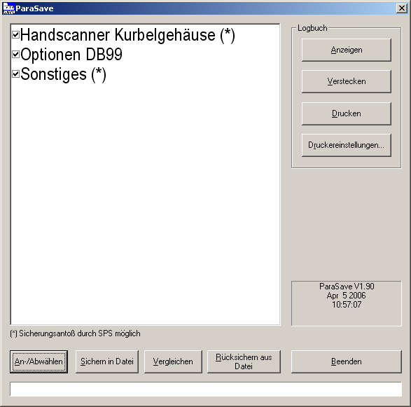

<h1>ParaSave</h1>
  

**Data backup tool for PLC data blocks**  

---  
#General Information#

ParaSave is used to backup, restore and compare data blocks of a PLC in/of CSV files on a PC. OPC is used for communication between PLC and PC. The parameterisation of ParaSave mostly takes place via an ini file (see Appendix). The individual functions can be selected from a Windows user interface or started "unsupervised" via command line parameters (s. Automatic mode).

---  
#User Interface#

---  
##Manual Mode##

  

  

In "manual" mode ParaSave has the above user interface. The data areas that can be backed-up and restored to/from the PLC are displayed in a list. Individual data areas can be activated/deactivated ("option checkmark" next to the area name). The actions that can be triggered using the buttons under the data area list always refer to all selected data areas. It is possible to control which areas are displayed in the list using the entries in the ini file (see [Appendix](#settings_in_ini_file)). The buttons in the "logbook" frame in the upper right corner allows you to display, hide and print out the application logbook. The backup procedure for the areas marked with (&#42;) can be triggered by the PLC. A bit is provided in the control word for this purpose. If this is set, ParaSave performs the backup procedure automatically for these areas. The individual areas are set via the configuration files (see below).

---  
##Automatic Mode##

No user interface appears in "automatic mode" by default. Depending on the command line parameters, ParaSave executes the required function and then terminates again automatically. Automatic backup, comparison and restore is currently supported. In the logbook, corresponding entries are performed in automatic mode, too. The following parameters are supported:
  

<table>
 <tr><th>"ParaSave –c" </th><td> Automatic compare (c = "compare")</td></tr>
 <tr><th>"ParaSave –s" </th><td> Automatic save (s = "save")</td></tr>
 <tr><th>"ParaSave –r" </th><td> Automatic restore (r = "restore")</td></tr>
</table>

  

If multiple parameters are specified, the last parameter has priority.
  

The automatic comparison has a special feature: If the comparison should fail (NOK), a specific bit in a freely definable data word is set in the PLC (see "PLC Interface"). This bit is reset (OK) if a further automatic comparison run or manually triggered comparison across all data areas no longer results in any differences.
  

Using the additional '-v' parameter, the user interface can be made visible during the course of the function even in automatic mode.

---  
#PLC Interface#

The data blocks that can be saved by the PLC and restored again in the PLC can be set in data block, offset and length via the INI file (see Appendix). Furthermore, a bit within a status word will serve as an interface to the PLC in case of an automatic comparison. The data block and offset of the control word and status word can also be set via the INI file. 

---  
##Status Word##

<table>
 <tr><th>Bit 0: </th><td> If set, then the last comparison NOK</td></tr>
 <tr><th>Bit 1: </th><td> Backup request executed by PLC</td></tr>
 <tr><th>Bit 2-15: </th><td> free</td></tr>
</table>

The PLC must reset bit 0 after the NOK case has been detected.

---  
##Control Word##

<table>
 <tr><th>Bit 0: </th><td> not used</td></tr>
 <tr><th>Bit 1: </th><td> Backup request of the blocks marked with "SichernDurchSPS"</td></tr>
 <tr><th>Bit 2-15: </th><td> free</td></tr>
</table>

---  
#Appendix#

---  
##Registry Entries##

<table><tr><th>Key: </th><th> HKEY_LOCAL_MACHINE\Software\insite GmbH\ParaSave\Setting</th></tr>
<tr><td>Character string: </td><td> ConfigFile</td></tr>
<tr><td>Values:	 </td><td> Name of the configuration file. The default value is </td></tr>
<tr><td>   </td><td> F:\DH\INSITE\ParaSave.INI.</td></tr>
</table>

---  
##Settings in INI file##

---  
###Section [SPS]###

*  **OPCServerName**		
  *  String	
  *  Name of the OPC server. This name corresponds to the COM object and is used to initialise the server	
  *  Default: "OPCServer.WinAC"	

*  **OPCPartnerName**		
  *  String	
  *  Name of the connection partner when using the SimaticNet OPC server	

*  **OPCConnectionName**		
  *  String	
  *  Name of the connection when using the SimaticNet OPC server	

*  **OPCServerPollZyklus**		
  *  Integer	
  *  Poll cycle of the OPC server	
  *  Default: 500	

*  **OPCMaxBlockSize**		
  *  Integer	
  *  Maximum block size for data transmission via OPC. Any block that exceeds this value is divided automatically into several read/write tasks. A "0" means an unlimited block size. 	
  *  Default: 0	

*  **AccessMode**		
  *  String	
  *  Access mode on PLC. Possible values "OPC", "OPCSinumeric" or "OPCSimaticNet".	
  *  Default: "OPC"	

*  **HandshakeTimeout**		
  *  Integer	
  *  Defines the period of time after which a timeout is detected when acknowledgement signals are exchanged with the PLC. If 0, no timeout is triggered – the application goes into an endless loop until the required signal of the PLC is set.	
  *  Time in milliseconds.	
  *  Default: 5000	

*  **HandshakeSleepTime**		
  *  Integer	
  *  Specifies how long the application is paused before an acknowledgement signal is polled once again	
  *  Time in milliseconds.	
  *  Default: 100	

*  **StatusWordDB**		
  *  Integer	
  *  Number of the data block with the status word	
  *  Default: 100	

*  **StatusWortOffset**		
  *  Integer	
  *  Offset of the status word within the DB	
  *  Default: 0	

*  **ControlWordDB**		
  *  Integer	
  *  Number of the data block with the control word	
  *  Default: 100	

*  **ControlWordOffset**		
  *  Integer	
  *  Offset of the control word within the DB.	
  *  Default: 2	

---  
###Section [LOG]###

*   *  Integer	
  *  Number of log messages that are recorded.	
  *  Default: 1000	

---  
###Section [BLOCKS]###

This section contains the definition of the data areas. The following structure applies here:
  

*  &#35;&#60;Name in the data areas list&#62;;&#60;filename&#62;;&#60;BackupByPLC&#62;
*  &&#35;42;&#60;DB&#62;,&#60;Offset&#62;,&#60;Length&#62;[&#60;Filter&#62;[&#60;Filter&#62;[...]]]
*  [&&#35;42;&#60;DB&#62;,&#60;Offset&#62;,&#60;Length&#62;[&#60;Filter&#62;[&#60;Filter&#62;[...]]]]
*  [...]
*  ...

A backup of the data block by the PLC is possible (control word, bit 1) by the flag &#60;BackupByPLC&#62; (default false‚ true if "1").
The filter expressions are optional. More on filter definition below.
  

Example of the dialogue shown above:

*  **[BLOCKS]**
*  &#35;Hand scanner crankcase;C:\Temp\Backup1.txt;1		
  *  &#42;100,10,3	
  *  &#42;100,20,10	
  *  &#42;100,24,3	

*  &#35;Options DB99;C:\Temp\Backup2.txt		
  *  &#42;99,10,10	
  *  &#42;99,20,10	
  *  &#42;99,24,3	

*  &#35;Other;C:\Temp\Backup3.txt;1		
  *  &#42;99,8,4	
  *  &#42;99,20,10	
  *  &#42;99,16,5	

---  
##Using Filters##

Filter expressions can be applied to individual parts of a data area. The data area is then and'ed bit by bit (logical "and" operation) with the filter expression when comparing the dataset and when writing the file back to the PLC. Thus, it is possible to protect dynamic areas from being overwritten or from performing comparisons regardless of the current temporary data.
  

One or more filter expressions can be attached to a data area definition (see [Section [BLOCKS]](#section_blocks) in Ini file above).  

The syntax for a filter expression is as follows:
  

;&#60;Offset&#62;[:&#60;Length&#62;]=&#60;Filter value&#62;
  

with:
  

<table>
 <tr><th>&#60;Offset&#62; </th><td> word offset, relative to the start of the data area</td></tr>
 <tr><th>&#60;Length&#62; </th><td> Length of the filter in bytes</td></tr>
 <tr><th>&#60;Filter value&#62; </th><td> value of the filter as a word (2-byte value). </td></tr>
 <tr><th>   </th><td> Format: Decimal or with preceding "0x" Hexadecimal</td></tr>
</table>

The filter value always covers just 2 bytes (word length) which are applied repeatedly over &#60;length&#62; byte, i.e. word by word. A length specification with an odd number of bytes means that the last byte in the data area is and'ed with the high byte of the filter value.

---  
###Filter example 1 (comparing, filtered data)###

Imagine a data block defined like this: 
  

[BLOCKS]  

&#35;Hand scanner crankcase;C:\Temp\Backup1.txt;1  

&#42;100,20,10;2:2=0xF1F0;6:4=0
  

Two filter expressions are applied here:

  1.   starting at byte-offset 2 with a length of 2 bytes and a hex value of 0xF1F0
  2.   starting at byte-offset 6 with a length of 4 bytes and a value of 0

*all other bytes are unfiltered or "filtered with 0xFFFF"*
  

The current PLC data content of the 10-byte-block is
  

0xAA 0x99 0x8B 0x44 0x66 0x55 0x77 0x88 0x99 0xAA
  

and the backup file content of this 10-byte-block differs, it is
  

0xAA 0x99 0x83 0x4C 0x66 0x55 0x44 0x33 0x22 0x11  

  

When comparing the backed-up data to the current PLC data, the filters are applied to the
  

<table>
 <tr><th>PLCDATA: </th><td> 0xAA 0x99 0x8B 0x44 0x66 0x55 0x77 0x88 0x99 0xAA</td></tr>
 <tr><th>Filter expr.: </th><td> 0xFF 0xFF 0xF1 0xF0 0xFF 0xFF 0x00 0x00 0x00 0x00</td></tr>
 <tr><th>Comp. data 1: </th><td> 0xAA 0x99 0x81 0x40 0x66 0x55 0x00 0x00 0x00 0x00</td></tr>
</table>

  

and the
  

<table>
 <tr><th>FILEDATA: </th><td> 0xAA 0x99 0x83 0x4C 0x66 0x55 0x44 0x33 0x22 0x11</td></tr>
 <tr><th>Filter expr.: </th><td> 0xFF 0xFF 0xF1 0xF0 0xFF 0xFF 0x00 0x00 0x00 0x00</td></tr>
 <tr><th>Comp. data 2: </th><td> 0xAA 0x99 0x81 0x40 0x66 0x55 0x00 0x00 0x00 0x00</td></tr>
</table>

  

So after filtering both data blocks are considered to be equal. We could say, that the formula for the comparison is (PLCDATA AND FILTER) = (FILEDATE AND FILTER).

---  
###Filter example 2 (writing filtered data)###

When writing filtered data, things get a bit more complex and the following formula applies:
  

NEWPLCDATA = (PLCDATA AND NOT FILTER) OR (FILEDATA AND FILTER)
  

Imagine the same data block and the same filters as in the previous example
  

[BLOCKS]  

&#35;Hand scanner crankcase;C:\Temp\Backup1.txt;1  

&#42;100,20,10;2:2=0xF1F0;6:4=0
  

The current PLC data content of the 10-byte-block is (as before)
  

0xAA 0x99 0x8B 0x44 0x66 0x55 0x77 0x88 0x99 0xAA
  

and the backup file content of this 10-byte-block differs, it is 
  

0xDD 0xCC 0x83 0x4C 0x77 0x66 0x44 0x33 0x22 0x11
  

Before writing back the backed-up data, the PLC data is first read back and'ed with the negated filter (PLCDATA AND NOT FILTER): 
  

<table>
 <tr><th>PLCDATA: </th><td> 0xAA 0x99 0x8B 0x44 0x66 0x55 0x77 0x88 0x99 0xAA</td></tr>
 <tr><th>NOT filter: </th><td> 0x00 0x00 0x0E 0x0F 0x00 0x00 0xFF 0xFF 0xFF 0xFF</td></tr>
 <tr><th>Result 1: </th><td> 0x00 0x00 0x0A 0x04 0x00 0x00 0x77 0x88 0x99 0xAA</td></tr>
</table>

  

The backed-up data is and'ed with the filter (FILEDATA AND FILTER):
  

<table>
 <tr><th>FILEDATA: </th><td> 0xDD 0xCC 0x83 0x4C 0x77 0x66 0x44 0x33 0x22 0x11</td></tr>
 <tr><th>Filter expr.: </th><td> 0xFF 0xFF 0xF1 0xF0 0xFF 0xFF 0x00 0x00 0x00 0x00</td></tr>
 <tr><th>Result 2: </th><td> 0xDD 0xCC 0x81 0x40 0x77 0x66 0x00 0x00 0x00 0x00</td></tr>
</table>

  

Both results are finally or'ed and then written to the PLC:
  

<table>
 <tr><th>Result 1: </th><td> 0x00 0x00 0x0A 0x04 0x00 0x00 0x77 0x88 0x99 0xAA</td></tr>
 <tr><th>OR Result 2: </th><td> 0xDD 0xCC 0x81 0x40 0x77 0x66 0x00 0x00 0x00 0x00</td></tr>
 <tr><th>NEWPLCDATA: </th><td> 0xDD 0xCC 0x8B 0x44 0x77 0x66 0x77 0x88 0x99 0xAA</td></tr>
</table>

  

As you can see, the data that is filtered is not overwritten in the PLC. 