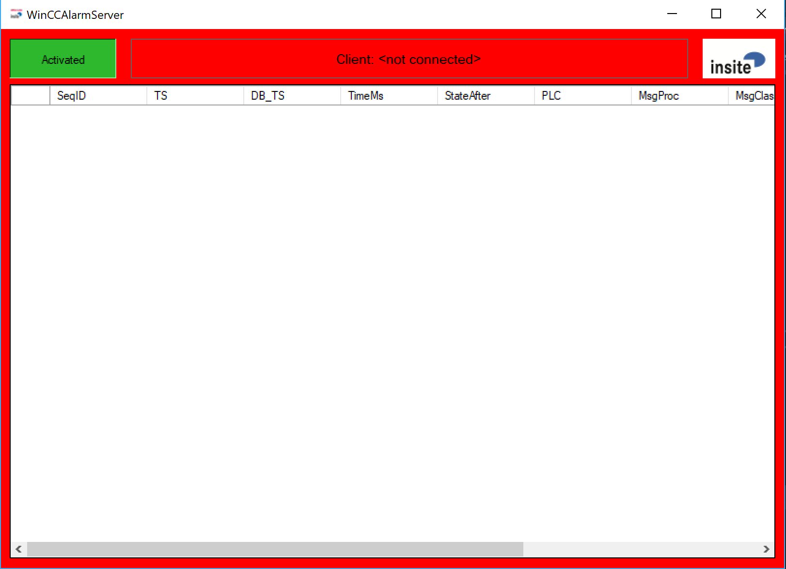

<h1>WinCCAlarmServer</h1>
  


**insite GmbH**


---  
#Overview#

---  
##General Information##

The program "WinCCAlarmServer" transmits the current state and progress of alarm states to a connected TCP/IP client. The source of the alarm data is a Message Archive table ("Meldearchiv") in a database on a Microsoft SQL server. By cyclically polling this database table the current status of the alarms registered there is determined, transformed into telegrams and forwarded to the client. Some entries in the table signal error states in the communication between the WinCC-Runtime environment and PLC or the Offline-Status of the WinCC-Runtime. These entries serve as a "marker", e.g. to implicitly terminate or generally ignore alarm states. The features for detecting such entries can be defined via the configuration file.

---  
##Preparation of the Microsoft SQL Server##

The Microsoft SQL Server Express can be used, for example, as a database. This can be obtained free of charge from Microsoft via the Internet.   

Before you can work with the WinCCAlarmServer, however, the SQL server must be patched by several SQL scripts after the initial installation. This patch ensures that the Message Archive will contain a column "SeqID" also after a new installation, which can guarantee the chronology of the registered events. The scripts are provided by Siemens and must be executed once (e.g. with the aid of the application "Microsoft SQL Server Management Studio Express" - part of the aforementioned Express package). 

---  
#Program Window#

The application window essentially represents four main states:  

  1.   **Enable polling ticker:** The Polling database can be switched on and off (Default: on)
  2.   ** Verbindungsanzeige:** Address and connection port of the currently connected TCP/IP-Client.
  3.   **Aktuelle Meldungen:** The table shows the currently pending alarms.
  4.   **Datenbankverbindung:** The whole window is displayed in red and placed in the foreground when there is no database connection.

---  
##Database connection ok, but no client connected##


---  
##Database connection not ok and no client connection##





---  
##Database connection ok and a client is connected##


---  
#Files#

---  
##Configuration file##

These are XML files. A standard text editor or (better) an XML editor (e.g. the free "XML Notepad", download from Microsoft) can be used for editing.

---  
###XML?###

An XML document consists of the following elements. An element comprises a Start-Tag and End-Tag. Between the Start-Tag and End-Tag of an element can either be an element value or additional elements. This allows data structures to be mapped hierarchically:
  
```html
<person>                Start-Tag of the person element
    <name>              Start-Tag of the name element
        Gorkow          Value of the name element
    </name>             End-Tag of the name element
    <first name>        Start-Tag of the first name element
        Karsten         Value of the first name element
    <first name>        End-Tag of the first name element
<person>                End-Tag of the person element
```  


In the case of the configuration file, e.g. all application specific settings are stored in elements with the following structure:
  
```html
<SettingNameDescription>Value</SettingNameDescription>
```  


---  
###Configuration Parameters###

The configuration parameters and a description of their position in the configuration file will now follow. The path to the element concerned is presented here according to a path on a data carrier with the "/" as a delimiter. If an attribute value plays a role for the selection, the name and value of the attribute is attached to the element in round brackets.
  

Example of the above server port:
  
```html
<TCPIPPort>7777</TCPIPPort>
```  

---  
####Allow disabling of DB polling in UI####
   

**Element:** AllowDisablingOfDBPolling  

**Default:** true


---  
####Connection string to the database####
   

**Element:** DBConnectionString  

**Default:** Data Source=.$\backslash\backslash$SQLEXPRESS;Initial Catalog=ARCHIV1;Integrated Security=True

---  
####Severport####
   

**Element:** TCPIPPort  

**Default:** 7777

---  
####Polling interval for database in milliseconds####
   

**Element:** DBPollingRate  

**Default:** 2000

---  
####Name of the database table (Meldearchiv)####
   

**Element:** DBTableName  

**Default:** Meldearchiv&#95;10

---  
####Substring in the message text of the WinCC Runtime online message####

**Element:** MsgTextOnline  

**Default:** Change to the 'Online' operating mode.

---  
####Content of the MsgProc column for online message of the WinCC-Runtime####
   

**Element:** MsgProcOnline  

**Default:** 1
  

A value &#60;= 0 in this parameter causes this column to be ignored when searching this dataset.

---  
####Content of the MsgClass column for online message of the WinCC-Runtime####
   

**Element:** MsgClassOnline  

**Default:** 3
  

A value &#60;= 0 in this parameter causes this column to be ignored when searching this dataset.

---  
####Content of the MsgNumber column for online message of the WinCC-Runtime####
   

**Element:** MsgNumberOnline  

**Default:** 110001
  

A value &#60;= 0 in this parameter causes this column to be ignored when searching this dataset.

---  
####Substring in the message text in the event of a connection disruption to the PLC####
   

**Element:** MsgTextConnDown  

**Default:** Connection terminated

---  
####Content of the MsgProc column in the event of a connection disruption to the PLC####
   

**Element:** MsgProcConnDown  

**Default:** 1
  

A value &#60;= 0 in this parameter causes this column to be ignored when searching this dataset.

---  
####Content of the MsgClass column in the event of a connection disruption to the PLC####
   

**Element:** MsgClassConnDown  

**Default:** 3
  

A value &#60;= 0 in this parameter causes this column to be ignored when searching this dataset

---  
####Content of the MsgNumber column in the event of a connection disruption to the PLC####
   

**Element:** MsgNumberConnDown  

**Default:** 140000
  

A value &#60;= 0 in this parameter causes this column to be ignored when searching this dataset.

---  
####Substring in the message text after reestablishing connection with PLC####
   

**Element:** MsgTextConnUp  

**Default:** Connection established

---  
####Content of the MsgProc column after reestablishing connection with PLC####
   

**Element:** MsgProcConnUp  

**Default:** 1
  

A value &#60;= 0 in this parameter causes this column to be ignored when searching this dataset.

---  
####Content of the MsgClass column after reestablishing connection with PLC####
   

**Element:** MsgClassConnUp  

**Default:** 3
  

A value &#60;= 0 in this parameter causes this column to be ignored when searching this dataset.

---  
####Content of the MsgNumber column after reestablishing connection with PLC####
   

**Element:** MsgNumberConnUp  

**Default:** 140000
  

A value &#60;= 0 in this parameter causes this column to be ignored when searching this dataset.

---  
####Message text when you exit WinCCflex or disconnect the database connection####
   

**Element:** MsgTextWinCCFlexDownAlarm  

**Default:** ""
  

A value == "" in this parameter means that the message will not be sent.

---  
####MsgProc when you exit WinCCflex or disconnect the database connection####
   

**Element:** MsgProcWinCCFlexDownAlarm  

**Default:** 0

---  
####MsgClass when you exit WinCCflex or disconnect the database connection####
   

**Element:** MsgClassWinCCFlexDownAlarm  

**Default:** 0

---  
####Messages which do not have PLCMarker ut to be still passed####
   

**Element:** HandledHMIMsgNumbers  

**Default:** ""
  

This field can be filled with a semicolon-separated list of message numbers. (e.g .: "320008;320009")

---  
####Disconnection after each polling####
   

**Element:** DBDisconnectAfterPolling  

**Default:** false

---  
####Marker for PLC alarm####
   

**Element:** PLCMarker  

**Default:** WinLC RTX

---  
####Do not set any SeqID filter when reading out the alarms from the database####
   

**Element:** UseUnfilteredQuery  

**Default:** false

---  
####Use a databsae filter by time and seqid to determine unhandled entries####
   

**Element:** UseChronologicalFilter  

**Default:** (depending on UseChronologicalOrderToVerifyMsgPair )

---  
####Number of days the log files are kept before being deleted####
   

**Element:** DaysToKeepLogfiles  

**Default:** 7

---  
####Controlling the comparison to determine whether a leaving message belongs to a specific pending alarm####
   

**Elements:** UseMsgTextToVerifyMsgPair, UseMsgClassToVerifyMsgPair, UseMsgProcToVerifyMsgPair, UseMsgNumberToVerifyMsgPair  

**Default:** all true
  

During the allocation, a leaving message for a pending alarm is checked by default for compliance with all 4 message criteria (Text, Proc, Class, Number).  

This behaviour can be influenced with these flags. If the corresponding flag for a criterion is not set (false), the criterion is ignored during the allocation.

---  
####Controlling the comparison to determine whether a coming message is already pending####
   

**Elements:** UseMsgTextToMatchPendingMsgs, UseMsgClassToMatchPendingMsgs, UseMsgProcToMatchPendingMsgs, UseMsgNumberToMatchPendingMsgs,  
 UseVar1ToMatchPendingMsgs, ... , UseVar8ToMatchPendingMsgs  

**Default:** all true
  

Coming alarms are only ever detected as "already pending" if all elements specified with true match.

---  
##Log File##

A log file is generated in the current work directory daily - the name of the file is made up as follows:
  

LOG&#95;YYYYMMDD.txt  

(**Y**ear, **M**onth, **D**ay)


  