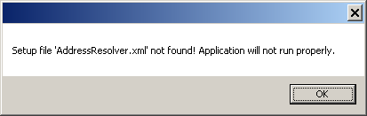
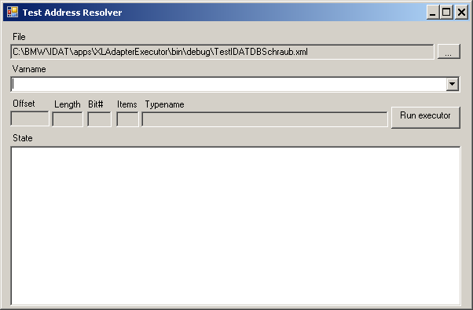

<h1>Software Specification</h1>  

<h1>XLAdapter</h1>
  


**insite GmbH**


	
---  
#Introduction#

XLAdapter (XL stands for Excel) is a software application for the transport of data. "Transport" means data is transported from one source to a target.

---  
##Purpose and Objective##

The original idea is the transmission of data from Excel to the PLC. The architecture of the XLAdapter (modular connection of Reader, Writer, Converter and Resolver) allows a wide variety of module implementations to be used. This creates the possibility at present of using an ExcelReader, LibNoDaveWriter, S7Converter and a user-specific ExcelPlcResolver.

---  
##Definitions, Acronyms, Abbreviations##

*  **LibNoDave:** A free library for the communication with a PLC.

---  
#General Description#

The special features and setting options of the software are described below.

---  
##System Environment##

The software is written with C&#35; Visual Studio 2010 for the Target framework .NET 4.0.
  


.NET 4.5 is not used since it does not guarantee any compatibility with XP.

---  
##The Functions at a Glance##

---  
###XLAdapterTest.exe###

This program is intended for developers to test the software.
  

An existing configuration file named "AddressResolver.xml" in the application directory is detected and loaded by XLAdapter. If you would like to use other configuration files, you can transfer an argument with the complete directory and file name to XLAdapterTest.exe when starting.
  

The structure of the "AddressResolver.xml" is like the configuration file of "ExecutorCmdLineHost.exe" (see the [next chapter](#ExecutorCmdLineHost.exe)).
  

When starting without an existing configuration file, this message appears:  




  

The application window of XLAdapter looks like this:  




  

With Varname you can enter a Resolver Text to determine whether the syntax is consistent. The "ExecutorCmdLineHost" program is started virtually with the "Run executor" button. If an exception should occur, this is displayed in the State.
  

The next chapter 'ExecutorCmdLineHost.exe" contains more information.

---  
###ExecutorCmdLineHost.exe###

<a name="ExecutorCmdLineHost.exe"></a>
ExecutorCmdLineHost.exe is activated as follows:  

Usage: ExecutorCmdLineHost.exe -d&#60;datadeffile&#62; [-c&#60;configfile&#62;] [-o&#60;outputfile&#62;]  

The data of the file is mandatory here for the data definition. The config file is "execconf.xml" by default if you do not specify any other. A config file must be available, however.  

The output file, in which the written data is output in Hex format, is optional.

---  
####Example Config File####
   

  
```html
<Setup>
    <Assemblies>
        <Assembly path="ResolverImpl.dll"/>
        <Assembly path="LibNoDaveReaderWriter.dll"/>
        <Assembly path="ExcelDataReader.dll"/>
        <Assembly path="S7Converter.dll"/>
    </Assemblies>
    <Instances>
        <Resolvers>
            <Resolver name="Resolver">
            </Resolver>
        </Resolvers>
        <BinaryReaderWriters>
            <BinaryReaderWriter name="LibNoDaveReaderWriter">
                <IP>192.168.0.145</IP>
                <Port>102</Port>
                <Rack>0</Rack>
                <Slot>2</Slot>
            </BinaryReaderWriter>
        </BinaryReaderWriters>
        <DataStoreReaderWriters>
            <DataStoreReaderWriter name="ExcelDataReader">
            </DataStoreReaderWriter>
        </DataStoreReaderWriters>
        <Converters>
            <Converter name="S7Converter">
            </Converter>
        </Converters>
    </Instances>
</Setup>
```  


---  
####Example Data Definition File####
   

  
```html
<DataDef Endianness="Host-Endianess" Encoding="Base16" 
         xmlns:xsi="http://www.w3.org/2001/XMLSchema-instance" 
         xmlns="http://www.insite-gmbh.de/IDAT/DataDef" 
         xsi:schemaLocation=
         "http://www.insite-gmbh.de/IDAT/DataDef TypeDefinition/DataDef.xsd">
    <Types>
        <Struct name="DBSchraub">
            <Struct name="Konfig" countItems="100">
                <Var name="KanalNr" type="INT" />
                <Var name="Steckplatz" type="INT" />
                <Var name="Parametersatz" type="INT" />
                <Struct name="Programm" countItems="50">
                    <Var name="PrgName" type="CHAR" countItems="2" />
                    <Var name="Count" type="INT" />
                </Struct>
            </Struct>
       </Struct>
    </Types>
    <Vars>
        <Var name="MyDBSchraub" type="DBSchraub" />
    </Vars>
    <Mappings>
      <Mapping name="Test" var="MyDBSchraub" source="LibNoDaveReaderWriter" 
selector="100" offset="0" type="BinaryFile">
        <Operations>
          <Write var="MyDBSchraub">
            <![CDATA[@C:\IDAT\apps\XLAdapterExecutor\testdata\ExcelTestdaten.xlsx
             !TEST
             !C"F7M000"R"F7M000"
             .Margin(0,1,63,GroupSameSequence)
             .Select(x => x.Where((y, index) => (index == 2 || index == 4 || index == 6
             || (index >= 10 && index <=20) || (index >= 22 && index <=30)
             || (index >= 32 && index <=46) || index >= 49)).ToList())
             .Aggregate(new List<List<string>>(), (list, item) => { 
                 if (list.Count < 1){
                     list.Add(item);
                 } else { 
                     List<string> r = list.First();
                     for (int i = 52; i > 2; i--){
                         item.Insert(i, r[i]);
                     } 
                     list.Add(item);
                 }
                 return list;
             }, list => { return list.Skip(1); })
            ]]>
          </Write>
        </Operations>
      </Mapping>
    </Mappings>
</DataDef>
```  


---  
#Installation#

This requires that 

  1.   Microsoft .NET Framework 4.0 Servicepack 1 and
  2.   Microsoft Visual C++ 2010 Redistributable Package

are installed and available.
  

XLAdapter or ExecutorCmdLineHost includes the following EXE and DLLs (date September 2012):

*  AddressResolver.exe (19.456 Bytes)
*  ExecutorCmdLineHost.exe (9.728 Bytes)
*  BinaryDataEncoders.dll (5.120 Bytes)
*  BinFileReaderWriter.dll (6.656 Bytes)
*  DataDef.dll (30.208 Bytes)
*  ExcelDataReader.dll (5.120 Bytes)
*  ExcelReader.dll (13.312 Bytes)
*  Executor.dll (14.336 Bytes)
*  IMatrixReader.dll (10.752 Bytes)
*  Interfaces.dll (8.192 Bytes)
*  Ioc.dll (22.528 Bytes)
*  LibNoDaveReaderWriter.dll (8.704 Bytes)
*  LibXLNet.dll (49.664 Bytes)
*  MatrixResolver.dll (9.728 Bytes)
*  PLCHelpers.dll (16.896 Bytes)
*  ResolverImpl.dll (14.848 Bytes)
*  S7Converter.dll (17.408 Bytes)

and these third-party components:

*  CommandLine.dll (43.520 Bytes)
*  libnodave.dll (126.976 Bytes)
*  libnodave.net.dll (14.848 libnodave Bytes)
*  libxl.dll (3.096.576 Bytes)
*  log4net.dll (286.720 Bytes)

These files can be copied to any directory and XLAdapter.exe or ExecutorCmdLineHost can then be started from there.

---  
##Files generated during runtime##

XLAdapter.exe or ExecutorCmdLineHost.exe generate files independently. Here are the meanings:

  1.   **Log files:** Files configured for Log4net.
  2.   **Out files:** If specified during the start.
  3.   **ExecutorCmdLineHost.dmp:** When ExecutorCmdLineHost triggers an exception that is not intercepted, the ExecutorCmdLineHost.dmp file is written.

---  
#Document History#

<table><tr><th>Author </th><th> Date </th><th> Remarks</th></tr>
<tr><td>Ralf Gedrat </td><td> September 2012 </td><td> Creation</td></tr>
<tr><td>Karsten Gorkow </td><td> January 2016 </td><td> Minor Changes</td></tr>
</table>