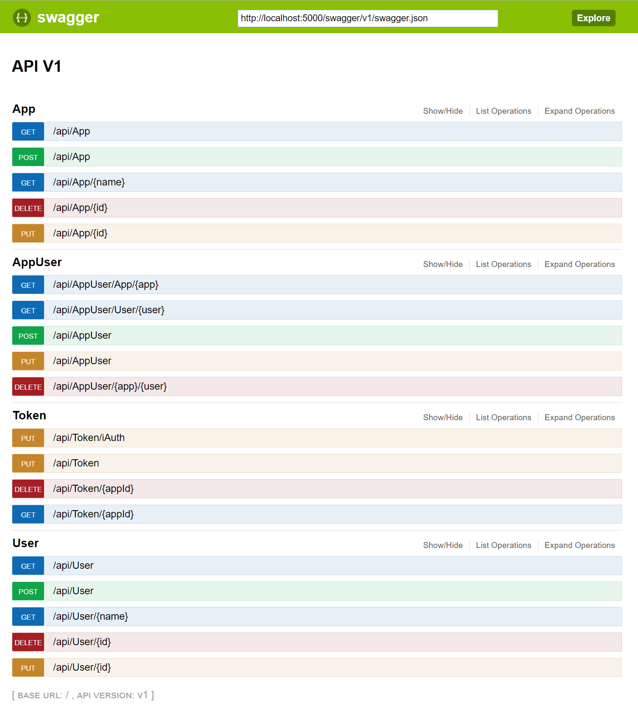

# iAuth
  
**Insite Authentication Manager**  


# General Information

This software provides an authentication service for a wide range of programs. It handles the sign-in/out process, handles all passwords and can also handle some specific 
cases of user management.

# Interfaces

iAuth supports the following interfaces for the communication whith the clients:

```
  "Global": {
    "UseSignalR": false,
    "UseSignalRWithWebSockets": false,
    "UseWebSockets": true,
    "UseSwagger ": true,
    "UseLogFiles": true,
    "UsePlc": false
  },
```

## REST

Overall it supports a REST interfaces to sign-in/out or poll the user states. This interfaces can also manage the configuration of iAut, so by using it, you can add/remove/update
the usermanagement. (currently not persistent -> this means after a restart the changes are lost). By using swagger (http://localhost:5000/swagger/ui), you can test iAuth and ot's REST interface.
Using the controllers for App, AppUser and User is only allowed for users of type `Admin`.



## SignalR
```"UseSignalR": true```
```"UseSignalRWithWebSockets": true```

SignalR can also be used for getting notifications of user changes. For this, a client has to subscribe to the AuthHub with it's AppId. By configuration you can specify that SignalR should use WebSockets for 
the communication. By default SignalR uses autonegotiation to find the fastes communication way, which was normally websocket if it is activted.
The server side interface of SignalR is the following:

```cs
void Subscribe(Guid appId);
void Unsubscribe();
```

And the client side looks like this:
```cs
public interface IAuthHubClient
{
    void UserChanged(Authentication auth);
}
```

The Authentication structure which will be exchanged, has the following structure:
```cs
  public class Authentication
  {
      public bool Authenticated { get; set; }
      public string User { get; set; }
      public string Role { get; set; }
      public string Token { get; set; }
      public DateTime? TokenExpires { get; set; }
  }
```

## WebSockets
```"UseWebSockets": true```

WebSockets can be used for the user state change update mechanismus also without SignalR, for this you have to set this option to true.
On the client side you have to start the websocket with the following path:

```"ws://" + IpAddress + "/ws";```

If the connection was opend, you can register the client by sending the AppId of the application over the socket. On any update of the user state, you will get an message which holds an `Authentication`
 JSON object in the data property. 
.

Example:

```js
self.start = function(){
    
    try {
        stopReconnect();
        ws = new WebSocket(self.swAddress);
        ws.onopen =    function()        { if(ws != null) ws.send(self.appId);  }; 
        ws.onmessage = function(message) { if (message.type === 'message') notifySubscribers(JSON.parse(message.data)); };
        ws.onclose =   function()        { startReconnect(); }; 

        if(ws.readyState > 1)
            startReconnect();
    } catch (error) {
        startReconnect();
    }
}
```

## Plc

iAuth also provides PLC access to get the user from Plc or set the current Data in the PLC. 


```
"Plc": {
  "ConnectionString": "Data Source=127.0.0.1:102,0,2",
  "Area": "DB250",
  "Address": "W188",
  "App": "EB97A642-78F5-4458-B8CA-036FE70298EF",
  "DefaultValue": "0"
}
```

* The `ConnectionString` is to specify the PLC connection, for this you have to add the following parameters: [IP-Address:Port,Rack,Slot} .
* The `Area` specifies the datablock in the PLC where the data should be read or written.
* The `Address` specifies the Type (W=Word) and the Offset(188 bytes -> if you used bits, the offset should be the bit offset (Byteoffset * 8 + Bitnumber)) of the data.
* The `App` specifies the App which should used for the plc, this is importent, because the PLC uses the valies in the `Data` field which was specified in the AppUser to find the correct user.
* The `DefaultValue` specifies the state where no user is logged in, or the fallbackuser, if a user should always be active if no other is active.


# Password Management

## User

The user configuration is used to specify users for the system.

|     Name   |   Type  | Password   | LogoutTimeInMin|   Id |
|:-----------|:--------|:----------:|:--------------:|:--:|
| Admin      | Admin   |     XXX    |     10         | [guid] |
| Joe        | Active  |     XXX    |     10         | [guid] |

* The `Name` is free to define and is should be used case sensitive.
* The `LogoutTimeInMin` can specified per user (maximum time a user can be logged in).
* The `Password` is an encrypted key (so see how you can generate it, see Commandline)
* The `Id` is to identify the user
* We support currently three user `Type`'s:

|     Type        |    Description    |
|:----------------|:------------------|
| Passive         |    Unpriviledged user (not used at the moment)    |  
| Active          |    Normal user to sign in/out            | 
| Admin           |    Management user to change settings    | 

### Example

```
  ...
  "Auth": {
    ...
    "Users": [
      {
        "Id": "15B78F31-349D-4A75-8807-73650CBB8957",
        "Type": "Admin",
        "Name": "Admin",
        "Password": "I4ZzXgfElW+l3ZvyF8gFURcLjdEP16vH1ZOwLlzq3iNc6V9sjac6stq0sBOcldm18R3LE20qEb3uzdfH5q2MEaq3W6ECbjk3/ySMrhvb5XWICAuDFLgKaANcqHTnjwsTGt07eUJQ36Mn2+cyhik4RPoeNgtBbMKp/o6mxJKMAy5iSx12Ljtx+v7Fm2eF+AtUvgCppX1/cGZ1EftoYWZ6VbmR761ScXKRf/FIUTxROwYtjBSPGIwHhG2kjwA8ZfYx0XtJMMrWlglIvvSoaUtiaZ5A2odJalGMs2XgV9XR+FRcDFEe1mzEejgWODD3eawPB/EjnO0dCt//7VCi0zf/7w==", //SUNRISE
        "LogoutTimeInMin": 10
      },
    ...
  }
  ...
```


## App Users

To setup each application which uses iAut, you have to assigne an name with an key.
(if an application will get the auth-state , it uses the Id for the request)

|    Name     |    Id       | LogoutTimeInMin |
|:----------------|:------------:|:---------------:|
| HMI             |    [guid]    |      10         |
| INAX            |    [guid]    |      10         |


* The `Name` is free to define and is should be used case sensitive.
* The `LogoutTimeInMin` can specified per app (maximum time a user can be logged in  (if a user and an app have specified this value, the lowest value will be used)).
* The `Id` is to identify the application

### Example

```
  ...
  "Auth": {
    ...
    "Apps": [
      {
        "Id": "EB97A642-78F5-4458-B8CA-036FE70298EF",
        "Name": "WinCCFlex",
        "LogoutTimeInMin": 10
      }
    ],
  ...
```

## App-User Relation

This section is to map the user with the apps and specify additional data to exchange.
e.g. If HMI asks for current AuthState it will get a number (e.g. 9) as the result. 

|     AppId       |    UserId      | Data       |
|:----------------|:--------------:|:----------:|
| [guid]          |    [guid]      |     9      | 
| [guid]          |    [guid]      |   Admin    |

* The `AppId` is the Id of a specified app.
* The `UserId` is the Id of a specified user.
* The `Data` field specifies some additional data which will be sent to the client we it signs in, or requests an state update.


## Security key
To handle security like password encryption, iAuth generates an keyfile if nothing is found. The path of this file can be specified in the configuration.
Attention: If this file will be changed, the password which were created with this file could no longer be encrypted.

```
  "Auth": {
    "KeyFile": ".\\iAuth.key",
```

## Logging
Logging can be specified one in the Logging section of the appsettings.json and otherwise in the nlog.config. For more details look at Nlog documentation.

```
  "Logging": {
    "NLogConfig" :  "nlog.config",
    "IncludeScopes": false,
    "LogLevel": {
      "Default": "Information",
      "System": "Information",
      "Microsoft": "Information"
    }
  },
```

## Commandline

```
Copyright (c) insite-gmbh 2017");

iAuth is intended to be run as windows service. Use one of the following options:");
  --register-service                      Registers and starts this program as a windows service named \"" + ServiceDisplayName + "\"");
							All additional arguments will be passed to ASP.NET Core's WebHostBuilder.");   
  --unregister-service                    Removes the windows service creatd by --register-service.");
  --interactive                           Runs the underlying asp.net core app.");

  --config                                Specifies the path to the config file.");
  --appsettings                           Set the name of the config file [default=appsettings].");
  --urls="http://localhost:10000/"        Application bounded url
e.g. :");
iAuth --register-service  --config=\"C:\\Path\\To\\Configs\" --appsettings=\"appsettings\"");
```
