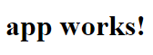
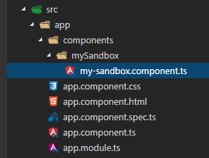

# INAX - Creating a project

## Prerequisites
If you haven't yet, please [install Node.js](https://nodejs.org/en/download/) which will also include the corresponding version of [npm](https://docs.npmjs.com/getting-started/what-is-npm).  
Ensure that you are running at least Node.js version `4.x.x` and npm version `3.x.x`. While older versions are not compatible, newer ones will work fine.

## Angular-CLI
The easiest way to set up an angular project is using the angular CLI, which you have to install globally:
```
$ npm install -g @angular/cli
```
## Creating a new project
Navigate the command line to the directory you want to create your project directory in and run 
```
$ ng new my-app
```
with your project's name, to create the directory and a skeleton application to work upon.
This will take a few seconds since it is installing all of the necessary npm packages.

### Trying the new project
After the setup is complete, run
```
$ cd my-app
$ ng serve
```
which will compile the project and host a server on [http://localhost:4200/](http://localhost:4200/).
The `ng serve` command will also watch your project's files and rebuild the app whenever you save a change to one of the files.  
In a new project, the site should show you the message:  
  

## INAX
To add INAX to the project, run
```
$ npm install @inax/common --save
```
This will install the 'common' package which is required by all other packages.  
Then, run the same command for the packages you want to include (package names on npm are lowercase only). If an installed package depends on another one that has not been installed yet, you will receive a warning:  


  

When this happens, just install the listed packages with the `npm install --save` command.
The other warnings (with the purple keywords) can be ignored, as they refer to `fsevents`, which is only needed on OS-X and therefore not installed on other operating systems.

## Creating a component 
To create a new component, go to `src/app/` and create a folder `components`. Here, create a folder for the new component - in this example, we will use `mySandbox`.  
We recommend to use the same rules for names as in this example, if you wish to take a look at a more complete overview on file naming,
visit [Angular's official style guide](https://angular.io/docs/ts/latest/guide/style-guide.html#!#02-03). There, you can also find more guidelines on Coding with
Angular2 and Typescript in general.  

In our new directory, we then create the file `my-sandbox.component.ts`. Our project structure should now look like this:  
  


<!--
TODO:
- guide to create components, modules, add providers, include stylesheets, tests etc...
-->

